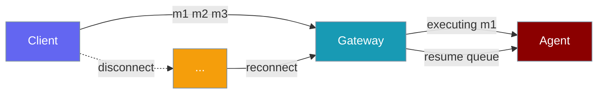
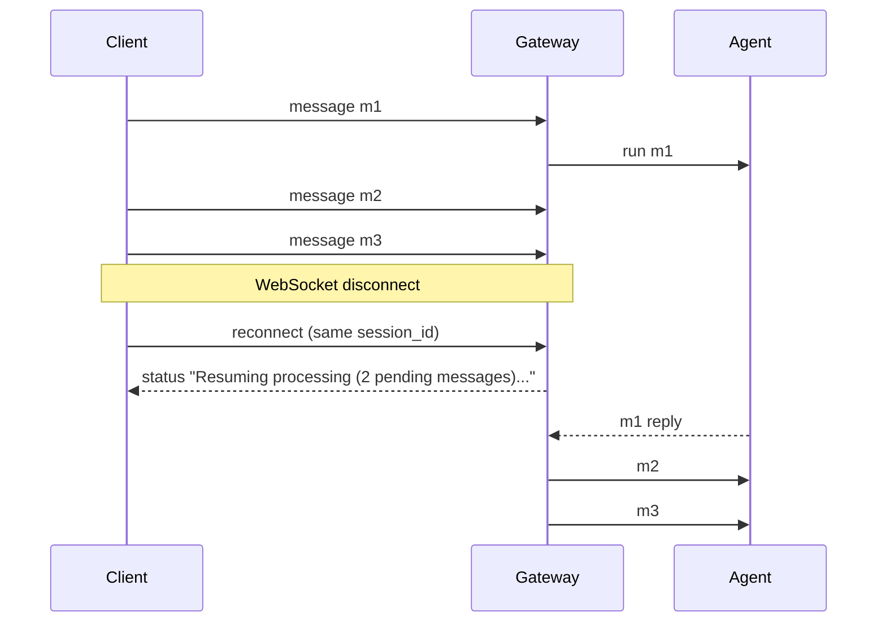

Gateway sessions preserve pending messages and in-flight executions across disconnects, restarts, and graceful shutdowns.



## Quick Start

<Steps>

<Step title="Start gateway with an agent">

```python
from praisonaiagents import Agent

agent = Agent(
    name="assistant",
    instructions="Answer user messages in order.",
)

# Default: immediate cancel on shutdown — no drain_timeout needed
# praisonai gateway start --config gateway.yaml
```

</Step>

<Step title="Enable graceful drain (opt-in)">

<Tabs>
<Tab title="Python">
```python
from praisonai.bots.botos import BotOS

bot_os = BotOS(drain_timeout=30)   # opt in; 0 or None = immediate cancel
await bot_os.start()
# ... on shutdown:
await bot_os.stop()                 # waits up to 30 s for in-flight turns
```
</Tab>
<Tab title="YAML">
```yaml
# gateway.yaml
gateway:
  drain_timeout: 30   # seconds; 0 or unset = immediate cancel (default)
```
</Tab>
<Tab title="CLI">
```bash
# CLI value wins over YAML
praisonai gateway start --config gateway.yaml --drain-timeout 30
```
</Tab>
</Tabs>

</Step>

</Steps>

---

## How It Works



When a client reconnects, the gateway checks whether the session has queued inbox messages or an in-flight execution. If so, it sends a `status` frame, marks the session as executing **before** spawning the queue task (preventing duplicate workers), and processes pending messages in FIFO order.

---

## Graceful Drain on Shutdown

Graceful drain is **opt-in and default off**. Without `drain_timeout`, shutdown cancels in-flight turns immediately — today's behaviour is preserved.

When enabled, shutdown runs two layers sequentially, sharing a single budget:

### Layer 1 — Channel-Bot Drain (BotOS)

`BotOS.drain()` quiesces ingress and waits for running agent turns to finish.

| Phase | What happens |
|-------|-------------|
| **Drain begins** | `accepting → False` (no new turns dispatched), `is_draining → True`, INFO log |
| **While in flight** | Polls `_running_turns` every ~0.5 s up to `drain_timeout`; uses `DrainTimeoutPolicy.should_keep_draining()` |
| **Drain ends cleanly** | All turns finished → outbox `flush()` called if the delivery router supports it → INFO log |
| **Drain timeout** | Remaining turns are abandoned (count returned), WARN log with reason |

```python
from praisonaiagents.gateway import DrainTimeoutPolicy, DrainDecision

policy = DrainTimeoutPolicy(drain_timeout_seconds=30)
decision: DrainDecision = policy.should_keep_draining(
    running_turns=2, seconds_elapsed=5.0,
)
# DrainDecision(keep_draining=True, reason="2 turn(s) in flight; draining")
```

**BotOS drain properties (adapter authors):**

| Property | Type | Description |
|----------|------|-------------|
| `accepting` | `bool` | `False` once drain begins — gate new ingress on this |
| `is_draining` | `bool` | `True` while actively waiting for turns to finish |

### Layer 2 — WebSocket Session Drain

After channel-bot drain, `WebSocketGateway._drain_active_sessions` persists sessions with pending inbox or in-flight execution — and now receives only the **remaining** budget from the total window.

| Phase | Behaviour |
|-------|-----------|
| **Within budget** | Sessions that finish are persisted via the configured session store |
| **After budget** | Remaining sessions are force-persisted with pending work; a `SESSION_END` event is emitted |

Force-closed `SESSION_END` payload:

```json
{
  "session_id": "...",
  "reason": "Force-closed during shutdown after timeout",
  "had_pending_work": true,
  "was_executing": true
}
```

---

## How the Budget is Shared

`drain_timeout` bounds **total** shutdown time, not per-phase or per-bot.

```mermaid
sequenceDiagram
    participant SIG as SIGTERM/SIGINT
    participant GW as WebSocketGateway
    participant Bots as BotOS (channel bots)
    participant WS as WebSocket sessions

    SIG->>GW: shutdown
    Note over GW: start drain budget timer (T seconds)
    GW->>Bots: stop_channels(drain_timeout=T)
    Note over Bots: accepting=False; wait for in-flight turns
    Bots-->>GW: drained or timed out (abandoned=N)
    GW->>WS: _drain_active_sessions(timeout=T - elapsed)
    WS-->>GW: persisted or force-persisted
    GW->>GW: cancel residual tasks

    classDef sig fill:#8B0000,stroke:#7C90A0,color:#fff
    classDef gw fill:#189AB4,stroke:#7C90A0,color:#fff
    classDef bots fill:#F59E0B,stroke:#7C90A0,color:#fff
    classDef ws fill:#10B981,stroke:#7C90A0,color:#fff
```

<Note>
Previously, the WebSocket-session drain received the full `drain_timeout` again after `stop_channels` already consumed up to that window — total shutdown could reach `2 × drain_timeout`. The budget is now tracked across both phases so the ceiling is always honoured.
</Note>

---

## Reconnect and Auto-Resume

On resume, clients receive:

```json
{
  "type": "status",
  "message": "Resuming processing (2 pending messages)..."
}
```

The gateway sets `mark_executing(True)` before launching `asyncio.create_task(_run_session_queue(...))`, so a race between reconnect and shutdown cannot spawn duplicate queue processors.

---

## Persisted Shape

Gateway session snapshots include pending work:

```json
{
  "session_id": "...",
  "messages": [],
  "events": [],
  "event_cursor": 42,
  "pending_inbox": ["queued message 1", "queued message 2"],
  "is_executing": true
}
```

The inbox is snapshotted non-destructively: items are drained into a list and put back so live processing is unaffected.

---

## Configuration

| Option | Type | Default | Description |
|--------|------|---------|-------------|
| `drain_timeout` (YAML / CLI / `BotOS` kwarg) | `float \| str` | `None` (disabled) | Total shutdown drain budget in seconds. `0`/unset = immediate cancel. |
| `drain_timeout` on `WebSocketGateway.stop()` | `float` | inherits from above | Per-call override for programmatic shutdown. |

`drain_timeout` accepts numbers or numeric strings from YAML/env (e.g. `"30"` is coerced to `30.0`). Non-finite or non-numeric values log a warning and disable drain — no user action required.

---

## Bypass / Disable

To keep today's immediate-cancel behaviour, simply don't set `drain_timeout`. No configuration change is needed.

```python
from praisonaiagents import Agent

agent = Agent(
    name="assistant",
    instructions="Answer user messages.",
)
# No drain_timeout → SIGTERM cancels in-flight turns immediately (default)
```

To disable drain after enabling it in YAML, set `drain_timeout: 0` or remove the key.

---

## External Drain Trigger

`drain_timeout` bounds the drain phase but only fires when something calls `gateway.stop()`. For hosted / containerised deployments where an operator or deploy step needs to ask a running gateway to drain — without exposing an inbound control port and without a stale signal wedging a restarted instance — pair it with the **port-less drain trigger**.

See [Gateway Drain Trigger](/docs/features/gateway-drain-trigger) for the marker-file contract and the `DrainMarkerPolicy` / `current_epoch()` API.

---

## Best Practices

<AccordionGroup>

<Accordion title="Set drain_timeout to at least your longest expected agent turn">
A 30-second turn needs at least `drain_timeout: 30` to drain cleanly. Short values cause turns to be abandoned.
</Accordion>

<Accordion title="Configure a session store">
Without persistence, drained sessions cannot be resumed after restart — only logged.
</Accordion>

<Accordion title="Monitor SESSION_END events">
Listen for `had_pending_work: true` or `was_executing: true` in audit or observability hooks to detect force-closed sessions.
</Accordion>

<Accordion title="Test reconnect under load">
Send messages faster than the agent processes them, then drop the WebSocket — pending messages should resume in order on reconnect.
</Accordion>

<Accordion title="Gate new ingress on accepting for custom adapters">
If you build a custom channel adapter, check `bot_os.accepting` before dispatching a new turn. When `False`, the gateway is draining and new turns should be rejected.
</Accordion>

</AccordionGroup>

---

<Note>
**Scale-to-Zero and session continuity work together.** When the scale-to-zero policy quiesces the gateway (stops transports), session continuity is what ensures the conversation history is preserved so users can pick up exactly where they left off after the gateway wakes. See [Scale-to-Zero Gateway](/docs/features/gateway-scale-to-zero).
</Note>

---

## Related

<CardGroup cols={2}>
  <Card title="Gateway" icon="tower-broadcast" href="/docs/features/gateway">
    WebSocket control plane overview
  </Card>
  <Card title="Session Persistence" icon="database" href="/docs/features/gateway-session-persistence">
    Persistent sessions and event replay
  </Card>
  <Card title="Error Handling" icon="triangle-alert" href="/docs/features/gateway-error-handling">
    Reconnect and error recovery
  </Card>
  <Card title="Session Protocol" icon="messages" href="/docs/features/session-protocol">
    Session message format
  </Card>
  <Card title="Scale to Zero" icon="moon" href="/docs/features/gateway-scale-to-zero">
    Suspend when idle — session continuity makes resume work
  </Card>
</CardGroup>
