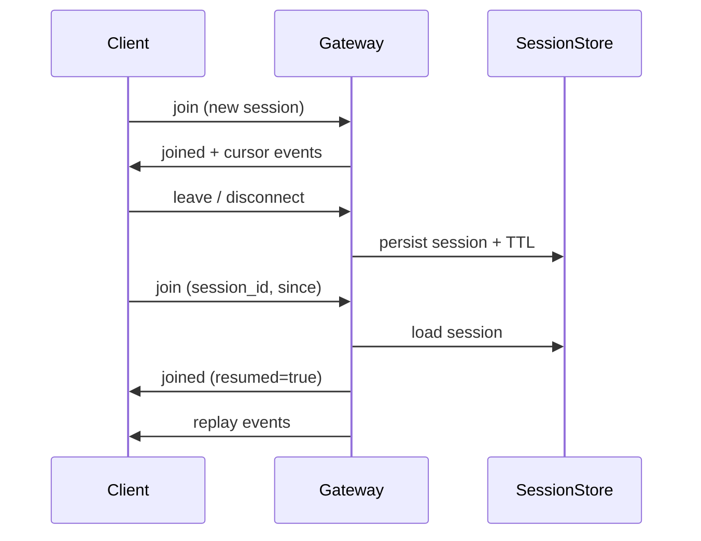
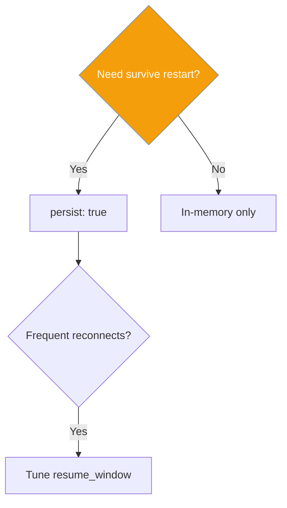

Persistent sessions keep conversation state alive across gateway restarts and let clients resume mid-conversation with event replay.

<Note>
This page covers **agent session** persistence (messages, events, cursors). **Gateway** sessions additionally preserve `pending_inbox` and `is_executing` across disconnects and graceful shutdown — see [Gateway Session Continuity](/docs/features/gateway-session-continuity).
</Note>

```python
from praisonaiagents import Agent

agent = Agent(name="assistant", instructions="Be helpful")
# Set session.persist: true in gateway.yaml so this agent's session survives restarts
```


## Quick Start

<Steps>

<Step title="Enable persistence">

```yaml
gateway:
  host: "127.0.0.1"
  port: 8765
  session:
    persist: true
```

```bash
praisonai gateway start --config gateway.yaml
```

Default storage: `~/.praisonai/sessions/`

</Step>

<Step title="Resume as a client">

```python
import asyncio
import json
import websockets

async def resume(session_id: str, since: int):
    async with websockets.connect("ws://127.0.0.1:8765") as ws:
        await ws.send(json.dumps({
            "type": "join",
            "agent_id": "assistant",
            "session_id": session_id,
            "since": since,
        }))
        while True:
            msg = json.loads(await ws.recv())
            if msg.get("type") == "joined" and msg.get("resumed"):
                print("Resumed at cursor", msg.get("cursor"))
            if msg.get("type") == "replay":
                print("Replay:", msg.get("event"))

asyncio.run(resume("abc-123", 42))
```

</Step>

<Step title="Full configuration">

```yaml
gateway:
  session:
    persist: true
    persist_path: ~/.praisonai/sessions/
    resume_window: 86400
    timeout: 3600
    max_messages: 1000
```

</Step>

</Steps>

## What gets persisted

The on-disk record under `persist_path` is the JSON returned by `GatewaySession.to_dict()`. Key fields:

| Key | Type | Purpose |
|---|---|---|
| `session_id` | `str` | Stable identifier; used on resume |
| `event_cursor` | `int` | Position in the event log for replay |
| `sequence` | `int` | Monotonic outbound sequence (gap detection) |
| `protocol_version` | `int` | Protocol version negotiated at the last handshake |
| `capabilities` | `List[str]` | Capability tokens advertised by the client (`streaming`, `presence`, `ack`, …) |
| `events` | `List[GatewayEvent]` | Last 100 events (for replay) |
| `pending_inbox` | `List[...]` | In-flight inbound queue snapshot |
| `is_executing` | `bool` | Mid-turn flag for [Session Continuity](/docs/features/gateway-session-continuity) |

<Note>
`capabilities` and `protocol_version` are restored on resume so server-side code that branches on either keeps working without re-handshake. A persisted record from before the upgrade (no `capabilities` key) restores cleanly to `[]` — no migration required.
</Note>

## How it works



| Role | Responsibility |
|------|----------------|
| Client | Track highest `cursor`; send `since` on reconnect |
| Gateway | Rehydrate sessions; emit replay frames |
| SessionStore | Persist state to disk |
| TTL cleanup | Hourly purge of expired sessions |

## Reconnect protocol

**Client join (resume):**

```json
{ "type": "join", "agent_id": "assistant", "session_id": "abc-123", "since": 42 }
```

**Server joined:**

```json
{ "type": "joined", "session_id": "abc-123", "agent_id": "assistant", "resumed": true, "cursor": 57 }
```

**Replay frames:**

```json
{ "type": "replay", "event": { "...": "..." } }
```

<Note>
Every `response`, `message`, `stream_end`, and `error` frame includes a monotonic `cursor`. Track the highest value for the next reconnect.
</Note>

## Configuration options

| Option | Type | Default | Description |
|--------|------|---------|-------------|
| `persist` | `bool` | `false` | Enable persistent session storage |
| `persist_path` | `str` | `~/.praisonai/sessions/` | Storage directory |
| `resume_window` | `int` | `86400` | Seconds a detached session stays resumable (24 h) |
| `timeout` | `int` | `3600` | Active session expiry in seconds |
| `max_messages` | `int` | `1000` | History cap per session |

## Common patterns

**Python override:**

```python
from praisonai.gateway.server import WebSocketGateway
from praisonaiagents.session.store import DefaultSessionStore

gateway = WebSocketGateway(
    port=8765,
    session_store=DefaultSessionStore("./sessions"),
)
```

**Choosing `resume_window`:** minutes for ephemeral chat, 24 h for support bots, up to 7 days for long tasks.



## Best practices

<AccordionGroup>

<Accordion title="Always send since on reconnect">
Without `since`, the client may miss events between disconnect and resume.
</Accordion>

<Accordion title="Match resume_window to user behaviour">
Too short loses conversations; too long grows disk usage.
</Accordion>

<Accordion title="Back up persist_path">
Session files should be included in normal backup rotation.
</Accordion>

<Accordion title="One gateway per persist_path">
Do not share storage between two gateway processes — see Gateway Overview single-instance guidance.
</Accordion>

</AccordionGroup>

## Related

<CardGroup cols={2}>
  <Card title="Gateway Overview" icon="tower-broadcast" href="/docs/features/gateway-overview">
    Gateway setup and configuration
  </Card>
  <Card title="Bot vs Gateway" icon="code-compare" href="/docs/features/bot-gateway">
    When to use gateway vs direct bots
  </Card>
</CardGroup>
