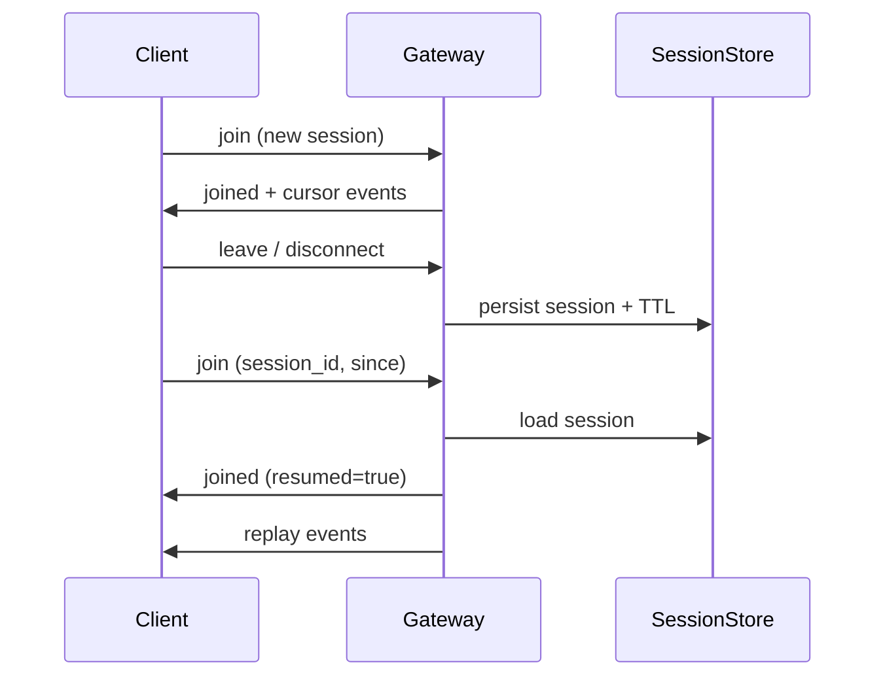
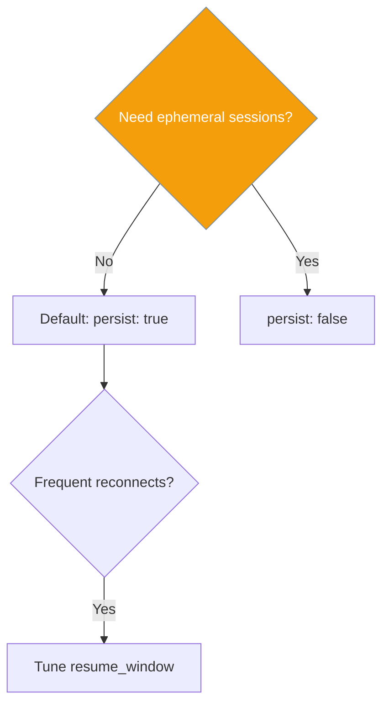

<Note>
The gateway now ships in the `praisonai-bot` package. `praisonai serve gateway` still works exactly as documented here; for a standalone install see [praisonai-bot Migration](/guides/praisonai-bot-migration).
</Note>


Persistent sessions keep conversation state alive across gateway restarts and let clients resume mid-conversation with event replay.

<Note>
This page covers **agent session** persistence (messages, events, cursors). **Gateway** sessions additionally preserve `pending_inbox` and `is_executing` across disconnects and graceful shutdown — see [Gateway Session Continuity](/features/gateway-session-continuity).
</Note>

<Note>
When a route names a `profile:`, the persisted session key is namespaced per tenant (`profile:<name>:<base>`), so each tenant's transcript is stored and reloaded separately — see [Gateway Tenant Profiles](/features/gateway-tenant-profile).
</Note>

<Note>
[Gateway Memory-Pressure Eviction](/features/gateway-memory-pressure-eviction) relies on this — an unflushed transcript is never evicted, because only a durably persisted cache can be losslessly rebuilt on the next turn. The flush marker is cleared on any caught store-write exception, so a partial or failed persist can never let the sweep evict a cache whose only current copy is in memory.
</Note>

<Note>
Channel-originated sessions get a proactive "interrupted — resuming" notice after a gateway restart — see [Restart Continuation](/features/gateway-restart-continuation).
</Note>

<Warning>
**Durable by default (as of PR #3595).** `session.persist` now defaults to `true`, so a gateway started from the out-of-the-box path writes to `~/.praisonai/sessions/sessions.db` on first boot and remembers conversations across restarts. Set `session.persist: false` in `gateway.yaml` to keep the old ephemeral, in-memory behaviour.
</Warning>

<Note>
This page covers **durability across restarts**. To back up, migrate, or restore sessions **across hosts**, see [Gateway Session Portability](/features/gateway-session-portability).
</Note>

<Note>
When `session.persist: false`, the gateway has no durable store to journal against, so `gateway.durable_runs` auto-defaults to off (see [Gateway Durable Runs](/features/gateway-durable-runs)).
</Note>

<Note>
**When a durable write does fail** (disk-full / corruption / permission), the turn is **not lost** — it's salvaged to `~/.praisonai/state/session_spill/` and re-folded on the next load. Subscribe to the observe-only [`SESSION_PERSIST_FAILED`](/features/hook-events#session-persist-failed-a-durable-write-failed) hook to alert/metric on the failure. See [Write-failure salvage](/features/session-persistence#write-failure-salvage) for the full spill + re-ingest flow.

Similarly, if a session file is found **corrupt** on the next load (malformed JSON / invalid UTF-8), the corrupt bytes are quarantined to `<file>.json.corrupt-<ts>` before a fresh session starts, and the same `SESSION_PERSIST_FAILED` hook fires with the quarantine path in `spilled`. See [Corruption-quarantine on load](/features/session-persistence#corruption-quarantine-on-load).
</Note>

```python
from praisonaiagents import Agent

agent = Agent(name="assistant", instructions="Be helpful")
# Persistence is on by default — this agent's session survives gateway restarts
```

The user returns later; persisted session state reloads so the agent remembers prior turns.


```mermaid
graph LR
    A[Active session] --> B[Disconnect]
    B --> C[Persisted store]
    C --> D[Reconnect + since cursor]
    D --> E[Rehydrate + replay]

    classDef active fill:#8B0000,stroke:#7C90A0,color:#fff
    classDef store fill:#F59E0B,stroke:#7C90A0,color:#fff
    classDef resume fill:#10B981,stroke:#7C90A0,color:#fff
    classDef cfg fill:#6366F1,stroke:#7C90A0,color:#fff

    class A active
    class B store
    class C store
    class D,E resume

```

## Quick Start

<Steps>

<Step title="Persistence is on by default">

No `session:` block is required — persistence engages automatically:

```yaml
gateway:
  host: "127.0.0.1"
  port: 8765
```

```bash
praisonai gateway start --config gateway.yaml
```

Default storage: `~/.praisonai/sessions/sessions.db`

Opt out for ephemeral, in-memory sessions:

```yaml
# Ephemeral sessions (explicit opt-out)
gateway:
  session:
    persist: false
```

<Note>
As of PraisonAI PR #3595, `session.persist` itself defaults to `true`, so the `SqliteTranscriptStore` (WAL SQLite, one row per session, indexed lookups) engages out-of-the-box. Set `session.store: file` to keep the legacy per-session JSON layout. See [SQLite Transcript Store](/features/sqlite-transcript-store) for the full picture.
</Note>

</Step>

<Step title="Resume as a client">

```python
import asyncio
import json
import websockets

async def resume(session_id: str, since: int):
    async with websockets.connect("ws://127.0.0.1:8765") as ws:
        await ws.send(json.dumps({
            "type": "join",
            "agent_id": "assistant",
            "session_id": session_id,
            "since": since,
        }))
        while True:
            msg = json.loads(await ws.recv())
            if msg.get("type") == "joined" and msg.get("resumed"):
                print("Resumed at cursor", msg.get("cursor"))
            if msg.get("type") == "replay":
                print("Replay:", msg.get("event"))

asyncio.run(resume("abc-123", 42))
```

</Step>

<Step title="Full configuration">

```yaml
gateway:
  session:
    persist: true          # default — shown here for completeness
    persist_path: ~/.praisonai/sessions/
    resume_window: 86400
    timeout: 3600
    max_messages: 1000
    max_inbox: 256
```

</Step>

</Steps>

<Note>
When the SQLite and file-store paths can't be opened (e.g. a read-only or absent `$HOME`), the gateway **degrades to in-memory sessions** instead of aborting startup. `persist: true` therefore never crashes on a constrained host — sessions are kept in memory for the run and lost on restart. If the doctor or logs report an in-memory fallback, `$HOME` is unwritable.
</Note>

## What gets persisted

The on-disk record under `persist_path` is the JSON returned by `GatewaySession.to_dict()`. Key fields:

| Key | Type | Purpose |
|-----|------|---------|
| `session_id` | `str` | Stable identifier; used on resume |
| `event_cursor` | `int` | Position in the event log for replay |
| `sequence` | `int` | Monotonic outbound sequence (gap detection) |
| `protocol_version` | `int` | Protocol version negotiated at the last handshake |
| `capabilities` | `List[str]` | Capability tokens advertised by the client (`streaming`, `presence`, `ack`, …) |
| `events` | `List[GatewayEvent]` | Last 100 events (for replay) |
| `pending_inbox` | `List[...]` | In-flight inbound queue snapshot |
| `is_executing` | `bool` | Mid-turn flag for [Session Continuity](/features/gateway-session-continuity) |
| `channel_target` | `str \| None` | `"channel:target"` origin used by [Restart Continuation](/features/gateway-restart-continuation) to notify channel users; `None` for direct-client sessions |

<Note>
`capabilities` and `protocol_version` are restored on resume so server-side code that branches on either keeps working without re-handshake. A persisted record from before the upgrade (no `capabilities` key) restores cleanly to `[]` — no migration required.
</Note>

## How it works


```mermaid
sequenceDiagram
    participant C as Client
    participant G as Gateway
    participant S as SessionStore

    C->>G: join (new session)
    G->>C: joined + cursor events
    C->>G: leave / disconnect
    G->>S: persist session + TTL
    C->>G: join (session_id, since)
    G->>S: load session
    G->>C: joined (resumed=true)
    G->>C: replay events
```

| Role | Responsibility |
|------|----------------|
| Client | Track highest `cursor`; send `since` on reconnect |
| Gateway | Rehydrate sessions; emit replay frames |
| SessionStore | Persist state to disk |
| TTL cleanup | Hourly purge of expired sessions |

## Reconnect protocol

**Client join (resume):**

```json
{ "type": "join", "agent_id": "assistant", "session_id": "abc-123", "since": 42 }
```

**Server joined:**

```json
{ "type": "joined", "session_id": "abc-123", "agent_id": "assistant", "resumed": true, "cursor": 57 }
```

**Replay frames:**

```json
{ "type": "replay", "event": { "...": "..." } }
```

<Note>
Every `response`, `message`, `stream_end`, and `error` frame includes a monotonic `cursor`. Track the highest value for the next reconnect.
</Note>

## Configuration options

| Option | Type | Default | Description |
|--------|------|---------|-------------|
| `persist` | `bool` | `true` | Persist session state. Defaults to `true` — an out-of-the-box gateway remembers conversations across restarts via the SQLite transcript store. Set `false` to opt into ephemeral, in-memory sessions |
| `persist_path` | `str` | `~/.praisonai/sessions/` | Storage directory |
| `store` | `str` | `"sqlite"` | Transcript backend — `"sqlite"` ([SQLite Transcript Store](/features/sqlite-transcript-store)) or `"file"` (legacy JSON) |
| `resume_window` | `int` | `86400` | Seconds a detached session stays resumable (24 h) |
| `timeout` | `int` | `3600` | Active session expiry in seconds |
| `max_messages` | `int` | `1000` | History cap per session |
| `max_inbox` | `int` | `256` | Bounded per-session queue size; `0` = unlimited |
| `mirror_runtime_state` | `bool` | `false` | Opt-in runtime-state mirroring for native transcript replay |

## Common patterns

**Python override:**

```python
from praisonai.gateway.server import WebSocketGateway
from praisonaiagents.session.store import DefaultSessionStore

gateway = WebSocketGateway(
    port=8765,
    session_store=DefaultSessionStore("./sessions"),
)
```

An explicit `session_store` always wins over the YAML/default derivation.

**CLI opt-out now honoured:** `session.persist: false` in `gateway.yaml` is re-read on `start_with_config`, so the multi-bot CLI now actually runs ephemeral (previously the flag was silently ignored).

**Choosing `resume_window`:** minutes for ephemeral chat, 24 h for support bots, up to 7 days for long tasks.


```mermaid
graph TB
    Q{Need ephemeral sessions?}
    Q -->|No| P[Default: persist: true]
    Q -->|Yes| D[persist: false]
    P --> R{Frequent reconnects?}
    R -->|Yes| W[Tune resume_window]

    classDef q fill:#F59E0B,stroke:#7C90A0,color:#fff
    class Q q
```

## Best Practices

<AccordionGroup>

<Accordion title="Opt out only when you need to">
The default is durable because most conversational bots want continuity. Only set `persist: false` for stateless, single-shot flows or ephemeral CI runs.
</Accordion>

<Accordion title="Confirm the on-disk store engaged">
Expect the transcript DB at `~/.praisonai/sessions/sessions.db`. If the doctor or logs report an in-memory fallback, `$HOME` is unwritable.
</Accordion>

<Accordion title="Always send since on reconnect">
Without `since`, the client may miss events between disconnect and resume.
</Accordion>

<Accordion title="Match resume_window to user behaviour">
Too short loses conversations; too long grows disk usage.
</Accordion>

<Accordion title="Back up persist_path">
Session files should be included in normal backup rotation.
</Accordion>

<Accordion title="One gateway per persist_path">
Do not share storage between two gateway processes — see Gateway Overview single-instance guidance.
</Accordion>

</AccordionGroup>

## Related

<CardGroup cols={2}>
  <Card title="Gateway Overview" icon="tower-broadcast" href="/features/gateway-overview">
    Gateway setup and configuration
  </Card>
  <Card title="SQLite Transcript Store" icon="database" href="/features/sqlite-transcript-store">
    The default persistence backend, engaged out-of-the-box
  </Card>
  <Card title="Gateway Session Continuity" icon="arrows-rotate" href="/features/gateway-session-continuity">
    Preserve pending inbox and mid-turn state across disconnects
  </Card>
  <Card title="Restart Continuation" icon="power-off" href="/features/gateway-restart-continuation">
    Notify channel users after a gateway restart
  </Card>
  <Card title="Write-failure salvage" icon="floppy-disk" href="/features/session-persistence#write-failure-salvage">
    Spill + re-ingest when a durable session write fails
  </Card>
</CardGroup>
