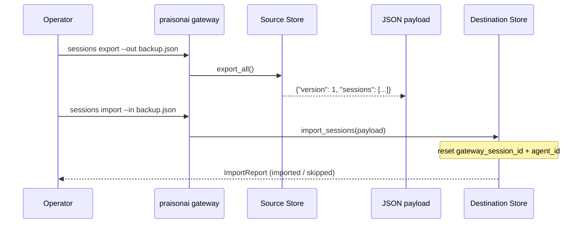
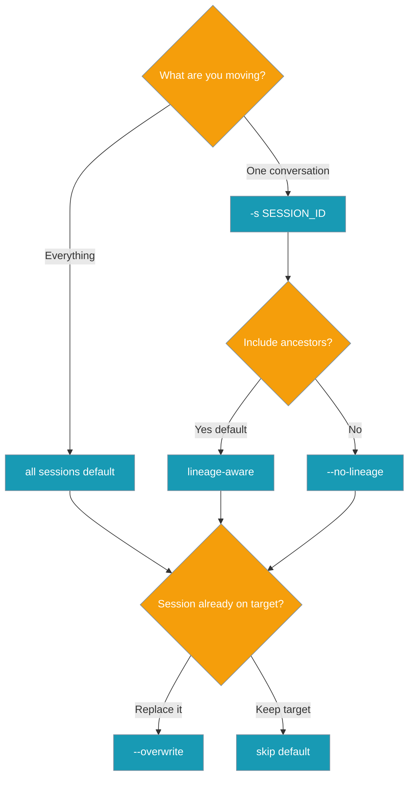

Export gateway conversations to a portable JSON file so you can back them up, move them between hosts, or restore them after disaster.


## Quick Start

<Steps>
<Step title="Back up and restore from the CLI">
Export every session to one file, then restore it on any host.

```bash
praisonai gateway sessions export --out backup.json
praisonai gateway sessions import --in backup.json   # inert until re-bound
```
</Step>

<Step title="Do it from Python">
The gateway helpers wrap the same store the gateway runs on.

```python
from praisonai_bot.gateway.preflight import export_gateway_sessions, import_gateway_sessions

payload = export_gateway_sessions()
report  = import_gateway_sessions(payload)
print(report["imported"], report["skipped_count"])
```
</Step>
</Steps>

---

## How It Works

Export reads live sessions into a versioned payload; import writes them back and resets live routing fields so restored state stays inert until the gateway re-binds it.



| Behaviour | Detail |
|-----------|--------|
| Payload shape | Versioned envelope `{"version": 1, "sessions": [...]}` built from `SessionData.to_dict()` |
| Lineage-aware | Compacted / rotated continuations round-trip as one logical session (`lineage_id` / `root_session_id` / `thread_id`) |
| Hardened import | `max_sessions` cap, duplicate/cycle guard, malformed records skipped **and reported** |
| Version guard | Rejects payloads newer than `PORTABLE_VERSION = 1`; older/unversioned accepted best-effort |
| Live-field reset | Clears `gateway_session_id` and `agent_id` so restored state is inert until re-bound |

---

## Choosing the right options

Pick a scope, decide on lineage, and choose whether to overwrite.



---

## CLI Reference

<Tabs>
<Tab title="export">
```bash
praisonai gateway sessions export [OPTIONS]

Examples:
  praisonai gateway sessions export --out backup.json
  praisonai gateway sessions export -s bot_slack_U123 -o one.json
  praisonai gateway sessions export -s bot_slack_U123 --no-lineage
```

| Flag | Type | Default | Description |
|------|------|---------|-------------|
| `--session-id, -s` | `str?` | `None` | Export just this session (lineage-aware); default = all |
| `--out, -o` | `str?` | stdout | Atomic write via temp file + `os.replace` |
| `--no-lineage` | `bool` | `False` | Skip compacted/rotated ancestors for a single-session export |
</Tab>

<Tab title="import">
```bash
praisonai gateway sessions import [OPTIONS]

Examples:
  praisonai gateway sessions import --in backup.json
  praisonai gateway sessions import -i backup.json --overwrite
  praisonai gateway sessions import -i backup.json --keep-live-fields --max-sessions 500 --json
```

| Flag | Type | Default | Description |
|------|------|---------|-------------|
| `--in, -i` | `str` | *required* | Read payload from this file |
| `--overwrite` | `bool` | `False` | Overwrite sessions that already exist |
| `--keep-live-fields` | `bool` | `False` | Do **not** reset live routing/activity fields |
| `--max-sessions` | `int` | `10_000` | Cap ingest |
| `--json` | `bool` | `False` | Output the `ImportReport` as JSON |
</Tab>
</Tabs>

---

## Python API Reference

The same surface exists on the store and as thin gateway helpers.

```python
from praisonaiagents.session import DefaultSessionStore, ImportReport

store = DefaultSessionStore()

# Export
payload = store.export_session("bot_slack_U123", include_lineage=True)  # {"version": 1, "sessions": [...]}
payload = store.export_all()                                            # {"version": 1, "sessions": [...]}

# Import
report: ImportReport = store.import_sessions(
    payload,
    max_sessions=10_000,
    reset_live_fields=True,
    overwrite=False,
)
```

Gateway helpers target the store the gateway actually runs on:

```python
from praisonai_bot.gateway.preflight import export_gateway_sessions, import_gateway_sessions

payload = export_gateway_sessions(session_id=None, include_lineage=True)
report  = import_gateway_sessions(payload, max_sessions=10_000, reset_live_fields=True, overwrite=False)
```

`DefaultSessionStore` and `SqliteSessionStore` both implement `PortableSessionStoreProtocol`.

| Method | Signature | Returns |
|--------|-----------|---------|
| `export_session` | `(session_id, *, include_lineage=True)` | `dict` — versioned payload |
| `export_all` | `()` | `dict` — versioned payload |
| `import_sessions` | `(payload, *, max_sessions=10_000, reset_live_fields=True, overwrite=False)` | `ImportReport` |

`ImportReport` is JSON-serialisable via `as_dict()`:

```json
{
  "imported": 3,
  "skipped": [{"session_id": "s1", "reason": "already exists (use overwrite)"}],
  "skipped_count": 1,
  "version": 1
}
```

---

## Payload format

The envelope is versioned and symmetric across the built-in stores.

```json
{
  "version": 1,
  "sessions": [
    { "session_id": "bot_slack_U123", "messages": [], "metadata": {} }
  ]
}
```

Each session dict is the `SessionData.to_dict()` shape, so `SessionData.from_dict()` reconstructs it verbatim on import.

---

## Common Patterns

**Daily backup** — schedule a cron job that writes one dated file per day.

```bash
praisonai gateway sessions export --out /var/backups/gw-$(date +%F).json
```

**Staging → production migration** — export from staging, then overwrite only the ids being cut over.

```bash
praisonai gateway sessions export -s bot_slack_U123 -o cutover.json   # on staging
praisonai gateway sessions import -i cutover.json --overwrite         # on production
```

**Move one user's conversation between hosts** — export a single lineage-aware session, plain-import on the new host.

```bash
praisonai gateway sessions export -s bot_slack_U123 -o one.json   # old host
praisonai gateway sessions import -i one.json                     # new host
```

**Restore after disaster** — import a backup; live fields reset by default, so sessions stay inert until the gateway re-binds them.

```bash
praisonai gateway sessions import --in backup.json
```

---

## Best Practices

<AccordionGroup>
<Accordion title="Keep reset_live_fields=True unless you know why not">
Resetting clears `gateway_session_id` and `agent_id` (top-level and inside `metadata`) so a restored session cannot masquerade as an active connection. Only opt out with `--keep-live-fields` when re-importing onto the exact same live gateway.
</Accordion>

<Accordion title="Cap ingest for untrusted payloads">
`--max-sessions` (default `10_000`) bounds how many sessions land. The remainder is skipped and reported — never silently truncated.
</Accordion>

<Accordion title="Always inspect ImportReport.skipped">
A skipped record — already-exists, malformed, or over the cap — is listed with a reason, never dropped in silence. Read `skipped` before assuming a clean restore.
</Accordion>

<Accordion title="Prefer --out over stdout redirection">
`--out` writes atomically via a temp file + `os.replace`, so a crashed export never leaves a half-written backup.
</Accordion>

<Accordion title="Mind payload version compatibility">
`PORTABLE_VERSION = 1`. Older/unversioned payloads are accepted best-effort; a payload with a newer version is rejected wholesale rather than partially applied.
</Accordion>
</AccordionGroup>

---

## Related

<CardGroup cols={2}>
  <Card title="Session Persistence" icon="database" href="/features/gateway-session-persistence">
    Durability across restarts on the same host.
  </Card>
  <Card title="Session Continuity" icon="link" href="/features/gateway-session-continuity">
    Survive disconnects without losing in-flight state.
  </Card>
  <Card title="Session Store" icon="box-archive" href="/features/session-store">
    Where and how gateway sessions are stored.
  </Card>
  <Card title="Session Protocol" icon="messages" href="/features/session-protocol">
    The pluggable store contract, including portability.
  </Card>
</CardGroup>
