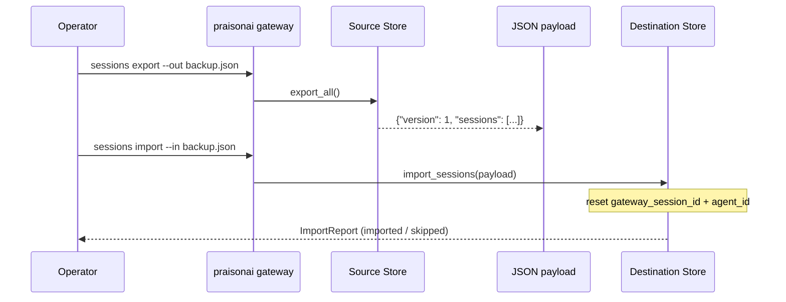
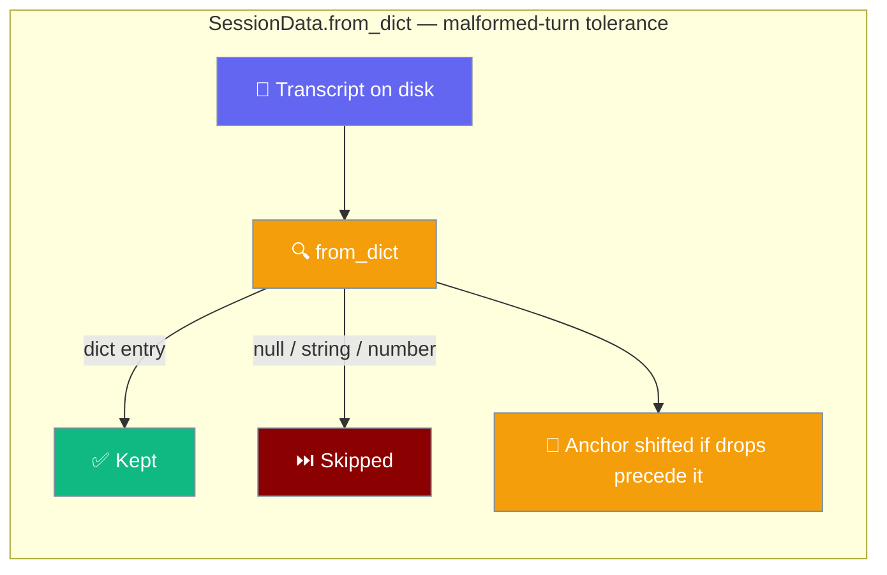
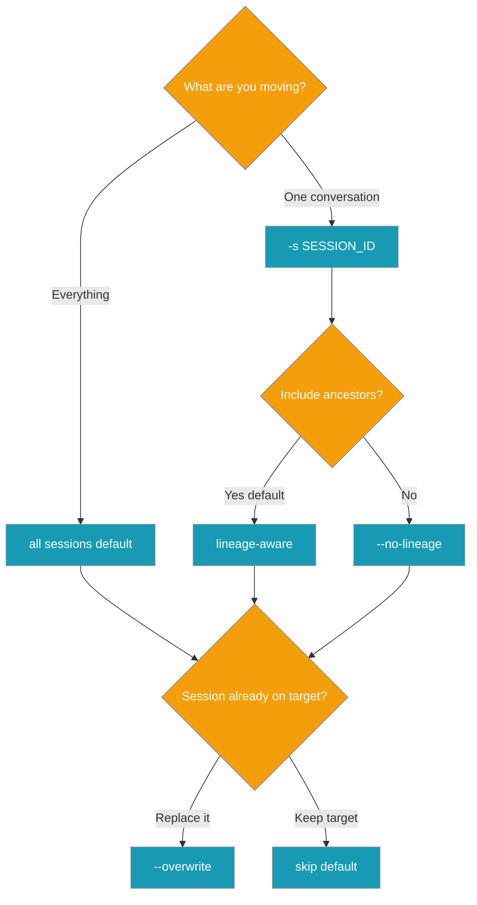

Export gateway conversations to a portable JSON file so you can back them up, move them between hosts, or restore them after disaster.


```mermaid
graph LR
    Live[(🗂️ Live store)] --> Export[⬇️ export]
    Export --> JSON[📦 JSON payload]
    JSON --> Import[⬆️ import]
    Import --> New[(🗂️ New host store)]

    classDef store fill:#8B0000,stroke:#7C90A0,color:#fff
    classDef process fill:#189AB4,stroke:#7C90A0,color:#fff
    classDef payload fill:#F59E0B,stroke:#7C90A0,color:#fff

    class Live,New store
    class Export,Import process
    class JSON payload
```

## Quick Start

<Steps>
<Step title="Back up and restore from the CLI">
Export every session to one file, then restore it on any host.

```bash
praisonai gateway sessions export --out backup.json
praisonai gateway sessions import --in backup.json   # inert until re-bound
```
</Step>

<Step title="Do it from Python">
The gateway helpers wrap the same store the gateway runs on.

```python
from praisonai_bot.gateway.preflight import export_gateway_sessions, import_gateway_sessions

payload = export_gateway_sessions()
report  = import_gateway_sessions(payload)
print(report["imported"], report["skipped_count"])
```
</Step>
</Steps>

---

## How It Works

Export reads live sessions into a versioned payload; import writes them back and resets live routing fields so restored state stays inert until the gateway re-binds it.


```mermaid
sequenceDiagram
    participant Operator
    participant CLI as praisonai gateway
    participant Src as Source Store
    participant JSON as JSON payload
    participant Dst as Destination Store

    Operator->>CLI: sessions export --out backup.json
    CLI->>Src: export_all()
    Src-->>JSON: {"version": 1, "sessions": [...]}
    Operator->>CLI: sessions import --in backup.json
    CLI->>Dst: import_sessions(payload)
    Note over Dst: reset gateway_session_id + agent_id
    Dst-->>Operator: ImportReport (imported / skipped)
```

| Behaviour | Detail |
|-----------|--------|
| Payload shape | Versioned envelope `{"version": 1, "sessions": [...]}` built from `SessionData.to_dict()` |
| Lineage-aware | Compacted / rotated continuations round-trip as one logical session (`lineage_id` / `root_session_id` / `thread_id`) |
| Hardened import | `max_sessions` cap, duplicate/cycle guard, malformed records skipped **and reported** |
| Version guard | Rejects payloads newer than `PORTABLE_VERSION = 1`; older/unversioned accepted best-effort |
| Live-field reset | Clears `gateway_session_id` and `agent_id` so restored state is inert until re-bound |

<Note>
**Gateway bindings survive `clear_session`.** Calling `store.clear_session(session_id)` empties the active transcript but keeps `gateway_session_id` and `agent_id` on the session — subsequent `get_by_gateway_session(...)` and `list_sessions_by_gateway_agent(...)` lookups continue to resolve the same session as an indexed lookup on `SqliteSessionStore`. To unbind and remove the routes, call `delete_session(session_id)`. See PraisonAI PR [#5681](https://github.com/MervinPraison/PraisonAI/pull/5681) / issue [#5521](https://github.com/MervinPraison/PraisonAI/issues/5521).
</Note>

<Note>
**Malformed turns are dropped on import.** `import_sessions` reconstructs each payload through `SessionData.from_dict`, which skips any entry in `messages` or `archived_messages` that is not a JSON object (`null`, a string, a number). Healthy turns survive — a single non-object turn in an imported transcript no longer crashes gateway routing (`get_by_gateway_session`, `list_sessions_by_gateway_agent`). When dropped active turns precede the compaction anchor, `last_compaction.message_index` is shifted down so `get_working_history()` still slices the retained tail correctly. The "live-field reset" and "version guard" behaviours above are unaffected. See PraisonAI PR [#5676](https://github.com/MervinPraison/PraisonAI/pull/5676) / issue [#5672](https://github.com/MervinPraison/PraisonAI/issues/5672).
</Note>


```mermaid
graph LR
    subgraph "SessionData.from_dict — malformed-turn tolerance"
        T[📝 Transcript on disk] --> F[🔍 from_dict]
        F -->|dict entry| K[✅ Kept]
        F -->|null / string / number| D[⏭️ Skipped]
        F --> A[🧭 Anchor shifted if drops precede it]
    end

    classDef input fill:#6366F1,stroke:#7C90A0,color:#fff
    classDef process fill:#F59E0B,stroke:#7C90A0,color:#fff
    classDef kept fill:#10B981,stroke:#7C90A0,color:#fff
    classDef dropped fill:#8B0000,stroke:#7C90A0,color:#fff

    class T input
    class F,A process
    class K kept
    class D dropped
```

```python
from praisonaiagents import Agent
from praisonaiagents.session import SqliteSessionStore

store = SqliteSessionStore(db_path="~/.praisonai/sessions.db")
agent = Agent(name="Gateway", session_store=store)

# Session is bound to a gateway event and handles a conversation
agent.start("Hello", session_id="chat-42")
store.set_gateway_info("chat-42", gateway_session_id="gw-abc", agent_id="support")

# Operator clears the active window to start a fresh chat for the same user
store.clear_session("chat-42")

# The next inbound gateway event still routes to the same local session —
# the route index survives clear_session (PR #5681).
same = store.get_by_gateway_session("gw-abc")   # SessionData for "chat-42"
assert same.session_id == "chat-42"
```

---

## Choosing the right options

Pick a scope, decide on lineage, and choose whether to overwrite.


```mermaid
graph TB
    Start{What are you moving?} -->|One conversation| One[-s SESSION_ID]
    Start -->|Everything| All[all sessions default]
    One --> Lin{Include ancestors?}
    Lin -->|Yes default| Keep[lineage-aware]
    Lin -->|No| Drop[--no-lineage]
    All --> Exists{Session already on target?}
    Keep --> Exists
    Drop --> Exists
    Exists -->|Replace it| Over[--overwrite]
    Exists -->|Keep target| Skip[skip default]

    classDef q fill:#F59E0B,stroke:#7C90A0,color:#fff
    classDef a fill:#189AB4,stroke:#7C90A0,color:#fff

    class Start,Lin,Exists q
    class One,All,Keep,Drop,Over,Skip a
```

---

## CLI Reference

<Tabs>
<Tab title="export">
```bash
praisonai gateway sessions export [OPTIONS]

Examples:
  praisonai gateway sessions export --out backup.json
  praisonai gateway sessions export -s bot_slack_U123 -o one.json
  praisonai gateway sessions export -s bot_slack_U123 --no-lineage
```

| Flag | Type | Default | Description |
|------|------|---------|-------------|
| `--session-id, -s` | `str?` | `None` | Export just this session (lineage-aware); default = all |
| `--out, -o` | `str?` | stdout | Atomic write via temp file + `os.replace` |
| `--no-lineage` | `bool` | `False` | Skip compacted/rotated ancestors for a single-session export |
</Tab>

<Tab title="import">
```bash
praisonai gateway sessions import [OPTIONS]

Examples:
  praisonai gateway sessions import --in backup.json
  praisonai gateway sessions import -i backup.json --overwrite
  praisonai gateway sessions import -i backup.json --keep-live-fields --max-sessions 500 --json
```

| Flag | Type | Default | Description |
|------|------|---------|-------------|
| `--in, -i` | `str` | *required* | Read payload from this file |
| `--overwrite` | `bool` | `False` | Overwrite sessions that already exist |
| `--keep-live-fields` | `bool` | `False` | Do **not** reset live routing/activity fields |
| `--max-sessions` | `int` | `10_000` | Cap ingest |
| `--json` | `bool` | `False` | Output the `ImportReport` as JSON |
</Tab>
</Tabs>

---

## Python API Reference

The same surface exists on the store and as thin gateway helpers.

```python
from praisonaiagents.session import DefaultSessionStore, ImportReport

store = DefaultSessionStore()

# Export
payload = store.export_session("bot_slack_U123", include_lineage=True)  # {"version": 1, "sessions": [...]}
payload = store.export_all()                                            # {"version": 1, "sessions": [...]}

# Import
report: ImportReport = store.import_sessions(
    payload,
    max_sessions=10_000,
    reset_live_fields=True,
    overwrite=False,
)
```

Gateway helpers target the store the gateway actually runs on:

```python
from praisonai_bot.gateway.preflight import export_gateway_sessions, import_gateway_sessions

payload = export_gateway_sessions(session_id=None, include_lineage=True)
report  = import_gateway_sessions(payload, max_sessions=10_000, reset_live_fields=True, overwrite=False)
```

`DefaultSessionStore`, `SqliteSessionStore`, and `SqliteTranscriptStore` (the **default** gateway backend) all implement `PortableSessionStoreProtocol`. The payload format is identical across all three — a backup from one restores cleanly into another.

| Method | Signature | Returns |
|--------|-----------|---------|
| `export_session` | `(session_id, *, include_lineage=True)` | `dict` — versioned payload |
| `export_all` | `()` | `dict` — versioned payload |
| `import_sessions` | `(payload, *, max_sessions=10_000, reset_live_fields=True, overwrite=False)` | `ImportReport` |

<Note>
**Not to be confused with** `PraisonAIDB.export_session` / `aexport_session` / `import_session` / `aimport_session`. Those live on the **DB adapter** (conversation-store layer, one session at a time) — see [Async Conversation Store](/features/async-conversation-store#session-export-import). The methods on this page are the **store-level** portability API (`include_lineage=` / `reset_live_fields=` / `export_all`), a different surface for whole-store backup and migration.
</Note>

`ImportReport` is JSON-serialisable via `as_dict()`:

```json
{
  "imported": 3,
  "skipped": [{"session_id": "s1", "reason": "already exists (use overwrite)"}],
  "skipped_count": 1,
  "version": 1
}
```

---

## Payload format

The envelope is versioned and symmetric across the built-in stores.

```json
{
  "version": 1,
  "sessions": [
    { "session_id": "bot_slack_U123", "messages": [], "metadata": {} }
  ]
}
```

Each session dict is the `SessionData.to_dict()` shape, so `SessionData.from_dict()` reconstructs it verbatim on import.

---

## Concurrency & no-clobber guarantee

Concurrent importers racing on the same `session_id` are safe: one wins, the other is reported — never silently overwritten.

```python
from praisonaiagents.session import SqliteSessionStore

store = SqliteSessionStore(db_path="~/.praisonai/sessions.db")

# Safe: concurrent importers cannot clobber each other.
# One wins; the other sees it in report.skipped.
report = store.import_sessions(payload, overwrite=False)
print(report.imported, report.skipped)
```

Both `DefaultSessionStore` and `SqliteSessionStore` enforce this guarantee identically.

`overwrite=False` is checked twice. The import loop first scans with `session_exists`, then `_save_imported_session` rechecks `os.path.exists` **inside the per-file write lock** — so a peer that creates the same session between the two checks still cannot be clobbered.

```mermaid
sequenceDiagram
    participant A as Importer A
    participant B as Peer writer B
    participant S as Store (lock + disk)

    A->>S: session_exists("shared")? false
    B->>S: write "shared" (creates file)
    A->>S: _save_imported_session("shared", overwrite=False)
    Note over S: acquire FileLock
    S-->>A: FileExistsError (recheck inside lock)
    Note over S: release lock
    A-->>A: skip with reason "already exists (use overwrite)"

    classDef importer fill:#8B0000,stroke:#7C90A0,color:#fff
    classDef lock fill:#189AB4,stroke:#7C90A0,color:#fff
    classDef outcome fill:#10B981,stroke:#7C90A0,color:#fff

    class A,B importer
    class S lock
```

The loser lands in `ImportReport.skipped` as `{"session_id": "shared", "reason": "already exists (use overwrite)"}`. As of [PraisonAI PR #5631](https://github.com/MervinPraison/PraisonAI/pull/5631), `SqliteSessionStore` honours `overwrite` end-to-end, so this protection holds identically whether the destination is JSON-on-disk or the SQLite-indexed store.

---

## Common Patterns

**Daily backup** — schedule a cron job that writes one dated file per day.

```bash
praisonai gateway sessions export --out /var/backups/gw-$(date +%F).json
```

**Staging → production migration** — export from staging, then overwrite only the ids being cut over.

```bash
praisonai gateway sessions export -s bot_slack_U123 -o cutover.json   # on staging
praisonai gateway sessions import -i cutover.json --overwrite         # on production
```

**Move one user's conversation between hosts** — export a single lineage-aware session, plain-import on the new host.

```bash
praisonai gateway sessions export -s bot_slack_U123 -o one.json   # old host
praisonai gateway sessions import -i one.json                     # new host
```

**Restore after disaster** — import a backup; live fields reset by default, so sessions stay inert until the gateway re-binds them.

```bash
praisonai gateway sessions import --in backup.json
```

---

## Best Practices

<AccordionGroup>
<Accordion title="Keep reset_live_fields=True unless you know why not">
Resetting clears `gateway_session_id` and `agent_id` (top-level and inside `metadata`) so a restored session cannot masquerade as an active connection. Only opt out with `--keep-live-fields` when re-importing onto the exact same live gateway.
</Accordion>

<Accordion title="Cap ingest for untrusted payloads">
`--max-sessions` (default `10_000`) bounds how many sessions land. The remainder is skipped and reported — never silently truncated.
</Accordion>

<Accordion title="Always inspect ImportReport.skipped">
A skipped record — already-exists, malformed, or over the cap — is listed with a reason, never dropped in silence. Read `skipped` before assuming a clean restore.
</Accordion>

<Accordion title="Prefer --out over stdout redirection">
`--out` writes atomically via a temp file + `os.replace`, so a crashed export never leaves a half-written backup.
</Accordion>

<Accordion title="Mind payload version compatibility">
`PORTABLE_VERSION = 1`. Older/unversioned payloads are accepted best-effort; a payload with a newer version is rejected wholesale rather than partially applied.
</Accordion>

<Accordion title="SqliteTranscriptStore export/import works on DB rows">
As of PraisonAI PR [#5686](https://github.com/MervinPraison/PraisonAI/pull/5686) (issue [#5517](https://github.com/MervinPraison/PraisonAI/issues/5517)), `SqliteTranscriptStore.export_all` scans rows in `sessions.db` and ignores stray `*.json` sidecars; `import_sessions` writes DB rows and reports a read-only database (`PRAGMA query_only=ON`) as a failed write in `ImportReport.skipped` instead of silently writing a sidecar. Lineage-aware exports (`lineage_id` / `root_session_id` / `thread_id`) follow DB continuations end-to-end.
</Accordion>
</AccordionGroup>

---

## Troubleshooting

<AccordionGroup>
<Accordion title="import error: ... unexpected keyword argument 'overwrite'">
Fixed in [PraisonAI PR #5631](https://github.com/MervinPraison/PraisonAI/pull/5631). Upgrade `praisonaiagents` and re-run the import; `SqliteSessionStore` now accepts and honours the `overwrite` flag end-to-end.
</Accordion>

<Accordion title="export skipped DB sessions / import wrote an invisible sidecar">
Fixed in PraisonAI PR [#5518](https://github.com/MervinPraison/PraisonAI/pull/5518) and PR [#5686](https://github.com/MervinPraison/PraisonAI/pull/5686). Before the fix, `SqliteTranscriptStore` inherited JSON-sidecar implementations of `export_all` / `_collect_lineage` / `_save_imported_session` — exports omitted every DB session and imports silently wrote to invisible `.json` sidecars. Upgrade `praisonaiagents` and re-run the export/import; the DB-row path is now used end-to-end.
</Accordion>
</AccordionGroup>

---

## Related

<CardGroup cols={2}>
  <Card title="Session Persistence" icon="database" href="/features/gateway-session-persistence">
    Durability across restarts on the same host.
  </Card>
  <Card title="Session Continuity" icon="link" href="/features/gateway-session-continuity">
    Survive disconnects without losing in-flight state.
  </Card>
  <Card title="Session Store" icon="box-archive" href="/features/session-store">
    Where and how gateway sessions are stored.
  </Card>
  <Card title="Session Protocol" icon="messages" href="/features/session-protocol">
    The pluggable store contract, including portability.
  </Card>
</CardGroup>
