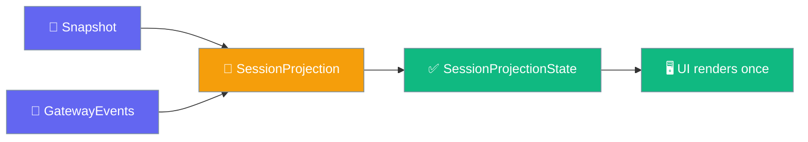
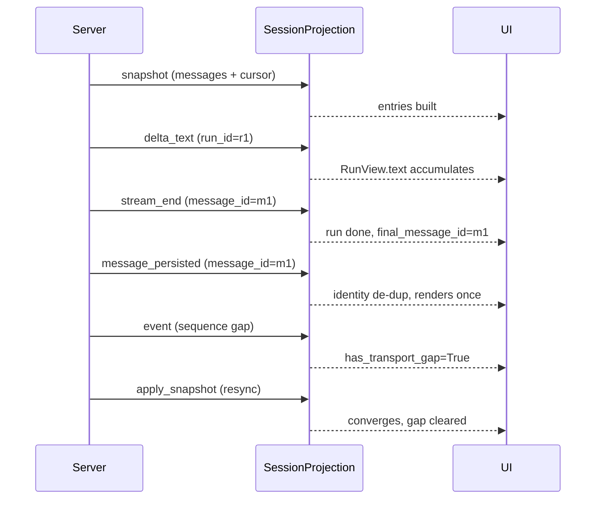
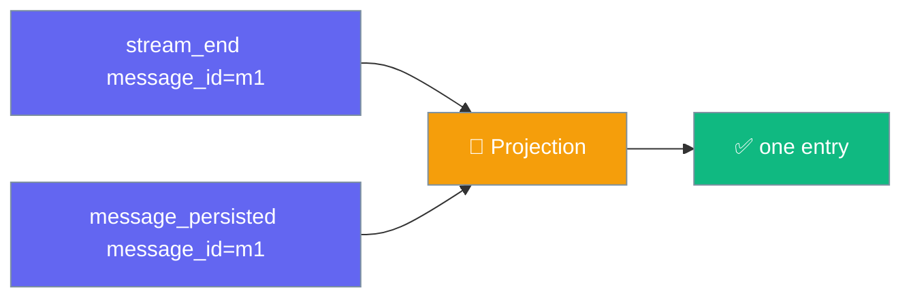
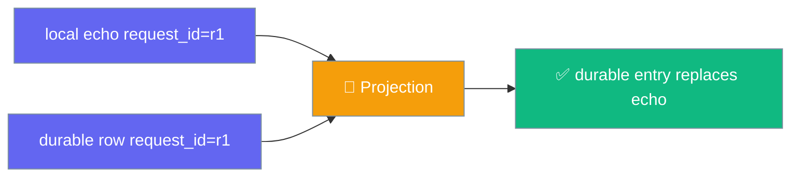
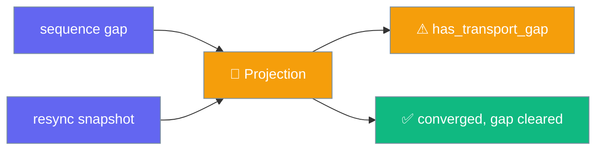
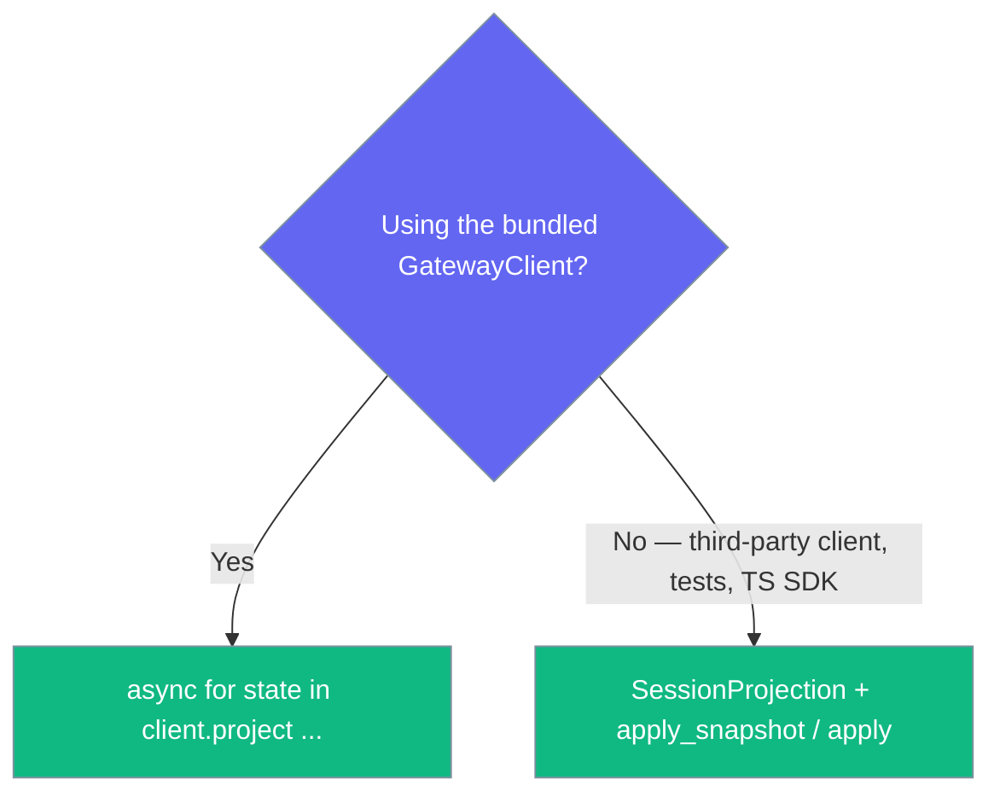

Turn a raw gateway event stream into a correct, resumable session view — no per-client de-dup, gap-healing or bounded retention to re-implement.

```python
from praisonai.gateway import GatewayClient

client = GatewayClient(url="ws://localhost:8765", agent_id="assistant")
await client.connect()

async for state in client.project():
    ui.render(state)   # de-duped, gap-aware, memory-bounded
```



## Quick Start

<Steps>
<Step title="Simplest usage">
Iterate the projected state and render it — the reducer folds every event for you.

```python
from praisonai.gateway import GatewayClient

client = GatewayClient(url="ws://localhost:8765", agent_id="assistant")
await client.connect()

async for state in client.project():
    ui.render(state)
```
</Step>

<Step title="With a resume snapshot">
Seed the projection with a snapshot on reconnect so the view converges instead of drifting.

```python
from praisonai.gateway import GatewayClient

client = GatewayClient(url="ws://localhost:8765", agent_id="assistant")
await client.connect()

snapshot = {"messages": [...], "cursor": 42}
async for state in client.project(snapshot=snapshot):
    ui.render(state)
```
</Step>

<Step title="Bound retention on a long-lived session">
Cap how many finished runs stay tracked; active streams are never evicted.

```python
async for state in client.project(max_tracked_runs=50):
    ui.render(state)
```
</Step>

<Step title="Pure-core usage without the wrapper">
Drive the reducer directly for third-party clients or tests — no transport required.

```python
from praisonaiagents.gateway import SessionProjection

proj = SessionProjection(max_tracked_runs=200)
state = proj.apply_snapshot({"messages": [...], "cursor": 5})

for event in my_event_source():
    state = proj.apply(event)
    render(state)
```
</Step>
</Steps>

---

## How It Works

The reducer folds a snapshot plus live events into an immutable state, reconciling every duplicate along the way.



| Step | Input | Effect |
|------|-------|--------|
| Snapshot | `messages` / `entries` / `transcript` + `cursor` / `sequence` | Rebuilds `entries`, resets gap tracking |
| Delta | `TOKEN_STREAM` / `delta_text` | Accumulates `RunView.text` per `run_id` |
| Stream end | `STREAM_END` | Marks run `done`, sets `final_message_id` |
| Persisted row | `MESSAGE` / `message_persisted` | Upserts transcript entry, de-duped by `message_id` |
| Sequence gap | `event.sequence > expected` | Flips `has_transport_gap = True` |
| Resync | `apply_snapshot()` | Converges without duplicates, clears the gap flag |

---

## De-duplication Behaviours

Three distinct reconciliations keep the view correct, each keyed on a different identifier.

<Tabs>
<Tab title="Identity de-dup (message_id)">
A final assistant message that arrives both as a `STREAM_END` and as a persisted transcript row renders once, keyed by `message_id`.


</Tab>

<Tab title="Optimistic reconciliation (request_id)">
A locally-echoed outbound message is replaced — not duplicated — by its durable counterpart with the same `request_id`. The echo's provisional `message_id` is dropped so a re-delivered echo cannot later overwrite the durable row.


</Tab>

<Tab title="Snapshot convergence after a gap">
A sequence hole sets `has_transport_gap=True`; a resync `apply_snapshot()` rebuilds `entries` from the persisted rows and clears the flag — without appending duplicates.


</Tab>
</Tabs>

---

## Configuration Options

The reducer constructor takes a single option.

| Option | Type | Default | Description |
|--------|------|---------|-------------|
| `max_tracked_runs` | `int` | `200` | Cap on tracked finished runs (LRU). Active/unfinished streams are never evicted. Must be positive; raises `ValueError` otherwise. |

`SessionProjectionState` — the immutable value returned by every apply call:

| Field | Type | Default | Description |
|-------|------|---------|-------------|
| `entries` | `Tuple[GatewayMessage, ...]` | `()` | Ordered transcript messages, de-duplicated by identity. |
| `runs` | `Dict[str, RunView]` | `{}` | Per-run streaming views, keyed by `run_id`. |
| `has_transport_gap` | `bool` | `False` | `True` when a sequence gap was observed and a resync has not yet reconciled it. |

`RunView` — the immutable per-run streaming view:

| Field | Type | Default | Description |
|-------|------|---------|-------------|
| `run_id` | `str` | — | The run/turn identifier the streamed deltas belong to. |
| `text` | `str` | `""` | Accumulated streamed text so far. |
| `done` | `bool` | `False` | Whether the stream has ended (`STREAM_END`) for this run. |
| `final_message_id` | `Optional[str]` | `None` | `message_id` of the persisted final row, once reconciled in. |

### `GatewayClient.project()`

| Parameter | Type | Default | Description |
|-----------|------|---------|-------------|
| `snapshot` | `Optional[Dict[str, Any]]` | `None` | Initial snapshot (`{"messages": [...], "cursor": N}`) to seed the projection before folding live events. When omitted, the view starts empty. |
| `max_tracked_runs` | `int` | `200` | Cap on tracked finished runs (LRU) for long-lived sessions; active streams are never evicted. |

Yields a `SessionProjectionState` after the initial snapshot (if any) and after every subsequent event.

---

## TypeScript Parity

The `praisonai-ts` SDK ships the same reducer, importing from the package root. It accepts both camelCase (SDK) and snake_case (wire) keys — `messageId`/`message_id`, `requestId`/`request_id`, `senderId`/`sender_id`, `runId`/`run_id` — so wire frames from the Python gateway drop straight in with identical de-dup, reconciliation, gap and retention semantics.

<Tabs>
<Tab title="Simplest usage">
```ts
import { SessionProjection } from 'praisonai';

const proj = new SessionProjection({ maxTrackedRuns: 200 });

for (const event of myEventSource) {
  const state = proj.apply(event);
  render(state);   // state.entries / state.runs / state.hasTransportGap
}
```
</Tab>

<Tab title="With snapshot">
```ts
import {
  SessionProjection,
  type RunView,
  type ProjectionEntry,
  type SessionProjectionState,
  type SessionSnapshot,
} from 'praisonai';

const proj = new SessionProjection({ maxTrackedRuns: 200 });
const s0 = proj.applySnapshot({ messages: [...], cursor: 5 });

for (const event of myEventSource) {
  const state = proj.apply(event);
  render(state);
}
```
</Tab>
</Tabs>

---

## Common Patterns

<Tabs>
<Tab title="Render a dashboard from a live session">
```python
from praisonai.gateway import GatewayClient

client = GatewayClient(url="ws://localhost:8765", agent_id="assistant")
await client.connect()

async for state in client.project():
    dashboard.render(state.entries, state.runs)
```
</Tab>

<Tab title="Resume after reconnect">
```python
from praisonai.gateway import GatewayClient

client = GatewayClient(url="ws://localhost:8765", agent_id="assistant")
await client.connect()

snapshot = {"messages": stored_transcript, "cursor": last_cursor}
async for state in client.project(snapshot=snapshot):
    if state.has_transport_gap:
        await client.resync()
    ui.render(state)
```
</Tab>

<Tab title="Third-party client without the wrapper">
```python
from praisonaiagents.gateway import SessionProjection

proj = SessionProjection(max_tracked_runs=100)
state = proj.apply_snapshot(my_snapshot)

for event in my_event_source():
    state = proj.apply(event)
    render(state)
```
</Tab>
</Tabs>

---

## Choose Your Entry Point

Pick the wrapper when you use the bundled client; drive the pure core everywhere else.



---

## Best Practices

<AccordionGroup>
<Accordion title="Feed a resume snapshot on reconnect">
Pass a snapshot so the view converges instead of drifting — `apply_snapshot()` resets gap tracking and rebuilds the transcript from persisted rows.
</Accordion>

<Accordion title="Watch has_transport_gap in your UI">
Pair `state.has_transport_gap` with `client.resync()` on the transport side to heal a sequence hole after a reconnect.
</Accordion>

<Accordion title="Tune max_tracked_runs for long-lived sessions">
Lower `max_tracked_runs` for dashboards that run for days; leave the default `200` for a chat UI.
</Accordion>

<Accordion title="Treat state as read-only">
Never mutate `state.entries` or `state.runs` — they are immutable snapshots. A previous state is never mutated in place by a later `apply()`.
</Accordion>

<Accordion title="Prefer project() over hand-rolled event handling">
`client.project()` is the SDK primitive that removes double-rendered answers, reconnect flicker and unbounded memory growth.
</Accordion>
</AccordionGroup>

---

## Related

<CardGroup cols={2}>
  <Card title="Gateway Client" icon="plug" href="/features/gateway-client">
    Reconnecting transport and raw event stream
  </Card>
  <Card title="Stream Events" icon="waveform-lines" href="/features/gateway-stream-events">
    Live progress events forwarded over WebSocket
  </Card>
  <Card title="Frame Codec" icon="barcode" href="/features/gateway-frame-codec">
    The `request_id` reconciliation key
  </Card>
  <Card title="Session Persistence" icon="clock" href="/features/gateway-session-persistence">
    Where durable transcript rows come from
  </Card>
</CardGroup>
