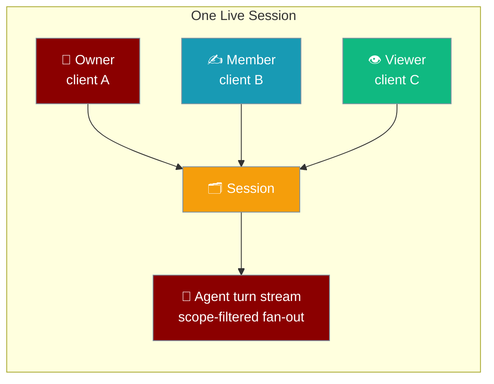
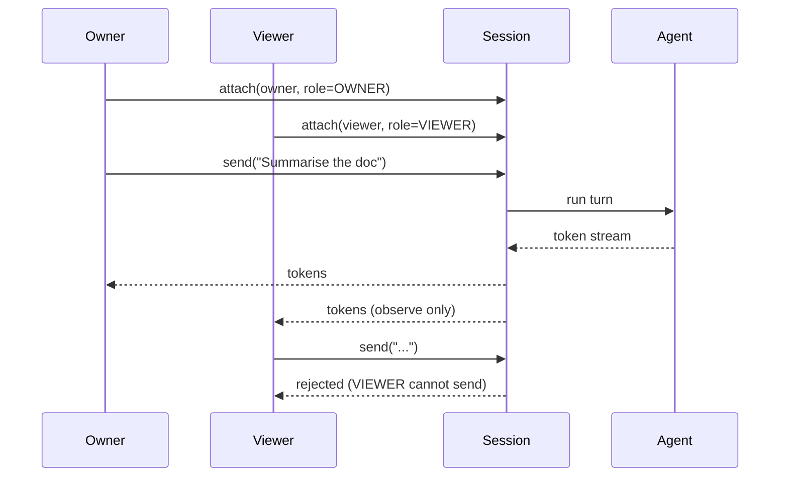
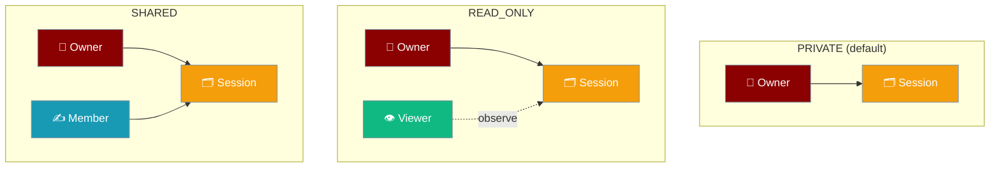
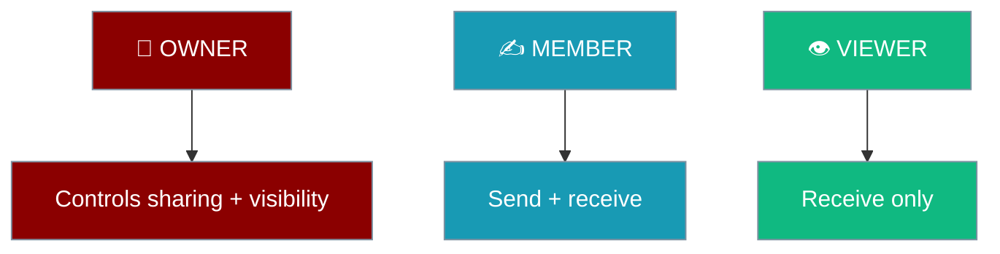
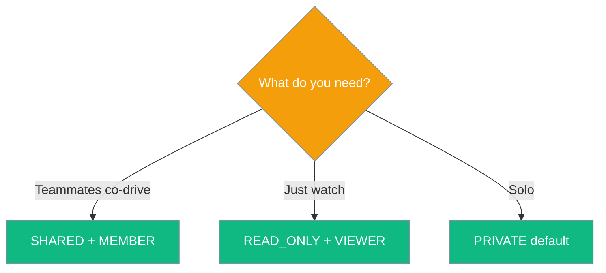
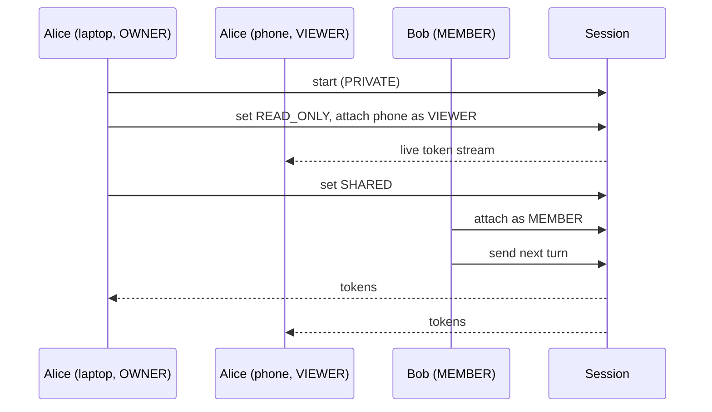

Session sharing lets more than one authorised client attach to the same live Gateway session — watching an agent work a task together, or opening the same conversation on desktop and mobile.

```python
from praisonaiagents import Agent

agent = Agent(name="assistant", instructions="Be helpful.")
agent.start("Kick off a shared session")
# A teammate attaches from another client to watch the same live turn stream.
```



## Quick Start

<Steps>
<Step title="Default — private, 1:1 (nothing to configure)">

Today's behaviour is unchanged. A session is `PRIVATE` and stays bound to its single owner.

```python
from praisonaiagents import Agent
from praisonaiagents.gateway import SessionVisibility

agent = Agent(name="assistant", instructions="Be helpful.")
agent.start("Solo research session")

# Default visibility — owner only
print(SessionVisibility.PRIVATE.value)  # "private"
```

</Step>

<Step title="Share a session read-only">

Set `READ_ONLY` so an extra client may attach as a `VIEWER` to watch the transcript, but not send.

```python
from praisonaiagents.gateway import SessionVisibility, SessionSharingRole

visibility = SessionVisibility.READ_ONLY
role = SessionSharingRole.VIEWER

print(visibility.value, role.value)  # "read_only" "viewer"
```

</Step>

<Step title="Share a session for co-driving">

Set `SHARED` so an extra client may attach as a `MEMBER` and co-drive — sending turns alongside the owner.

```python
from praisonaiagents.gateway import SessionVisibility, SessionSharingRole

visibility = SessionVisibility.SHARED
role = SessionSharingRole.MEMBER

print(visibility.value, role.value)  # "shared" "member"
```

</Step>
</Steps>

<Note>
Sharing is **additive**. A `PRIVATE` session keeps a single `OWNER` observer — everything that worked before still works.
</Note>

---

## How It Works

Two clients attach to one session, a turn fires, and both receive the stream — but a viewer's send is rejected.



1. The owner starts a session — it is `PRIVATE` by default.
2. Raising visibility to `SHARED` or `READ_ONLY` lets a second authorised client attach.
3. Each attached client holds a role: `OWNER`, `MEMBER`, or `VIEWER`.
4. The turn stream fans out to every observer, filtered by their `OperatorScope`.

---

## Visibility

Visibility decides *whether* a second authorised client may attach on top of scope authorisation.



## Roles

A role decides what an attached client may do inside a shared session.



## Which visibility should I pick?



---

## Configuration

Every value maps to a wire string used on the protocol.

### `SessionVisibility`

| Value | Wire value | Meaning |
|---|---|---|
| `SessionVisibility.PRIVATE` | `"private"` | **Default.** Owner only — today's 1:1 behaviour. |
| `SessionVisibility.SHARED` | `"shared"` | Additional authorised clients may attach with WRITE-capable roles. |
| `SessionVisibility.READ_ONLY` | `"read_only"` | Additional clients may attach as viewers to observe, but not send. |

### `SessionSharingRole`

| Value | Wire value | Meaning |
|---|---|---|
| `SessionSharingRole.OWNER` | `"owner"` | Controls sharing/visibility; the session's original driver. |
| `SessionSharingRole.MEMBER` | `"member"` | May co-drive (send) when the session is `SHARED`. |
| `SessionSharingRole.VIEWER` | `"viewer"` | Observes the live turn stream but cannot send. |

All imports use the friendly top-level path:

```python
from praisonaiagents.gateway import (
    SessionVisibility,
    SessionSharingRole,
    SessionObserverProtocol,
)
```

---

## User Interaction Flow

Alice starts a research session on her laptop, opens it read-only on her phone to watch tokens stream, then Bob joins as a `MEMBER` to help steer the next turn.

```python
from praisonaiagents.gateway import SessionVisibility, SessionSharingRole

# Alice owns the session on her laptop
owner_role = SessionSharingRole.OWNER

# Alice opens the same session read-only on her phone
alice_phone = (SessionVisibility.READ_ONLY, SessionSharingRole.VIEWER)

# Bob joins to co-drive — the session is shared
bob = (SessionVisibility.SHARED, SessionSharingRole.MEMBER)

print(owner_role.value)     # "owner"
print(alice_phone[1].value) # "viewer"
print(bob[1].value)         # "member"
```



---

## Observer Protocol

`SessionObserverProtocol` is the `@runtime_checkable` contract every client agrees on for attaching, detaching, and enumerating observers.

```python
from typing import List, Tuple
from praisonaiagents.gateway import SessionSharingRole, SessionObserverProtocol


class InMemoryObservers:
    def __init__(self) -> None:
        self._by_session: dict[str, dict[str, SessionSharingRole]] = {}

    def attach(
        self,
        session_id: str,
        client_id: str,
        role: SessionSharingRole = SessionSharingRole.VIEWER,
    ) -> None:
        self._by_session.setdefault(session_id, {})[client_id] = role

    def detach(self, session_id: str, client_id: str) -> None:
        self._by_session.get(session_id, {}).pop(client_id, None)

    def observers(
        self, session_id: str,
    ) -> "List[Tuple[str, SessionSharingRole]]":
        return list(self._by_session.get(session_id, {}).items())


impl = InMemoryObservers()
impl.attach("s1", "alice", SessionSharingRole.OWNER)
impl.attach("s1", "bob")  # defaults to VIEWER

print(impl.observers("s1"))
# [('alice', <SessionSharingRole.OWNER>), ('bob', <SessionSharingRole.VIEWER>)]

# Protocol is runtime-checkable
print(isinstance(impl, SessionObserverProtocol))  # True
```

`attach` adds an observer rather than re-pointing ownership — a `PRIVATE` session still keeps its single `OWNER`.

---

## Interaction with Operator Scopes

Visibility and role layer **on top of** `OperatorScope` — they are not authorisation.

An observer without the `READ` scope receives nothing regardless of role, and a `MEMBER` still needs `WRITE` to send. Visibility gates *whether* a client may attach; scopes gate *what* they may do once attached.

<Card title="Gateway Operator Scopes" icon="shield-check" href="/features/gateway-operator-scopes">
  Role-based access control that visibility and roles build on top of
</Card>

---

## Best Practices

<AccordionGroup>
<Accordion title="Default to PRIVATE">
Keep sessions `PRIVATE` unless a real collaboration case exists. Sharing is opt-in and additive.
</Accordion>

<Accordion title="Use READ_ONLY for watching, SHARED for co-driving">
Pick `READ_ONLY` for supervisor, audit, or multi-device watching. Reserve `SHARED` for teammates who truly co-drive.
</Accordion>

<Accordion title="Detach viewers on disconnect">
Call `detach` when a client drops so the observer set stays clean and fan-out stays cheap.
</Accordion>

<Accordion title="Combine with OperatorScope">
Visibility is not authorisation. Pair sharing with scopes so an observer without `READ` receives nothing.
</Accordion>
</AccordionGroup>

---

## Related

<CardGroup cols={2}>
<Card title="Operator Scopes" icon="shield-check" href="/features/gateway-operator-scopes">
  Least-privilege RBAC that sharing layers on top of
</Card>
<Card title="Session Continuity" icon="link" href="/features/gateway-session-continuity">
  One owner reconnecting to one session
</Card>
<Card title="Session Persistence" icon="database" href="/features/gateway-session-persistence">
  Durable session state across restarts
</Card>
<Card title="Handshake Protocol" icon="handshake" href="/features/gateway-handshake-protocol">
  Version negotiation and connection setup
</Card>
</CardGroup>
