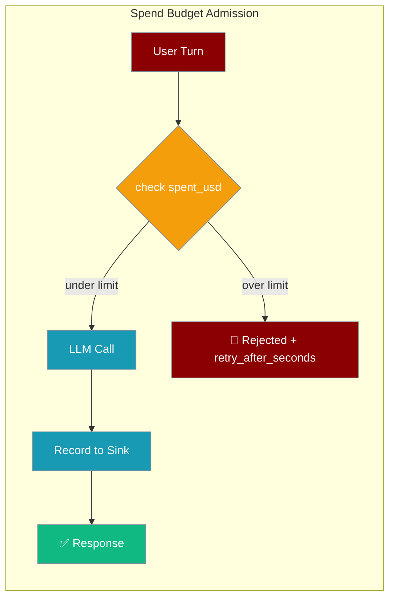
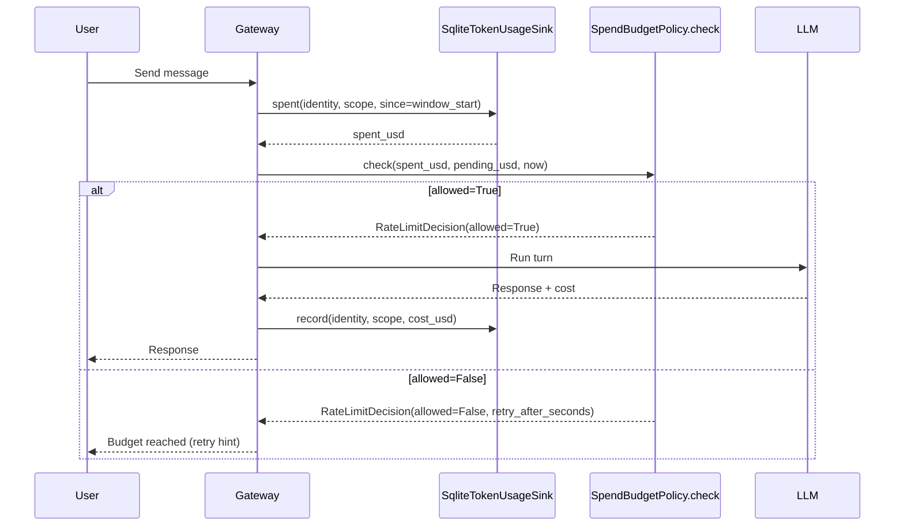
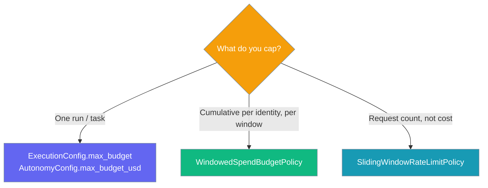

Cap how much each end user can spend on a shared-Agent gateway, enforced *before* the LLM call.

```python
from praisonaiagents import Agent
from praisonaiagents.gateway import WindowedSpendBudgetPolicy

agent = Agent(
    name="Support Bot",
    instructions="Answer user questions",
)

# Cap each end-user at $2/day
budget = WindowedSpendBudgetPolicy(limit_usd=2.00, window_seconds=86_400)
```



## Quick Start

<Steps>
<Step title="Disabled by default">

A `limit_usd` of `0` (the default) disables budgeting — every turn is allowed, exactly like the legacy behaviour.

```python
from praisonaiagents.gateway import WindowedSpendBudgetPolicy

budget = WindowedSpendBudgetPolicy()          # limit_usd=0 → no cap
assert budget.enabled is False
```
</Step>

<Step title="Enable with a limit">

Set a positive `limit_usd` to cap cumulative spend per identity in a rolling window.

```python
from praisonaiagents.gateway import WindowedSpendBudgetPolicy

budget = WindowedSpendBudgetPolicy(limit_usd=2.00, window_seconds=86_400)
assert budget.enabled is True
```
</Step>

<Step title="Wire it alongside a durable sink">

Pair the policy with `SqliteTokenUsageSink` so cumulative spend survives restarts and is shared across processes.

```python
import time
from praisonaiagents.gateway import WindowedSpendBudgetPolicy
from praisonaiagents.telemetry.durable_sink import SqliteTokenUsageSink

sink = SqliteTokenUsageSink("~/.praisonai/usage.db")
budget = WindowedSpendBudgetPolicy(limit_usd=2.00, window_seconds=86_400)

now = time.time()
spent = sink.spent(identity="tg:123", scope="telegram", since=budget.window_start(now))
decision = budget.check(identity="tg:123", scope="telegram", spent_usd=spent, now=now)

if not decision.allowed:
    print(f"Budget reached — retry in {decision.retry_after_seconds:.0f}s")
```
</Step>
</Steps>

---

## How It Works

The gateway reads cumulative `spent_usd` from a durable sink, then asks the policy whether the next turn is allowed — all before the LLM call runs.



Pass `pending_usd` to reserve budget for the estimated turn cost **before** the call, so a single expensive turn cannot overshoot the cap.

---

## Choose Your Budget Knob

PraisonAI has three cost controls — pick the one that matches your scope.



---

## Imports

```python
from praisonaiagents.gateway import (
    RateLimitDecision,
    SpendBudgetPolicyProtocol,
    SpendBudgetPolicy,            # backward-compat alias for the Protocol
    WindowedSpendBudgetPolicy,
)
```

---

## API Reference

### `WindowedSpendBudgetPolicy`

Config-driven, stateless, dependency-free default. Cumulative spend is owned by the sink.

| Option | Type | Default | Description |
|--------|------|---------|-------------|
| `limit_usd` | `float` | `0.0` | Rolling-window cap in USD. `0` (or negative) **disables** the budget — every turn is allowed. |
| `window_seconds` | `float` | `86_400.0` | Rolling-window length in seconds. Must be `> 0`. |

| Member | Signature / Type | Description |
|--------|------------------|-------------|
| `enabled` | `bool` (property) | `True` when `limit_usd > 0`. |
| `window_start(now)` | `(float) -> float` | Returns `now - window_seconds`. Use it to query the sink over the same window the policy enforces. |
| `check(...)` | see below | Returns `RateLimitDecision(allowed=True)` while `spent_usd + pending_usd < limit_usd`; otherwise `allowed=False` with a `retry_after_seconds` hint. |

### `SpendBudgetPolicyProtocol`

`@runtime_checkable` `Protocol` — any object with a matching `check` signature satisfies it, no base class needed.

```python
class SpendBudgetPolicyProtocol(Protocol):
    def check(
        self,
        *,
        identity: str,                        # Canonical caller id
        scope: str,                           # Channel / tenant token
        spent_usd: float,                     # Cumulative spend in the window
        now: float,                           # Current timestamp
        pending_usd: float = 0.0,             # Estimated cost of this turn
        oldest_spend_ts: float | None = None, # Earliest in-window charge
    ) -> RateLimitDecision: ...
```

### `RateLimitDecision`

Reused frozen dataclass — identical to the rate-limit policy shape.

| Field | Type | Description |
|-------|------|-------------|
| `allowed` | `bool` | `True` → turn proceeds; `False` → reject with a retry hint. |
| `retry_after_seconds` | `float` | Seconds until the oldest in-window charge ages out (or `window_seconds` as a safe upper bound when `oldest_spend_ts` is not supplied; `0.0` when already aged out). |

### `SpendBudgetPolicy`

Backward-compat alias for `SpendBudgetPolicyProtocol`. New code should import `SpendBudgetPolicyProtocol`.

<Card title="SDK Reference" icon="code" href="/docs/sdk/reference/">
  Full auto-generated API surface for the gateway package.
</Card>

---

## Configuration Options

The policy supports three levels of control.

```python
from praisonaiagents.gateway import WindowedSpendBudgetPolicy, RateLimitDecision

# Level 1: Bool-like default — 0 disables (legacy always-allow)
budget = WindowedSpendBudgetPolicy(limit_usd=0)

# Level 2: Config class — cap $X per identity per window
budget = WindowedSpendBudgetPolicy(limit_usd=2.00, window_seconds=86_400)

# Level 3: Instance — a custom object conforming to SpendBudgetPolicyProtocol
class TenantBudget:
    def check(self, *, identity, scope, spent_usd, now,
              pending_usd=0.0, oldest_spend_ts=None) -> RateLimitDecision:
        cap = 10.0 if identity.startswith("p_") else 1.0
        if spent_usd + pending_usd < cap:
            return RateLimitDecision(allowed=True)
        return RateLimitDecision(allowed=False, retry_after_seconds=3600.0)
```

---

## Common Patterns

### $2/day per identity

```python
from praisonaiagents.gateway import WindowedSpendBudgetPolicy

budget = WindowedSpendBudgetPolicy(limit_usd=2.00, window_seconds=86_400)
```

### $0.50/hour burst cap

```python
from praisonaiagents.gateway import WindowedSpendBudgetPolicy

budget = WindowedSpendBudgetPolicy(limit_usd=0.50, window_seconds=3_600)
```

### Custom tenant-tiered policy

```python
from praisonaiagents.gateway import RateLimitDecision, SpendBudgetPolicyProtocol

class TierBudget:
    def check(self, *, identity, scope, spent_usd, now,
              pending_usd=0.0, oldest_spend_ts=None) -> RateLimitDecision:
        cap = 10.0 if identity.startswith("p_") else 1.0
        if spent_usd + pending_usd < cap:
            return RateLimitDecision(allowed=True)
        return RateLimitDecision(allowed=False, retry_after_seconds=3600.0)

assert isinstance(TierBudget(), SpendBudgetPolicyProtocol)  # runtime-checkable
```

### Friendly retry-after reply

```python
decision = budget.check(identity="tg:123", scope="telegram", spent_usd=2.5, now=now)
if not decision.allowed:
    mins = decision.retry_after_seconds / 60
    reply = f"You've hit your daily budget. Try again in ~{mins:.0f} min."
```

---

## Best Practices

<AccordionGroup>

<Accordion title="Always pair with SqliteTokenUsageSink">

The policy is stateless — it never stores spend. Back it with a durable sink so budgets survive restarts. An in-memory sink loses budget on every restart.
</Accordion>

<Accordion title="Pass pending_usd when you can estimate turn cost">

Supplying `pending_usd` reserves budget for the turn *before* the LLM call, so a single expensive turn cannot overshoot the cap before its cost is recorded.
</Accordion>

<Accordion title="Feed oldest_spend_ts for accurate retry hints">

Pass `oldest_spend_ts` from `sink.oldest_spend_ts(...)` so rejected users get the precise time until spend rolls out of the window — not a full-window worst case.
</Accordion>

<Accordion title="Prefer per-identity caps; use scope for tenant ceilings">

Cap per canonical identity for fair per-user limits. Scope-scoped caps are for tenant-level ceilings across many users on one channel.
</Accordion>

</AccordionGroup>

---

## Related

<CardGroup cols={2}>
<Card title="SQLite Usage Sink" icon="database" href="/features/token-usage-sqlite-sink">
  Durable, per-identity spend ledger that feeds this policy
</Card>
<Card title="Rate-Limit Policy" icon="gauge-high" href="/features/gateway-rate-limit-policy">
  Gate on request count instead of cost
</Card>
<Card title="Gateway Admission Control" icon="shield-check" href="/features/gateway-admission-control">
  The admission seam this policy plugs into
</Card>
<Card title="Agent Max Budget" icon="dollar-sign" href="/features/agent-max-budget">
  Cap spend for a single agent run
</Card>
</CardGroup>
