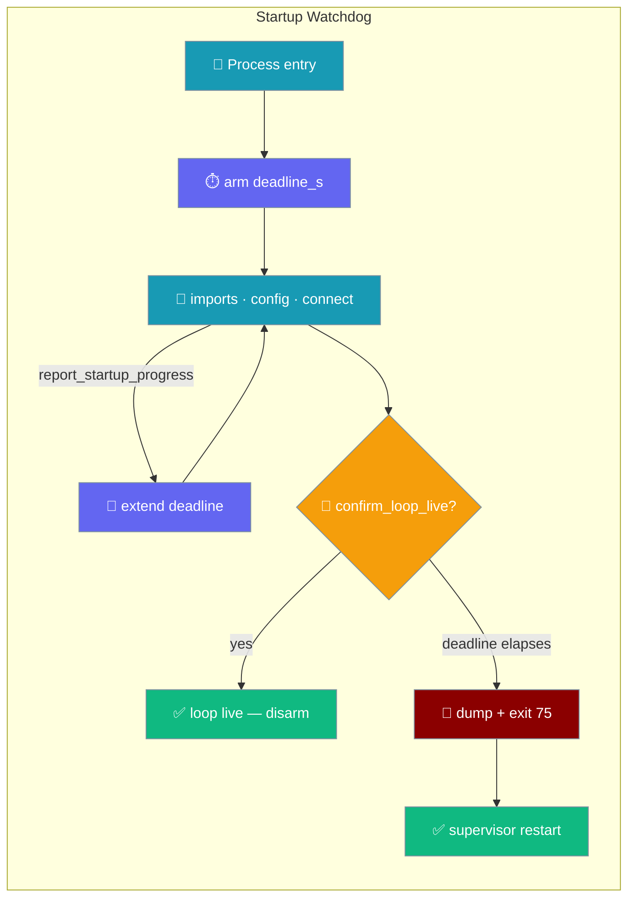
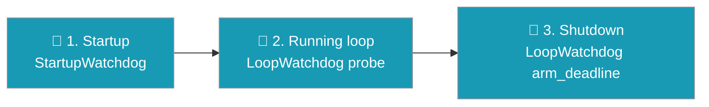
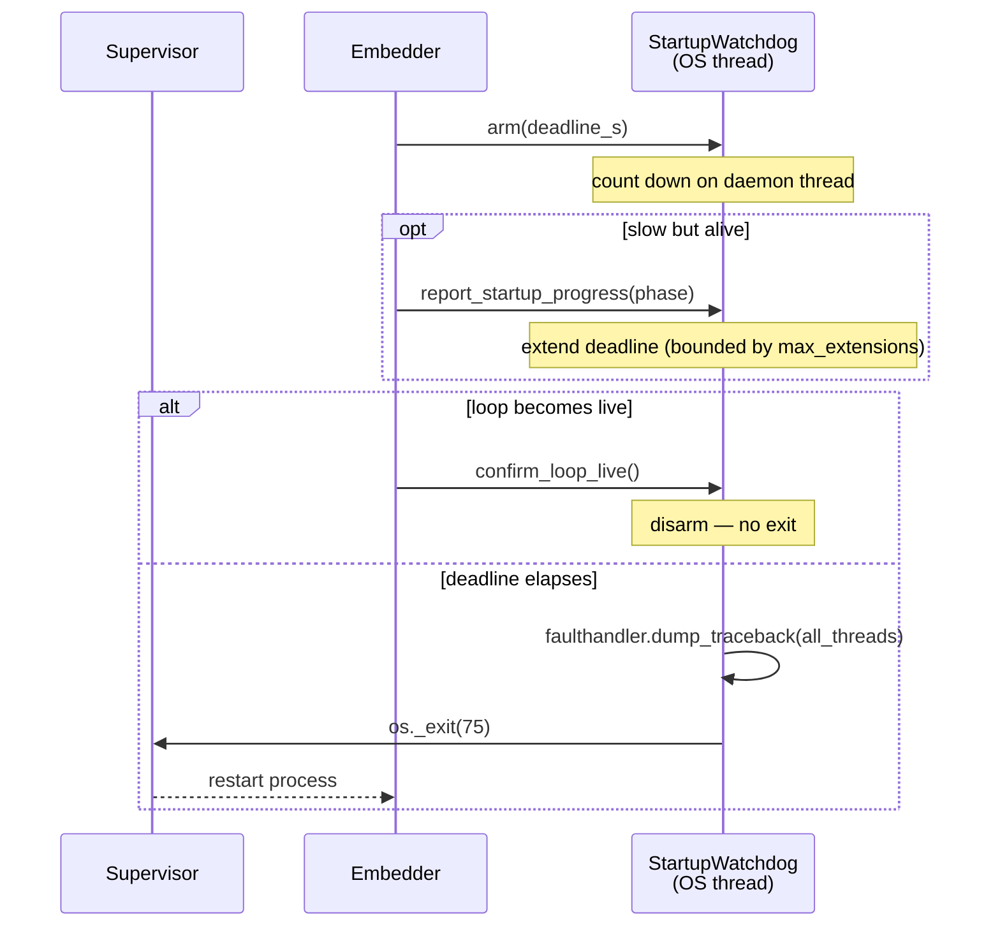

`StartupWatchdog` guards the window between process entry and a live event loop, so a hanging import, a blocking credential mint, or a deadlocked `connect()` never becomes a silent zombie.



<Info>
**Running `praisonai gateway start`?** CLI/YAML wiring for this rung is not yet in the wrapper — it is deliberately scoped out of PR [#5266](https://github.com/MervinPraison/PraisonAI/pull/5266) as an embedder concern. You need a small custom entry point (see [Quick Start](#quick-start)) to arm it today. Watch [issue #5265](https://github.com/MervinPraison/PraisonAI/issues/5265) for the follow-up CLI/YAML PR.
</Info>

<Note>
This primitive is a **minimal, dependency-free core building block only** — no Agent params, no new dependencies, no `praisonai gateway start --startup-watchdog-timeout=…` flag, and no `gateway.startup_watchdog:` YAML block. Wiring those into the wrapper is intentionally out of scope for PR #5266 and is left for a future embedder-side change. Arm it manually from your own entry point for now.
</Note>

## Watchdog ladder

`StartupWatchdog` is the front rung of a three-rung ladder — it covers startup, [`LoopWatchdog`](/features/gateway-loop-watchdog) covers the running loop and the shutdown drain.



| Rung | Class / mode | Covers | Fires when |
|---|---|---|---|
| 1. Startup | `StartupWatchdog` | Imports, config/secret load, first `connect()` — before the loop exists | Deadline elapses without `confirm_loop_live()` |
| 2. Running loop | [`LoopWatchdog`](/features/gateway-loop-watchdog) (probe mode) | The event loop while it serves | N consecutive missed `call_soon_threadsafe` probes |
| 3. Shutdown | [`LoopWatchdog.arm_deadline`](/features/gateway-loop-watchdog#shutdown-phase-deadline-mode) | Wedged teardown after `stop()` / SIGTERM | `drain_timeout + shutdown_grace` elapses without `cancel()` |

## Quick Start

<Steps>

<Step title="Arm before heavy startup, confirm when the loop is live">

Arm the deadline before the first heavy import, then disarm the instant the loop begins serving.

```python
import asyncio
from praisonaiagents.gateway import StartupWatchdog, LoopWatchdog

sw = StartupWatchdog()
sw.arm(deadline_s=30.0)          # trip if startup wedges for 30s

# ... heavy imports, config/secret load, initial adapter connect() ...

loop = asyncio.new_event_loop()
LoopWatchdog().arm(loop)
sw.confirm_loop_live()           # disarm; loop watchdog now owns liveness
loop.run_forever()
```

</Step>

<Step title="Extend the deadline across slow-boot phases">

A legitimately slow boot reports progress at each phase, so it earns a fresh window instead of tripping.

```python
from praisonaiagents.gateway import StartupWatchdog

sw = StartupWatchdog()
sw.arm(deadline_s=15.0)

load_config()
sw.report_startup_progress("config loaded")     # extends the deadline

connect_adapters()
sw.report_startup_progress("adapters connected") # extends again (bounded)

sw.confirm_loop_live()
```

</Step>

<Step title="Observe without exiting (dev / staging)">

Use `on_expire="dump_only"` to capture a stack dump on a wedge without killing the process.

```python
from praisonaiagents.gateway import StartupWatchdog

sw = StartupWatchdog(
    on_expire="dump_only",
    dump_file="/var/log/praisonai/startup-wedge.log",
)
sw.arm(deadline_s=10.0)
# ... startup ...
if sw.expired:
    print("startup hung at least once; check the stack dump")
```

</Step>

</Steps>

---

## How It Works

A dedicated daemon OS thread counts down a wall-clock deadline, so it keeps working precisely when the main thread is wedged.



| Piece | Owner | Role |
|---|---|---|
| `StartupWatchdog.arm(deadline_s=…)` | Embedder call | Spawns daemon OS thread `praisonai-startup-watchdog` before heavy work |
| `report_startup_progress(phase)` | Embedder call | Extends the deadline by one window, bounded by `max_extensions` |
| `confirm_loop_live()` | Embedder call | Disarms once the loop is live — hands liveness to `LoopWatchdog` |
| `faulthandler.dump_traceback(all_threads=True)` | Stdlib | All-thread stack dump on expiry |
| `os._exit(75)` | Stdlib | Bypasses `Py_FinalizeEx` — supervisor sees `EX_TEMPFAIL` |
| `GATEWAY_RESTART_EXIT_CODE` | Protocol | The `75` constant, shared with the rest of the restart-intent protocol |

The watchdog is **stdlib-only** (`threading`, `time`, `os`, `sys`, `math`, `faulthandler`) — it has to run when the code it guards cannot, so its correctness never depends on the imports it protects.

On expiry the stack-dump header reads:

```
praisonai-startup-watchdog: gateway startup did not confirm a live event loop within ~Ns; dumping all-thread stacks
```

This is distinct from both the loop-wedge header and the shutdown-phase header, so a single glance at the log tells you *which* rung fired. See [Exit Codes](/features/gateway-exit-codes) for the shared `75` contract.

---

## Configuration Options

The constructor holds every knob; `arm()` takes the deadline.

| Option | Type | Default | Description |
|--------|------|---------|-------------|
| `on_expire` | `"dump_and_exit"` \| `"dump_only"` | `"dump_and_exit"` | What to do on a wedge. `"dump_and_exit"` dumps all-thread stacks then calls `os._exit(exit_code)`; `"dump_only"` dumps stacks and leaves the process running. Any other value raises `ValueError`. |
| `exit_code` | `int` | `75` (`GATEWAY_RESTART_EXIT_CODE`) | Exit code used when `on_expire == "dump_and_exit"`. |
| `dump_file` | `Optional[str]` | `None` | Optional path to also append the stack dump to. `None` writes to stderr only. |
| `max_extensions` | `int` | `10` | Upper bound on how many `report_startup_progress()` calls can extend the deadline before a still-wedged phase trips. Must be `>= 0` (else `ValueError`). |

`arm(*, deadline_s: float, dump_stacks: bool = True)`:

| Argument | Type | Default | Description |
|---|---|---|---|
| `deadline_s` | `float` | — | Wall-clock seconds before the watchdog trips. Non-finite or non-positive values are a silent no-op. |
| `dump_stacks` | `bool` | `True` | Set `False` to skip the `faulthandler` dump on expiry. |

`StartupWatchdog` exposes a small surface:

| Method / property | Description |
|---|---|
| `arm(*, deadline_s, dump_stacks=True)` | Arm the deadline on a daemon thread named `praisonai-startup-watchdog` *before* heavy startup. Idempotent (a second `arm` while armed is a no-op) and fail-open. |
| `report_startup_progress(phase)` | Extend the deadline by one window. Bounded by `max_extensions`. Fail-open and a no-op when not armed. |
| `confirm_loop_live()` | Disarm the watchdog — call immediately before `LoopWatchdog.arm(loop)`. Safe to call multiple times / when not armed. Suppresses an in-flight self-exit even mid-dump. |
| `armed` | `True` iff the watchdog thread is alive. |
| `expired` | `True` once the startup deadline expired (mainly useful for `dump_only`). |
| `confirmed` | `True` once `confirm_loop_live()` has disarmed the watchdog. |

---

## Common Patterns

Three ways teams wire the startup watchdog.

**Minimal embedder (production):** arm before heavy startup, confirm when the loop is live, and wire the process to your existing supervisor. `EX_TEMPFAIL (75)` is the same code the rest of the restart-intent protocol uses.

```python
import asyncio
from praisonaiagents.gateway import StartupWatchdog, LoopWatchdog

sw = StartupWatchdog()
sw.arm(deadline_s=30.0)
# ... imports, config, connect() ...
loop = asyncio.new_event_loop()
LoopWatchdog().arm(loop)
sw.confirm_loop_live()
loop.run_forever()
```

**Slow boot with progress reports:** many adapters or cold DNS make a healthy boot take longer than a single window — report progress at every phase so the deadline extends.

```python
from praisonaiagents.gateway import StartupWatchdog

sw = StartupWatchdog(max_extensions=20)   # generous for a slow cold start
sw.arm(deadline_s=10.0)
for adapter in adapters:
    adapter.connect()
    sw.report_startup_progress(f"connected {adapter.name}")
sw.confirm_loop_live()
```

**Dump-only staging:** catch a hang without killing the process, inspect the dump, then flip to `dump_and_exit` in production.

```python
from praisonaiagents.gateway import StartupWatchdog

sw = StartupWatchdog(on_expire="dump_only", dump_file="/var/log/praisonai/startup-wedge.log")
sw.arm(deadline_s=10.0)
```

---

## Fail-open guarantees

A misbehaving watchdog must never kill a healthy startup.

- `arm()` while already armed is a no-op.
- `arm()` with `deadline_s <= 0`, `NaN`, or `inf` is a silent no-op — nothing to guard.
- `report_startup_progress()` when not armed is a no-op.
- `confirm_loop_live()` when not armed is safe.
- A `confirm_loop_live()` racing an in-flight expiry — including during the pre-`os._exit` stderr flush — suppresses the destructive exit, so a legitimate late confirm never terminates a healthy startup.
- Any exception inside the watchdog is swallowed.

---

## Best Practices

<AccordionGroup>

<Accordion title="Arm before the first heavy import, not after">
The watchdog guards imports too — a hanging SDK import is exactly the kind of pre-loop wedge it exists to catch. Arm it as the very first thing your entry point does.
</Accordion>

<Accordion title="Match the deadline to your 99th-percentile cold start">
Size `deadline_s` off the slowest healthy boot you have seen, not the mean. A deadline tuned to the average trips on every cold cache warm-up.
</Accordion>

<Accordion title="Report progress at every meaningful phase transition">
Config loaded, secrets minted, each adapter connected — one `report_startup_progress()` per phase keeps a legitimately slow boot alive while a truly wedged phase still trips.
</Accordion>

<Accordion title="Keep max_extensions honest">
A boot that always exhausts the extension budget is a boot that needs tuning, not a bigger budget. Raise the deadline for genuinely slow startups; keep `max_extensions` bounded so a wedge inside one phase still fires.
</Accordion>

<Accordion title="Confirm the loop live immediately before LoopWatchdog.arm(loop)">
Disarm the startup rung the instant the running-loop rung takes over — never after. This closes the coverage handoff with no gap and no double-guard.
</Accordion>

<Accordion title="Wire your supervisor for EX_TEMPFAIL (75)">
systemd (`Restart=on-failure`), launchd's `KeepAlive`, Docker's `restart: unless-stopped`, and Kubernetes all restart on exit 75 — the same code `LoopWatchdog` uses. See [Exit Codes](/features/gateway-exit-codes) for the full contract.
</Accordion>

</AccordionGroup>

---

## Related

<CardGroup cols={2}>

<Card title="Loop Watchdog" icon="stethoscope" href="/features/gateway-loop-watchdog">
Rungs 2 & 3: probe a live loop, and guard the shutdown drain.
</Card>

<Card title="Exit Codes" icon="hashtag" href="/features/gateway-exit-codes">
The shared `EX_TEMPFAIL (75)` restart-intent protocol.
</Card>

<Card title="Forensics" icon="magnifying-glass" href="/features/gateway-forensics">
What to keep on unhealthy exits.
</Card>

<Card title="Crash-Loop Guard" icon="shield" href="/features/gateway-crash-loop-guard">
Guard against restart storms.
</Card>

</CardGroup>

{/* SDK verification — every claim above maps to StartupWatchdog in praisonaiagents/gateway/liveness.py
  (re-exported lazily from praisonaiagents/gateway/__init__.py) and to tests in
  tests/unit/test_gateway_loop_watchdog.py under "# ── Startup-phase watchdog (Issue #5265) ──",
  including test_startup_batched_progress_does_not_waste_budget,
  test_startup_confirm_suppresses_in_flight_exit, and test_startup_confirm_during_flush_suppresses_exit.
  GATEWAY_RESTART_EXIT_CODE = 75 in praisonaiagents/gateway/protocols.py.
  Added in PraisonAI PR #5266 / issue #5265 @ commit d3364e236c278fe003374b2a40e1500df9a67fc7. */}
