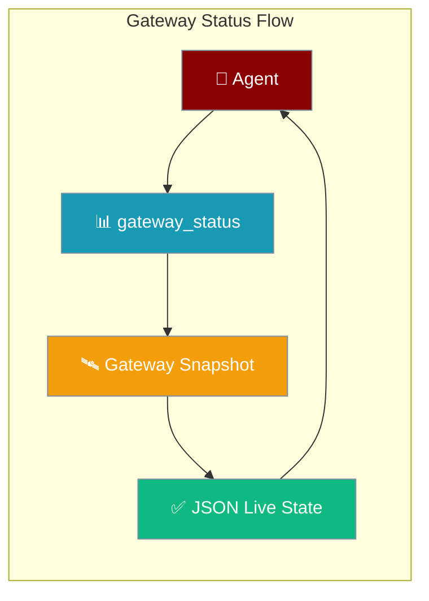
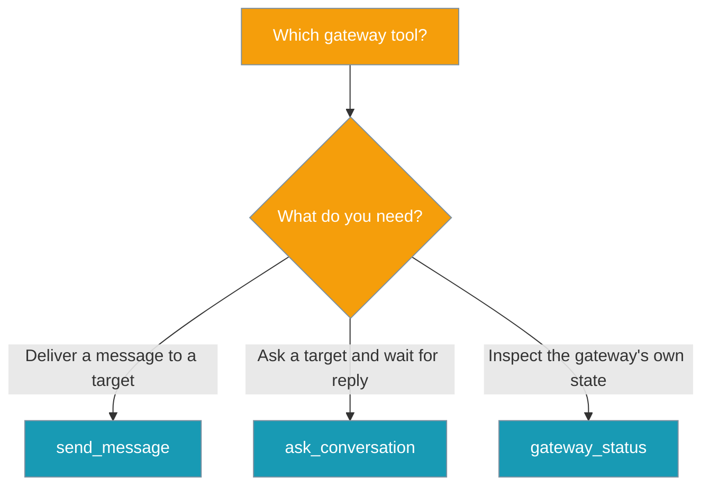
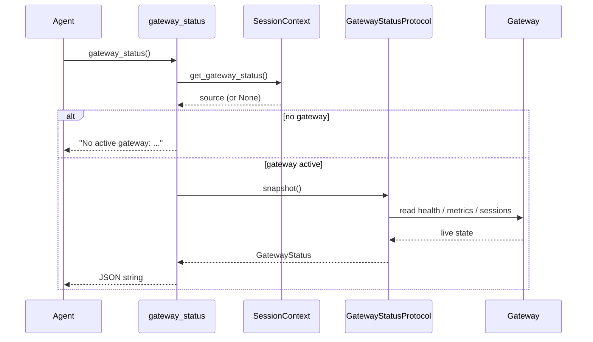
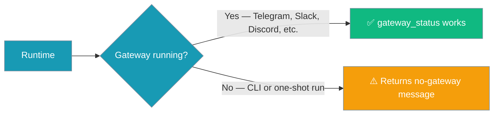
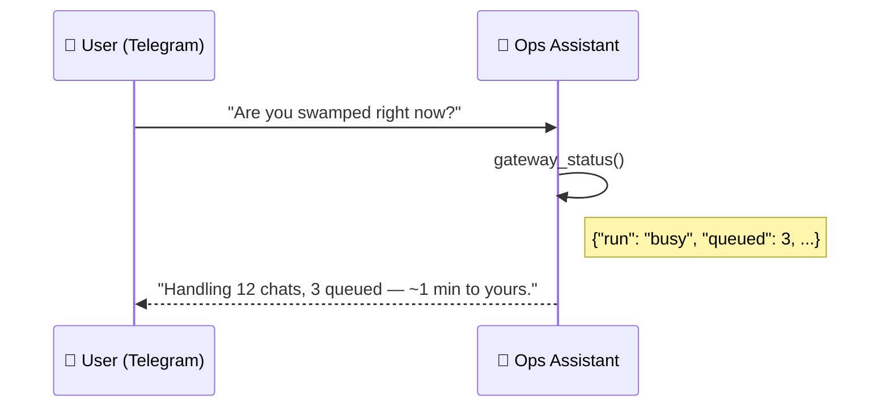

Gateway Status lets a running agent look at its own live gateway state — whether it's busy or idle, how many conversations are active, the delivery backlog, and whether any channel is degraded — so it can proactively warn the user instead of silently under-delivering.

```python
from praisonaiagents import Agent
from praisonaiagents.tools import gateway_status

agent = Agent(
    name="Ops Assistant",
    instructions=(
        "If a user asks how you're doing or whether their message went out, "
        "call gateway_status and answer from the live snapshot."
    ),
    tools=[gateway_status],
)
agent.start("Are you busy right now, and did my last message to #ops go out?")
```

A user asks the agent how it's doing; the agent reads its own live gateway snapshot and answers from the current state — all within a single turn.



## Which tool?

`gateway_status` is easy to confuse with its two siblings. This decision diagram picks the right one.



| Tool | Purpose | Waits? | Returns |
|------|---------|--------|---------|
| `send_message` | Deliver to a target | No | `DeliveryResult` |
| `ask_conversation` | Ask a target, await reply | Yes (bounded) | JSON string, typed status |
| `gateway_status` | Inspect self-state | No | JSON string, live snapshot |

---

## Quick Start

<Steps>
<Step title="Enable the Tool">

```python
from praisonaiagents import Agent
from praisonaiagents.tools import gateway_status

agent = Agent(
    name="Ops Assistant",
    instructions="Report your live state when asked how you're doing.",
    tools=[gateway_status],
)

agent.start("How busy are you right now?")
# Model call:
#   gateway_status()
# Returns JSON:
#   {"run": "busy", "queued": 2, "active_sessions": 7, ...}
```

</Step>

<Step title="React to a Busy State">

```python
agent = Agent(
    name="Ops Assistant",
    instructions=(
        "Call gateway_status before answering. "
        "If run is 'busy' or queued > 0, tell the user you'll get back to them shortly."
    ),
    tools=[gateway_status],
)
```

</Step>

<Step title="Detect Degraded Channels">

```python
agent = Agent(
    name="Ops Assistant",
    instructions=(
        "Call gateway_status. "
        "If degraded lists the channel the user is on, "
        "warn them their next message may be delayed."
    ),
    tools=[gateway_status],
)
```

</Step>

<Step title="Detect Redis pub/sub outage">

```python
agent = Agent(
    name="Ops Assistant",
    instructions=(
        "Call gateway_status. "
        "If push.redis_degraded is true, warn the user their message "
        "may not have fanned out to other gateway instances."
    ),
    tools=[gateway_status],
)
```

</Step>
</Steps>

---

## How It Works

The running gateway registers a live source into the per-turn context; `gateway_status` resolves it and serializes a snapshot, returning the no-gateway message when nothing is registered.



| Component | Purpose |
|-----------|---------|
| **gateway_status tool** | Agent-callable function; resolves the live source from context |
| **GatewayStatusProtocol** | Read-only interface the gateway registers per-turn via `register_gateway_status` |
| **SessionContext slot** | Task-local `get_gateway_status()` — no globals, safe for concurrent handlers |
| **Concrete binding** | Reads `health()` / `metrics_snapshot()` / the session registry in the `praisonai-bot` wrapper |

Core ships only the protocol, the snapshot shape, and the built-in tool; when no source is registered (CLI / one-shot), the tool returns the no-gateway message instead of raising.

---

## Fields Reference

`gateway_status()` takes no arguments and returns a JSON string serialized from `GatewayStatus.as_dict()`. Every field defaults to empty so a partial binding is valid.

| Field | Type | Default | Description |
|-------|------|---------|-------------|
| `run` | `str` | `"idle"` | Current turn/run status (e.g. `"idle"`, `"busy"`, `"queued"`). |
| `queued` | `int` | `0` | Number of turns queued behind the current one. |
| `active_sessions` | `int` | `0` | Count of active sessions (visibility-scoped). |
| `sessions_by_channel` | `dict[str, int]` | `{}` | Active-session counts keyed by channel/platform (e.g. `{"telegram": 5, "slack": 2}`). |
| `delivery` | `dict[str, Any]` | `{}` | Delivery-health facts, e.g. `{"outbox_depth": 0, "dlq": 1, "dead_targets": ["slack:C123"]}`. |
| `degraded` | `list[dict]` | `[]` | Degraded owners as `{"owner": ..., "reason": ...}` entries (channels/capabilities/routes flagged configured-unavailable). |
| `detail` | `str` | `""` | Optional free-form extra context for the model. |

### Push HA state

When the gateway runs with Redis pub/sub fan-out (`PushConfig(redis=...)`), the `push` block reports the health of the cross-instance transport.

| Field | Type | Description |
|-------|------|-------------|
| `push.redis_connected` | `bool` | `True` only when the adapter has a live client **and** is not marked degraded. |
| `push.redis_degraded` | `bool` | `True` for the duration of a Redis pub/sub outage; `False` after recovery. |
| `push.redis_dropped_writes` | `int` | Monotonically increasing count of writes (`publish` / presence / message-store) attempted while disconnected. |

When degraded, `route:redis-pubsub` also appears in `degraded_owners`:

```json
{
  "push": {
    "redis_connected": false,
    "redis_degraded": true,
    "redis_dropped_writes": 3,
    "online_clients": 12
  },
  "degraded_owners": [
    {
      "owner_kind": "route",
      "owner_id": "redis-pubsub",
      "state": "stale",
      "reason": "redis pub/sub disconnected: Connection refused",
      "retry_hint": "check Redis connectivity; see `praisonai gateway doctor`"
    }
  ]
}
```

See [Real-Time Push Notifications → HA & cross-instance delivery](/features/push-notifications#ha--cross-instance-delivery) for the full outage-and-recovery contract.

### Durability-degraded owners

When a durable state store cannot initialise, the gateway falls back to in-memory and records a `gateway` owner under `degraded_owners` — `owner_id = "durability:idempotency"` (webhook dedup) or `owner_id = "durability:session"` (session history). The reason is redacted; the raw store path stays in the log.

```json
{
  "degraded_owners": [
    {
      "owner_kind": "gateway",
      "owner_id": "durability:idempotency",
      "state": "cold",
      "reason": "durable idempotency store unavailable (running in-memory)",
      "retry_hint": "praisonai gateway doctor --fix"
    }
  ]
}
```

The entry clears automatically once the durable store comes up (a restart or hot-reload that repairs the path). See [Gateway State Durability](/features/gateway-durability).

Example returned JSON:

```json
{
  "run": "busy",
  "queued": 2,
  "active_sessions": 7,
  "sessions_by_channel": {"telegram": 5, "slack": 2},
  "delivery": {"outbox_depth": 0, "dlq": 1, "dead_targets": ["slack:C123"]},
  "degraded": [{"owner": "channel:telegram", "reason": "credential_unavailable"}],
  "detail": ""
}
```

---

## When It's Available

`gateway_status` needs a running bot/gateway to read live self-state; a plain CLI run has nothing to report.



| Runtime | Behaviour |
|---------|-----------|
| Bot / Gateway (Telegram, Slack, Discord, WhatsApp, …) | Reads the live snapshot; returns a JSON string |
| CLI / one-shot (`agent.start(...)` directly) | Returns the string below — **does not raise** |

When no gateway is active the tool returns:

```
No active gateway: gateway_status is only available inside a running bot/gateway (e.g. Telegram, Slack, Discord). It is unavailable for CLI/one-shot runs.
```

If the bound source's `snapshot()` raises, the tool logs and returns `"Error reading gateway status: {e}"` — it never raises into the agent turn.

---

## User Interaction Flow

A user in Telegram asks the ops assistant *"Are you swamped right now?"* The agent calls `gateway_status()`, sees `run: "busy"`, `queued: 3`, `active_sessions: 12`, and replies with a grounded estimate instead of a silent delay.



---

## Common Patterns

### Proactive backlog warning

```python
agent = Agent(
    name="Ops Assistant",
    instructions=(
        "Call gateway_status first. "
        "If queued > 0, preface your reply with how many turns are ahead."
    ),
    tools=[gateway_status],
)
```

### Delivery health check before a critical send

```python
from praisonaiagents import Agent
from praisonaiagents.tools import gateway_status, send_message

agent = Agent(
    name="Ops Assistant",
    instructions=(
        "Before sending to a sensitive channel, call gateway_status. "
        "If delivery.dlq > 0 or the target is in delivery.dead_targets, "
        "warn the user before calling send_message."
    ),
    tools=[gateway_status, send_message],
)
```

### Degraded-channel apology

```python
agent = Agent(
    name="Ops Assistant",
    instructions=(
        "Call gateway_status. "
        "If the current channel appears in degraded, "
        "apologise proactively for slow delivery."
    ),
    tools=[gateway_status],
)
```

---

## Best Practices

<AccordionGroup>
<Accordion title="Use it to warn, not to gate" icon="triangle-exclamation">
Report state and continue. Don't loop until `run == "idle"` — that stalls the turn. A single call gives the agent enough to set expectations.
</Accordion>

<Accordion title="Prefer it over polling" icon="gauge-high">
One call returns the whole picture — run status, sessions, delivery, and degraded owners. There's no reason to combine multiple health tools.
</Accordion>

<Accordion title="Combine with send_message for reliable delivery" icon="paper-plane">
Check `delivery.dead_targets` and `delivery.dlq` before sending to sensitive channels, so the agent can warn the user first.
</Accordion>

<Accordion title="Tolerate the no-gateway string in CLI runs" icon="terminal">
In tests and one-shot runs the tool returns the no-gateway message. Write instructions that handle that string instead of assuming a JSON snapshot.
</Accordion>
</AccordionGroup>

---

## Related

<CardGroup cols={2}>
<Card title="Send Message Tool" icon="paper-plane" href="/features/send-message-tool">
Deliver a message to a target without waiting for a reply
</Card>

<Card title="Ask Conversation Tool" icon="messages-question" href="/features/ask-conversation-tool">
Ask a target and wait for its reply mid-turn
</Card>

<Card title="Clarify Tool" icon="comment-question" href="/features/clarify-tool">
Ask the current user for input mid-turn
</Card>

<Card title="Messaging Bots" icon="robot" href="/features/messaging-bots">
Set up the gateway that makes this tool available
</Card>
</CardGroup>
