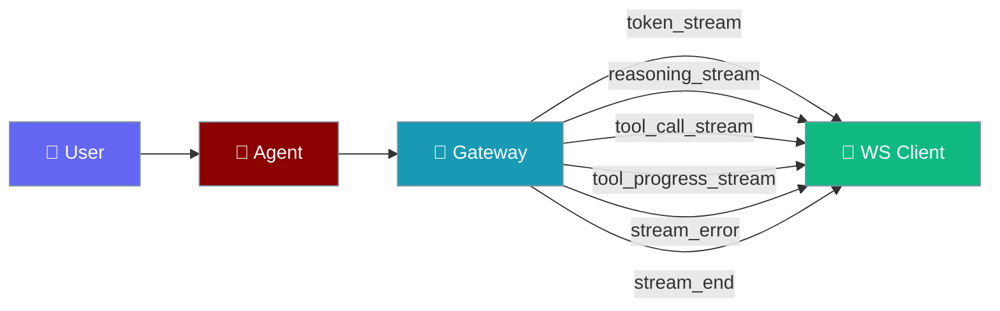
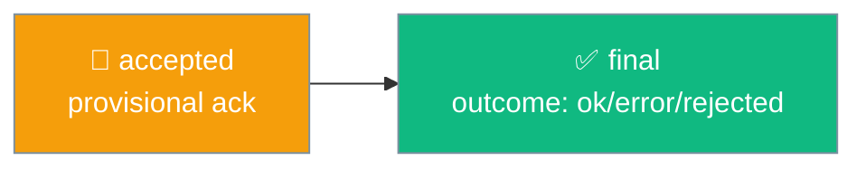
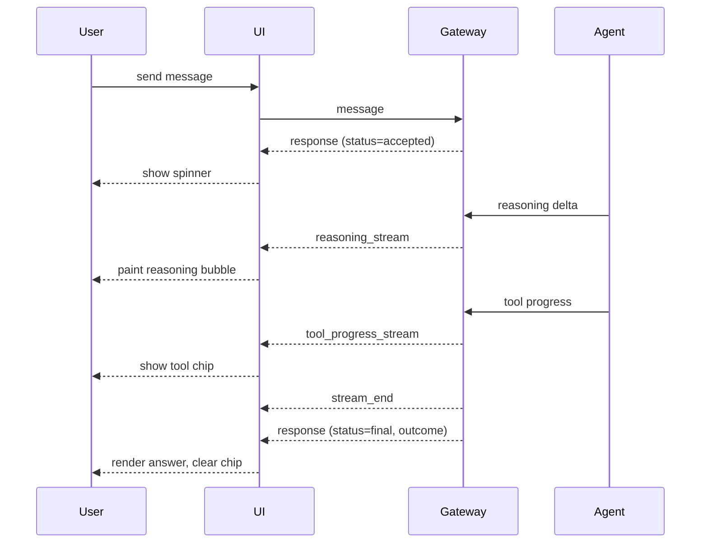

The gateway relays six structured progress events to WebSocket clients once they negotiate the `streaming` capability, so UIs can paint reasoning, tool progress, and the final answer as they arrive.

```python
from praisonaiagents import Agent

agent = Agent(name="stream-agent", instructions="Answer while streaming reasoning and tool progress.")
agent.start("Look up the weather in Paris and explain your reasoning.")
```

The agent emits token, reasoning, and tool events; the gateway forwards each to the WS client, which distinguishes a provisional `accepted` ack from the `final` answer.



## Quick Start

<Steps>

<Step title="Open a streaming client">
```python
import asyncio
from praisonai.gateway import GatewayClient

async def main():
    client = GatewayClient(
        url="ws://localhost:8765",
        agent_id="assistant",
        capabilities=["streaming"],   # advertise streaming in hello
    )
    await client.connect()

asyncio.run(main())
```
</Step>

<Step title="Print each event type">
```python
import asyncio
from praisonai.gateway import GatewayClient

async def main():
    client = GatewayClient(
        url="ws://localhost:8765",
        agent_id="assistant",
        capabilities=["streaming"],
    )
    await client.connect()

    async for event in client.events():
        if event.type == "reasoning_stream":
            print("[reasoning]", event.data)
        elif event.type == "tool_progress_stream":
            print("[tool]", event.data)
        elif event.type == "stream_error":
            print("[error]", event.data)
        elif event.type == "stream_end":
            print("[done]")
        else:
            print(event.type, event.data)

asyncio.run(main())
```
</Step>

</Steps>

---

## Event Vocabulary

Each streaming event maps to an `EventType` in `praisonaiagents.gateway.protocols` and is advertised in `hello_ok.features["events"]` when the client negotiates `streaming`.

| Event | Wire type | Payload | When it fires |
|-------|-----------|---------|---------------|
| `TOKEN_STREAM` | `token_stream` | text delta | LLM token deltas |
| `TOOL_CALL_STREAM` | `tool_call_stream` | tool call frame | Tool call streamed to client |
| `REASONING_STREAM` | `reasoning_stream` | `DELTA_TEXT` with `is_reasoning=True` | Model emits reasoning/thinking |
| `TOOL_PROGRESS_STREAM` | `tool_progress_stream` | tool progress frame | Tool reports in-flight progress |
| `STREAM_ERROR` | `stream_error` | error frame | Streaming pipeline hits an error |
| `STREAM_END` | `stream_end` | terminal marker | Stream completes |

<Note>
`reasoning_stream`, `tool_progress_stream`, and `stream_error` are additive. Existing `token_stream` consumers keep working unchanged — gate the new events on `client.supports_event(...)`.
</Note>

---

## Response Frame States

Every WebSocket response frame carries a `status`: a provisional `accepted` ack arrives first, then the real answer as `final` with a structured `outcome`.



| `status` | `outcome` present? | Meaning | Client action |
|----------|-------------------|---------|---------------|
| `accepted` | no | Provisional ack ("queued") | Show spinner / typing indicator |
| `final` | yes (`ok` \| `error` \| `rejected`) | Real answer with completion state | Render text + reflect outcome |

<Warning>
Never treat `type: "response"` alone as "done". Check `status: "final"` and read `outcome.status` before clearing the spinner.
</Warning>

---

## User Interaction Flow

A streaming UI paints each event as it arrives — reasoning bubble, then a tool progress chip, then the final answer.



---

## Common Patterns

<Tabs>

<Tab title="Reasoning Inline with Answer">
```python
import asyncio
from praisonai.gateway import GatewayClient

async def main():
    client = GatewayClient(url="ws://localhost:8765", agent_id="assistant", capabilities=["streaming"])
    await client.connect()

    reasoning, answer = [], []
    async for event in client.events():
        if event.type == "reasoning_stream":
            reasoning.append(event.data.get("text", ""))
        elif event.type == "token_stream":
            answer.append(event.data.get("text", ""))
        elif event.type == "stream_end":
            print("Reasoning:", "".join(reasoning))
            print("Answer:", "".join(answer))
            break

asyncio.run(main())
```
</Tab>

<Tab title="Tool Progress Chip">
```python
import asyncio
from praisonai.gateway import GatewayClient

async def main():
    client = GatewayClient(url="ws://localhost:8765", agent_id="assistant", capabilities=["streaming"])
    await client.connect()

    async for event in client.events():
        if event.type == "tool_progress_stream":
            show_chip(event.data)          # display in-flight tool progress
        elif event.type == "stream_end":
            clear_chip()                   # remove the chip when the stream ends
            break

asyncio.run(main())
```
</Tab>

</Tabs>

---

## Best Practices

<AccordionGroup>

<Accordion title="Gate rendering on client.supports_event(...)">
Wrap new-event rendering in `client.supports_event("reasoning_stream")` and `client.supports_event("tool_progress_stream")` so legacy gateways — which never advertise these events — degrade silently instead of breaking.
</Accordion>

<Accordion title="Treat stream_error as a soft signal">
A `stream_error` frame does not end the run. The gateway may still deliver a `final` response with `outcome.status="error"`. Surface the error but keep listening until `stream_end` / `final`.
</Accordion>

<Accordion title="Never assume type: response means done">
Both the provisional ack and the real answer share `type: "response"`. Branch on `status`: show a spinner on `accepted`, render only on `final`, and read `outcome.status` for the completion state.
</Accordion>

</AccordionGroup>

---

## Related

<CardGroup cols={2}>
  <Card title="Gateway Handshake Protocol" icon="handshake" href="/features/gateway-handshake-protocol">
    Negotiate `streaming` and read the advertised event set
  </Card>
  <Card title="Gateway Client" icon="plug" href="/features/gateway-client">
    Reconnecting client that streams these events
  </Card>
  <Card title="Frame Codec" icon="shield-check" href="/features/gateway-frame-codec">
    Validate inbound frames at the WebSocket boundary
  </Card>
  <Card title="Session Protocol" icon="messages" href="/features/session-protocol">
    How sessions carry these events
  </Card>
</CardGroup>
