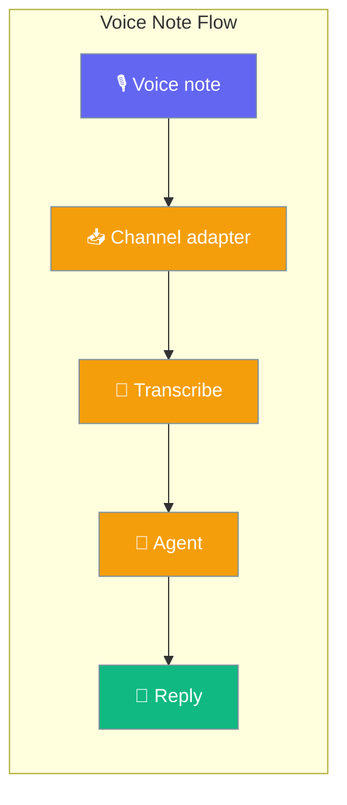
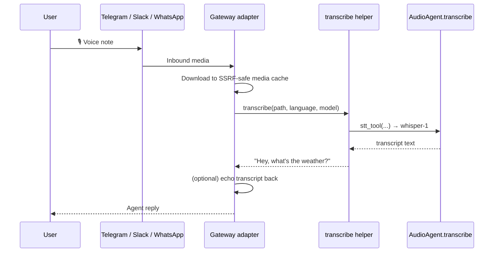

Voice notes sent to your gateway bot are transcribed and delivered to the agent as text — no code changes required, on by default across Telegram, Slack, and WhatsApp.



## Quick Start

<Steps>
<Step title="Works out of the box">
Voice notes are transcribed automatically — no config needed.

```yaml
# gateway.yaml
channels:
  telegram:
    token: ${TELEGRAM_BOT_TOKEN}
agent:
  name: "assistant"
  instructions: "Reply helpfully to any question, including voice notes."
```

```python
from praisonaiagents import Agent

agent = Agent(
    name="assistant",
    instructions="Reply helpfully to any question, including voice notes.",
)
# Start the gateway — voice notes are transcribed automatically.
```
</Step>

<Step title="Echo the transcript back">
Mirror the recognised text back so users can verify what the bot heard.

```yaml
channels:
  telegram:
    token: ${TELEGRAM_BOT_TOKEN}
    stt:
      enabled: true          # default; set false to opt out
      echo_transcripts: true # echo the recognised text back to the user
```
</Step>

<Step title="Force a language">
Skip auto-detection for faster, more accurate short clips.

```yaml
channels:
  telegram:
    stt:
      language: "en"
```
</Step>

<Step title="Custom STT model">
Swap the default model for any LiteLLM-supported STT model.

```yaml
channels:
  telegram:
    stt:
      model: "openai/whisper-1"   # default; any LiteLLM-supported STT model
```
</Step>

<Step title="Opt out entirely">
Disable transcription for a channel.

```yaml
channels:
  telegram:
    stt:
      enabled: false
```
</Step>
</Steps>

<Tip>
The `stt:` block also accepts a bare boolean as shorthand — `stt: true` is equivalent to `{enabled: true}`, and `stt: false` to `{enabled: false}`.
</Tip>

---

## How It Works

A voice note is downloaded, transcribed, and handed to the agent as text.



A user records a voice note in Telegram (or Slack, or WhatsApp) and taps send. Within a second, the bot's typing indicator appears — the audio has been downloaded and handed to `whisper-1`. When the transcript comes back, the agent processes it exactly as if the user had typed the text. If `echo_transcripts: true`, the user first sees the recognised text confirmed back to them, then the agent's reply — helpful during onboarding so users know their voice was heard correctly.

### Graceful degradation

A voice note is never silently dropped — the agent always sees at least a placeholder.

- STT disabled → the turn still reaches the agent with `[Voice message received]`.
- Transcription fails → same placeholder.
- STT tool import fails (missing whisper/litellm deps) → same placeholder plus a `WARNING` in logs.

---

## Configuration Options

The `stt:` block lives under any channel in `gateway.yaml` / `bot.yaml`.

| Option | Type | Default | Description |
|--------|------|---------|-------------|
| `enabled` | `bool` | `True` | Transcribe inbound audio. On by default. |
| `echo_transcripts` | `bool` | `False` | Echo the recognised text back to the user. |
| `language` | `Optional[str]` | `None` | ISO language code (e.g. `"en"`, `"es"`). `None` = auto-detect. |
| `model` | `Optional[str]` | `None` | STT model override. `None` uses `openai/whisper-1`. |

```yaml
channels:
  <platform>:
    stt:
      enabled: true
      echo_transcripts: false
      language: null
      model: null
```

### Bool shorthand

```yaml
channels:
  telegram:
    stt: true    # equivalent to {enabled: true}
```

### Resolution order

The effective policy is resolved from, in order:

1. `config.metadata["stt"]` (operator override; dict or bool),
2. a direct `config.stt` attribute (schema-backed configs), then
3. the on-by-default default.

---

## Platform Support

| Platform | Native voice-note support | Behaviour |
|----------|--------------------------|-----------|
| Telegram | ✅ | Downloads voice file, transcribes, feeds transcript to agent. |
| Slack | ✅ | Downloads voice file via bot token through the SSRF-safe media cache. |
| WhatsApp | ✅ | Transcribes inbound audio, forwards transcript **plus** cached audio to the agent. |
| Discord | ❌ | Voice-note API not yet wired by the adapter. |
| Email / AgentMail / Linear | ❌ | No voice-note surface. |

---

## Placeholder Behaviour

When transcription is unavailable, the agent receives `[Voice message received]` instead of nothing.

| Scenario | What the agent sees |
|----------|---------------------|
| STT enabled, transcription succeeds | The transcript (e.g. `"Hey, what's the weather?"`) |
| STT enabled, `echo_transcripts: true` | `[Voice message]: Hey, what's the weather?` |
| STT disabled (`enabled: false`) | `[Voice message received]` |
| Transcription fails or deps missing | `[Voice message received]` |

The invariant: a voice note always reaches the agent with at least the placeholder.

---

## Common Patterns

Voice notes fit several bot styles.

### Voice-first assistant

No config needed. The user taps the mic, records a question, and the agent replies in text — the transcription happens automatically.

```yaml
channels:
  telegram:
    token: ${TELEGRAM_BOT_TOKEN}
```

### Multilingual support

Force a language for a single-language community bot. Auto-detection is skipped for faster, more accurate recognition.

```yaml
channels:
  whatsapp:
    stt:
      language: "es"
```

### Debug transcription quality

Echo the recognised text back so users can spot recognition errors and rephrase.

```yaml
channels:
  slack:
    stt:
      echo_transcripts: true
```

---

## Best Practices

<AccordionGroup>
<Accordion title="Set a language when your users speak one language">
`language: "en"` (or `"es"`, `"fr"`, …) skips auto-detection — faster and more accurate for short clips.
</Accordion>

<Accordion title="Turn on echo_transcripts during onboarding">
`echo_transcripts: true` shows users what the bot heard so they can rephrase if recognition was off.
</Accordion>

<Accordion title="Keep enabled: true unless you have a reason to disable">
Even with STT off, the placeholder fallback still lets voice-note messages reach the agent. Only disable for privacy, cost, or latency reasons.
</Accordion>

<Accordion title="Ship your STT provider's API key">
`openai/whisper-1` is the default, so set `OPENAI_API_KEY`. Any LiteLLM-supported STT model works via the `model:` field.
</Accordion>
</AccordionGroup>

---

## Related

<CardGroup cols={2}>
<Card title="Gateway Overview" icon="server" href="/docs/gateway">
  The overall gateway pattern — voice notes are one of several inbound-media types.
</Card>
<Card title="Audio Overview" icon="waveform-lines" href="/docs/audio/overview">
  The higher-level `AudioAgent` abstraction — different from this gateway feature.
</Card>
</CardGroup>
