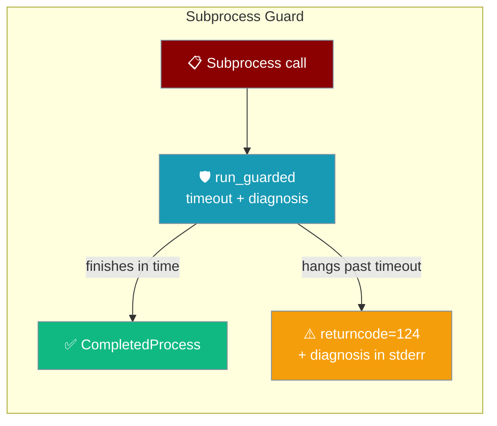
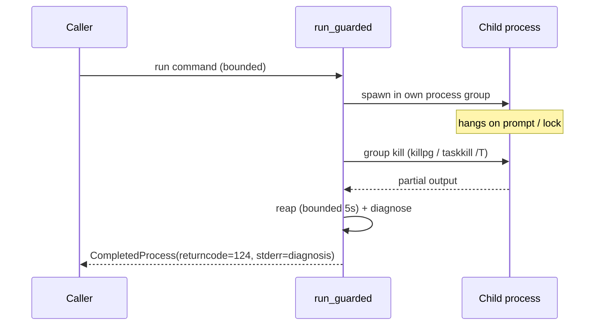

The gateway bounds every git and shell command it runs, so a child stuck on a credential prompt or a lock can never freeze your WebSocket clients, bots, or heartbeat.



## Quick Start

<Steps>
<Step title="Default posture — nothing to configure">
The guard is already applied inside the gateway. Every git command the [kanban dispatcher](/features/kanban#per-task-worktree-isolation) runs, plus the macOS and Windows startup probes, are bounded automatically. An agent that queues kanban work needs no code change — the guard wraps the dispatcher's git calls for you.

```python
from praisonai_bot.kanban.sqlite_store import SQLiteKanbanStore

store = SQLiteKanbanStore()

# The dispatcher's git calls (worktree add, merge, rev-parse) are guarded
# automatically — no timeout wiring on your side.
task = store.create_task({
    "title": "Refactor auth module",
    "repo_path": "/repos/service-a",
})
```
</Step>

<Step title="Operator tuning — raise the ceilings">
Export the two environment variables to widen the timeouts for a legitimately slow repo. Both are read fresh on each call.

```bash
# Every git command from the kanban dispatcher (default 300s)
export PRAISONAI_KANBAN_GIT_TIMEOUT=600

# Every other guarded call without an explicit timeout (default 120s)
export PRAISONAI_SUBPROCESS_TIMEOUT=180
```
</Step>
</Steps>

---

## How It Works

On timeout the guard kills the whole process group, reaps whatever output exists, and returns a `CompletedProcess` with `returncode=124` — never an exception.



Two layers of defence work together:

| Layer | What it does |
|-------|--------------|
| **Prevent** | stdin is `/dev/null`; `GIT_TERMINAL_PROMPT=0`, `GCM_INTERACTIVE=never`, `DEBIAN_FRONTEND=noninteractive` are layered under your env so tools fail fast instead of prompting. |
| **Explain** | On timeout the child's partial output is matched against known stall signatures and turned into an actionable message in `stderr`. |

---

## Configuration Options

Two operator-tunable environment variables control the ceilings.

| Env var | Applies to | Default | Notes |
|---------|-----------|---------|-------|
| `PRAISONAI_KANBAN_GIT_TIMEOUT` | Every git command from the kanban dispatcher (`_run_git`) | `300` s | Deliberately generous — worktree add / merge on a large repo is legitimately slow. Non-positive, non-finite (`inf`, `nan`), or non-numeric values are ignored and the default is used. |
| `PRAISONAI_SUBPROCESS_TIMEOUT` | Every other guarded call whose caller did not pass an explicit `timeout=` | `120` s | Same validation rules as above. |

---

## Diagnostic Messages

The guard decodes why a child stalled and writes it to `stderr`, so you can act without reading source.

| Signature the child emitted | What `stderr` will say | Fix |
|-----------------------------|------------------------|-----|
| `Username for` / `password for` / `passphrase` / `authentication failed` | `DETECTED: credential prompt.` | Configure a credential helper, or set `GIT_TERMINAL_PROMPT=0`. |
| `index.lock` / `unable to create` / `another git process` | `DETECTED: git lock contention.` | Retry once the other git exits, or remove a stale `.git/index.lock`. |
| `[y/N]` / `(yes/no)` / `are you sure` / `continue?` / `overwrite?` / `proceed?` | `DETECTED: confirmation prompt.` | Re-run with `--yes` / `-y` / `--force` / `--no-confirm`. |
| `host key` / `fingerprint` / `known_hosts` | `DETECTED: SSH host-key prompt.` | Pre-populate `known_hosts`, or pass `-o StrictHostKeyChecking=accept-new`. |
| *(unmatched)* | No interactive prompt was detected. The command may be genuinely slow, blocked on network I/O, or deadlocked. Raise `timeout=` if the work is expected to take longer. | Investigate manually. |

---

## Adopted Call Sites

The guard already wraps every gateway path that shells out.

| Site | Why it matters | Timeout used |
|------|----------------|--------------|
| `gateway/kanban_dispatcher.py::_run_git` | Every dispatcher git call — blocks the gateway event loop when unbounded | `PRAISONAI_KANBAN_GIT_TIMEOUT` (300 s default) |
| `kanban/sqlite_store.py::_is_git_repo` | `git rev-parse` on the `create_task` path | 15 s explicit |
| `gateway/preflight.py::_scan_launch_agent` | `launchctl list` on macOS startup | 15 s explicit |
| `gateway/pairing.py::_restrict_windows_acl` | `icacls` while hardening the pairing secret on Windows | 15 s explicit |

---

## User-Visible Behaviour Change

The `create_task` git probe now downgrades a slow path instead of hanging — but that means it no longer auto-enables worktree isolation for it.

When a task is linked to a git repo, [kanban](/features/kanban#per-task-worktree-isolation) auto-upgrades it to `workspace_kind="worktree"`. The one exception: if the `git rev-parse --is-inside-work-tree` probe times out (15 s), the task is created in the **shared** workspace rather than an isolated worktree, and the gateway log records:

```text
Timed out probing <path> for a git worktree; treating it as not a
repository, so this task will run in the shared workspace rather than
an isolated worktree.
```

Grep for `Timed out probing` to catch NFS- or lock-contended paths that quietly lost isolation.

<Note>
On timeout the guard kills the **whole process group** (POSIX `killpg`, Windows `taskkill /T /F`), so a git credential helper the command spawned cannot outlive the timeout and keep the output pipe open. This is why the guard is safer than `subprocess.run(timeout=...)` alone, which only kills the direct child.
</Note>

<Info>
Callers extending the wrapper can pass `interactive=True` to skip stdin redirection and env layering for a command that must reach a terminal. The timeout and group-kill still apply.
</Info>

---

## Best Practices

<AccordionGroup>
<Accordion title="Leave the defaults alone unless you see a real timeout">
The 300 s git ceiling already tolerates worktree add and merge on large repos. Only raise `PRAISONAI_KANBAN_GIT_TIMEOUT` after you observe a legitimately-slow git op hitting the limit.
</Accordion>

<Accordion title="Never set a timeout to 0, negative, inf, or non-numeric">
The guard ignores unusable overrides and falls back to the built-in default. Setting `PRAISONAI_KANBAN_GIT_TIMEOUT=0` does not disable the guard — it silently uses 300 s.
</Accordion>

<Accordion title="Grep logs for lost worktree isolation">
Watch gateway logs for `Timed out probing` to catch NFS or lock-contended paths whose `create_task` git probe timed out and fell back to the shared workspace.
</Accordion>
</AccordionGroup>

---

## Related

<CardGroup cols={2}>
<Card title="Gateway Reliability" icon="shield" href="/features/gateway-reliability">
  Backpressure, retries, and failure handling on the gateway
</Card>
<Card title="Kanban Worktree Isolation" icon="diagram-project" href="/features/kanban#per-task-worktree-isolation">
  Per-task git worktrees and the timeout ceiling
</Card>
<Card title="Gateway" icon="tower-broadcast" href="/gateway#kanban-dispatcher">
  Kanban dispatcher and gateway internals
</Card>
<Card title="Workspace Isolation" icon="box" href="/features/workspace-isolation">
  Isolating agent file operations per run
</Card>
</CardGroup>
