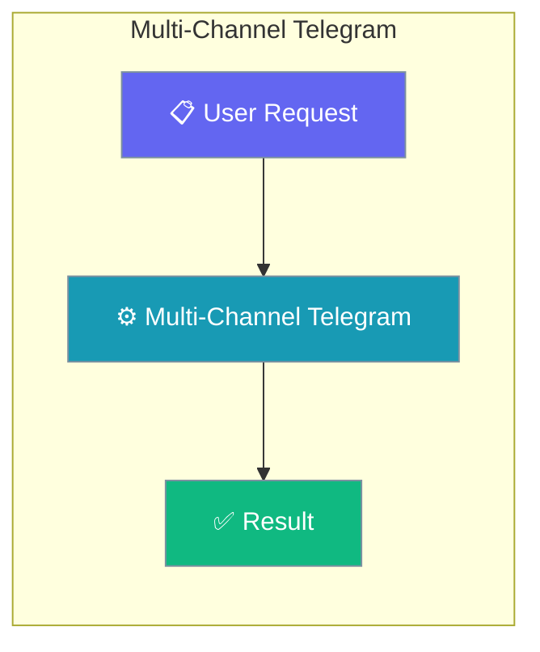
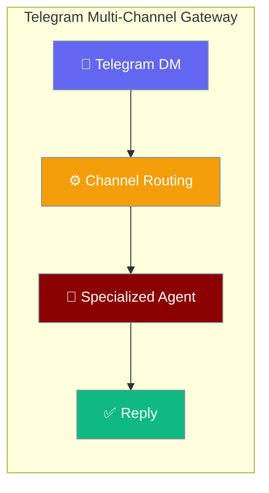
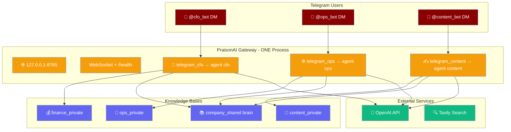
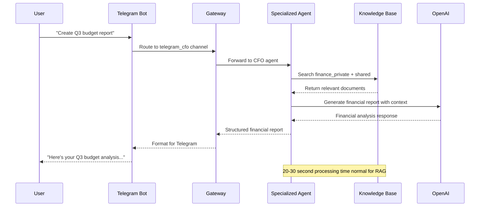

<Note>
The gateway now ships in the `praisonai-bot` package. `praisonai serve gateway` still works exactly as documented here; for a standalone install see [praisonai-bot Migration](/docs/guides/praisonai-bot-migration).
</Note>


Deploy a Hermes-style AI workforce using PraisonAI Gateway with multiple specialized Telegram bots, each serving different business functions while sharing common knowledge.

```python
from praisonaiagents import Agent

cfo = Agent(name="cfo", instructions="Handle finance questions.")
ops = Agent(name="ops", instructions="Handle operations.")
# Register both on one gateway — see channels: in gateway.yaml below
```

The user chats on Telegram; multichannel routing delivers the same agent logic across Telegram chats.



### Workforce Layout



## Quick Start

<Steps>
<Step title="Create Multiple Telegram Bots">

Create three separate bots with [@BotFather](https://t.me/botfather):

```
/newbot
CFO Assistant Bot
@your_company_cfo_bot

/newbot  
Operations Assistant Bot
@your_company_ops_bot

/newbot
Content Assistant Bot
@your_company_content_bot
```

Save each token separately - **never reuse tokens between bots**.

</Step>

<Step title="Configure Multi-Channel Gateway">

Create `gateway.yaml` with Hermes workforce pattern:

```yaml
gateway:
  host: "127.0.0.1"
  port: 8765

agents:
  cfo:
    model: gpt-4o-mini
    instructions: |
      You are a CFO assistant. Help with financial analysis, reporting, 
      budgeting, and strategic financial decisions. You have access to 
      company financial data and industry knowledge.
    tools: [search_knowledge]
  
  ops:
    model: gpt-4o-mini
    instructions: |
      You are an operations assistant. Help with process optimization,
      workflow design, resource management, and operational efficiency.
      You have access to internal processes and best practices.
    tools: [search_knowledge]
  
  content:
    model: gpt-4o-mini
    instructions: |
      You are a content assistant. Help with marketing content, 
      documentation, copywriting, and brand messaging. You have 
      access to brand guidelines and content libraries.
    tools: [search_knowledge]

channels:
  telegram_cfo:
    platform: telegram
    token: ${TELEGRAM_CFO_TOKEN}
    routes:
      default: cfo
  
  telegram_ops:
    platform: telegram
    token: ${TELEGRAM_OPS_TOKEN}
    routes:
      default: ops
  
  telegram_content:
    platform: telegram
    token: ${TELEGRAM_CONTENT_TOKEN}
    routes:
      default: content
```

</Step>

<Step title="Configure Environment">

Create `.env` file with all required tokens:

```env
# Telegram Bot Tokens - each bot needs unique token
TELEGRAM_CFO_TOKEN=<cfo-bot-token-from-botfather>
TELEGRAM_OPS_TOKEN=<ops-bot-token-from-botfather>
TELEGRAM_CONTENT_TOKEN=<content-bot-token-from-botfather>

# API Keys
OPENAI_API_KEY=<your-openai-key>
GATEWAY_AUTH_TOKEN=<optional-auth-token>

# Windows UTF-8 (if on Windows)
PYTHONUTF8=1

# Optional: User access control
TELEGRAM_ALLOWED_USERS=123456789,987654321
```

<Note>
If you leave `TELEGRAM_ALLOWED_USERS` empty, you must also set `unknown_user_policy: "allow"` for the bot to reply to anyone (since [PR #1885](https://github.com/MervinPraison/PraisonAI/pull/1885)). For production, set `TELEGRAM_ALLOWED_USERS` to your user IDs and leave `unknown_user_policy` at the default `"deny"`.
</Note>

</Step>

<Step title="Launch Workforce Gateway">

Start the single gateway process:

```bash
praisonai gateway start --config gateway.yaml
```

All three bots will start simultaneously through one gateway process.

</Step>
</Steps>

---

## How Multi-Channel Works



### Routing Logic

Each channel routes to its specialized agent:

| Channel | Bot Username | Routes To | Specialization |
|---------|-------------|-----------|----------------|
| `telegram_cfo` | @your_company_cfo_bot | `cfo` agent | Financial analysis, budgeting, reporting |
| `telegram_ops` | @your_company_ops_bot | `ops` agent | Process optimization, workflows |
| `telegram_content` | @your_company_content_bot | `content` agent | Marketing, copywriting, brand |

---

## Knowledge Architecture

### Dual-Brain RAG Pattern

Each agent accesses both shared and private knowledge:

<AccordionGroup>

<Accordion title="Shared Knowledge Base">

Company-wide information accessible to all agents:

```
company_shared/
├── company_handbook.pdf
├── brand_guidelines.pdf  
├── org_chart.pdf
├── policies_procedures.pdf
└── industry_research/
    ├── market_analysis.pdf
    └── competitor_reports.pdf
```

All agents can search this knowledge for general company context.

</Accordion>

<Accordion title="Finance Private Knowledge">

CFO agent exclusive access:

```
finance_private/
├── financial_statements/
├── budget_templates/
├── audit_reports/
├── investor_presentations/
└── financial_models/
    ├── revenue_forecasting.xlsx
    └── cash_flow_models.xlsx
```

Only accessible via CFO bot (@your_company_cfo_bot).

</Accordion>

<Accordion title="Operations Private Knowledge">

Ops agent exclusive access:

```
ops_private/
├── process_documentation/
├── workflow_diagrams/
├── sop_library/
├── vendor_contracts/
└── efficiency_metrics/
    ├── kpi_dashboards.pdf
    └── process_improvements.md
```

Only accessible via Ops bot (@your_company_ops_bot).

</Accordion>

<Accordion title="Content Private Knowledge">

Content agent exclusive access:

```
content_private/
├── content_calendar/
├── brand_assets/
├── campaign_archives/
├── style_guides/
└── content_templates/
    ├── blog_templates.md
    └── social_media_templates.md
```

Only accessible via Content bot (@your_company_content_bot).

</Accordion>

</AccordionGroup>

---

## Golden Rules for Workforce Deployment

### Single Gateway Instance

**Critical:** Run only one gateway process per machine.

**Why:** Multiple gateways cause conflicts:
- Both bind to port 8765 (port collision)
- Both poll same Telegram tokens (409 Conflict errors)  
- Session state becomes inconsistent
- Bot stops responding mid-conversation

**Verification:**
```bash
# Check for running gateways
ps aux | grep "praisonai gateway"

# Verify port usage
netstat -tuln | grep 8765

# Health check
curl http://127.0.0.1:8765/health
```

### Unique Tokens per Channel

Each Telegram channel requires its own bot:

```yaml
# ✅ Correct - separate bots
channels:
  telegram_cfo:
    token: ${TELEGRAM_CFO_TOKEN}    # Bot 1: @company_cfo_bot
  telegram_ops:  
    token: ${TELEGRAM_OPS_TOKEN}    # Bot 2: @company_ops_bot
  telegram_content:
    token: ${TELEGRAM_CONTENT_TOKEN} # Bot 3: @company_content_bot

# ❌ Incorrect - reusing tokens
channels:
  telegram_cfo:
    token: ${TELEGRAM_BOT_TOKEN}    # Same token
  telegram_ops:
    token: ${TELEGRAM_BOT_TOKEN}    # Same token = conflict
```

### Response Latency Expectations

**Normal behavior:** First reply takes 20-30 seconds for RAG queries.

**Why the delay:**
1. Knowledge base search (5-8 seconds)
2. Context preparation (2-3 seconds) 
3. LLM processing (10-15 seconds)
4. Response formatting (1-2 seconds)

**User experience notes:**
- Typing indicator disappears after ~5 seconds (known limitation)
- Do NOT send duplicate messages during processing
- Do NOT restart gateway if response is delayed
- Typing indicator renewal fix is pending in PraisonAI

---

## Advanced Configuration

### User Access Control

Configure per-channel user allowlists:

```yaml
channels:
  telegram_cfo:
    platform: telegram
    token: ${TELEGRAM_CFO_TOKEN}
    allowed_users: ${TELEGRAM_CFO_USERS}  # Finance team
    routes:
      default: cfo
  
  telegram_ops:
    platform: telegram  
    token: ${TELEGRAM_OPS_TOKEN}
    allowed_users: ${TELEGRAM_OPS_USERS}  # Operations team
    routes:
      default: ops
```

Environment variables:
```env
TELEGRAM_CFO_USERS=123456789,987654321      # Finance team user IDs
TELEGRAM_OPS_USERS=111222333,444555666      # Operations team user IDs
TELEGRAM_CONTENT_USERS=777888999,000111222  # Content team user IDs
```

**Security:** As of PR #1835, the gateway polling path enforces `allowed_users` for both text messages **and** built-in commands (`/help`, `/status`, `/new`). Unauthorized users are silently dropped at the security pipeline.

### Custom Knowledge Tools

Configure specialized search tools per agent:

```yaml
agents:
  cfo:
    model: gpt-4o-mini
    tools: 
      - search_knowledge:
          sources: ["finance_private", "company_shared"]
          max_results: 10
      - calculate_metrics:
          enabled: true
    
  ops:
    model: gpt-4o-mini
    tools:
      - search_knowledge:
          sources: ["ops_private", "company_shared"] 
          max_results: 15
      - workflow_analyzer:
          enabled: true
```

### Performance Tuning

Optimize for multi-channel deployment:

```yaml
gateway:
  host: "127.0.0.1"
  port: 8765
  max_connections: 200          # Support 3 channels
  heartbeat_interval: 30
  request_timeout: 180          # Allow for RAG processing
  
  # Channel-specific settings
  channel_config:
    message_queue_size: 100     # Per-channel queue
    retry_attempts: 3
    retry_delay: 5
```

---

## Monitoring and Troubleshooting

### Health Check Interpretation

Comprehensive health monitoring:

```bash
curl http://127.0.0.1:8765/health | jq
```

**Expected response for 3-channel deployment:**
```json
{
  "status": "healthy",
  "uptime": 7200.5,
  "agents": 3,
  "sessions": 24,
  "clients": 12,
  "channels": {
    "telegram_cfo": {
      "platform": "telegram",
      "running": true,
      "active_sessions": 8,
      "last_message": "2024-01-15T14:30:22Z"
    },
    "telegram_ops": {
      "platform": "telegram", 
      "running": true,
      "active_sessions": 12,
      "last_message": "2024-01-15T14:28:15Z"
    },
    "telegram_content": {
      "platform": "telegram",
      "running": true, 
      "active_sessions": 4,
      "last_message": "2024-01-15T14:25:08Z"
    }
  }
}
```

### Common Multi-Channel Issues

<AccordionGroup>

<Accordion title="Only 1 of 3 bots responding">

**Symptoms:** One bot works, others silent

**Causes:**
- Missing environment variables for non-working bots
- Incorrect token in .env file
- BotFather token typos

**Debugging:**
```bash
# Check environment variables
echo $TELEGRAM_CFO_TOKEN
echo $TELEGRAM_OPS_TOKEN  
echo $TELEGRAM_CONTENT_TOKEN

# Verify token format (should be: numbers:letters)
env | grep TELEGRAM_.*_TOKEN

# Test individual bot tokens
curl https://api.telegram.org/bot${TELEGRAM_CFO_TOKEN}/getMe
```

</Accordion>

<Accordion title="Bots start then stop (409 Conflict)">

**Symptoms:**
- All bots work initially  
- Random bots stop responding
- Logs show: `Conflict: terminated by other getUpdates request`

**Cause:** Duplicate gateway processes or token reuse

**Solution:**
```bash
# Kill all gateway processes
pkill -f "praisonai gateway"

# Wait 10 seconds
sleep 10

# Start single gateway
praisonai gateway start --config gateway.yaml
```

</Accordion>

<Accordion title="Knowledge search not working">

**Symptoms:** Agents respond but can't find company information

**Debugging:**
```bash
# Check knowledge base paths
ls -la ~/.praisonai/knowledge/
ls -la ~/.praisonai/knowledge/finance_private/
ls -la ~/.praisonai/knowledge/company_shared/

# Test search tools manually
python -c "
from praisonaiagents import Agent
agent = Agent(tools=['search_knowledge'])
result = agent.run('search for budget')
print(result)
"
```

</Accordion>

<Accordion title="Windows-specific encoding errors">

**Symptoms:** 
```
UnicodeEncodeError: 'charmap' codec can't encode character
```

**Solution:**
```powershell
# Set UTF-8 environment
$env:PYTHONUTF8 = "1"

# Also check OpenAI billing (common trigger)
# Visit platform.openai.com/billing
```

</Accordion>

</AccordionGroup>

### Log Analysis

Monitor gateway logs for multi-channel issues:

```bash
# Real-time log monitoring
tail -f ~/.praisonai/logs/gateway.log

# Filter for specific channels
grep "telegram_cfo" ~/.praisonai/logs/gateway.log
grep "409\|Conflict" ~/.praisonai/logs/gateway.log

# Check for token issues
grep "Unauthorized\|Invalid token" ~/.praisonai/logs/gateway.log
```

---

## Best Practices

<AccordionGroup>

<Accordion title="Structure bot usernames consistently">

Use clear naming conventions:

```
Good:
@company_cfo_bot
@company_ops_bot  
@company_content_bot

Bad:
@random_bot1
@mybotabc
@untitled_bot
```

This helps users understand which bot to contact for specific needs.

</Accordion>

<Accordion title="Set clear bot descriptions">

Configure helpful bot descriptions in BotFather:

```
CFO Bot: 
Financial analysis, budgeting, and reporting assistance for [Company Name]

Operations Bot:
Process optimization, workflow design, and operational efficiency for [Company Name]

Content Bot:  
Marketing content, copywriting, and brand messaging for [Company Name]
```

</Accordion>

<Accordion title="Implement user onboarding">

Configure welcome messages for new users:

```yaml
agents:
  cfo:
    instructions: |
      You are a CFO assistant for [Company Name]. 
      
      I can help with:
      • Financial analysis and reporting
      • Budget planning and forecasting  
      • Cost optimization strategies
      • Investment analysis
      
      Try asking: "Show me our Q3 budget summary" or "Analyze cash flow trends"
```

</Accordion>

<Accordion title="Monitor resource usage">

Track performance for 3-channel deployment:

```bash
# Monitor gateway process
top -p $(pgrep -f "praisonai gateway")

# Check memory usage
ps -o pid,rss,cmd -p $(pgrep -f "praisonai gateway")

# Monitor API rate limits
grep "rate limit\|429" ~/.praisonai/logs/gateway.log
```

</Accordion>

</AccordionGroup>

---

## Migration from Hermes

### Configuration Mapping

If migrating from Hermes agent setup:

| Hermes Component | PraisonAI Equivalent |
|------------------|----------------------|
| Hermes Gateway | PraisonAI Gateway (port 8765) |
| Agent definitions | `agents:` section in gateway.yaml |
| Channel configs | `channels:` section in gateway.yaml |
| Knowledge bases | File-based knowledge under ~/.praisonai/knowledge/ |
| Tool definitions | Built-in tools: search_knowledge, web search, etc. |

### Feature Parity

PraisonAI Gateway provides equivalent functionality:

✅ **Supported:**
- Multi-channel deployment (3+ bots)
- Specialized agent routing
- Shared + private knowledge bases
- WebSocket coordination
- Health monitoring
- User access control

⚠️ **Different implementation:**
- Knowledge search uses different indexing
- Tool system has different syntax
- Session management works differently

❌ **Not yet available:**
- Real-time typing indicator renewal
- Advanced analytics dashboard
- Multi-tenancy features

---

## Related

<CardGroup cols={2}>
<Card title="Gateway Overview" icon="broadcast-tower" href="/docs/features/gateway-overview">
  Core gateway concepts
</Card>
<Card title="Windows Deployment" icon="windows" href="/docs/features/gateway-windows-deployment">
  Windows-specific setup guide
</Card>
</CardGroup>