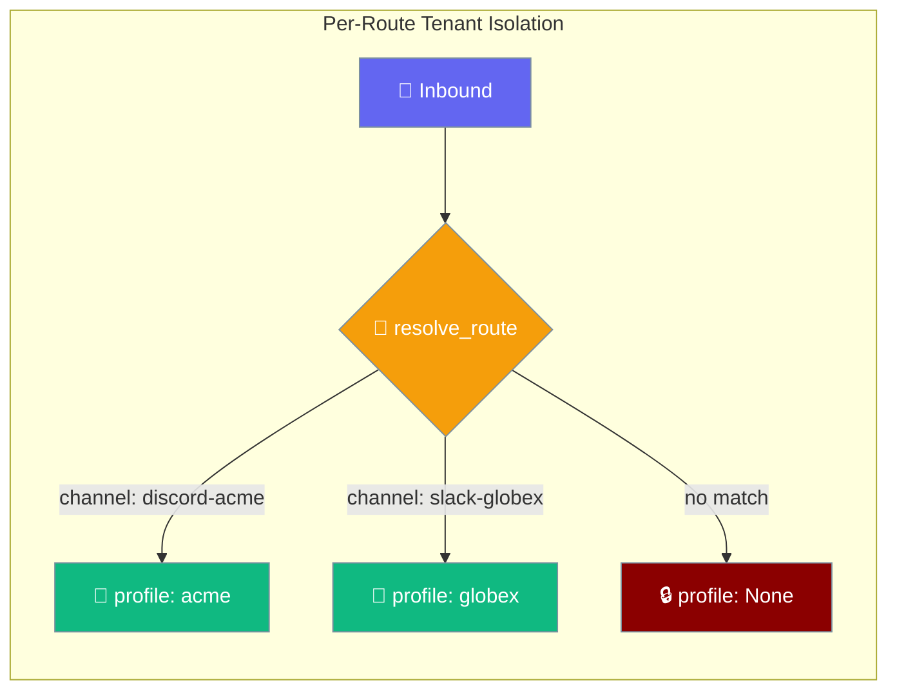
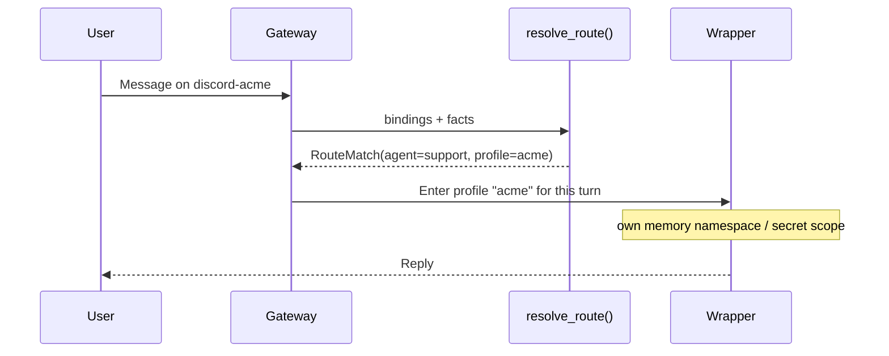

A route's `profile:` field names an isolated tenant scope so one gateway can safely serve many tenants without leaking memory or secrets between them.



## Quick Start

<Steps>
<Step title="Bind two tenants to the same agent">

Give each route a different `profile:` value. The same `support` agent serves both tenants, but each route names its own isolation scope.

```yaml
agents:
  support:
    instructions: "You are the support assistant."
    model: gpt-4o-mini

routing:
  bindings:
    - agent: support
      channel_id: discord-acme
      profile: acme
    - agent: support
      channel_id: slack-globex
      profile: globex
```

</Step>

<Step title="Read the resolved profile in code">

`resolve_route()` copies the winning binding's `profile` onto the `RouteMatch`, so the wrapper knows which tenant scope to enter for the turn.

```python
from praisonaiagents.gateway import RouteBinding, RouteFacts, resolve_route

bindings = [
    RouteBinding(agent="support", channel_id="discord-acme", profile="acme"),
    RouteBinding(agent="support", channel_id="slack-globex", profile="globex"),
]

match = resolve_route(bindings, RouteFacts(channel_id="discord-acme"), default_agent="support")

print(match.agent)    # "support"
print(match.profile)  # "acme"
```

</Step>

<Step title="Leave a route unscoped">

Omit `profile:` (or leave it blank) and the route stays unscoped — `match.profile` is `None`.

```python
match = resolve_route(bindings, RouteFacts(channel_id="unknown"), default_agent="support")

print(match.agent)    # "support"  (fallback)
print(match.profile)  # None       (never inherits acme or globex)
```

</Step>
</Steps>

---

## How It Works



`resolve_route()` picks the most-specific matching binding and copies its `profile` onto the returned `RouteMatch`. An unmatched route yields `RouteMatch(profile=None)`.

---

## Fail-Closed Contract

<Warning>
Tenant isolation is fail-closed by design — a misconfigured route can never silently share another tenant's memory or secrets.

- Blank or whitespace-only `profile` normalises to `None` (unscoped) — never an empty-named scope.
- An unmatched route yields `RouteMatch(profile=None)` and **never inherits another tenant's profile**, even when the fallback agent is the same.
- Treat `profile is None` as "no tenant scope" and fail closed rather than entering an anonymous namespace.
</Warning>

<Note>
This page documents the **routing-protocol contract only**: `RouteBinding.profile` and `RouteMatch.profile` are defined on the gateway protocol. The wrapper wiring that actually enters a profile's memory namespace / secret scope is a follow-up — describe the contract to integrators, but don't rely on the wrapper isolation subsystem until it ships.
</Note>

---

## Configuration Options

| Field | Type | Default | Description |
|-------|------|---------|-------------|
| `profile` (on `RouteBinding`) | `Optional[str]` | `None` | Isolated tenant-profile name the route enters. Blank/whitespace coerces to `None`. |
| `profile` (on `RouteMatch`) | `Optional[str]` | `None` | Populated by `resolve_route()` from the winning binding; `None` when unmatched or unscoped. |

---

## Best Practices

<AccordionGroup>
<Accordion title="Give every tenant its own profile name">
Use one stable, tenant-specific value per route (`acme`, `globex`). Never reuse a profile name across tenants — that would merge their memory and secret scopes.
</Accordion>

<Accordion title="Treat None as fail-closed, not shared">
When `match.profile is None`, do not fall back to a "default tenant" that another route also uses. Unscoped means isolated, not shared.
</Accordion>

<Accordion title="Bind tenants on stable identifiers">
Route tenant profiles on `channel_id` or `account` — stable platform ids — rather than display names, which change.
</Accordion>

<Accordion title="Keep profile names out of user-controlled input">
Profile names come from your config, not from message content. Never derive a profile from a field a user can set.
</Accordion>
</AccordionGroup>

---

## Related

<CardGroup cols={2}>
  <Card title="Route Bindings" icon="route" href="/docs/features/gateway-route-bindings">
    The full routing surface — match by peer, role, channel, account, and priority.
  </Card>
  <Card title="Scoped Approvals" icon="user-lock" href="/docs/features/gateway-scoped-approvals">
    Durable, agent-scoped approval grants that don't leak across agents.
  </Card>
</CardGroup>
