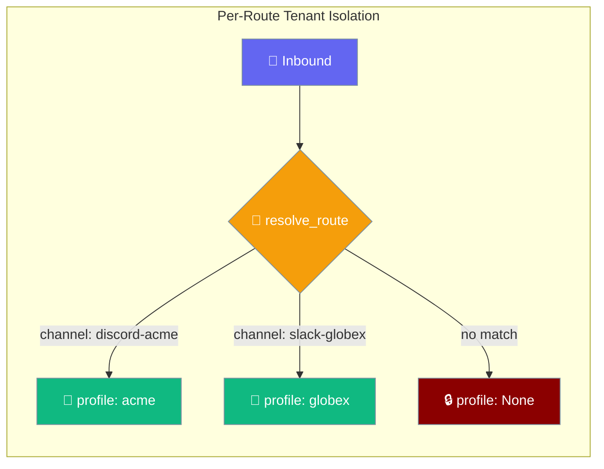
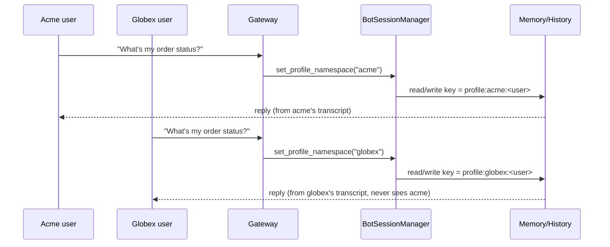
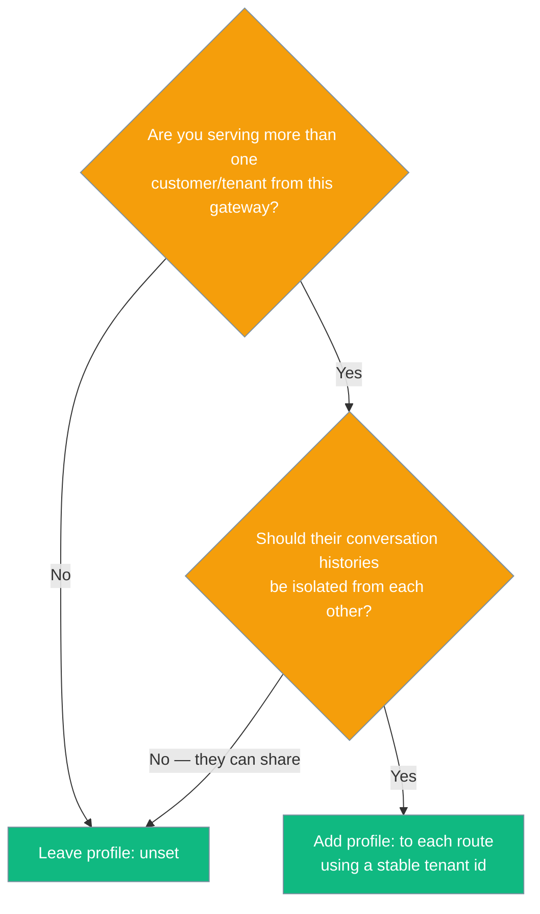

A route's `profile:` field keys memory and session state per tenant on every turn, so one gateway multiplexes many tenants and their conversation histories never cross.

```python
from praisonaiagents import Agent

# Same agent, two tenants — memory never crosses between them.
support = Agent(name="support", instructions="Help the customer.")
support.launch(gateway_config="gateway.yaml")
```

```yaml gateway.yaml
agents:
  support:
    instructions: "Help the customer."
    model: gpt-4o-mini

channels:
  discord-acme:
    platform: discord
    token: ${ACME_DISCORD}
    routes:
      default: { agent: support, profile: acme }
  slack-globex:
    platform: slack
    token: ${GLOBEX_SLACK}
    routes:
      default: { agent: support, profile: globex }
```

Two channels, two tenants, one agent — acme's chat history and globex's chat history are stored under separate keys and never leak into each other.


```mermaid
graph LR
    subgraph "Per-Route Tenant Isolation"
        Msg[📩 Inbound] --> Resolve{🎯 resolve_route}
        Resolve -->|channel: discord-acme| Acme[🏢 profile: acme]
        Resolve -->|channel: slack-globex| Globex[🏢 profile: globex]
        Resolve -->|no match| Unscoped[🔒 profile: None]
    end

    classDef input fill:#6366F1,stroke:#7C90A0,color:#fff
    classDef process fill:#F59E0B,stroke:#7C90A0,color:#fff
    classDef tenant fill:#10B981,stroke:#7C90A0,color:#fff
    classDef fail fill:#8B0000,stroke:#7C90A0,color:#fff

    class Msg input
    class Resolve process
    class Acme,Globex tenant
    class Unscoped fail
```

## Quick Start

<Steps>
<Step title="Bind two tenants to the same agent">

Give each route a different `profile:` value. The same `support` agent serves both tenants, but each route names its own memory namespace.

```yaml
agents:
  support:
    instructions: "You are the support assistant."
    model: gpt-4o-mini

routing:
  bindings:
    - agent: support
      channel_id: discord-acme
      profile: acme
    - agent: support
      channel_id: slack-globex
      profile: globex
```

</Step>

<Step title="Read the resolved profile in code">

`resolve_route()` copies the winning binding's `profile` onto the `RouteMatch`, so the gateway knows which tenant namespace to enter for the turn.

```python
from praisonaiagents.gateway import RouteBinding, RouteFacts, resolve_route

bindings = [
    RouteBinding(agent="support", channel_id="discord-acme", profile="acme"),
    RouteBinding(agent="support", channel_id="slack-globex", profile="globex"),
]

match = resolve_route(bindings, RouteFacts(channel_id="discord-acme"), default_agent="support")

print(match.agent)    # "support"
print(match.profile)  # "acme"
```

</Step>

<Step title="Leave a route unscoped">

Omit `profile:` (or leave it blank) and the route stays unscoped — `match.profile` is `None` and its memory is never namespaced.

```python
match = resolve_route(bindings, RouteFacts(channel_id="unknown"), default_agent="support")

print(match.agent)    # "support"  (fallback)
print(match.profile)  # None       (never inherits acme or globex)
```

</Step>
</Steps>

---

## How It Works


```mermaid
sequenceDiagram
    participant AcmeUser as Acme user
    participant GlobexUser as Globex user
    participant Gateway
    participant Session as BotSessionManager
    participant Store as Memory/History

    AcmeUser->>Gateway: "What's my order status?"
    Gateway->>Session: set_profile_namespace("acme")
    Session->>Store: read/write key = profile:acme:<user>
    Store-->>AcmeUser: reply (from acme's transcript)

    GlobexUser->>Gateway: "What's my order status?"
    Gateway->>Session: set_profile_namespace("globex")
    Session->>Store: read/write key = profile:globex:<user>
    Store-->>GlobexUser: reply (from globex's transcript, never sees acme)
```

`resolve_route()` picks the most-specific matching binding and copies its `profile` onto the returned `RouteMatch`; the gateway then enters that namespace before the agent runs, and every storage key for the turn is prefixed with `profile:<name>:`. An unmatched route yields `RouteMatch(profile=None)` and stays unscoped.

---

## What the Profile Isolates Today

Only memory/session state is namespaced by the profile today; the other dimensions named on the routing protocol are separable follow-ups.

<CardGroup cols={2}>
  <Card title="Memory / session state" icon="circle-check">
    **Shipped (PR #4343).** Every storage key for the turn is prefixed with `profile:<name>:`, so two routes multiplexed on one process never share a transcript.
  </Card>
  <Card title="Secrets / model / instructions" icon="clock">
    **Still follow-up.** These dimensions are not yet consumed from the profile. Do not rely on the profile to scope secrets, override a model, or swap instructions.
  </Card>
</CardGroup>

### Storage-key example

The tenant name appears as `profile:<name>:` at the head of the key, so you can reason about exactly what is isolated.

```
# Unscoped route (no profile)
storage_key = "u1"

# Route with profile: acme
storage_key = "profile:acme:u1"

# Route with profile: acme + per_chat scope
storage_key = "profile:acme:telegram:acct:default:chat:-100123:"
```

---

## When To Use a Profile


```mermaid
graph TD
    Q1{Are you serving more than one<br/>customer/tenant from this gateway?}
    Q1 -->|No| NoProfile[Leave profile: unset]
    Q1 -->|Yes| Q2{Should their conversation histories<br/>be isolated from each other?}
    Q2 -->|Yes| UseProfile[Add profile: to each route<br/>using a stable tenant id]
    Q2 -->|No — they can share| NoProfile

    classDef question fill:#F59E0B,stroke:#7C90A0,color:#fff
    classDef answer fill:#10B981,stroke:#7C90A0,color:#fff
    class Q1,Q2 question
    class UseProfile,NoProfile answer
```

---

## Fail-Closed Contract

<Warning>
Tenant memory isolation is fail-closed at runtime — a misconfigured route can never silently share another tenant's transcript.

- Blank, whitespace-only, or `None` profiles stay **unscoped** and **never borrow another tenant's namespace** — enforced turn-locally, so clearing a profile returns the storage key to its unscoped form (never sticky).
- Concurrent turns — two routes overlapped on one process — each see **their own** tenant namespace; there is no cross-tenant bleed under load, even when turns interleave.
- An unmatched route yields `RouteMatch(profile=None)` and stays unscoped, even when the fallback agent is the same.
</Warning>

<Note>
Memory/session isolation shipped in PR #4343: the profile now keys memory per tenant on every routed turn. Secret-scope, model-override, and instruction-override remain separable follow-ups — the profile does not yet touch them.
</Note>

<Note>
Each concurrent turn keeps its own tenant scope for the duration of the turn and clears it afterward, so overlapping routes never share a namespace and a stale scope never leaks into a later turn.
</Note>

---

## Configuration Options

| Field | Type | Default | Description |
|-------|------|---------|-------------|
| `profile` (on `RouteBinding`) | `Optional[str]` | `None` | Isolated tenant-profile name the route enters. Blank/whitespace coerces to `None`. |
| `profile` (on `RouteMatch`) | `Optional[str]` | `None` | Populated by `resolve_route()` from the winning binding; `None` when unmatched or unscoped. |

At runtime the resolved profile flows into `BotSessionManager`'s storage-key derivation on every routed turn — Discord and Slack via `_routed_message_handler`, Telegram via `handle_message` — so the memory namespace is applied before the agent runs.

---

## Best Practices

<AccordionGroup>
<Accordion title="Give every tenant its own profile name">
Use one stable, tenant-specific value per route (`acme`, `globex`). Never reuse a profile name across tenants — that would merge their conversation histories.
</Accordion>

<Accordion title="Treat None as fail-closed, not shared">
When `match.profile is None`, do not fall back to a "default tenant" that another route also uses. Unscoped means isolated, not shared.
</Accordion>

<Accordion title="Bind tenants on stable identifiers">
Route tenant profiles on `channel_id` or `account` — stable platform ids — rather than display names, which change.
</Accordion>

<Accordion title="Keep profile names out of user-controlled input">
Profile names come from your config, not from message content. Never derive a profile from a field a user can set.
</Accordion>

<Accordion title="Verify isolation by checking a storage key">
Confirm a tenant is isolated by inspecting the head of its storage key — the tenant name must appear as `profile:<name>:` before the base id (e.g. `profile:acme:u1`). An unscoped route shows no prefix (`u1`).
</Accordion>
</AccordionGroup>

---

## Related

<CardGroup cols={2}>
  <Card title="Route Bindings" icon="route" href="/features/gateway-route-bindings">
    The full routing surface — match by peer, role, channel, account, and priority.
  </Card>
  <Card title="Session Persistence" icon="database" href="/features/gateway-session-persistence">
    How profile-scoped routes persist under a namespaced session key across restarts.
  </Card>
  <Card title="Scoped Approvals" icon="user-lock" href="/features/gateway-scoped-approvals">
    Durable, agent-scoped approval grants that don't leak across agents.
  </Card>
</CardGroup>
