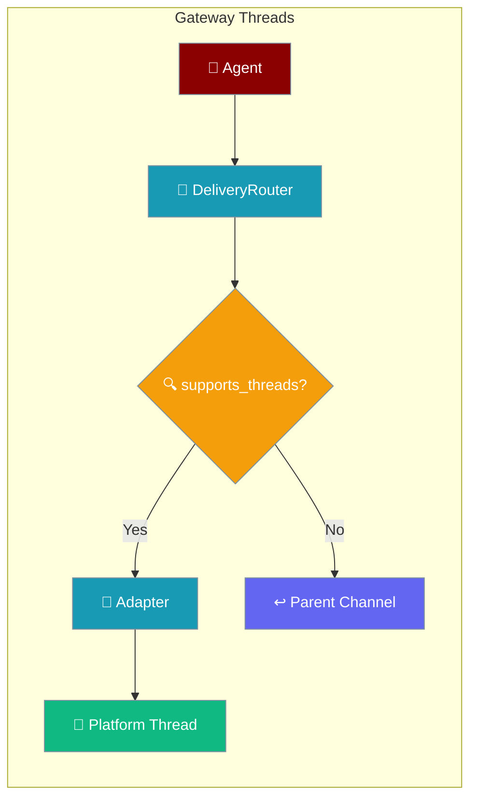
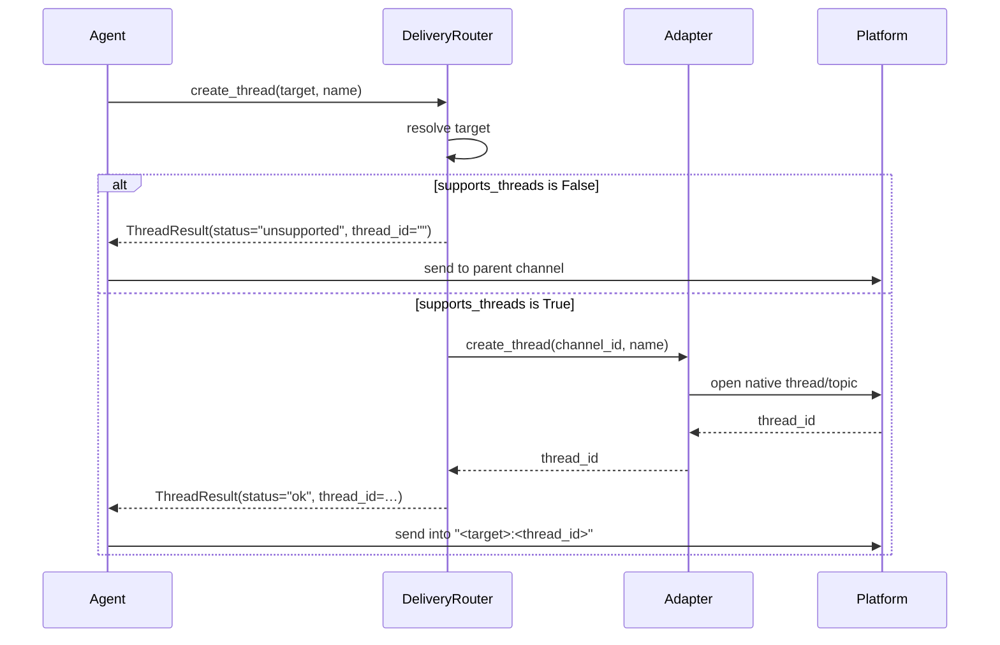
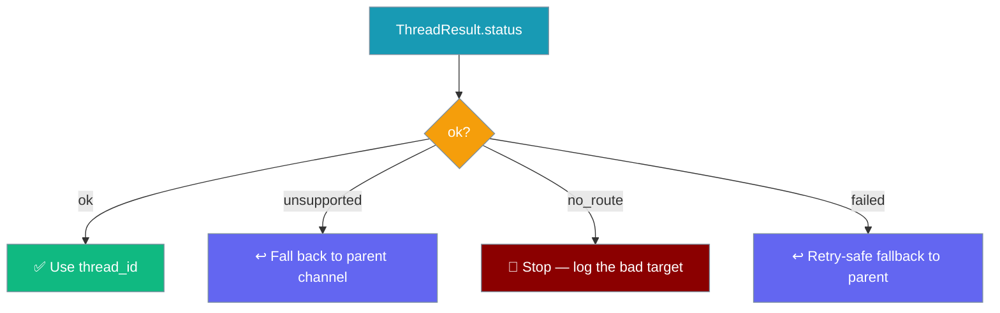

An agent opens a native thread (Telegram forum topic, Discord thread, Slack thread) under a channel and posts a follow-up into it — falling back to the parent channel when the platform can't thread.



## Quick Start

<Steps>
<Step title="Open a thread and post into it">

```python
from praisonaiagents import Agent

agent = Agent(
    name="assistant",
    instructions="Group replies by topic when the channel supports threads.",
)

result = agent.gateway.create_thread(target="telegram:123456", name="daily-standup")
if result.ok:
    agent.gateway.send(target=f"{result.target}:{result.thread_id}", text="Standup starting…")
else:
    # unsupported | failed | no_route — fall back to the parent channel
    agent.gateway.send(target="telegram:123456", text="Standup starting…")
```

</Step>

<Step title="Read the typed outcome">

```python
from praisonaiagents.gateway import ThreadResult

result: ThreadResult = agent.gateway.create_thread(target="slack:C123", name="research")

result.status      # "ok" | "unsupported" | "failed" | "no_route"
result.ok          # True only when status == "ok"
result.thread_id   # the new thread id (set on "ok", "" otherwise)
result.target      # the resolved parent target
```

</Step>
</Steps>

---

## How It Works

`create_thread` resolves the target, checks the channel's `supports_threads` capability, and dispatches to the adapter — returning a typed outcome instead of raising.



---

## Status Decision Guide

Each call resolves to exactly one `ThreadStatus` — map it to the right caller action.



<Info>
Progressive disclosure: start with the boolean `result.ok`, then branch on the four `status` values, then read the full `ThreadResult` dataclass when you need `target`, `thread_id`, or `detail`.
</Info>

---

## Configuration Options

`ThreadResult` (from `praisonaiagents.gateway`) is the typed return of every `create_thread` call.

| Field | Type | Default | Description |
|-------|------|---------|-------------|
| `status` | `ThreadStatus` | *(required)* | Outcome: `"ok"`, `"unsupported"`, `"failed"`, or `"no_route"` |
| `target` | `str` | `""` | Resolved parent target the thread was opened under |
| `thread_id` | `str` | `""` | New thread/topic id — populated only when `status == "ok"` |
| `detail` | `Optional[str]` | `None` | Model-readable explanation (set on non-`ok` outcomes) |
| `ok` | `bool` (property) | — | Convenience for `status == "ok"` |

`ThreadStatus` is a string literal — one of the four values below.

| Value | Meaning | Caller action |
|-------|---------|---------------|
| `"ok"` | A new thread/topic was opened; `thread_id` carries its id | Send into `"<target>:<thread_id>"` |
| `"unsupported"` | The channel has no `supports_threads` capability | Fall back to the parent channel |
| `"failed"` | The transport rejected the attempt (topics mode off, or missing permission) | Retry-safe fallback to parent |
| `"no_route"` | The target could not be resolved to a reachable channel | Stop and log the bad target |

The capability flag lives on the adapter's `PlatformCapabilities`.

| Field | Type | Default | Description |
|-------|------|---------|-------------|
| `supports_threads` | `bool` | `False` | Whether the adapter can open a native thread/topic under a chat |

---

## Fallback Pattern

Try the thread, and route to the parent channel on any non-`ok` outcome.

```python
from praisonaiagents import Agent

agent = Agent(name="assistant", instructions="Scope subtasks into threads when possible.")

parent = "slack:C123"
result = agent.gateway.create_thread(target=parent, name="research")

# Compose the routed target only when a thread was actually opened
destination = f"{result.target}:{result.thread_id}" if result.ok else parent
agent.gateway.send(target=destination, text="Kicking off the research subtask…")
```

<Note>
**Never raises.** A channel that cannot thread returns a typed `unsupported` outcome — you do **not** need `try/except` around `create_thread`.
</Note>

---

## Authoring a Custom Adapter

A custom `OutboundMessengerProtocol` implementation declares the capability and returns a `ThreadResult`.

```python
from praisonaiagents.gateway import ThreadResult
from praisonaiagents.bots.protocols import PlatformCapabilities


class MyAdapter:
    @property
    def capabilities(self) -> PlatformCapabilities:
        return PlatformCapabilities(supports_threads=True)

    async def create_thread(self, target: str, name: str) -> ThreadResult:
        thread_id = await self._open_native_topic(target, name)
        if not thread_id:
            return ThreadResult(status="failed", target=target)
        return ThreadResult(status="ok", target=target, thread_id=str(thread_id))
```

---

## Per-Platform Support

Support tracks each adapter's `supports_threads` capability.

| Channel | supports_threads | Notes |
|---------|:----------------:|-------|
| Telegram | Yes | Forum topics |
| Discord | Yes | Native threads |
| Slack | Yes | Thread anchoring (`thread_ts`) |
| WhatsApp | No | No native threads → `unsupported` |
| Email | No | No native threads → `unsupported` |

---

## Common Patterns

Scope a multi-agent subtask into its own thread so it doesn't flood the shared channel.

```python
result = agent.gateway.create_thread(target="discord:987654", name="deploy-run")
target = f"{result.target}:{result.thread_id}" if result.ok else "discord:987654"
agent.gateway.send(target=target, text="Deploy started — updates will land here.")
```

Branch parallel workflow steps into separate threads, each falling back independently.

```python
parent = "telegram:123456"
for name in ("build", "test", "ship"):
    r = agent.gateway.create_thread(target=parent, name=name)
    agent.gateway.send(
        target=f"{r.target}:{r.thread_id}" if r.ok else parent,
        text=f"{name} stage running…",
    )
```

---

## Best Practices

<AccordionGroup>
  <Accordion title="Always compose the routed target from the result">
    Send into `f"{result.target}:{result.thread_id}"` only when `result.ok` is `True`. On any other status, send to the parent target so the message still lands.
  </Accordion>
  <Accordion title="Skip try/except — the call never raises">
    `create_thread` resolves to a typed `unsupported` / `failed` / `no_route` outcome instead of throwing. Branch on `result.status`, not on exceptions.
  </Accordion>
  <Accordion title="Treat no_route as a bug, not a fallback">
    `"no_route"` means the target string didn't resolve to a reachable channel — log it and fix the target rather than silently retrying.
  </Accordion>
  <Accordion title="Declare supports_threads on custom adapters">
    Return `PlatformCapabilities(supports_threads=True)` and implement `create_thread` together. Declaring the capability without the method leaves the router returning `unsupported`.
  </Accordion>
</AccordionGroup>

---

## Related

<CardGroup cols={2}>
  <Card title="Channel Capabilities" icon="list-check" href="/features/channel-capabilities">
    What each channel supports, including threads
  </Card>
  <Card title="Send Message Tool" icon="paper-plane" href="/features/send-message-tool">
    Deliver messages and reactions to symbolic targets
  </Card>
  <Card title="Gateway" icon="network-wired" href="/gateway">
    Gateway lifecycle predicates and exported symbols
  </Card>
  <Card title="Platform Capabilities" icon="sliders" href="/features/bot-platform-capabilities">
    Per-adapter capability descriptor
  </Card>
</CardGroup>
