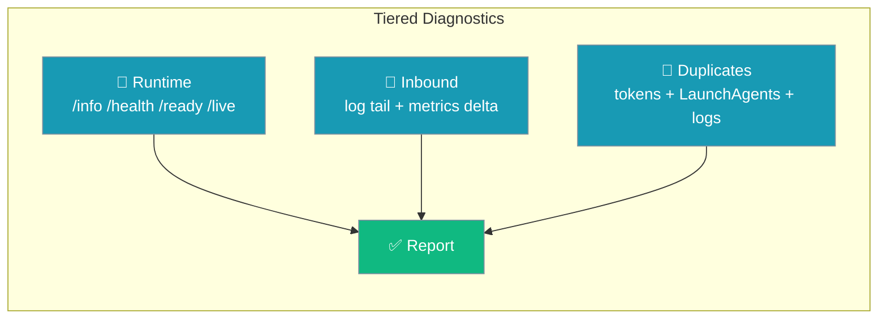
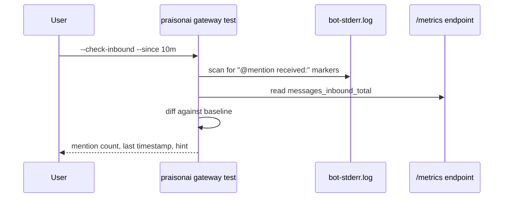

Three CLI checks verify a running gateway from the outside in — HTTP endpoints reachable, inbound messages actually flowing, and no competing gateway fighting for the same tokens.



## Quick Start

<Steps>
<Step title="Verify the gateway is reachable">

Probe the runtime endpoints of a running gateway:

```bash
praisonai gateway test --check-runtime
```

</Step>

<Step title="Confirm messages are arriving">

Check inbound delivery within a time window using a config file:

```bash
praisonai gateway test --check-inbound --since 10m -c ~/.praisonai/gateway.yaml
```

</Step>

<Step title="Detect a competing gateway">

Scan for a second gateway sharing your Slack/Telegram token:

```bash
praisonai gateway test --check-duplicates
```

</Step>
</Steps>

---

## How It Works

Each tier answers a different "is my bot healthy?" question.

| Tier | Flag | What it proves |
|------|------|----------------|
| Runtime | `--check-runtime` | HTTP endpoints respond; `/ready` returns `ready:true`, `/live` returns `alive:true` |
| Inbound | `--check-inbound` | Real messages arrived — via `@mention received:` log markers and a `messages_inbound_total` delta |
| Duplicates | `--check-duplicates` | No second gateway or shared token is stealing your inbound events |

The inbound tier combines two independent signals: a scan of the gateway log and a Prometheus counter compared against a persisted baseline.



---

## Configuration Options

The diagnostics are entirely CLI-driven — no new YAML keys.

**`praisonai gateway test` flags:**

| Flag | Type | Default | Description |
|------|------|---------|-------------|
| `--config, -c` | `str` | `"gateway.yaml"` | Path to `gateway.yaml` |
| `--check-runtime` | `bool` | `False` | Probes `/info`, `/health`, `/ready`, `/live` |
| `--check-inbound` | `bool` | `False` | Verifies recent inbound via logs + metrics delta |
| `--check-duplicates` | `bool` | `False` | Scans for competing gateways / shared tokens |
| `--since` | `str` | `"10m"` | Window for `--check-inbound` (accepts `Xs / Xm / Xh / Xd`) |

**`praisonai gateway status` flags:**

| Flag | Type | Default | Description |
|------|------|---------|-------------|
| `--config, -c` | `str` | — | YAML path (required by `--deep`/`--probe`) |
| `--deep` | `bool` | `False` | Per-channel rows, log tail, DLQ hints, version-skew line |
| `--probe` | `bool` | `False` | Live per-channel credential probe |

**`praisonai gateway sessions` subcommands:**

| Subcommand | Flags | Description |
|------------|-------|-------------|
| `sessions list` | `--platform`, `--active SECONDS`, `--json` | List active/known sessions |
| `sessions show SESSION_REF` | `--tail 20`, `--json` | Show one session's last N transcript lines |
| `sessions export` | `--session-id`, `--out`, `--no-lineage` | Export gateway conversation state to a portable, versioned JSON payload |
| `sessions import` | `--in`, `--overwrite`, `--keep-live-fields`, `--max-sessions`, `--json` | Restore/migrate sessions from an exported payload (hardened) |

**Environment variable:**

| Name | Purpose |
|------|---------|
| `GATEWAY_AUTH_TOKEN` | Bearer for `/info` and `/metrics`; attached only over loopback or HTTPS (omitted on plaintext remote to avoid leaking the credential) |

`/health` uses the existing `health_config.stale_after` (default `120.0`s) and `startup_grace` (default `60.0`s).

<Info>
State files the checks read (read-only): `~/.praisonai/state/inbound_metrics_baseline.json` (counter baseline), `~/.praisonai/logs/bot-stderr.log` (mention markers), and `~/.hermes/gateway_state.json` + `~/.praisonai/.env` + `~/.hermes/.env` (duplicate detection).
</Info>

---

## Common Patterns

Run runtime and duplicate checks together for a fast liveness sweep:

```bash
praisonai gateway test --check-runtime --check-duplicates -c gateway.yaml
```

Inspect stored conversations when a user reports a missing reply:

```bash
praisonai gateway sessions list --platform slack --active 3600
praisonai gateway sessions show <session-ref> --tail 20
```

Call the checks directly from Python for custom health tooling:

```python
from praisonai_bot.gateway.preflight import (
    check_runtime,
    check_inbound,
    check_duplicates,
)

runtime = check_runtime("gateway.yaml")
inbound = check_inbound("gateway.yaml", since="10m")
dupes = check_duplicates("gateway.yaml")

print(runtime.to_dict())
print(inbound.to_dict())
print(dupes.to_dict())
```

Each function returns a dataclass with a `.to_dict()` for JSON output:

| Function | Returns |
|----------|---------|
| `check_runtime(config_path, timeout=5.0)` | `RuntimeCheckResult` |
| `check_inbound(config_path, since="10m", log_path=None, timeout=5.0, probe_results=None)` | `InboundCheckResult` |
| `check_duplicates(config_path)` | `DuplicateCheckResult` |
| `list_gateway_sessions(platform=None, active_seconds=None)` | `List[Dict]` |
| `show_gateway_session(session_ref, tail=20)` | `Dict` |

---

## Related Emissions

The inbound tier reads a counter the gateway increments on every inbound message.

- **Metric:** `messages_inbound_total{channel="..."}` — incremented per channel, including the Slack `@mention` path. `handle_mention` now fires `fire_message_received`, so mentions count toward inbound and honour `drop` / rewritten `content` decisions.
- **`/health` additions:** top-level `last_inbound_at`; per-channel `ok`, `reason` (from the `HealthReason` enum), `last_activity`, and optional `probe.ok`.
- **Two doctor checks** (category `BOTS`, both `requires_deep=True`):

| Check | Severity |
|-------|----------|
| `gateway_duplicate_services` | HIGH |
| `gateway_no_inbound_recent` | MEDIUM |

Run them with `praisonai doctor --deep`.

---

## Best Practices

<AccordionGroup>
<Accordion title="Seed the inbound baseline first">
The first `--check-inbound` run seeds `inbound_metrics_baseline.json`. Re-run it after sending a test message to see a real delta within the window.
</Accordion>
<Accordion title="Use --check-duplicates before debugging silence">
When a bot stops replying, a second gateway sharing the same token is the most common cause. Run `--check-duplicates` before touching config.
</Accordion>
<Accordion title="Keep GATEWAY_AUTH_TOKEN loopback-only for remote gateways">
The bearer token is withheld over plaintext HTTP to a remote host. Probe over loopback or serve the gateway behind HTTPS so `/info` and `/metrics` stay reachable.
</Accordion>
<Accordion title="Widen the window for low-traffic bots">
`--since 10m` suits busy bots. For a quiet channel use `--since 2h` or `--since 1d` so a real-but-old message still registers.
</Accordion>
</AccordionGroup>

---

## Related

<CardGroup cols={2}>
<Card title="Gateway Forensics" icon="magnifying-glass" href="/features/gateway-forensics">
  Deep post-incident inspection of gateway state
</Card>
<Card title="Gateway Liveness" icon="heart-pulse" href="/features/gateway-liveness">
  Health, readiness, and liveness endpoints
</Card>
<Card title="Runtime Preflight" icon="list-check" href="/features/runtime-preflight">
  Pre-start readiness verification
</Card>
<Card title="Loop Watchdog" icon="rotate" href="/features/gateway-loop-watchdog">
  Detect and break runaway gateway loops
</Card>
<Card title="Diagnostics Export" icon="file-zipper" href="/features/gateway-diagnostics-export">
  One-command, pre-sanitised support bundle for a bug report
</Card>
</CardGroup>
