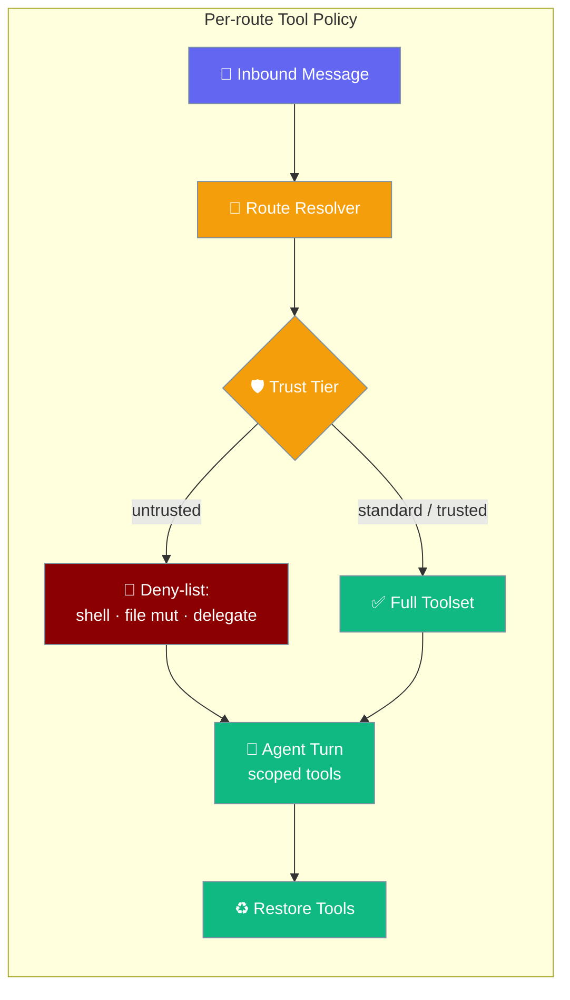
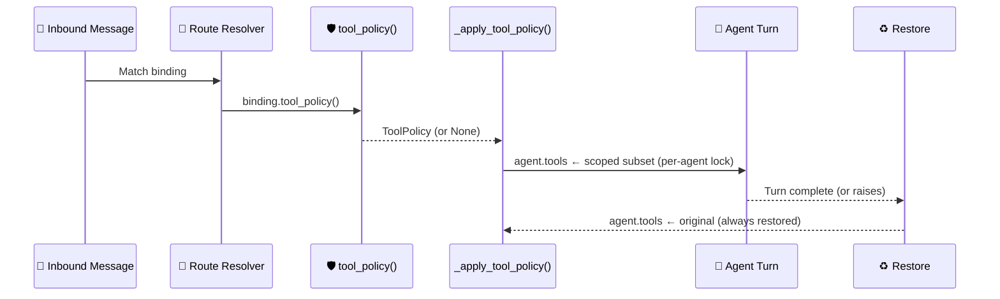

Untrusted inbound routes never even see dangerous tools — the model is offered a scoped subset for that turn, then the agent's original toolset is restored.



## Quick Start

<Steps>

<Step title="Lock down stranger DMs with one YAML line">

Add `trust: untrusted` to any binding. Dangerous tools (shell, file mutation, delegation, scheduling) are automatically withheld from the model for that route.

```yaml
gateway:
  routes:
    - { chat_type: dm, agent: assistant, trust: untrusted }
```

</Step>

<Step title="Give your operator full power">

```python
from praisonaiagents import Agent
from praisonaiagents.gateway import RouteBinding

assistant = Agent(name="assistant", instructions="Help users.")

bindings = [
    RouteBinding(agent="assistant", chat_type="dm", trust="untrusted"),
    RouteBinding(agent="assistant", peer="operator-123", trust="trusted"),
]
```

Stranger DMs get the safe subset. Your operator peer gets everything.

</Step>

<Step title="Add explicit allow/deny overrides">

```python
from praisonaiagents.gateway import RouteBinding

RouteBinding(
    agent="assistant",
    channel_id="ops",
    deny_tools=["shell", "delete_file"],
)
```

Layer `deny_tools` on top of any trust tier for project-specific tools not covered by the default substrings.

</Step>

</Steps>

---

## How It Works



The apply/restore step happens **inside the per-agent lock** and is guaranteed to run even when the agent turn raises an exception — so a failed run can never leave an agent permanently hobbled.

| Step | What happens |
|------|-------------|
| Route resolver | Matches the binding with highest priority + specificity |
| `tool_policy()` | Builds a `ToolPolicy` from `trust`, `allow_tools`, `deny_tools` |
| `_apply_tool_policy()` | Swaps `agent.tools` to the allowed subset for this turn |
| Agent turn | Model only sees the scoped tool list |
| Restore | `agent.tools` reset to original regardless of outcome |

---

## Configuration Options

### `RouteBinding` security fields

For routing fields (`peer`, `role`, `channel_id`, `account`, `chat_type`, `priority`) see [Gateway Route Bindings](/docs/features/gateway-route-bindings).

| Field | Type | Default | Description |
|-------|------|---------|-------------|
| `trust` | `Optional[str]` | `None` | `"untrusted"` \| `"standard"` \| `"trusted"`. Unknown values normalise to `"untrusted"` (fail-closed). |
| `allow_tools` | `Optional[List[str]]` | `None` | Whitelist by exact tool name. `None` = allow all except deny rules. Accepts a YAML scalar or list. |
| `deny_tools` | `Optional[List[str]]` | `None` | Exact tool names removed before the run. Layers on top of the trust tier's deny-list. Accepts a YAML scalar or list. |

### `ToolPolicy` dataclass

| Field | Type | Default | Description |
|-------|------|---------|-------------|
| `allow_tools` | `Optional[Set[str]]` | `None` | Whitelist by exact name. `None` = allow all except deny rules. |
| `deny_tools` | `Set[str]` | `set()` | Exact names removed. |
| `deny_substrings` | `List[str]` | `[]` | Case-insensitive substrings; a tool whose name *contains* any of these is removed. Used by the `untrusted` tier. |

### Module constants

| Constant | Type | Description |
|----------|------|-------------|
| `UNTRUSTED_DENY_SUBSTRINGS` | `List[str]` | The 12 substrings the `untrusted` tier seeds: `shell`, `exec`, `command`, `subprocess`, `write_file`, `edit_file`, `delete_file`, `rm_file`, `delegate`, `handoff`, `cronjob`, `schedule`. |
| `TRUST_TIERS` | `List[str]` | `["untrusted", "standard", "trusted"]` (least → most privileged). |

Import from `praisonaiagents.gateway`:

```python
from praisonaiagents.gateway import (
    RouteBinding, ToolPolicy, TRUST_TIERS, UNTRUSTED_DENY_SUBSTRINGS,
)
```

---

## Common Patterns

**Lock down stranger DMs, keep operator at full power**

```python
from praisonaiagents import Agent
from praisonaiagents.gateway import RouteBinding

assistant = Agent(name="assistant", instructions="Help users.")

bindings = [
    RouteBinding(agent="assistant", chat_type="dm", trust="untrusted"),
    RouteBinding(agent="assistant", peer="operator-123", trust="trusted"),
]
```

Or in YAML:

```yaml
gateway:
  routes:
    - { chat_type: dm, agent: assistant, trust: untrusted }
    - { peer: "operator-123", agent: assistant, trust: trusted }
```

**Channel-scoped policy — deny specific tools on #ops**

```python
from praisonaiagents.gateway import RouteBinding

RouteBinding(
    agent="assistant",
    channel_id="ops",
    deny_tools=["shell", "delete_file"],
)
```

**Whitelist mode — only `search` on a public-facing route**

```python
from praisonaiagents.gateway import RouteBinding

RouteBinding(
    agent="assistant",
    chat_type="group",
    allow_tools=["search"],
)
```

Only the `search` tool is offered. Everything else is withheld.

---

## Best Practices

<AccordionGroup>

<Accordion title="Default new gateway routes to trust: untrusted">
Opt *in* to power, not *out* of safety. Add `trust: untrusted` to every new route you create; promote to `standard` or `trusted` only when you have a clear need.

```yaml
gateway:
  routes:
    - { chat_type: dm, agent: assistant, trust: untrusted }   # safe by default
```
</Accordion>

<Accordion title="Layer deny_tools on top of untrusted for project-specific tools">
`UNTRUSTED_DENY_SUBSTRINGS` covers the 12 common dangerous families. Custom tools with names like `purge_cache` or `flush_queue` won't match any substring — add them explicitly.

```python
RouteBinding(
    agent="assistant",
    chat_type="dm",
    trust="untrusted",
    deny_tools=["purge_cache", "flush_queue"],
)
```
</Accordion>

<Accordion title="Never put your operator's peer on an untrusted binding">
Pair `trust: trusted` (or omit `trust`) with your operator's stable `peer:` id. If you put an operator peer on `untrusted`, they will hit the conservative deny-list on every message.

```yaml
bindings:
  - { peer: "operator-123", agent: assistant }          # trusted by default (no trust field)
  - { chat_type: dm, agent: assistant, trust: untrusted }   # everyone else
```
</Accordion>

<Accordion title="Audit UNTRUSTED_DENY_SUBSTRINGS for your tool families">
Import the constant and check your tool names against it before deploying:

```python
from praisonaiagents.gateway import UNTRUSTED_DENY_SUBSTRINGS

my_tools = ["search_web", "read_file", "send_email", "run_python"]
for tool in my_tools:
    blocked = any(sub in tool.lower() for sub in UNTRUSTED_DENY_SUBSTRINGS)
    print(f"{tool}: {'BLOCKED on untrusted' if blocked else 'allowed'}")
```

Anything that bypasses the 12 substrings will leak through `trust: untrusted` unless you add an explicit `deny_tools` entry.
</Accordion>

</AccordionGroup>

---

## Related

<CardGroup cols={2}>
  <Card title="Gateway Route Bindings" icon="route" href="/docs/features/gateway-route-bindings">
    The routing surface this layers on — match by peer, role, channel, or chat type.
  </Card>
  <Card title="Approval" icon="shield" href="/docs/features/approval">
    The second line of defence — require human confirmation before risky tool calls execute.
  </Card>
</CardGroup>
