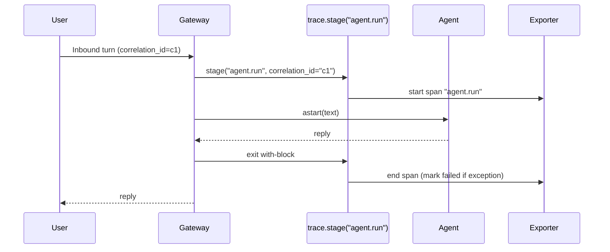
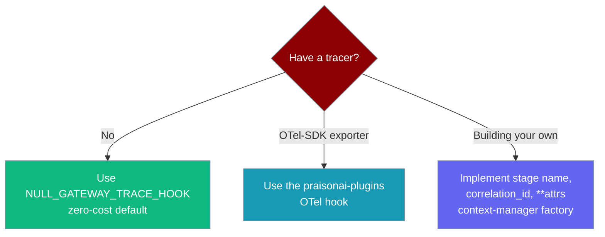

<Note>
The gateway now ships in the `praisonai-bot` package. `praisonai serve gateway` still works exactly as documented here; for a standalone install see [praisonai-bot Migration](/docs/guides/praisonai-bot-migration).
</Note>

```python
from praisonaiagents import Agent

agent = Agent(name="Support", instructions="Help the customer.")
# The gateway wraps each pipeline stage in a span your tracer can pick up
agent.start("Where is my order?")
```

Wrap each stage of the gateway pipeline in a span your own OpenTelemetry exporter can pick up.

The user sends a turn; the gateway opens a span around every stage — inbound, admission, agent run, each LLM and tool call, outbox, delivery — so latency and failures show up per stage in Jaeger, Tempo, Datadog, or Honeycomb.

```mermaid
graph LR
    Inbound[📨 Inbound] --> Admit[🚦 Admit]
    Admit --> Run[🤖 Agent.run]
    Run --> LLM[🧠 LLM.call]
    LLM --> Tool[🔧 Tool.call]
    Tool --> Outbox[📤 Outbox.enqueue]
    Outbox --> Delivery[✅ Delivery]

    classDef inbound fill:#6366F1,stroke:#7C90A0,color:#fff
    classDef admit fill:#F59E0B,stroke:#7C90A0,color:#fff
    classDef agent fill:#8B0000,stroke:#7C90A0,color:#fff
    classDef process fill:#189AB4,stroke:#7C90A0,color:#fff
    classDef done fill:#10B981,stroke:#7C90A0,color:#fff

    class Inbound inbound
    class Admit admit
    class Run agent
    class LLM,Tool,Outbox process
    class Delivery done
```



## Quick Start

<Steps>
<Step title="Simple Usage — the safe, zero-cost default">

Do nothing and the gateway holds a no-op hook. Every `stage(...)` returns a null context manager that ignores its arguments, so tracing adds negligible overhead until you attach a real exporter.

```python
from praisonaiagents.gateway import NULL_GATEWAY_TRACE_HOOK

# The default a gateway uses until an exporter is supplied — one shared, stateless instance
with NULL_GATEWAY_TRACE_HOOK.stage("agent.run", correlation_id="turn-42", session="s1") as span:
    assert span is None   # no-op: nothing is recorded, nothing is swallowed
```

</Step>

<Step title="With a real tracer — plug a custom hook">

Any object with a matching `stage(name, *, correlation_id, **attrs)` context-manager factory satisfies the protocol — no base class needed. This recorder captures each stage as it opens and closes:

```python
from contextlib import contextmanager
from praisonaiagents.gateway import resolve_trace_hook

class Recorder:
    def __init__(self):
        self.events = []

    def stage(self, name, *, correlation_id=None, **attrs):
        return self._span(name, correlation_id, attrs)

    @contextmanager
    def _span(self, name, correlation_id, attrs):
        self.events.append(("start", name, correlation_id))
        try:
            yield name
        finally:
            self.events.append(("end", name, correlation_id))

tracer = resolve_trace_hook(Recorder())

with tracer.stage("agent.run", correlation_id="c1", session="s1") as span:
    ...  # run the stage; the span opens here and closes on exit
```

A production exporter follows the same shape but calls `tracer.start_as_current_span(...)` from the OpenTelemetry SDK inside `stage`. That exporter lives in the separate `praisonai-plugins` package — core ships only the seam and the no-op default.

</Step>
</Steps>

---

## How It Works

The hook is a synchronous context-manager factory, so it wraps both sync and async stages with the same `with ...:` block.



| Step | What happens |
|------|--------------|
| Enter `with` | The hook starts the span for that stage name |
| Body runs | The stage (sync or async) executes inside the span's scope |
| Exit `with` | The hook ends the span |
| Exception raised | Propagates out and the span is marked failed — implementations must not swallow it |

---

## Configuration Options

Core exposes the seam through five top-level symbols on `praisonaiagents.gateway`:

<CardGroup cols={2}>
<Card title="GatewayTraceHook" icon="plug">
  `@runtime_checkable` `Protocol` — the structural contract a tracer implements.
</Card>
<Card title="NullGatewayTraceHook" icon="ban">
  Zero-cost no-op default class used when tracing is disabled.
</Card>
<Card title="NULL_GATEWAY_TRACE_HOOK" icon="box">
  Shared stateless singleton of the no-op default.
</Card>
<Card title="resolve_trace_hook" icon="wand-magic-sparkles">
  Returns the supplied hook, or the no-op default when passed `None`.
</Card>
</CardGroup>

```python
from praisonaiagents.gateway import (
    GatewayTraceHook,
    NullGatewayTraceHook,
    NULL_GATEWAY_TRACE_HOOK,
    resolve_trace_hook,
    GATEWAY_TRACE_STAGES,
)
```

The `stage` contract is deliberately dependency-free — no OpenTelemetry import lives in core:

```python
def stage(
    self,
    name: str,
    *,
    correlation_id: Optional[str] = None,
    **attrs: Any,
) -> AbstractContextManager[Any]:
    ...
```

---

## Canonical Stage Names

`GATEWAY_TRACE_STAGES` is a tuple of the seven canonical span names, so a tracer plugin and the wrapper agree on names without importing each other.

| Stage name | Fires around |
|------------|--------------|
| `inbound` | Reading a new message off a channel adapter |
| `admit` | Admission / rate-limit / concurrency gating |
| `agent.run` | One full agent turn |
| `llm.call` | An individual LLM call inside a turn |
| `tool.call` | An individual tool call inside a turn |
| `outbox.enqueue` | Handing a reply to the outbound queue |
| `delivery` | Actually sending the reply on the channel |

<Tip>
Pin your tracer to these names so span names line up with the pipeline out of the box. Add new names to `GATEWAY_TRACE_STAGES` in a follow-up PR rather than inventing them per plugin.
</Tip>

<AccordionGroup>
<Accordion title="inbound — a turn arrives">
The message reaches the gateway. Span attributes typically carry the channel and correlation id.
</Accordion>
<Accordion title="admit — admission control">
Concurrency and rate-limit policies decide whether the turn proceeds or is rejected.
</Accordion>
<Accordion title="agent.run — the agent turn">
The agent processes the turn end to end. This is usually the parent span for the model and tool calls below.
</Accordion>
<Accordion title="llm.call — a model call">
A single LLM request. Attributes commonly include the model name.
</Accordion>
<Accordion title="tool.call — a tool invocation">
A single tool execution. Attributes commonly include the tool name.
</Accordion>
<Accordion title="outbox.enqueue — queued for delivery">
The reply is placed on the outbox for reliable delivery.
</Accordion>
<Accordion title="delivery — sent to the user">
The reply is delivered to the channel. Attributes commonly include the channel.
</Accordion>
</AccordionGroup>

---

## Common Patterns

### Pattern 1: Correlation id as a span attribute

Pass the inbound turn's existing correlation id so spans and logs share a single key — the same id you already join logs on.

```python
from praisonaiagents.gateway import NULL_GATEWAY_TRACE_HOOK

trace = NULL_GATEWAY_TRACE_HOOK  # swap for a real exporter in production

with trace.stage("delivery", correlation_id="turn-42", channel="telegram"):
    ...  # deliver the reply; the correlation id lands on the span as an attribute
```

### Pattern 2: Wrapping a custom stage

Fire the seam around an async stage with the same synchronous `with` block:

```python
with self._trace.stage("agent.run", correlation_id=current_correlation_id(), session=sid):
    reply = await agent.astart(text)
```

### Pattern 3: `resolve_trace_hook` in a constructor

Accept an optional `tracer=` and resolve it once, so no stage ever branches on `None`:

```python
from praisonaiagents.gateway import resolve_trace_hook

class MyGateway:
    def __init__(self, tracer=None):
        self._trace = resolve_trace_hook(tracer)  # a callable hook either way

    async def handle(self, text, sid):
        with self._trace.stage("agent.run", correlation_id="c1", session=sid):
            ...
```

---

## Best Practices

<AccordionGroup>
<Accordion title="Keep OpenTelemetry out of core">
The seam is dependency-free on purpose. Core holds only the protocol and the no-op default, so there is no OTel import and no hot-path overhead when tracing is off. The heavy `opentelemetry-sdk` dependency belongs in the `praisonai-plugins` exporter, not in your agent code.
</Accordion>
<Accordion title="Reuse the correlation id as a span attribute">
Pass the inbound turn's `correlation_id` to every `stage(...)` call. Spans and logs then share one key, so a trace in Jaeger and a log line in your aggregator line up on the same id.
</Accordion>
<Accordion title="Do not swallow exceptions in the context manager">
An exception propagating out of the `with` block is what marks the span as failed. Catching it inside `stage` hides errors from your tracer. Let it propagate — the no-op default already does.
</Accordion>
<Accordion title="Prefer the shared NULL_GATEWAY_TRACE_HOOK instance">
The no-op default is stateless, so reuse the shared `NULL_GATEWAY_TRACE_HOOK` singleton instead of constructing `NullGatewayTraceHook()` per call.
</Accordion>
</AccordionGroup>

---

## Choosing an Integration Path



---

## Related

<CardGroup cols={2}>
<Card title="Gateway Overview" icon="server" href="/docs/features/gateway-overview">
  Bot gateway architecture and core concepts
</Card>
<Card title="Bot Gateway" icon="server" href="/docs/features/bot-gateway">
  Multi-bot WebSocket gateway — the host whose pipeline these spans wrap
</Card>
<Card title="Gateway Metrics" icon="chart-line" href="/docs/features/gateway-metrics">
  Prometheus counters — the other observability rail alongside traces
</Card>
<Card title="Correlation IDs" icon="link" href="/docs/features/correlation-ids">
  The join key that ties spans, logs, and metrics to one turn
</Card>
<Card title="Gateway Forensics" icon="magnifying-glass" href="/docs/features/gateway-forensics">
  Crash and shutdown forensics, keyed on the same correlation id
</Card>
<Card title="Observability Hooks" icon="eye" href="/docs/features/observability-hooks">
  Lifecycle hooks for logging, metrics, and tracing
</Card>
<Card title="Gateway Observability" icon="route" href="/docs/features/bot-gateway#observability">
  The gateway observability section that links here
</Card>
</CardGroup>
