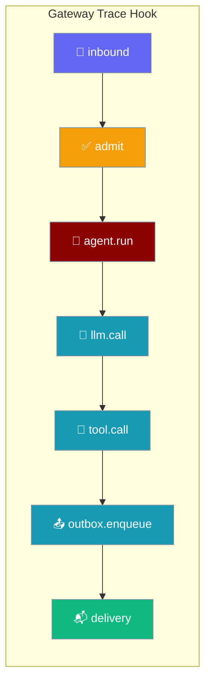
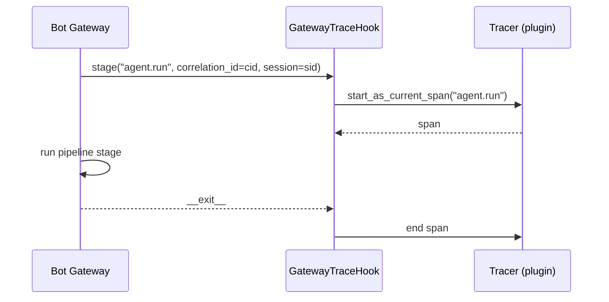

Gateway Tracing opens a distributed-tracing span around each stage of the bot gateway pipeline — inbound → admit → agent run → LLM/tool call → outbox → delivery — so you can see per-turn latency and errors in Jaeger, Tempo, Datadog, or Honeycomb.



Attach a hook to open one span per stage; leave it off and the shared no-op default costs nothing.

## Quick Start

<Steps>
<Step title="See the zero-cost default">
The default hook is a shared, stateless no-op — tracing stays free until you attach a real tracer.

```python
from praisonaiagents import Agent
from praisonaiagents.gateway import (
    NULL_GATEWAY_TRACE_HOOK,
    GATEWAY_TRACE_STAGES,
)

agent = Agent(name="assistant", instructions="Help users")

tracer = NULL_GATEWAY_TRACE_HOOK

with tracer.stage("agent.run", correlation_id="cid-1", session="s1"):
    agent.start("Say hi")

print(GATEWAY_TRACE_STAGES)
```
</Step>

<Step title="Attach a real tracer">
Supply any object with a `stage(...)` method and `resolve_trace_hook` hands it straight back.

```python
from contextlib import contextmanager
from praisonaiagents.gateway import GatewayTraceHook, resolve_trace_hook

class PrintTracer:
    @contextmanager
    def _span(self, name, correlation_id, attrs):
        print(f"→ {name} cid={correlation_id} attrs={attrs}")
        try:
            yield name
        finally:
            print(f"← {name} cid={correlation_id}")

    def stage(self, name, *, correlation_id=None, **attrs):
        return self._span(name, correlation_id, attrs)

tracer: GatewayTraceHook = resolve_trace_hook(PrintTracer())
with tracer.stage("delivery", correlation_id="cid-2", channel="telegram"):
    pass
```
</Step>

<Step title="Learn the stage names">
Each span name comes from `GATEWAY_TRACE_STAGES` — see the [stage reference](#stage-reference) below.
</Step>
</Steps>

---

## How It Works

The gateway fires the hook around each stage; the hook returns a context manager whose scope is the span.



Every `stage(...)` return value is a real `AbstractContextManager`, so it is safe in a `with` block; exceptions inside the scope propagate through the null default rather than being swallowed; and the default is stateless, so `NULL_GATEWAY_TRACE_HOOK` is shared everywhere without allocation churn.

---

## Stage Reference

The seven canonical stage names come verbatim from `GATEWAY_TRACE_STAGES`.

| Stage name | Fires around |
|------------|--------------|
| `inbound` | Reading a new message off a channel adapter |
| `admit` | Admission / rate-limit / concurrency gating |
| `agent.run` | One full agent turn |
| `llm.call` | An individual LLM call inside a turn |
| `tool.call` | An individual tool call inside a turn |
| `outbox.enqueue` | Handing a reply to the outbound queue |
| `delivery` | Actually sending the reply on the channel |

<Tip>
Pin your tracer to these names so span names line up with the pipeline out of the box. Add new names to `GATEWAY_TRACE_STAGES` in a follow-up PR rather than inventing them per plugin.
</Tip>

---

## Custom Hook

A hook is any object with a `stage(...)` method that returns a context manager.

```python
from contextlib import contextmanager
from typing import Any, Iterator, Optional
from praisonaiagents.gateway import GatewayTraceHook

class MyTracer:
    """A GatewayTraceHook that records span start/end for demo purposes."""

    def __init__(self):
        self.events = []

    def stage(
        self,
        name: str,
        *,
        correlation_id: Optional[str] = None,
        **attrs: Any,
    ):
        return self._span(name, correlation_id, attrs)

    @contextmanager
    def _span(self, name, correlation_id, attrs) -> Iterator[str]:
        self.events.append(("start", name, correlation_id, attrs))
        try:
            yield name
        finally:
            self.events.append(("end", name, correlation_id))

hook: GatewayTraceHook = MyTracer()
with hook.stage("llm.call", correlation_id="cid-3", model="gpt-4o"):
    pass
```

<Note>
A ready-made OpenTelemetry / OTLP exporter that implements `GatewayTraceHook` will ship in **`praisonai-plugins`**. Until it lands, use the pattern above with your tracer of choice — core stays dependency-free.
</Note>

---

## Correlation IDs

The `correlation_id` you pass to `stage(...)` is the same identifier the gateway already writes into logs and Prometheus labels, so spans, logs, and metrics all join on one key per turn. Read it inside any tool with `current_correlation_id()` (see [Correlation IDs](/docs/features/correlation-ids)) and pair spans with counters from [Gateway Metrics](/docs/features/gateway-metrics).

---

## Best Practices

<AccordionGroup>
  <Accordion title="Reuse GATEWAY_TRACE_STAGES">
    Pinning to the canonical stage names keeps dashboards portable when the pipeline evolves. Import `GATEWAY_TRACE_STAGES` and name spans from it instead of hard-coding strings.
  </Accordion>
  <Accordion title="Always pass correlation_id">
    Spans without the id can't be joined to logs or metrics on the same turn. Forward the turn's `correlation_id` into every `stage(...)` call.
  </Accordion>
  <Accordion title="Use resolve_trace_hook(None) for zero-cost defaults">
    `resolve_trace_hook(None)` returns the shared `NULL_GATEWAY_TRACE_HOOK`, so the pipeline never branches on `None` and tracing is free when disabled.
  </Accordion>
  <Accordion title="Do not swallow exceptions">
    The null default deliberately propagates exceptions. Custom hooks should mark the span as failed and re-raise so error spans surface in your tracer.
  </Accordion>
</AccordionGroup>

---

## Related

<CardGroup cols={2}>
  <Card icon="server" href="/docs/features/bot-gateway" title="Gateway Server">
    Multi-bot WebSocket gateway — the host whose pipeline these spans wrap.
  </Card>
  <Card icon="chart-line" href="/docs/features/gateway-metrics" title="Gateway Metrics">
    Prometheus counters and gauges for every hop of the message flow.
  </Card>
  <Card icon="link" href="/docs/features/correlation-ids" title="Correlation IDs">
    The join key that ties spans, logs, and metrics to one turn.
  </Card>
  <Card icon="route" href="/docs/features/bot-gateway#observability" title="Observability">
    The gateway observability section that links here.
  </Card>
</CardGroup>
