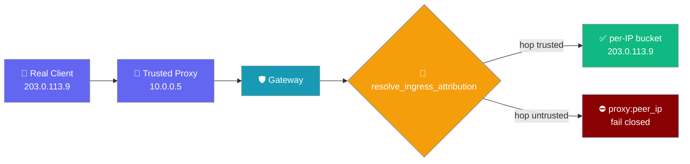
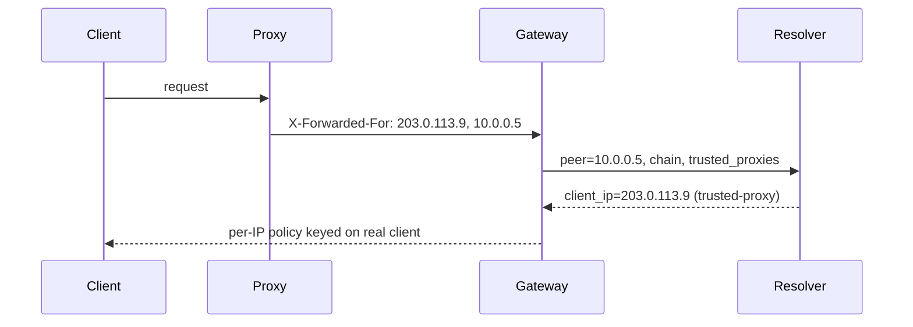
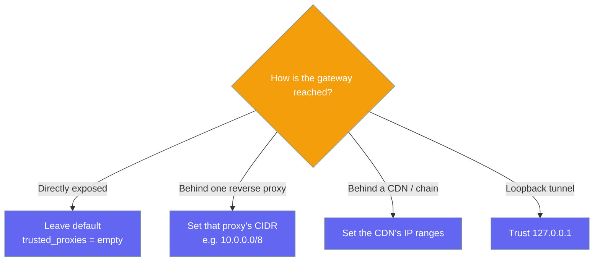

Behind a reverse proxy or tunnel the socket peer is the *proxy* for every request, so per-IP policy collapses onto one bucket — declaring the proxy trusted resolves the real client instead.

```python
from praisonaiagents import GatewayConfig

config = GatewayConfig(
    trusted_proxies=["10.0.0.0/8"],  # the CIDR of your reverse proxy
)
```



## Quick Start

<Steps>
<Step title="Simple (Python)">
Declare the proxy's network so the gateway keys per-IP policy on the real client.

```python
from praisonaiagents import GatewayConfig

config = GatewayConfig(
    trusted_proxies=["10.0.0.0/8"],
)
```
</Step>

<Step title="YAML">
Set `trusted_proxies` under the `gateway:` block in `gateway.yaml`.

```yaml
gateway:
  trusted_proxies:
    - 10.0.0.0/8       # CIDR — a whole trusted network
    - 192.168.1.10     # bare IP — a single trusted proxy
    - 127.0.0.1        # loopback tunnel (Tailscale Serve / Cloudflare sidecar)
```
</Step>

<Step title="CLI">
Pass `--trusted-proxy` (repeatable) to `praisonai gateway start`.

```bash
praisonai gateway start \
  --trusted-proxy 10.0.0.0/8 \
  --trusted-proxy 192.168.1.10
```
</Step>
</Steps>

---

## How It Works

Every per-IP seam consults one pure decision that walks `X-Forwarded-For` across declared trusted hops, then keys policy on the first untrusted address.



The walk peels trusted hops right→left and **stops at the first untrusted hop**, so a client-supplied spoofed prefix cannot be peeled past. A malformed hop (e.g. `unknown`) fails closed to the socket peer.

### Which option should I pick?



Every inbound request lands in one of five classifications.

| Classification | When it happens | Key used for per-IP policy | Header trusted? |
|---|---|---|---|
| `direct-local` | Loopback peer, no proxy headers (local CLI / same host) | Socket peer | n/a |
| `direct-remote` | Remote peer, no proxy headers | Socket peer | n/a |
| `trusted-proxy` | Immediate hop is trusted; forwarded chain resolves to a valid client IP | Resolved real client IP | Yes, across trusted hops only |
| `tunnel` | Same as `trusted-proxy` but the trusted hop is loopback | Resolved real client IP | Yes |
| `unattributable-proxy` | Forwarded headers present but the immediate hop is **not** trusted, or the resolved hop is not a literal IP | `proxy:<peer_ip>` — one fail-closed bucket per proxy peer | **No — never** |

An empty `trusted_proxies` (default) preserves today's raw-peer behaviour byte-for-byte — every seam keys on the socket peer as before.

---

## Configuration Options

The feature adds a single field on the existing `GatewayConfig`.

| Option | Type | Default | Description |
|--------|------|---------|-------------|
| `trusted_proxies` | `List[str]` | `[]` | CIDRs or bare IPs of upstream proxies/tunnels the operator declares trusted for real-client-IP resolution. Empty (default) keeps the raw-peer behaviour byte-for-byte. |

Entries accept a CIDR (`10.0.0.0/8`, `2001:db8::/32`), a bare IPv4/IPv6 address (`192.168.1.10`, `2001:db8::1`), whitespace is trimmed, and malformed entries are silently skipped (fail-closed for the entry, not the whole config).

The trusted set resolves in this order **every request**, so a config reload takes effect without a restart: CLI `--trusted-proxy` (always wins) → YAML `gateway.trusted_proxies` → Python `GatewayConfig(trusted_proxies=[...])`.

<Note>
Adding or removing a proxy in `gateway.yaml` and hot-reloading takes effect on the *next request* — no restart. The CLI `--trusted-proxy` override always wins.
</Note>

---

## Common Patterns

Three real deployment shapes cover almost every setup.

<Tabs>
<Tab title="nginx / reverse proxy">
The proxy peer (`10.0.0.5`) is trusted, so the real client (`203.0.113.9`) is resolved from `X-Forwarded-For: 203.0.113.9, 10.0.0.5`.

```yaml
gateway:
  trusted_proxies:
    - 10.0.0.0/8
```
</Tab>

<Tab title="Cloudflare in front">
Trust Cloudflare's published edge ranges so per-IP buckets separate real callers.

```yaml
gateway:
  trusted_proxies:
    - 173.245.48.0/20
    - 103.21.244.0/22
    # ...refresh from Cloudflare's published IP list periodically
```
</Tab>

<Tab title="Tailscale Serve / loopback tunnel">
The sidecar delivers on loopback but attaches `X-Forwarded-For`; the request classifies as `tunnel` and keys on the real remote user.

```yaml
gateway:
  trusted_proxies:
    - 127.0.0.1
```
</Tab>
</Tabs>

An attacker prepending a spoofed `10.0.0.9` to the chain (`10.0.0.9, 198.51.100.7, 10.0.0.1`) with `trusted_proxies: [10.0.0.0/8]` still resolves to `198.51.100.7` — the walk stops at the first untrusted hop.

<Warning>
Anything set here is **allowed** to spoof `X-Forwarded-For` from the gateway's point of view — only list addresses you actually own. Empty (default) is the safe posture for a directly-reachable gateway. The resolver is fail-closed for anything proxy-shaped but unattributable; `proxy:<peer_ip>` buckets in per-IP rate-limit logs mean "one bucket per misconfigured proxy," not per real client.
</Warning>

---

## Best Practices

<AccordionGroup>

<Accordion title="Set the exact CIDR of your reverse proxy, not a broader range">
Scope `trusted_proxies` to the narrowest network that contains your proxy. A broad range trusts addresses you do not control and lets them spoof the forwarded chain.
</Accordion>

<Accordion title="Don't trust 0.0.0.0/0">
Trusting the whole internet removes the protection entirely — every caller becomes a trusted hop and any spoofed `X-Forwarded-For` is believed.
</Accordion>

<Accordion title="For Cloudflare, use their published IP ranges and refresh periodically">
Trust only Cloudflare's official edge ranges, and update the list when they publish changes. Stale ranges either trust addresses you shouldn't or fail closed on real traffic.
</Accordion>

<Accordion title="Verify with a spoofed curl">
Hit the gateway directly with a forged `X-Forwarded-For` — per-IP rate limits should still key on your actual IP, confirming the header is ignored on a directly-reachable path.
</Accordion>

</AccordionGroup>

---

## Related

<CardGroup cols={2}>
<Card title="Edge Protections" icon="shield-halved" href="/features/gateway-edge-protections">
  Pre-auth connection budget that now keys on the real client IP
</Card>
<Card title="Rate Limiting" icon="gauge" href="/features/gateway-rate-limiting">
  Per-identity rate limits that separate real callers behind a proxy
</Card>
<Card title="Gateway CLI" icon="terminal" href="/features/gateway-cli">
  The `--trusted-proxy` flag and its precedence
</Card>
<Card title="Gateway" icon="server" href="/gateway">
  Main gateway configuration and the `gateway:` block
</Card>
</CardGroup>
