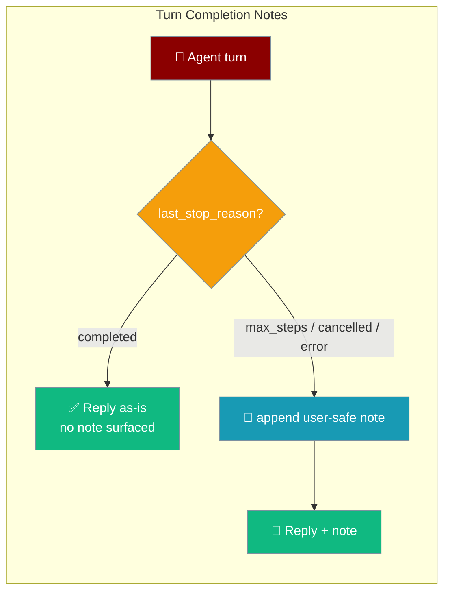
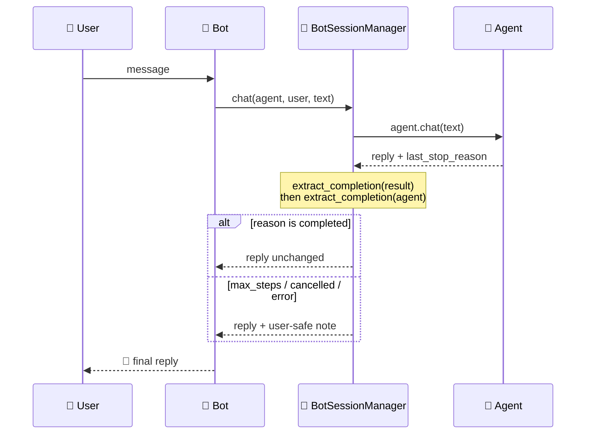

Surface *why* a bot turn ended — so a chat user reads "I stopped at the step limit" instead of a silently truncated reply.



Off by default — clean completions and existing deployments are byte-for-byte unchanged.

## Quick Start

<Steps>
<Step title="Turn the note on">
Pass `surface_completion_reason=True` to the session manager. A turn that stops early appends a note to the reply.

```python
from praisonaiagents import Agent
from praisonai_bot.bots._session import BotSessionManager

agent = Agent(
    name="assistant",
    instructions="Help users with their questions.",
    max_steps=5,   # keep it low so max_steps notes are easy to see
)

session = BotSessionManager(
    platform="telegram",
    surface_completion_reason=True,
)

import asyncio
reply = asyncio.run(session.chat(agent, "u1", "do a big task"))
print(reply)  # includes: ⏳ I stopped after reaching the step limit — reply "continue" to carry on.
```

A truncated turn now ends with `⏳ I stopped after reaching the step limit — reply "continue" to carry on.`
</Step>

<Step title="Emit a custom TurnCompletion yourself">
Return an `AgentReply` with your own `TurnCompletion` when the agent already knows why it stopped.

```python
from praisonaiagents import Agent
from praisonaiagents.bots import AgentReply, TurnCompletion

class MyAgent(Agent):
    def chat(self, prompt):
        if self.not_enough_context(prompt):
            return AgentReply(
                text="Here's what I have so far.",
                completion=TurnCompletion(
                    reason="max_steps",
                    detail="I ran out of steps mid-lookup — send `continue` to keep going.",
                ),
            )
        return AgentReply(text="Full answer.")
```

`detail` overrides the default note verbatim — it's already user-safe, no template applied.
</Step>
</Steps>

---

## How It Works

The gateway reads the turn's completion after each reply and appends a note only when the turn stopped early *and* the flag is on.



| Step | What happens |
|------|-------------|
| **Extract** | `extract_completion(result)` prefers an `AgentReply.completion`; falls back to `agent.last_stop_reason` |
| **Gate** | Note is appended only when `surface_completion_reason=True` |
| **Skip clean turns** | `completed` (and `""`) surface no note |
| **Append** | Early stops append `TurnCompletion.note()` to the reply text |

---

## Configuration Options

| Option | Where | Type | Default | Description |
|--------|-------|------|---------|-------------|
| `surface_completion_reason` | `BotSessionManager(...)` | `bool` | `False` | Opt-in gate. When `True`, a turn that stops early appends a note to the reply. |
| `AgentReply.completion` | Agent reply object | `TurnCompletion \| None` | `None` | The agent's own completion; when set, `extract_completion` prefers it over the agent's `last_stop_reason`. |
| `TurnCompletion.detail` | On the `TurnCompletion` | `str` | `""` | Overrides the default note verbatim. |

<Note>
`surface_completion_reason` is a parameter on `BotSessionManager` — there is no `BotConfig` field for it today, and `build_session_manager` does not forward it. Construct the session manager directly, or use the raw helpers below in a custom reply path.
</Note>

### Completion reason vocabulary

The reasons mirror `Agent.last_stop_reason` and the built-in `_COMPLETION_NOTES` map.

| `reason` | User-facing note (default) | Meaning |
|----------|----------------------------|---------|
| `completed` | *(none — no note surfaced)* | Turn finished cleanly |
| `max_steps` | `⏳ I stopped after reaching the step limit — reply "continue" to carry on.` | Hit `ExecutionConfig.max_steps` |
| `cancelled` | `🛑 This turn was interrupted before it finished — send it again to retry.` | Turn was cancelled |
| `error` | `⚠️ This turn ended early due to an error — please try again.` | Turn ended on an exception |
| *(any other string)* | `⏳ This turn ended early — please try again.` | Forward-compat fallback for future reasons |

`.truncated` is `True` for anything not in `{"completed", ""}`.

---

## The TurnCompletion Contract

`TurnCompletion` wraps the coarse stop reason into a portable value the reply path can render.

| Field / method | Type | Behaviour |
|----------------|------|-----------|
| `reason` | `str` | Stop reason (`completed` default); unknown values tolerated |
| `detail` | `str` | Optional user-safe override of the default note |
| `truncated` | `bool` (property) | `True` for any reason outside `{"completed", ""}` |
| `note()` | `str` | Concise user note, or `""` for a clean completion; returns `detail` when set |
| `to_dict()` / `from_dict()` | `dict` | Round-trip serialisation across a network hop |

```python
from praisonaiagents.bots import TurnCompletion

c = TurnCompletion(reason="max_steps")
c.truncated          # True
c.note()             # ⏳ I stopped after reaching the step limit — reply "continue" to carry on.

TurnCompletion.from_dict(c.to_dict()).reason   # "max_steps"
```

---

## Gateway Integration

Operators wiring a custom reply path use the two raw helpers directly.

```python
from praisonaiagents.bots import extract_completion, append_completion_note

completion = extract_completion(result) or extract_completion(agent)   # falls back to agent.last_stop_reason
text_to_send = append_completion_note(text, completion, enabled=True)
```

`extract_completion` checks, in order:

1. `AgentReply.completion` if the result is an `AgentReply`.
2. `dict["completion"]` if the result is a serialised dict.
3. `result.completion` attribute on any object.
4. `result.last_stop_reason` string on any object (the plain-text-agent fallback).
5. `None`.

`append_completion_note` returns the text untouched when `enabled=False`, when there is no completion, or when the turn completed cleanly — so turning it on only affects truncated turns.

---

## Common Patterns

### Turn on notes for early stops on public bots

One flag on the session manager, matching the Quick Start.

```python
session = BotSessionManager(platform="telegram", surface_completion_reason=True)
```

### Return an AgentReply with a custom detail

For agent code that already knows *why* it's stopping.

```python
from praisonaiagents.bots import AgentReply, TurnCompletion

return AgentReply(
    text="Partial result.",
    completion=TurnCompletion(reason="cancelled", detail="You interrupted me — resend to retry."),
)
```

### Serialise across a network hop

Round-trip via `to_dict()` / `from_dict()` on both `TurnCompletion` and `AgentReply`.

```python
from praisonaiagents.bots import AgentReply, TurnCompletion

wire = AgentReply(text="hi", completion=TurnCompletion(reason="error")).to_dict()
restored = AgentReply.from_dict(wire)
restored.completion.reason   # "error"
```

---

## Best Practices

<AccordionGroup>
<Accordion title="Keep the flag off unless you want early-stop notes">
Clean completions never surface a note, so turning `surface_completion_reason` on only affects truncated turns. Leave it off for bots where a silent reply is fine.
</Accordion>

<Accordion title="Prefer TurnCompletion.detail over rewriting the default note">
`detail` is user-safe, agent-authored, and localisable per turn. Set it when the agent knows the specific reason instead of relying on the generic default.

```python
TurnCompletion(reason="max_steps", detail="Ran out of steps mid-search — send `continue`.")
```
</Accordion>

<Accordion title="Combine with a low max_steps for debugging">
Set `max_steps=5` so `⏳ step limit` notes surface fast while you tune step budgets.

```python
Agent(name="debug", instructions="...", max_steps=5)
```
</Accordion>

<Accordion title="Emit cancelled yourself when a user interrupts">
The gateway's default `cancelled` note is generic — set your own `detail` to replace it.

```python
TurnCompletion(reason="cancelled", detail="Stopped on your request — resend to retry.")
```
</Accordion>
</AccordionGroup>

---

## Related

<CardGroup cols={2}>
<Card title="Messaging Bots" icon="robot" href="/docs/features/messaging-bots">
  All supported platforms: Telegram, Discord, Slack, WhatsApp
</Card>
<Card title="Max Steps" icon="list-check" href="/docs/features/max-steps">
  Bound how many steps an agent turn may take
</Card>
<Card title="Error Handling" icon="triangle-alert" href="/docs/features/error-handling">
  Retries, fallbacks, and graceful failure
</Card>
<Card title="Bot Streaming Replies" icon="message-pen" href="/docs/features/bot-streaming-replies">
  Live streaming responses for Telegram, Slack, and Discord
</Card>
</CardGroup>
