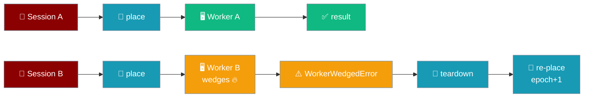
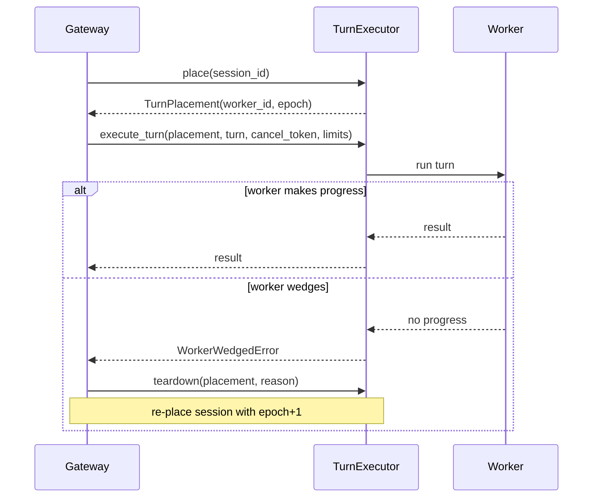

The turn executor decides *where* a session's agent turn runs, so a wedged, runaway, or crashed turn is contained to its own worker instead of taking down every session on the gateway.



## Quick Start

<Steps>

<Step title="Default — every turn runs on the current loop, no config">

The gateway uses `InProcessTurnExecutor` when nothing is set, so every turn runs on the current event loop exactly as today.

```python
from praisonaiagents.gateway import InProcessTurnExecutor, TurnPlacement

executor = InProcessTurnExecutor()

async def run_a_turn():
    placement = await executor.place("session-alice")

    async def turn():
        return "hello"

    return await executor.execute_turn(placement, turn)
```

</Step>

<Step title="Isolate a bad session's turn on its own worker">

Select an isolated executor from a wrapper package (subprocess / container / remote) when you need blast-radius containment. Core ships only the seam and the safe in-process default — the wrapper ships concrete isolated executors.

```python
from praisonaiagents.gateway import TurnExecutorProtocol, TurnPlacement

class MyIsolatedExecutor:  # user code — lives in your wrapper, not core
    async def place(self, session_id: str) -> TurnPlacement:
        worker_id = await self._spawn_worker(session_id)
        return TurnPlacement(session_id=session_id, worker_id=worker_id, epoch=0)

    async def execute_turn(self, placement, turn, *, cancel_token=None, limits=None):
        return await self._await_worker_result(placement, turn, cancel_token, limits)

    async def teardown(self, placement, *, reason: str) -> None:
        await self._kill_worker(placement.worker_id)

assert isinstance(MyIsolatedExecutor(), TurnExecutorProtocol)  # runtime-checkable
```

</Step>

</Steps>

---

## How It Works

The gateway asks the executor to `place` a session, runs the turn on that placement, and tears the placement down only when its worker wedges — never the whole process.



| Piece | Owner | Role |
|---|---|---|
| `TurnExecutorProtocol` | Core (pure) | Async `place` / `execute_turn` / `teardown` contract for *where* a turn runs |
| `TurnPlacement` | Core (pure) | Frozen handle: which worker owns a session's turns, and at what `epoch` |
| `InProcessTurnExecutor` | Core (pure) | Default — runs each turn on the current loop, byte-for-byte compatible |
| `WorkerWedgedError` | Core (pure) | Scoped fault signal — tear down this placement, re-place the session |

`InProcessTurnExecutor` is the default and reproduces today's on-loop behaviour exactly: leaving the executor unset changes nothing and adds no dependency.

---

## The Contract

`TurnExecutorProtocol` is a runtime-checkable protocol with three async methods.

| Method | Signature | Does |
|---|---|---|
| `place` | `place(session_id: str) -> TurnPlacement` | Returns the placement that owns this session's turns; may bump `epoch` when the worker is replaced |
| `execute_turn` | `execute_turn(placement, turn, *, cancel_token=None, limits=None) -> Any` | Runs `turn` on `placement` and returns its result; raises `WorkerWedgedError` if the worker can't make progress |
| `teardown` | `teardown(placement, *, reason: str) -> None` | Reclaims the placement's worker, scoped to the owning session only |

`TurnPlacement` is a frozen dataclass — mutating any field raises `dataclasses.FrozenInstanceError`.

| Field | Type | Default | Description |
|---|---|---|---|
| `session_id` | `str` | — | The resolved session whose turns this placement serves |
| `worker_id` | `str` | — | Opaque id of the worker that owns the session's turns; a constant (`"inprocess"`) for the in-process default |
| `epoch` | `int` | `0` | Monotonic generation bumped when the backing worker is replaced — the fencing token; a turn carrying a stale epoch must not run |

`WorkerWedgedError` is a plain `Exception` subclass. It is **scoped**: the gateway tears down only the offending placement and re-places its session — never a process-wide `os._exit`. Ordinary turn errors surface as the turn's own exception and do not condemn the worker.

<Note>
An isolated executor does **not** ship the live `turn` callable (and its captured loop/agent state) across a process boundary. The worker owns the session via `place()` and rebuilds the turn from serialisable inputs on its own side; the passed `turn` is the gateway-side await point for the worker's result.
</Note>

---

## Configuration Options

The seam is a typed contract, not a config block. Reach for these SDK references for the full surface.

<CardGroup cols={2}>
<Card icon="code" href="/sdk/reference/praisonaiagents/classes/TurnExecutorProtocol">
  `TurnExecutorProtocol` — auto-generated SDK reference.
</Card>
<Card icon="code" href="/sdk/reference/praisonaiagents/classes/TurnPlacement">
  `TurnPlacement` — auto-generated SDK reference.
</Card>
<Card icon="code" href="/sdk/reference/praisonaiagents/classes/InProcessTurnExecutor">
  `InProcessTurnExecutor` — auto-generated SDK reference.
</Card>
<Card icon="code" href="/sdk/reference/praisonaiagents/classes/WorkerWedgedError">
  `WorkerWedgedError` — auto-generated SDK reference.
</Card>
</CardGroup>

<Note>
`limits` on `execute_turn` is a typed `Any` today, accepted for protocol symmetry. It is inert in-process and honoured only by isolated executors — there is no `limits=` config class in core.
</Note>

---

## Common Patterns

Three shapes cover almost every use.

```python
# 1. Default — no code needed. Leaving the executor unset runs turns on the
#    current loop exactly as today, byte-for-byte backward compatible.
from praisonaiagents.gateway import InProcessTurnExecutor

executor = InProcessTurnExecutor()
```

```python
# 2. A wrapper's isolated executor (sketch — user code, not shipped by core).
from praisonaiagents.gateway import TurnPlacement

class SubprocessTurnExecutor:  # illustrative — your wrapper implements this
    async def place(self, session_id: str) -> TurnPlacement:
        worker_id = await self._spawn(session_id)
        return TurnPlacement(session_id=session_id, worker_id=worker_id, epoch=0)

    async def execute_turn(self, placement, turn, *, cancel_token=None, limits=None):
        return await self._dispatch(placement, cancel_token, limits)

    async def teardown(self, placement, *, reason: str) -> None:
        await self._kill(placement.worker_id)
```

```python
# 3. Handle a wedged worker — tear down, then re-place with a bumped epoch.
from praisonaiagents.gateway import WorkerWedgedError, TurnPlacement

async def run_with_recovery(executor, session_id, turn):
    placement = await executor.place(session_id)
    try:
        return await executor.execute_turn(placement, turn)
    except WorkerWedgedError:
        await executor.teardown(placement, reason="wedged")
        fresh = await executor.place(session_id)  # new worker, epoch+1
        return await executor.execute_turn(fresh, turn)
```

---

## Best Practices

<AccordionGroup>

<Accordion title="Fence with epoch, always">
`epoch` is the fencing token. Bump it whenever a session's worker is replaced, and refuse any turn carrying a stale epoch — that is what stops a reclaimed worker from executing against a session it no longer owns.
</Accordion>

<Accordion title="Keep teardown scoped to one session">
`teardown` reclaims a single placement's worker. A worker fault must fail scoped: tear down the offending placement and re-place its session, never the whole gateway. That is the whole point of the seam versus a process-wide `os._exit`.
</Accordion>

<Accordion title="Reach for isolation only when you need blast-radius containment">
The in-process default is zero-cost and dependency-free but offers no isolation — a turn that wedges the loop still affects the process. Switch to an isolated executor (subprocess / container / remote) when one bad session must not degrade the rest.
</Accordion>

<Accordion title="Never cross a boundary with a live callable">
An isolated worker owns the session via `place()` and rebuilds the turn from serialisable inputs on its own side. Do not try to send the live `turn` callable across a process boundary — treat it as the gateway-side await point for the worker's result.
</Accordion>

</AccordionGroup>

---

## Related

<CardGroup cols={2}>
<Card title="Gateway Turn Lock" icon="lock" href="/features/gateway-turn-lock">
  Sibling primitive — serialises turns per session across replicas.
</Card>
<Card title="Gateway Loop Watchdog" icon="heart-pulse" href="/features/gateway-loop-watchdog">
  Detects a wedged event loop.
</Card>
</CardGroup>
