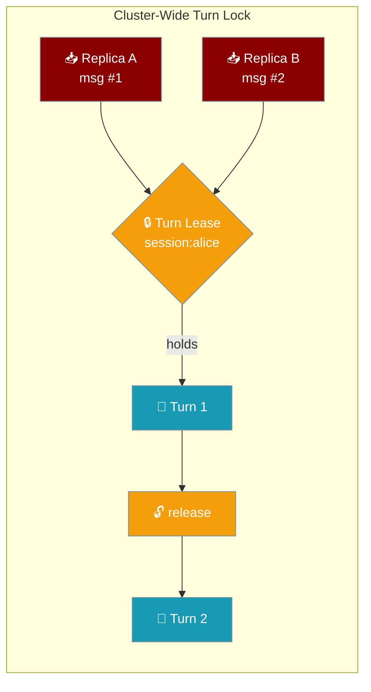
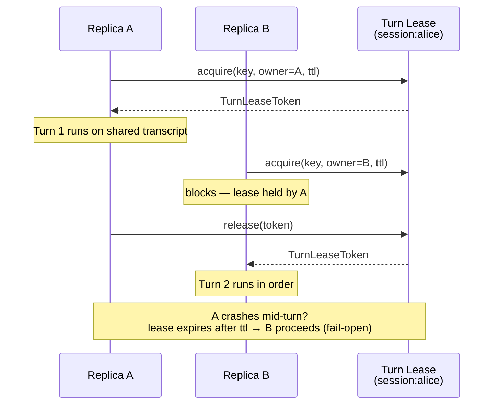
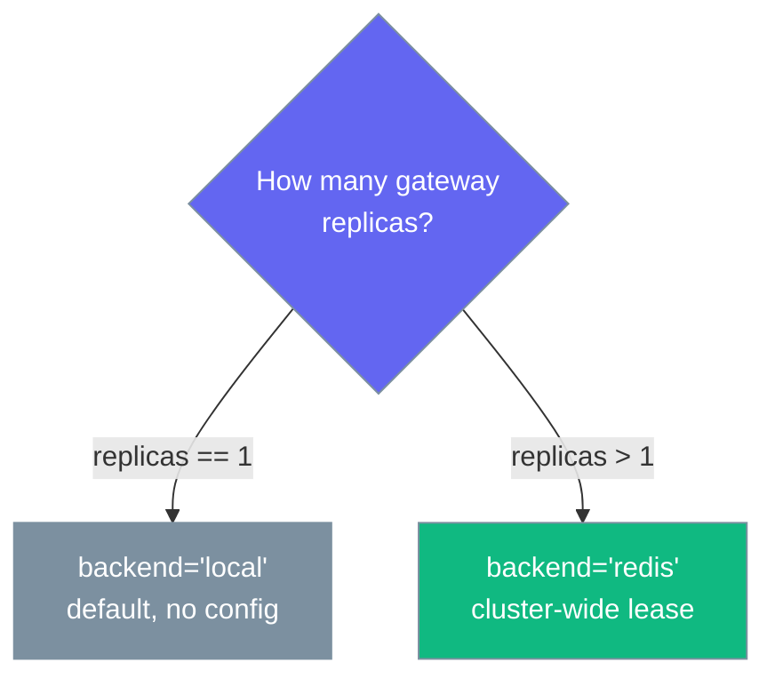

The turn lock keeps only one turn running against a session at a time, and its `redis` backend extends that guarantee across every replica.



## Quick Start

<Steps>

<Step title="Single replica — already correct, no config">

One gateway process serialises turns with the in-process default. Nothing to set.

```python
from praisonaiagents import Agent
from praisonai_bot.gateway import WebSocketGateway

agent = Agent(name="Support", instructions="Help users")
WebSocketGateway(agent=agent).start()   # turn_lock backend defaults to "local"
```

</Step>

<Step title="Multiple replicas — switch the backend to redis">

Scaling to `replicas > 1` needs a distributed lease so two pods can't run one session's turns at once.

```python
from praisonaiagents import Agent
from praisonaiagents.gateway import GatewayConfig, TurnLockConfig
from praisonai_bot.gateway import WebSocketGateway

agent = Agent(name="Support", instructions="Help users")

gateway = WebSocketGateway(
    agent=agent,
    config=GatewayConfig(
        turn_lock=TurnLockConfig(backend="redis", ttl=60.0),
    ),
)
gateway.start()
```

</Step>

<Step title="Or configure it in gateway.yaml">

```yaml
gateway:
  turn_lock:
    backend: redis   # local | redis
    ttl: 60          # lease TTL in seconds
    # url: redis://...   # optional; falls back to gateway's RedisConfig
```

</Step>

</Steps>

---

## How It Works

The gateway holds a lease keyed on the resolved session id for the whole turn; a second replica blocks until the first releases, and a crashed holder's lease expires after `ttl` so a healthy session is never wedged.



| Piece | Owner | Role |
|---|---|---|
| `TurnLockConfig` | Core config | Selects `local` or `redis`; wired as `turn_lock=…` |
| `TurnLockProtocol` | Core (pure) | Async `acquire` / `release` / `hold` contract |
| `LocalTurnLock` | Core (pure) | In-process default — today's `asyncio.Lock`, byte-for-byte |
| `TurnLeaseToken` | Core (pure) | Opaque `key` / `owner` / `expires_at` handle for identity-checked release |

Release is identity-checked and idempotent: only the exact token handed out may release the lease, so a stale token never frees another owner's turn.

---

## Configuration Options

`TurnLockConfig` from `praisonaiagents/gateway/config.py`.

| Option | Type | Default | Description |
|---|---|---|---|
| `backend` | `str` | `"local"` | `"local"` (in-process `asyncio.Lock`) or `"redis"` (distributed lease, cluster-wide serialisation). Any other value raises `ValueError`. |
| `ttl` | `float` | `60.0` | Lease TTL in seconds for a distributed backend — how long a crashed holder's lease survives before it is reclaimable. Inert for `"local"`. Rejects `<= 0` and `NaN`. |
| `url` | `Optional[str]` | `None` | Optional Redis URL for the `"redis"` backend. When omitted the distributed lock reuses the gateway's configured `RedisConfig`. Redacted (`"***"`) in `to_dict()`. |

The `enabled` property returns `True` only when a distributed backend is selected (`backend != "local"`).

<Card icon="code" href="/sdk/reference/praisonaiagents/modules/feature_configs">
  Full field, type, and default reference for `TurnLockConfig`, `TurnLockProtocol`, `LocalTurnLock`, and `TurnLeaseToken`
</Card>

---

## When to Enable

Match the backend to your replica count.



---

## Backward Compatibility

`local` is the default and reproduces today's in-process `asyncio.Lock` byte-for-byte — single-replica deployments are unchanged and the core protocol adds no new dependency.

---

## Best Practices

<AccordionGroup>

<Accordion title="Size ttl to outlast your slowest turn">
The lease must survive the longest legitimate turn, or a slow turn's lease expires and a second replica starts a concurrent turn. Keep it short enough that a crashed replica unblocks quickly — the default `60.0` suits most turns.
</Accordion>

<Accordion title="Reuse the gateway's RedisConfig unless you need a separate store">
Leave `url` unset and the distributed lock reuses the gateway's configured `RedisConfig`. Set `url` only when the lock lives on a different Redis than push/delivery.
</Accordion>

<Accordion title="Monitor lease expiries">
A lease that expires mid-turn means `ttl` is too short for real traffic. Watch for expiry-then-reacquire on the same session and raise `ttl` if you see it.
</Accordion>

<Accordion title="Enable it before you scale, not after">
Flip `backend='redis'` before raising `replicaCount`. Scaling first leaves a window where two pods run concurrent turns on one session.
</Accordion>

</AccordionGroup>

---

## Related

<CardGroup cols={2}>
<Card title="Cross-Platform Sessions" icon="users" href="/features/cross-platform-mirror">
  The in-process turn lock this extends across replicas.
</Card>
<Card title="Helm Chart (Gateway)" icon="ship" href="/features/helm-chart-gateway">
  Scale the gateway on Kubernetes with `replicaCount`.
</Card>
<Card title="Gateway Admission Control" icon="gauge-high" href="/features/gateway-admission-control">
  Sibling robustness knob — concurrency ceiling and backpressure.
</Card>
<Card title="Gateway Liveness" icon="heart-pulse" href="/features/gateway-liveness">
  Sibling robustness knob — reap half-open connections.
</Card>
<Card title="Gateway Turn Executor" icon="shield" href="/features/gateway-turn-executor">
  Sibling robustness knob — place a session's turn on its own worker.
</Card>
</CardGroup>
