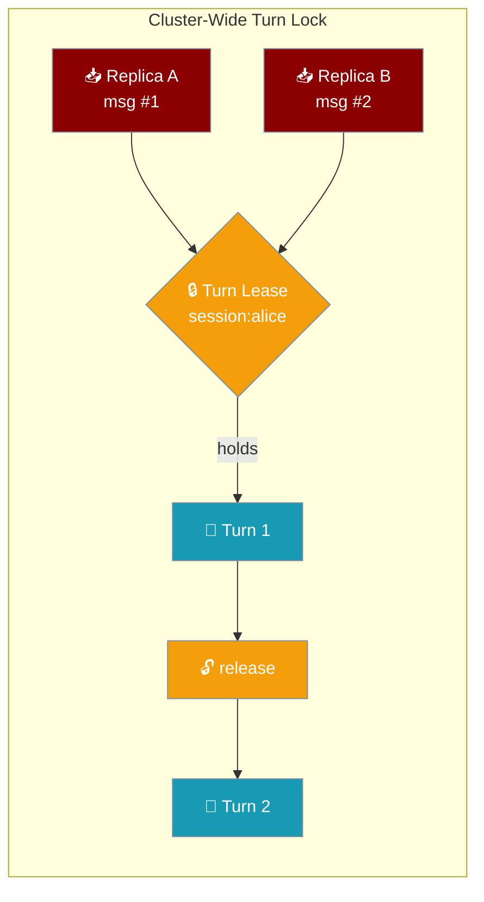
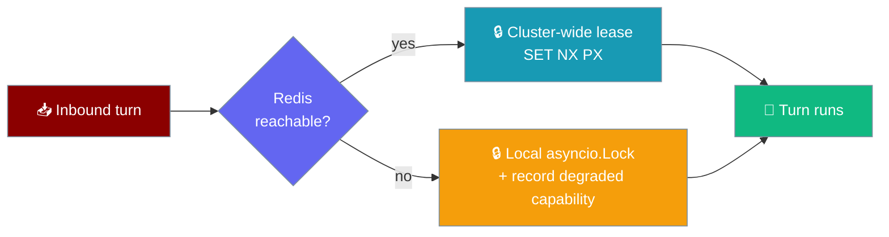
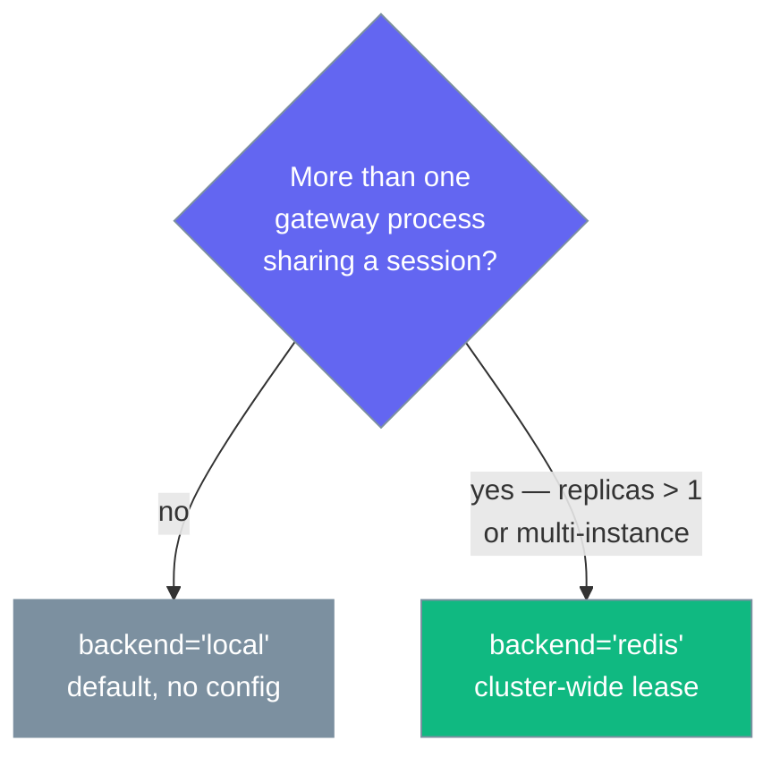

The turn lock keeps only one turn running against a session at a time, and its `redis` backend extends that guarantee across every replica.



## Quick Start

The `redis` backend needs the async Redis client:

```bash
pip install "praisonai-bot[redis]"   # or: pip install redis
```

<Steps>

<Step title="Single replica — already correct, no config">

One gateway process serialises turns with the in-process default. Nothing to set.

```python
from praisonaiagents import Agent
from praisonai_bot.gateway import WebSocketGateway

agent = Agent(name="Support", instructions="Help users")
WebSocketGateway(agent=agent).start()   # turn_lock backend defaults to "local"
```

</Step>

<Step title="Multiple replicas — switch the backend to redis">

Two or more gateway processes sharing a session need a distributed lease so two pods can't run one session's turns at once.

```python
from praisonaiagents import Agent
from praisonaiagents.gateway import GatewayConfig, TurnLockConfig
from praisonai_bot.gateway import WebSocketGateway

agent = Agent(name="Support", instructions="Help users")

gateway = WebSocketGateway(
    agent=agent,
    config=GatewayConfig(
        turn_lock=TurnLockConfig(backend="redis", ttl=60.0),
    ),
)
gateway.start()
```

</Step>

<Step title="Or configure it in gateway.yaml">

```yaml
gateway:
  turn_lock:
    backend: redis   # local | redis
    ttl: 60          # lease TTL in seconds
    # url: redis://...   # optional; overrides the gateway's RedisConfig
```

</Step>

</Steps>

---

## How It Works

The lock is `LockMap`-compatible: one `.get(session_id)` call returns an async context manager that holds a cluster-wide lease for the whole `async with` block, and a crashed holder's lease expires after `ttl` so a healthy session is never wedged.

```mermaid
sequenceDiagram
    participant A as Replica A
    participant B as Replica B
    participant Redis as Redis<br/>(lease: session:alice)

    A->>Redis: SET NX PX (owner=A, ttl)
    Redis-->>A: OK — lease acquired
    Note over A: Turn 1 runs; lease renews at ~ttl/3
    B->>Redis: SET NX PX (owner=B, ttl)
    Redis-->>B: nil — held by A (polls until free)
    A->>Redis: compare-and-del(owner=A)
    Redis-->>A: released
    B->>Redis: SET NX PX (owner=B, ttl)
    Redis-->>B: OK — lease acquired
    Note over B: Turn 2 runs in order

    Note over A,Redis: A crashes mid-turn?<br/>renewal stops → lease expires after ttl → B proceeds (fail-open)
```

| Piece | Owner | Role |
|---|---|---|
| `TurnLockConfig` | Core (`praisonaiagents.gateway`) | Selects `local` or `redis`; wired as `turn_lock=…` on `GatewayConfig` |
| `build_turn_lock` | Wrapper (`praisonai_bot.bots._redis_turn_lock`) | Factory that picks the backend from `TurnLockConfig` + the gateway's `RedisConfig`; fails **open** to a local lock (and records a degraded entry) if Redis is unreachable |
| `RedisTurnLock` | Wrapper (`praisonai_bot.bots._redis_turn_lock`) | Distributed, `LockMap`-compatible lock — `.get(key)` returns an async context manager holding a cluster-wide lease keyed on the resolved session id. Auto-renews at ~`ttl/3`; releases with an owner-checked compare-and-del |
| `LockMap` (default) | Wrapper (`praisonai_bot._lockmap`) | In-process default — today's `asyncio.Lock`, byte-for-byte |

Release is owner-checked and idempotent: only the exact owner token that claimed the lease may release it, so an expired or reclaimed lease is a harmless no-op, never another replica's lease.

---

## Fail-open on Redis outage

A live turn is never blocked by Redis being down — the lock degrades to a local `asyncio.Lock` for that turn and records a degraded capability you find later.



<Warning>
A live turn is never blocked by Redis being down; you find out via `praisonai gateway doctor`.
</Warning>

While degraded, turns serialise per-process only (cross-replica ordering pauses until Redis recovers). The lock records a degraded capability entry (`owner_kind="capability"`, `owner_id="turn_lock:redis"`) and clears it automatically on the first successful reconnect.

---

## Health & observability

The fail-open behaviour surfaces through the same tools that report every other degraded gateway capability.

- `praisonai gateway doctor` — lists the `capability` / `turn_lock:redis` degraded owner with a redacted reason.
- Gateway `health()` / `/health` — the same degraded entry, machine-readable.
- Logs — a `WARNING: Distributed turn lock degraded to local-only (Redis unavailable): …` on the first outage.

<CardGroup cols={2}>
<Card title="Extensible Doctor" icon="plug" href="/features/extensible-doctor">
  How `praisonai gateway doctor` reports degraded capabilities.
</Card>
<Card title="Gateway Liveness" icon="heart-pulse" href="/features/gateway-liveness">
  Companion health signal — reap half-open connections.
</Card>
</CardGroup>

---

## Configuration Options

`TurnLockConfig` from `praisonaiagents/gateway/config.py`.

| Option | Type | Default | Description |
|---|---|---|---|
| `backend` | `str` | `"local"` | `"local"` (in-process `asyncio.Lock`) or `"redis"` (distributed lease, cluster-wide serialisation). Any other value raises `ValueError`. |
| `ttl` | `float` | `60.0` | Lease TTL in seconds for the `"redis"` backend — how long a crashed holder's lease survives before it is reclaimable. The lease auto-renews at ~`ttl/3` while a turn runs. Inert for `"local"`. Rejects `<= 0`. |
| `url` | `Optional[str]` | `None` | Optional Redis URL for the `"redis"` backend. When set, overrides `RedisConfig`; when omitted, reuses the gateway's `RedisConfig`. Redacted (`"***"`) in `to_dict()`. |

The `enabled` property returns `True` only when a distributed backend is selected (`backend != "local"`).

<Note>
Lease keys are namespaced as `{RedisConfig.prefix}turnlock:{session_id}`, defaulting to `praison:turnlock:` when no prefix is set. Operators sharing one Redis across environments should set distinct `RedisConfig.prefix` values so leases never collide.
</Note>

<CardGroup cols={2}>
<Card title="TurnLockConfig Reference" icon="code" href="/sdk/reference/praisonaiagents/classes/TurnLockConfig">
  Full field, type, and default reference for `TurnLockConfig`.
</Card>
<Card title="GatewayConfig Reference" icon="code" href="/sdk/reference/praisonaiagents/classes/GatewayConfig">
  The parent config that wires `turn_lock` into the gateway.
</Card>
</CardGroup>

---

## When to Enable

Enable `redis` whenever more than one gateway process can share a session — replica count alone decides it.



You need `backend: 'redis'` whenever more than one gateway process shares a session — with **or** without an identity resolver. A single-adapter deployment with `replicas > 1` still wires the distributed backend.

---

## Backward Compatibility

`local` is the default and reproduces today's in-process `asyncio.Lock` byte-for-byte — single-replica deployments are unchanged and add no new dependency.

---

## Best Practices

<AccordionGroup>

<Accordion title="Size ttl to survive one Redis blip; renewal covers long turns">
The lease auto-renews at ~`ttl/3` while a turn runs, so a turn longer than `ttl` never lets another replica claim the same session. Size `ttl` to survive a brief Redis blip, not your slowest turn — the default `60.0` suits most deployments.
</Accordion>

<Accordion title="Reuse the gateway's RedisConfig unless you need a separate store">
Leave `url` unset and the distributed lock reuses the gateway's configured `RedisConfig`. Set `url` only when the lock lives on a different Redis than push/delivery — when both are set, `url` wins.
</Accordion>

<Accordion title="Watch the doctor for a degraded turn lock">
On a Redis outage the lock fails open and records a `turn_lock:redis` degraded capability. Check `praisonai gateway doctor` or `/health` — a persistent entry means cross-replica ordering is paused until Redis recovers.
</Accordion>

<Accordion title="Enable it before you scale, not after">
Flip `backend='redis'` before raising `replicaCount`. Scaling first leaves a window where two pods run concurrent turns on one session.
</Accordion>

</AccordionGroup>

---

## Related

<CardGroup cols={2}>
<Card title="Gateway Durability" icon="database" href="/features/gateway-durability">
  The wider "never lose or double-run a turn" story this fits into.
</Card>
<Card title="Gateway Degraded Channels" icon="triangle-alert" href="/features/gateway-degraded-channels">
  The symmetric fail-open pattern for a degraded delivery channel.
</Card>
<Card title="Cross-Platform Sessions" icon="users" href="/features/cross-platform-mirror">
  The in-process turn lock this extends across replicas.
</Card>
<Card title="Helm Chart (Gateway)" icon="ship" href="/features/helm-chart-gateway">
  Scale the gateway on Kubernetes with `replicaCount`.
</Card>
<Card title="Gateway Admission Control" icon="gauge-high" href="/features/gateway-admission-control">
  Sibling robustness knob — concurrency ceiling and backpressure.
</Card>
<Card title="Gateway Turn Executor" icon="shield" href="/features/gateway-turn-executor">
  Sibling robustness knob — place a session's turn on its own worker.
</Card>
</CardGroup>
