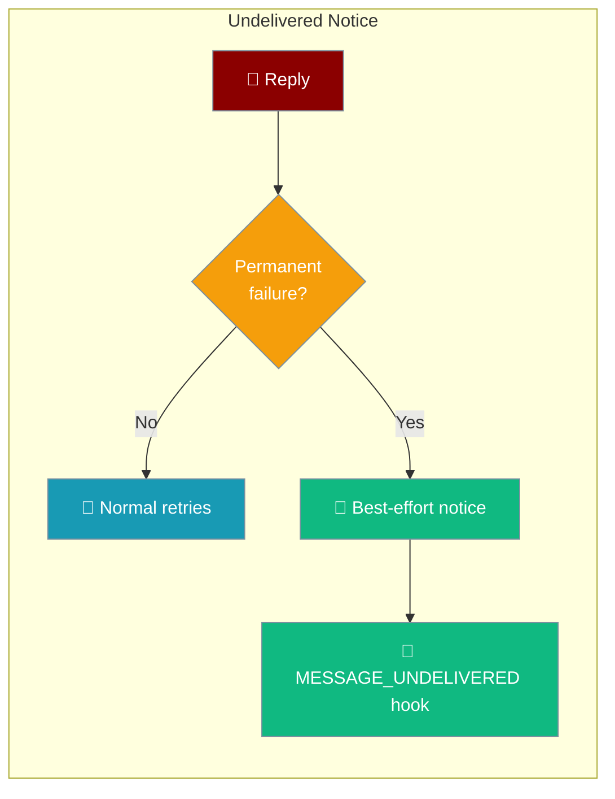
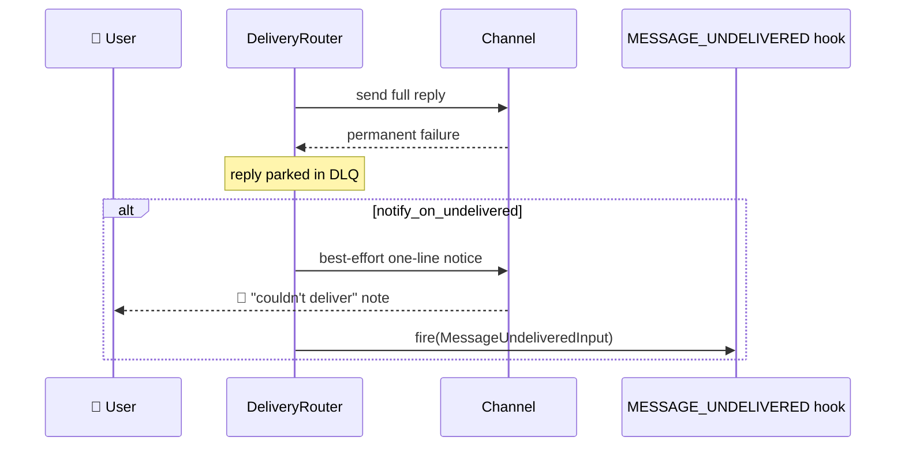

When a gateway reply fails permanently, this sends the user a short "couldn't deliver" notice and fires a `MESSAGE_UNDELIVERED` hook so operators can route the failure.



Off by default — existing deployments are unchanged until you opt in.

## Quick Start

<Steps>
<Step title="Turn the notice on">
Set `notify_on_undelivered: true` in the `gateway:` block of `gateway.yaml`.

```yaml
gateway:
  notify_on_undelivered: true
```

Start the gateway as usual — a permanently-undeliverable reply now sends a one-line notice and fires the hook.

```bash
praisonai gateway start --config gateway.yaml
```
</Step>

<Step title="Customise the notice text">
Add `undelivered_template` to replace the built-in one-line note.

```yaml
gateway:
  notify_on_undelivered: true
  undelivered_template: "⚠️ We processed your request but couldn't deliver the reply — please try again."
```
</Step>
</Steps>

---

## How It Works

The `DeliveryRouter` already parks a permanently-failed reply in the DLQ. With the flag on, it also best-effort sends a short notice on the same channel and fires the hook — both fully guarded so they can never mask the original failure.



A large or rich reply may fail while a one-line note still lands, so the notice is attempted even when the original send did not succeed. Whether the note reached the user is reported to the hook as `notice_delivered`.

---

## Configuration Options

Both keys live under the top-level `gateway:` block.

| Key | Type | Default | Description |
|-----|------|---------|-------------|
| `notify_on_undelivered` | `bool` | `false` | Opt in to the last-resort user notice and the `MESSAGE_UNDELIVERED` hook. |
| `undelivered_template` | `str` | built-in note | The one-line plain-text notice. Kept short so it slips through where the original reply couldn't. |

<Note>
The built-in notice is `⚠️ Your request was processed but the reply couldn't be delivered.` These knobs are read off the gateway config via `getattr` — the CLI path (`start_with_config` / `from_config_file`) stamps them from the validated `gateway:` block, so the opt-in actually reaches the router instead of silently defaulting to OFF.
</Note>

---

## The MESSAGE_UNDELIVERED Hook

The hook fires the moment a reply is confirmed permanently undeliverable, so an operator can mirror, alert, or re-queue it without patching adapters.

```python
from praisonaiagents.hooks import HookRegistry, HookEvent

registry = HookRegistry()

@registry.on(HookEvent.MESSAGE_UNDELIVERED)
def on_undelivered(data):
    # data.platform, data.channel_id, data.content, data.error, data.notice_delivered
    alert_ops(f"Undelivered on {data.platform}:{data.channel_id} — {data.error}")
```

`MessageUndeliveredInput` payload fields:

| Field | Type | Description |
|-------|------|-------------|
| `platform` | `str` | Channel platform (e.g. `telegram`, `slack`) |
| `content` | `str` | The reply that could not be delivered (truncated to 500 chars in `to_dict`) |
| `channel_id` | `str` | Target channel/chat id |
| `error` | `str` | The delivery error that triggered the failure |
| `notice_delivered` | `bool` | Whether the best-effort user notice actually landed |

<Tip>
`HookEvent` and `MessageUndeliveredInput` are exported from `praisonaiagents.hooks`. The hook is a notification only — the reply is already parked in the DLQ, so use it to route or re-queue, not to guarantee delivery.
</Tip>

---

## Common Patterns

### Mirror every undelivered reply to a home channel

```python
from praisonaiagents.hooks import HookRegistry, HookEvent

registry = HookRegistry()

@registry.on(HookEvent.MESSAGE_UNDELIVERED)
def mirror(data):
    send_to_ops_channel(
        f"[{data.platform}] to {data.channel_id} failed: {data.error}\n{data.content}"
    )
```

### Notice on, but no operator hook

Set only `notify_on_undelivered` when you just want the user to hear something and don't yet handle the hook.

```yaml
gateway:
  notify_on_undelivered: true
```

---

## Best Practices

<AccordionGroup>
<Accordion title="Keep it off unless silent loss is a problem">
The default is OFF and byte-for-byte unchanged. Turn it on for user-facing bots where a silently dropped reply would confuse people.
</Accordion>

<Accordion title="Keep the template short">
The notice exists to slip through where a large/rich reply couldn't. A one-line plain-text note is far more likely to land than the original.
</Accordion>

<Accordion title="Use the hook to re-queue, not to retry inline">
The reply is already in the DLQ by the time the hook fires. Route it — mirror, alert, or re-queue — rather than assuming the notice guarantees delivery.
</Accordion>

<Accordion title="Check notice_delivered before you rely on it">
`notice_delivered` tells you whether even the one-line note reached the user. When it's `False`, escalate through the operator channel.
</Accordion>
</AccordionGroup>

---

## Related

<CardGroup cols={2}>
<Card title="Gateway Overview" icon="server" href="/docs/features/gateway-overview">
  Gateway configuration, channels, and multi-bot mode.
</Card>
<Card title="Inbound DLQ" icon="inbox" href="/docs/features/inbound-dlq">
  Where permanently-failed messages are parked.
</Card>
<Card title="Dead Target Registry" icon="ban" href="/docs/features/dead-target-registry">
  Self-healing suppression of confirmed-dead targets.
</Card>
<Card title="Bot Lifecycle Hooks" icon="webhook" href="/docs/features/bot-lifecycle-hooks">
  All gateway/bot lifecycle hook events.
</Card>
</CardGroup>
