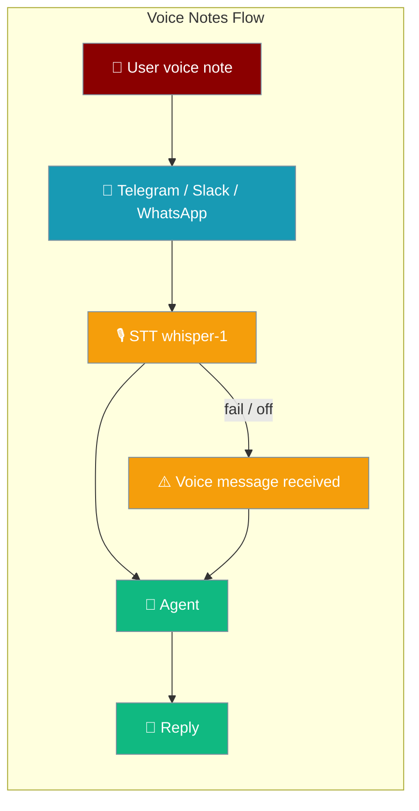
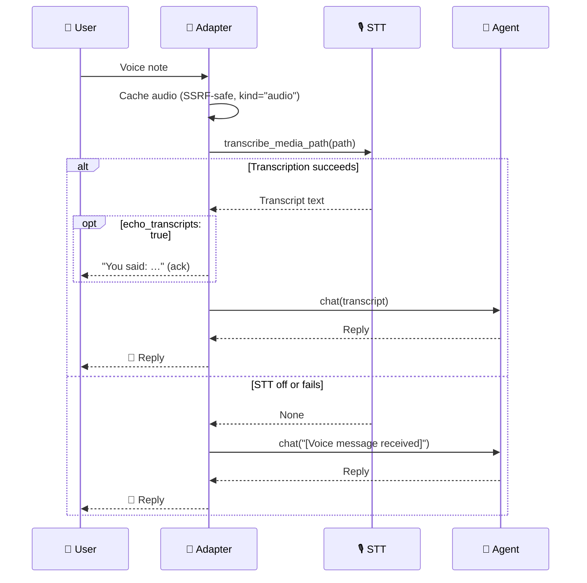
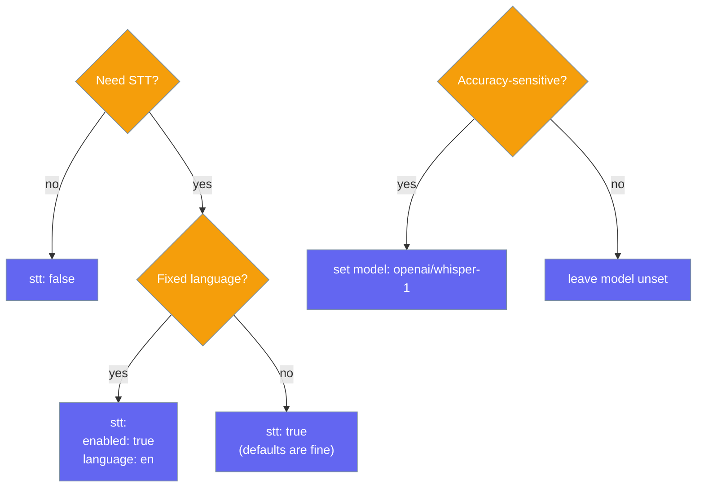

<Note>
Bot platform adapters ship in the `praisonai-bot` package. `praisonai bot serve` still works exactly as documented here; for a standalone install see [praisonai-bot Migration](/docs/guides/praisonai-bot-migration).
</Note>

Voice notes sent to your bot are transcribed and handed to the agent as plain text — on by default, with a visible placeholder when transcription is off or fails.

```python
from praisonaiagents import Agent
from praisonai.bots import TelegramBot

agent = Agent(name="assistant", instructions="Be helpful.")
bot = TelegramBot(token="YOUR_TOKEN", agent=agent)

# STT is on by default — send a voice note to the bot,
# the agent replies to the transcribed text.
import asyncio
asyncio.run(bot.start())
```

The user taps the microphone and sends a voice note; the bot transcribes it with whisper-1 and the agent replies to the recognised text.



## Quick Start

<Steps>
<Step title="Level 1 — Bool shorthand">
STT is on by default. Turn it off per channel with `stt: false`.

```yaml
channels:
  telegram:
    platform: telegram
    token: ${TELEGRAM_BOT_TOKEN}
    stt: true    # default; set false to opt out
```
</Step>

<Step title="Level 2 — Dict">
Tune behaviour with a dict — echo the transcript, force a language, or override the model.

```yaml
channels:
  telegram:
    platform: telegram
    token: ${TELEGRAM_BOT_TOKEN}
    stt:
      enabled: true
      echo_transcripts: true
      language: en
      model: openai/whisper-1
```
</Step>

<Step title="Level 3 — SttConfigSchema">
Build the channel config in Python with the validated schema.

```python
from praisonai_bot.bots._config_schema import (
    ChannelConfigSchema,
    SttConfigSchema,
)

channel = ChannelConfigSchema(
    platform="telegram",
    token="${TELEGRAM_BOT_TOKEN}",
    stt=SttConfigSchema(
        enabled=True,
        echo_transcripts=True,
        language="en",
        model="openai/whisper-1",
    ),
)
```
</Step>
</Steps>

---

## How It Works

The adapter downloads the voice note, transcribes it, and forwards the transcript — never dropping the turn.



| Step | What happens |
|------|-------------|
| **Download** | Adapter caches the audio through the SSRF-safe media cache (`kind="audio"`) |
| **Transcribe** | `transcribe_media_path` calls `stt_tool` → `AudioAgent.transcribe` (whisper-1 by default) |
| **Success** | Transcript passed to `agent.chat(transcript)`; echoed back first when `echo_transcripts: true` |
| **Failure / off** | The `[Voice message received]` placeholder reaches the agent — the turn is never silently dropped |

---

## Configuration Options

Fields from `SttConfigSchema` / `SttConfig`.

| Option | Type | Default | Description |
|--------|------|---------|-------------|
| `enabled` | `bool` | `true` | Transcribe inbound audio. On by default. |
| `echo_transcripts` | `bool` | `false` | Echo the recognised text back to the user. |
| `language` | `str \| None` | `null` | Optional forced language code (`"en"`, `"es"`, …). |
| `model` | `str \| None` | `null` | Optional STT model override (default: `openai/whisper-1`). |

The bare shorthand `stt: true` / `stt: false` is accepted as `{"enabled": <bool>}`.

### Choosing a configuration



---

## Per-Platform YAML

<CodeGroup>
```yaml Telegram
channels:
  telegram:
    platform: telegram
    token: ${TELEGRAM_BOT_TOKEN}
    stt:
      enabled: true
      echo_transcripts: true
      language: en
      model: openai/whisper-1
```

```yaml Slack
channels:
  slack:
    platform: slack
    token: ${SLACK_BOT_TOKEN}
    app_token: ${SLACK_APP_TOKEN}
    stt:
      enabled: true
      language: en
```

```yaml WhatsApp
channels:
  whatsapp:
    platform: whatsapp
    token: ${WHATSAPP_TOKEN}
    stt:
      enabled: true
      echo_transcripts: true
```
</CodeGroup>

---

## When STT Is Off or Fails

Voice notes were previously dropped silently when transcription was unavailable. Now the adapter substitutes the `[Voice message received]` placeholder so the agent always gets the turn — it can ask the user to retype, fall back to another channel, or acknowledge the message.

```
User: [voice note]  (STT disabled)
Agent: receives "[Voice message received]" and can reply
       "I got your voice note but can't transcribe it here —
        could you type it out?"
```

See fixed issue [#2721](https://github.com/MervinPraison/PraisonAI/issues/2721) for context.

---

## Best Practices

<AccordionGroup>
<Accordion title="Set language when you know it">
Forcing `language: en` (or the relevant code) improves transcription accuracy and speed over auto-detection.

```yaml
stt:
  enabled: true
  language: en
```
</Accordion>

<Accordion title="Enable echo_transcripts for accessibility">
`echo_transcripts: true` sends the recognised text back to the user so they can confirm what the bot heard — helpful for accessibility and correcting mis-hearings.

```yaml
stt:
  enabled: true
  echo_transcripts: true
```
</Accordion>

<Accordion title="Opt out on privacy-sensitive channels">
Turn STT off where voice content must not leave the device or reach a third-party STT provider.

```yaml
stt:
  enabled: false
```
</Accordion>

<Accordion title="Ship a fallback plan">
The `[Voice message received]` placeholder means the agent still gets the turn when transcription is off or fails. Give the agent instructions to handle that case gracefully.

```python
agent = Agent(
    name="assistant",
    instructions="If a voice note can't be transcribed, ask the user to type it.",
)
```
</Accordion>
</AccordionGroup>

---

## Related

<CardGroup cols={2}>
<Card title="Inbound Media" icon="image" href="/docs/features/bot-inbound-media">
  Forward user photos and documents to your agent's vision capability
</Card>
<Card title="Audio Tools" icon="microphone" href="/docs/features/audio-tools">
  `stt_tool`, `tts_tool`, and `AudioAgent.transcribe`
</Card>
<Card title="Chat Commands" icon="terminal" href="/docs/features/bot-commands">
  Built-in and custom bot chat commands
</Card>
<Card title="Gateway" icon="gateway" href="/docs/gateway">
  Unified gateway and control-plane overview
</Card>
</CardGroup>
