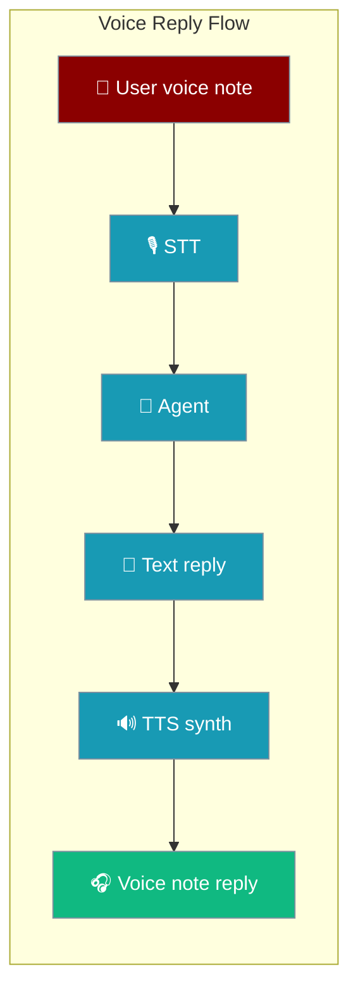
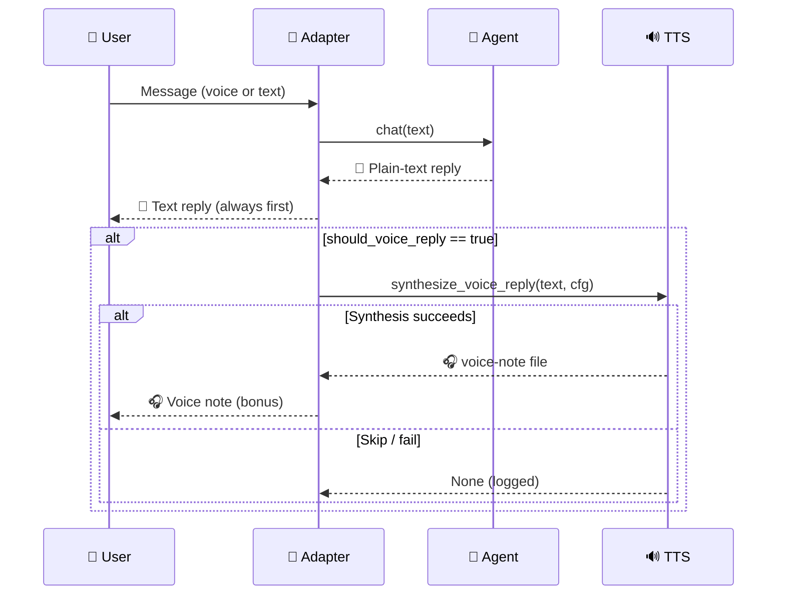
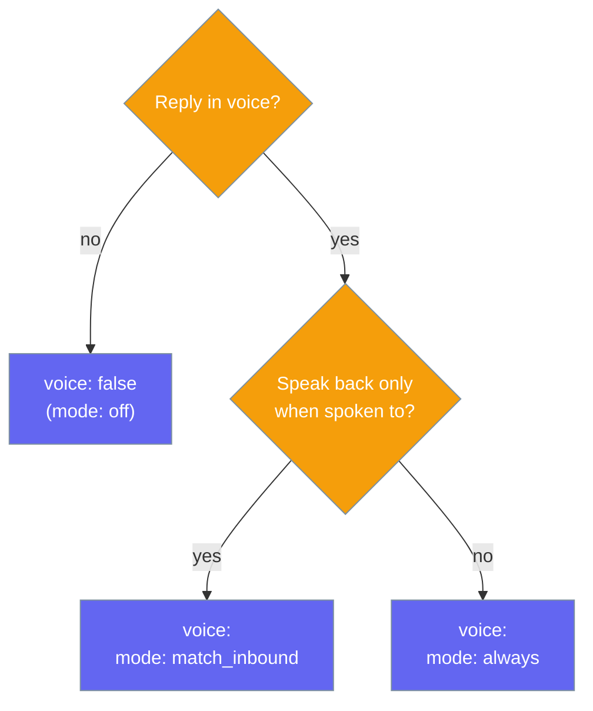

Speak the agent's plain-text reply back as a native voice note — the outbound counterpart to inbound speech-to-text, off by default and opt-in per channel.

```python
from praisonaiagents import Agent

# 1. Author the agent exactly as before — voice is a transport concern.
agent = Agent(
    name="assistant",
    instructions="Be helpful and concise.",
)

# 2. Enable voice replies on your Telegram channel in gateway.yaml:
#
#    channels:
#      telegram:
#        platform: telegram
#        token: ${TELEGRAM_BOT_TOKEN}
#        stt:   true                    # user speaks in
#        voice: { mode: match_inbound } # bot speaks back when they do
#
# 3. Send a voice note to the bot on Telegram — you get a spoken reply.
#    Send a text message — you get a text reply.
```

One YAML line closes the voice loop — the bot listens **and** speaks.



<Note>
Voice reply mirrors inbound [Voice Notes (Speech-to-Text)](/features/gateway-stt), but it is **off by default**. Set `voice.mode: match_inbound` for the intuitive "speak in / speak out" symmetry.
</Note>

## Quick Start

<Steps>
<Step title="Level 1 — Bool shorthand">
`voice: true` turns replies into voice notes for every message (`mode: always`).

```yaml
channels:
  telegram:
    platform: telegram
    token: ${TELEGRAM_BOT_TOKEN}
    voice: true    # every reply is also spoken
```
</Step>

<Step title="Level 2 — Mode shorthand">
A bare `mode` implies `enabled: true`. Use `match_inbound` to speak back only when the user sent a voice memo.

```yaml
channels:
  telegram:
    platform: telegram
    token: ${TELEGRAM_BOT_TOKEN}
    voice:
      mode: match_inbound    # speak back only when spoken to
```
</Step>

<Step title="Level 3 — Dict">
Tune the voice, model, speed, format, and length cap.

```yaml
channels:
  telegram:
    platform: telegram
    token: ${TELEGRAM_BOT_TOKEN}
    voice:
      enabled: true
      mode: match_inbound
      model: openai/tts-1
      voice: nova
      speed: 1.0
      format: ogg
      max_chars: 4000
```
</Step>

<Step title="Level 4 — TtsConfigSchema">
Build the channel config in Python with the validated schema.

```python
from praisonai_bot.bots._config_schema import (
    ChannelConfigSchema,
    TtsConfigSchema,
)

channel = ChannelConfigSchema(
    platform="telegram",
    token="${TELEGRAM_BOT_TOKEN}",
    voice=TtsConfigSchema(
        enabled=True,
        mode="match_inbound",
        model="openai/tts-1",
        voice="nova",
        speed=1.0,
        format="ogg",
        max_chars=4000,
    ),
)
```
</Step>
</Steps>

<Tip>
The `tts:` block is an accepted alias for `voice:` anywhere. `voice: true` is shorthand for `{enabled: true, mode: always}`.
</Tip>

---

## How It Works

The gateway synthesises the reply after the text is already sent, so voice is always a bonus — never a blocker.



| Step | What happens |
|------|-------------|
| **Reply** | The agent returns plain text; the text reply is delivered first, every time. |
| **Gate** | `should_voice_reply` checks `enabled` + `mode` (and, for `match_inbound`, whether the inbound was a voice memo). |
| **Synthesise** | `synthesize_voice_reply` calls `tts_tool` → `AudioAgent.speech` (default `openai/tts-1`). |
| **Deliver** | The adapter sends the file as a native voice note (Telegram `send_voice`). |
| **Degrade** | Any skip or failure logs and is dropped — the text reply already reached the user. |

### Graceful degradation

Voice reply is best-effort — the text reply is always delivered first.

- Empty / whitespace text → skipped silently.
- Reply longer than `max_chars` → skipped, `INFO` log entry.
- TTS tool import fails (missing `openai`/`litellm` deps) → skipped, `WARNING` log entry.
- Synthesis error → skipped, `ERROR` log entry.
- Adapter `send_voice` fails → logged; the text reply already went out.

---

## Configuration Options

Fields from `TtsConfig` / `TtsConfigSchema`.

| Option | Type | Default | Description |
|--------|------|---------|-------------|
| `enabled` | `bool` | `False` | Master switch. Off by default (opt-in) — the mirror of STT's on-by-default inbound transcription. |
| `mode` | `str` | `"off"` | Delivery mode: `"off"` \| `"always"` \| `"match_inbound"`. Ignored when `enabled` is `False`. |
| `model` | `Optional[str]` | `None` | Optional TTS model override. `None` uses `openai/tts-1`. |
| `voice` | `Optional[str]` | `None` | Optional voice name (`"alloy"`, `"echo"`, `"fable"`, `"onyx"`, `"nova"`, `"shimmer"`). |
| `speed` | `Optional[float]` | `None` | Speaking-rate multiplier (`0.25`–`4.0`). Provider default when `None`. |
| `format` | `str` | `"ogg"` | Output audio format. `"ogg"` / `"opus"` are the voice-note native formats. |
| `max_chars` | `int` | `4000` | Skip TTS for replies longer than this. `0` disables the cap. |

### Bool shorthand

```yaml
channels:
  telegram:
    voice: true    # equivalent to {enabled: true, mode: always}
```

### Resolution order

The effective policy is resolved from, in order:

1. `config.metadata["voice"]` (operator override),
2. `config.metadata["tts"]` (alias),
3. a direct `config.voice` attribute (schema-backed configs),
4. a direct `config.tts` attribute, then
5. the off-by-default `TtsConfig()`.

---

## Choosing a Mode

Pick the mode that matches how chatty your users want the bot to be.



| Mode | When to use |
|------|-------------|
| `off` | Default. Never reply in voice. |
| `match_inbound` | **Recommended.** Reply in voice only when the user sent a voice memo — the natural mirror of STT. |
| `always` | Every reply is also a voice note — best for voice-first or accessibility bots. |

<Tip>
`mode: match-inbound` (hyphen) normalises to `match_inbound` automatically.
</Tip>

---

## Per-Platform YAML

Telegram is wired today; other adapters share the same `_tts` helper and can adopt it without further core changes.

<CodeGroup>
```yaml Telegram
channels:
  telegram:
    platform: telegram
    token: ${TELEGRAM_BOT_TOKEN}
    stt: true                  # user speaks in
    voice:
      mode: match_inbound      # bot speaks back when they do
      voice: nova
```

```yaml Slack (adapter adoption pending)
channels:
  slack:
    platform: slack
    token: ${SLACK_BOT_TOKEN}
    app_token: ${SLACK_APP_TOKEN}
    voice:
      mode: always
```

```yaml WhatsApp (adapter adoption pending)
channels:
  whatsapp:
    platform: whatsapp
    token: ${WHATSAPP_TOKEN}
    voice:
      mode: match_inbound
```

```yaml Discord (adapter adoption pending)
channels:
  discord:
    platform: discord
    token: ${DISCORD_BOT_TOKEN}
    voice:
      mode: always
```
</CodeGroup>

---

## Platform Support

| Platform | Voice reply status | Notes |
|----------|--------------------|-------|
| Telegram | ✅ Wired | Reference consumer — delivers via `send_voice`. Streaming and non-streaming reply paths both honour the policy. |
| Slack | 🔜 Adapter can adopt | Same shared `_tts` helper; adapter update needed. |
| WhatsApp | 🔜 Adapter can adopt | Same shared `_tts` helper; adapter update needed. |
| Discord | 🔜 Adapter can adopt | Same shared `_tts` helper; adapter update needed. |

The `[[audio_as_voice]]` manual escape hatch continues to work for pre-rendered audio on Telegram.

---

## User Interaction Flow

A voice-in / voice-out conversation on Telegram with `mode: match_inbound`.

1. The user taps 🎙️ and records a voice note on Telegram.
2. Inbound STT transcribes it → the agent processes the text → produces a plain-text reply.
3. The gateway sees `voice.mode: match_inbound` and that the inbound was a voice memo → synthesises the reply with `openai/tts-1`.
4. The user receives **both**: the text reply and a native voice note they can play right in the chat.
5. If the user next sends a text message, they get only a text reply — no unnecessary audio.

---

## Best Practices

<AccordionGroup>
<Accordion title="Prefer match_inbound over always">
`match_inbound` speaks back only when the user spoke first — the symmetry users expect. Reserve `always` for voice-first or accessibility bots.

```yaml
voice:
  mode: match_inbound
```
</Accordion>

<Accordion title="Cap length for chatty agents">
Set `max_chars` low so long analytical replies don't become multi-minute audio clips. The text reply still carries the full answer.

```yaml
voice:
  mode: match_inbound
  max_chars: 600
```
</Accordion>

<Accordion title="Ship your TTS provider's API key">
`openai/tts-1` is the default, so set `OPENAI_API_KEY`. Any LiteLLM-supported TTS model works via the `model:` field.
</Accordion>

<Accordion title="Trust the graceful-degradation contract">
Voice reply is best-effort — the plain-text reply is always delivered first, so users never lose a message even when synthesis fails.
</Accordion>

<Accordion title="Keep the manual escape hatch for pre-rendered audio">
The `[[audio_as_voice]]` marker still works on Telegram for audio you've already produced — e.g. a recording pulled from a knowledge base.
</Accordion>
</AccordionGroup>

---

## Related

<CardGroup cols={2}>
<Card title="Voice Notes (Speech-to-Text)" icon="microphone" href="/features/gateway-stt">
  The inbound counterpart — transcribe voice notes into text for the agent.
</Card>
<Card title="Audio Tools" icon="waveform-lines" href="/features/audio-tools">
  `tts_tool`, `stt_tool`, and `AudioAgent.speech`.
</Card>
<Card title="Voice Notes" icon="microphone" href="/features/gateway-voice-notes">
  The inbound voice-notes doc for gateway bots.
</Card>
<Card title="Gateway" icon="network-wired" href="/gateway">
  The overall gateway pattern — voice reply is one of several channel features.
</Card>
</CardGroup>
