Gateway provides a WebSocket-based control plane for coordinating multiple agents, managing sessions, and enabling real-time communication between agents and clients.

```mermaid
graph LR
    subgraph "Gateway Control Plane"
        C[👤 Client] --> G[🗼 Gateway]
        G --> A1[🤖 Agent 1]
        G --> A2[🤖 Agent 2]
        G --> A3[🤖 Agent 3]
        A1 <--> A2
        A2 <--> A3
    end
    
    classDef client fill:#6366F1,stroke:#7C90A0,color:#fff
    classDef gateway fill:#F59E0B,stroke:#7C90A0,color:#fff
    classDef agent fill:#8B0000,stroke:#7C90A0,color:#fff
    
    class C client
    class G gateway
    class A1,A2,A3 agent
```



## Quick Start

<Steps>

<Step title="Configure Gateway">
```python
from praisonaiagents import GatewayConfig

config = GatewayConfig(
    host="127.0.0.1",
    port=8765,
    auth_token="your-secret-token"
)
```
</Step>

<Step title="Start Gateway Server">
```bash
praisonai serve gateway --port 8765
```
</Step>

<Step title="Connect Agents">
```python
from praisonaiagents import Agent

agent = Agent(
    name="assistant",
    instructions="You help users with tasks"
)

# Agent automatically connects to gateway
```
</Step>

</Steps>

---

## How It Works


| Component | Role |
|-----------|------|
| **Gateway** | Central hub managing connections and routing |
| **Session** | Isolated conversation context per client |
| **Agent** | AI worker processing requests |
| **Event** | Structured message for communication |

---

## Configuration Options

```python
from praisonaiagents import GatewayConfig, SessionConfig

config = GatewayConfig(
    host="127.0.0.1",           # Bind address
    port=8765,                   # WebSocket port
    auth_token="secret",         # Authentication token
    max_connections=1000,        # Max concurrent connections
    heartbeat_interval=30,       # Heartbeat in seconds
    session_config=SessionConfig(
        timeout=3600,            # Session timeout (1 hour)
        max_messages=1000,       # Message history limit
    )
)
```

| Option | Type | Default | Description |
|--------|------|---------|-------------|
| `host` | `str` | `"127.0.0.1"` | Host to bind to |
| `port` | `int` | `8765` | WebSocket port |
| `auth_token` | `str` | `None` | Authentication token |
| `max_connections` | `int` | `1000` | Maximum concurrent connections |
| `heartbeat_interval` | `int` | `30` | Heartbeat interval in seconds |
| `reconnect_timeout` | `int` | `60` | Reconnection timeout |
| `ssl_cert` | `str` | `None` | SSL certificate path |
| `ssl_key` | `str` | `None` | SSL key path |

---

## Event Types

Gateway uses typed events for communication:

```python
from praisonaiagents import GatewayEvent, EventType

# Create an event
event = GatewayEvent(
    type=EventType.MESSAGE,
    data={"content": "Hello!"},
    source="agent-1",
    target="client-1"
)
```

| Event Type | Description |
|------------|-------------|
| `MESSAGE` | Text message between parties |
| `CONNECT` | Client/agent connected |
| `DISCONNECT` | Client/agent disconnected |
| `ERROR` | Error notification |
| `HEARTBEAT` | Keep-alive ping |
| `BROADCAST` | Message to all clients |

---

## Common Patterns

<Tabs>
<Tab title="Multi-Agent Chat">
```python
from praisonaiagents import Agent, GatewayConfig

# Configure gateway
config = GatewayConfig(port=8765)

# Create specialized agents
researcher = Agent(
    name="researcher",
    instructions="Research topics thoroughly"
)

writer = Agent(
    name="writer", 
    instructions="Write clear content"
)

# Agents coordinate via gateway
```
</Tab>

<Tab title="Secure Gateway">
```python
from praisonaiagents import GatewayConfig

config = GatewayConfig(
    host="0.0.0.0",
    port=8765,
    auth_token="your-secret-token",
    ssl_cert="/path/to/cert.pem",
    ssl_key="/path/to/key.pem"
)
```
</Tab>

<Tab title="Session Management">
```python
from praisonaiagents import SessionConfig

session_config = SessionConfig(
    timeout=7200,        # 2 hour timeout
    max_messages=500,    # Keep last 500 messages
    persist=True,        # Save session state
    persist_path="./sessions"
)
```
</Tab>
</Tabs>

---

## CLI Commands

```bash
# Start gateway server
praisonai serve gateway --port 8765

# Start with authentication
praisonai serve gateway --port 8765 --auth-token "secret"

# Check gateway status
praisonai serve gateway status

# Start with SSL
praisonai serve gateway --ssl-cert cert.pem --ssl-key key.pem
```

---

## Best Practices

<AccordionGroup>
  <Accordion title="Use authentication in production">
    Always set `auth_token` when exposing the gateway beyond localhost. This prevents unauthorized access to your agents.
  </Accordion>
  
  <Accordion title="Configure appropriate timeouts">
    Set `session_config.timeout` based on your use case. Long-running tasks need longer timeouts, while chat applications can use shorter ones.
  </Accordion>
  
  <Accordion title="Enable SSL for remote access">
    Use `ssl_cert` and `ssl_key` when the gateway is accessible over the network. This encrypts all WebSocket traffic.
  </Accordion>
  
  <Accordion title="Monitor connection limits">
    Set `max_connections` based on your server capacity. Monitor active connections to prevent resource exhaustion.
  </Accordion>
</AccordionGroup>

---

## Related

<CardGroup cols={2}>
  <Card title="Multi-Agent Workflows" icon="users" href="/features/multi-agent">
    Coordinate multiple agents
  </Card>
  <Card title="Sessions" icon="clock" href="/concepts/sessions">
    Manage conversation state
  </Card>
</CardGroup>
