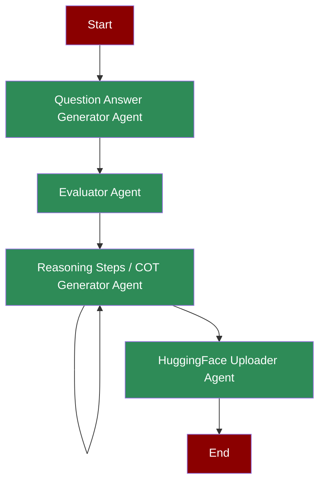

## What is Chain-of-Thought Generation?

Chain-of-Thought (CoT) Generation is a process where AI agents create detailed, step-by-step reasoning paths for solving problems. This involves generating questions, evaluating them, producing detailed solution steps, and making the data available for training and analysis.

## Quick Start

<Steps>
    <Step title="Install Package">
        First, install the PraisonAI Agents package:
        ```bash
        pip install "praisonaiagents[llm]" datasets huggingface-hub pandas
        ```
    </Step>

    <Step title="Set API Key">
        Set your OpenAI API key as an environment variable in your terminal:
        ```bash
        export OPENAI_API_KEY=your_api_key_here
        export HF_TOKEN=your_huggingface_token_here
        ```
    </Step>

    <Step title="Create a file">
        Create a new file `app.py` with the basic setup:
```python
from praisonaiagents import Agent, Task, Agents
from praisonaiagents import cot_save, cot_upload_to_huggingface
from pydantic import BaseModel
import os

# Define Pydantic model for structured output
class DecisionModel(BaseModel):
    response: str
    decision: str

def write_csv(file_path, data):
    """Write data to CSV file."""
    if not os.path.exists(file_path):
        with open(file_path, 'w') as file:
            file.write(data + '\n')
    else:
        with open(file_path, 'a') as file:
            file.write(data + '\n')
    return f"Data appended to {file_path}"

def count_questions(file_path):
    """Count lines in file."""
    with open(file_path, 'r') as file:
        return sum(1 for _ in file)

# Create specialized agents
qa_generator = Agent(
    name="Generator",
    role="Question Creator",
    goal="Create challenging math and logic questions",
    backstory="Expert in educational content creation",
    llm="gpt-4o-mini",
    tools=[write_csv, count_questions]
)

total_questions_evaluator = Agent(
    name="TotalQuestionsEvaluator",
    role="Total Questions Evaluator",
    goal="Evaluate the total number of questions in qa_pairs.csv file",
    backstory="Expert in evaluating the total number of questions in a file",
    llm="gpt-4o-mini",
    tools=[count_questions],
    output="silent"
)

cot_generator = Agent(
    name="COTGenerator",
    role="Chain of Thought Specialist",
    goal="Generate and manage chain of thought solutions for Q&A pairs",
    backstory="Expert in breaking down problems and generating detailed solution steps",
    tools=[cot_save],
    llm="gpt-4o-mini",
    output="silent"
)

upload_to_huggingface = Agent(
    name="UploadToHuggingface",
    role="Upload to Huggingface",
    goal="Upload the generated chain of thought solutions to a Huggingface dataset",
    backstory="Expert in saving data to Huggingface",
    tools=[cot_upload_to_huggingface],
    llm="gpt-4o-mini",
    output="silent"
)

# Create workflow with repeat pattern for generation
from praisonaiagents import Workflow, Task, WorkflowContext, StepResult
from praisonaiagents import repeat, loop

# Step handlers using agents
def generate_qa(ctx: WorkflowContext) -> StepResult:
    result = qa_generator.chat("""Generate question and answer in csv format: question, answer
    Generate 10 unique questions and answers. Example:
    What is the sum of numbers from 1 to 10?, 55
    Number of r's in the word strawberry, 3""")
    write_csv("qa_pairs.csv", result)
    return StepResult(output=result)

def evaluate_count(ctx: WorkflowContext) -> StepResult:
    count = count_questions("qa_pairs.csv")
    return StepResult(
        output=f"count: {count}",
        variables={"question_count": count}
    )

def generate_cot(ctx: WorkflowContext) -> StepResult:
    result = cot_generator.chat(f"Generate chain of thought for: {ctx.variables.get('current_item')}")
    cot_save(result)
    return StepResult(output=result)

def upload_dataset(ctx: WorkflowContext) -> StepResult:
    result = upload_to_huggingface.chat("Upload cot_solutions.csv to mervinpraison/cot-dataset")
    return StepResult(output=result)

# Create workflow
workflow = Workflow(
    steps=[
        generate_qa,
        evaluate_count,
        loop(generate_cot, over="qa_pairs", from_csv="qa_pairs.csv"),
        upload_dataset
    ]
)

result = workflow.start("Generate reasoning data")
```
    </Step>

    <Step title="Run the application">
        Execute the Python script to start generating chain-of-thought data:
        ```bash
        python app.py
        ```
    </Step>

</Steps>


## Features

<CardGroup cols={2}>
  <Card title="Question Generation" icon="question">
    Create challenging math and logic questions with answers.
  </Card>
  <Card title="Question Evaluation" icon="check-double">
    Evaluate and validate generated questions for quality.
  </Card>
  <Card title="CoT Solutions" icon="diagram-project">
    Generate detailed chain-of-thought solutions for each question.
  </Card>
  <Card title="Data Management" icon="database">
    Save and manage generated data in structured formats.
  </Card>
  <Card title="HuggingFace Integration" icon="cloud-arrow-up">
    Upload datasets directly to HuggingFace for sharing.
  </Card>
</CardGroup>

## Understanding the Workflow

<AccordionGroup>
  <Accordion title="Key Components">
    <CardGroup cols={2}>
      <Card title="Question Generator" icon="robot">
        Creates unique math and logic questions with answers. Uses `write_csv` and `count_questions` tools.
      </Card>
      <Card title="Questions Evaluator" icon="magnifying-glass-chart">
        Validates the total number of generated questions. Uses `count_questions` tool.
      </Card>
      <Card title="CoT Generator" icon="diagram-project">
        Produces detailed step-by-step solutions. Uses `cot_save` tool for solution management.
      </Card>
      <Card title="HuggingFace Uploader" icon="cloud-arrow-up">
        Publishes datasets to HuggingFace. Uses `cot_upload_to_huggingface` tool.
      </Card>
    </CardGroup>
  </Accordion>

  <Accordion title="Task Types and Flow Control">
    <Tabs>
      <Tab title="Decision Tasks">
        Used in question generation and evaluation phases.
        
        ```python Decision Task Example
        generate_task = Task(
            task_type="decision",
            condition={
                "more": "generate_task",
                "done": "evaluate_total_questions"
            }
        )
        ```

        <Note>
          Conditions determine whether to continue generating or move forward. The task can loop back to itself or proceed to the next task.
        </Note>
      </Tab>
      <Tab title="Loop Tasks">
        Used in Chain-of-Thought generation phase.
        
        ```python Loop Task Example
        generate_cot_task = Task(
            task_type="loop",
            input_file="qa_pairs.csv",
            output_pydantic=DecisionModel
        )
        ```

        <Warning>
          Always use Pydantic models for output validation in loop tasks to ensure data consistency.
        </Warning>
      </Tab>
    </Tabs>

    <Info>
      Each task type serves a specific purpose in the workflow:
      - **Decision Tasks**: Control flow and branching logic
      - **Loop Tasks**: Process data iteratively with validation
    </Info>
  </Accordion>
</AccordionGroup>

## Next Steps

<CardGroup>
  <Card title="Introduction" icon="book" href="/introduction">
    Learn more about PraisonAI and its core concepts
  </Card>
  <Card title="Quick Start" icon="bolt" href="/quickstart">
    Get started with the basics of PraisonAI
  </Card>
</CardGroup>