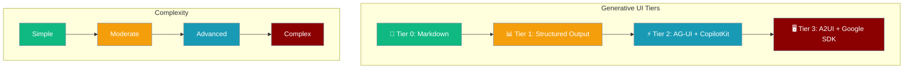
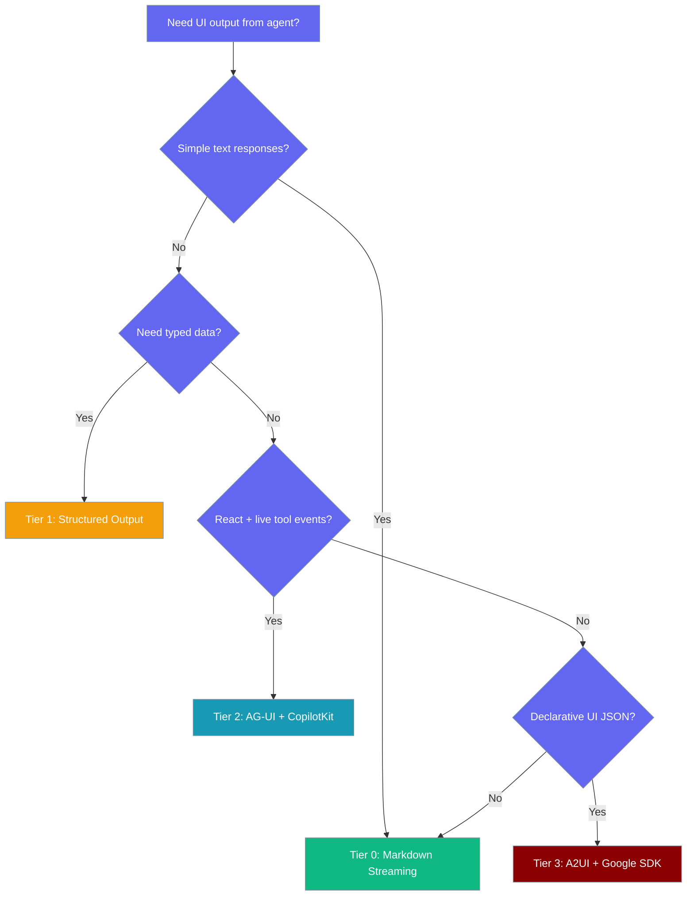

Generate user interfaces from AI agents using four different approaches, from simple markdown to complex declarative UIs.

```python
from praisonaiagents import Agent

agent = Agent(
    name="Assistant",
    instructions="Help users with their tasks",
)

agent.start("Create a simple interface to collect user information")
```



## Which Tier Should I Use?



---

## Tier 0: Markdown Streaming

Stream markdown responses for chat-style interactions with no client UI work required.

```python
from praisonaiagents import Agent

agent = Agent(
    name="Chat Assistant",
    instructions="Respond in helpful markdown format",
)

# Streams markdown text
response = agent.start("Explain Python classes", stream=True)
```

**Best for:**
- Chat applications
- Documentation generation  
- Text-based responses
- Simple Q&A interfaces

**Learn more:** [Streaming Documentation](/docs/features/streaming)

---

## Tier 1: Structured Output

Generate typed JSON results for programmatic UI construction on the client.

```python
from praisonaiagents import Agent
from pydantic import BaseModel

class ContactForm(BaseModel):
    name: str
    email: str
    message: str

agent = Agent(
    name="Form Generator",
    instructions="Generate contact form data",
    output_pydantic=ContactForm,
)

# Returns typed ContactForm object
form_data = agent.start("Create a contact form")
print(f"Name field: {form_data.name}")
```

**Best for:**
- Data extraction
- Form generation
- API responses
- Type-safe client integration

**Learn more:** [Structured Output Documentation](/docs/features/structured-output)

---

## Tier 2: AG-UI + CopilotKit 

React/CopilotKit apps with live tool events using the AG-UI streaming bridge.

```python
from praisonaiagents import Agent
from praisonaiagents.tools import web_search

agent = Agent(
    name="Search Assistant", 
    instructions="Search the web and provide results",
    tools=[web_search],
)

# Tool events stream live to CopilotKit clients
response = agent.start("Search for Python tutorials", stream=True)
```

The new AG-UI streaming bridge converts internal `stream_emitter` events into AG-UI SSE events during `async_stream_agent_response`, allowing CopilotKit clients to receive live tool execution updates.

### AG-UI Streaming Bridge

The streaming bridge in `praisonaiagents/ui/agui/streaming.py` provides:

| Function | Purpose |
|----------|---------|
| `stream_event_to_agui_events` | Convert PraisonAI StreamEvents to AG-UI events |
| `async_stream_agent_response` | Stream agent responses as AG-UI events |
| `EventBuffer` | Manage event ordering and tool call tracking |

```python
from praisonaiagents.ui.agui.streaming import async_stream_agent_response

# Stream agent response as AG-UI events
async for event in async_stream_agent_response(
    agent=agent,
    user_input="Search for AI tools",
    thread_id="thread-123", 
    run_id="run-456"
):
    # Event sent to CopilotKit client
    print(f"Event: {event.type}")
```

**Best for:**
- React applications
- Live tool execution display
- CopilotKit integration
- Real-time user interfaces

**Learn more:** [AG-UI Server](/docs/deploy/servers/agui) | [AG-UI API](/docs/deploy/api/agui-api)

---

## Tier 3: A2UI + Google SDK

Declarative agent-generated UIs with Google's A2UI SDK validation and renderer clients.

```python
from praisonaiagents import Agent
from praisonaiagents.ui import A2UI  
from praisonaiagents.tools.a2ui_tools import send_a2ui_messages

agent = Agent(
    name="UI Generator",
    instructions="Create user interfaces using A2UI",
    system_prompt=A2UI.system_prompt(
        role_description="You generate declarative UIs using A2UI",
        ui_description="Use the basic catalog v0.9"
    ),
    tools=[send_a2ui_messages],
)

# Generates validated A2UI JSON
agent.start("Create a contact form with name and email fields")
```

**Best for:**
- Complex declarative UIs
- Multi-platform rendering (Web, Flutter, React)
- Schema-validated UI generation  
- Agent-driven interface creation

**Learn more:** [A2UI Documentation](/docs/features/a2ui)

---

## Comparison Table

| Tier | Output Format | Client Work | Validation | Use Case |
|------|---------------|-------------|------------|----------|
| **0** | Markdown text | None | None | Chat, documentation |
| **1** | Typed JSON | Build UI from data | Pydantic | Forms, data extraction |
| **2** | AG-UI events | CopilotKit components | Tool execution | React apps, live updates |
| **3** | A2UI JSON | A2UI renderer | Schema validation | Declarative UIs, multi-platform |

## Installation Requirements

| Tier | Installation Command |
|------|---------------------|
| **0** | `pip install praisonaiagents` (included) |
| **1** | `pip install praisonaiagents` (included) |
| **2** | `pip install praisonaiagents` + CopilotKit setup |
| **3** | `pip install praisonaiagents[a2ui]` |

---

## Related

<CardGroup cols={2}>
<Card title="Streaming" icon="stream" href="/docs/features/streaming">
  Tier 0: Markdown streaming responses
</Card>
<Card title="A2UI" icon="window" href="/docs/features/a2ui">
  Tier 3: Declarative UI generation
</Card>
<Card title="AG-UI Server" icon="server" href="/docs/deploy/servers/agui">
  Tier 2: Deploy AG-UI with CopilotKit
</Card>
<Card title="Structured Output" icon="code" href="/docs/features/structured-output">
  Tier 1: Generate typed JSON results
</Card>
</CardGroup>