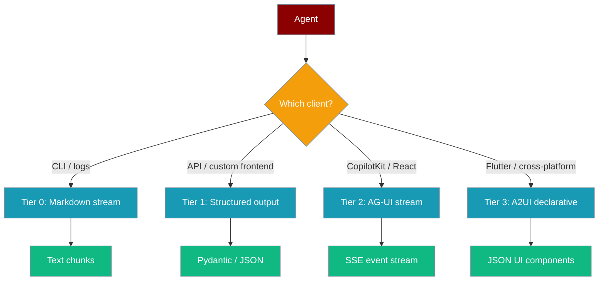
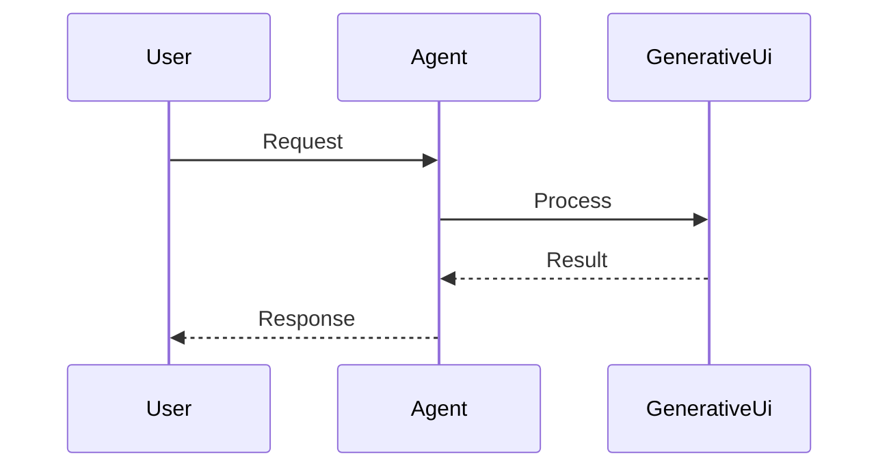
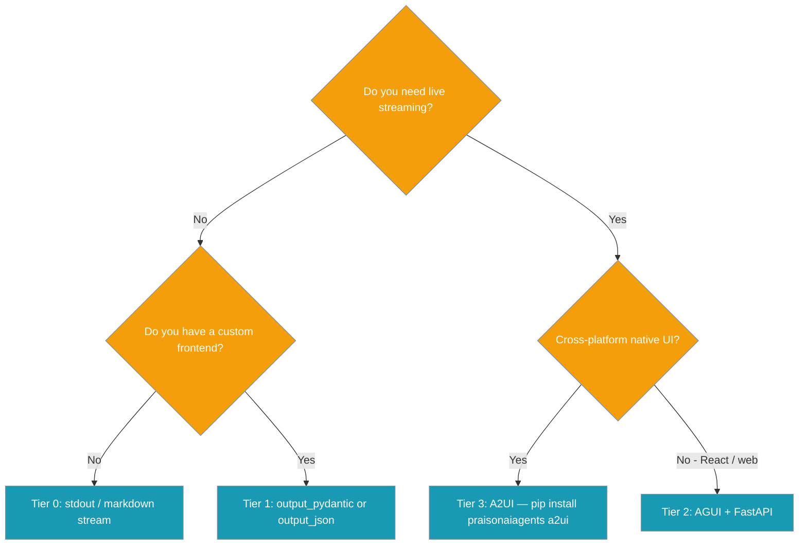
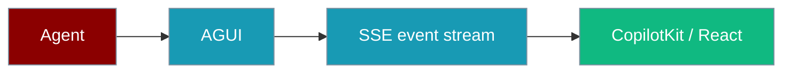

```python
from praisonaiagents import Agent

agent = Agent(name="ui-assistant", instructions="Reply with concise text suitable for UI cards.")
agent.start("Show me a summary card for my project")
```
Agents can drive rich user interfaces — from plain text streaming to typed JSON schemas to live React components — by picking the right output tier for your client.

The user chats with the agent; generative UI renders cards, forms, or charts alongside the text reply.



## How It Works




## Quick Start

<Steps>
<Step title="Tier 1 — Structured output (recommended for APIs)">

```python
from pydantic import BaseModel
from praisonaiagents import Agent

class Dashboard(BaseModel):
    title: str
    summary: str
    metrics: list[dict]

agent = Agent(
    name="Analyst",
    instructions="Summarise sales data into a dashboard.",
    output_pydantic=Dashboard
)

data = agent.start("Summarise Q1 sales from the attached report.")
print(data.title)
print(data.metrics)
```

Your frontend receives a typed object — map `Dashboard` fields to whatever React, Vue, or mobile components you already have.

</Step>

<Step title="Tier 2 — AG-UI (CopilotKit / React)">

```python
from praisonaiagents import Agent, AGUI
from fastapi import FastAPI

agent = Agent(
    name="Assistant",
    instructions="Help users with research.",
)
agui = AGUI(agent=agent)

app = FastAPI()
app.include_router(agui.get_router())
```

Run: `uvicorn main:app --port 8002`

The agent streams text deltas and tool call events over Server-Sent Events to any AG-UI compatible frontend (CopilotKit, custom SSE client).

</Step>
</Steps>

---

## How It Works

### Tier decision flow



### Tier 0 — Markdown streaming


```python
from praisonaiagents import Agent

agent = Agent(name="Bot", instructions="Answer questions.")
for chunk in agent.start("Tell me about AI.", stream=True):
    print(chunk, end="", flush=True)
```

### Tier 1 — Structured output


Use `output_pydantic=YourModel` or `output_json=True` on the agent. The model formats its response to fit the schema, and you receive a validated Python object.

### Tier 2 — AG-UI stream



`AGUI` wraps any agent and exposes a `POST /agui` endpoint that emits text delta and tool call events per the AG-UI protocol.

### Tier 3 — A2UI declarative


Requires `pip install praisonaiagents[a2ui]`. The agent emits A2UI JSON; platform-specific renderers (React, Flutter, Lit) turn it into native UI components.

---

## Configuration Options

**Tier 1 — Structured output parameters on `Agent`:**

| Parameter | Type | Description |
|-----------|------|-------------|
| `output_pydantic` | `type[BaseModel]` | Pydantic model class — response is validated and returned as an instance |
| `output_json` | `bool` | Return raw JSON dict instead of a model instance |

**Tier 2 — `AGUI` constructor:**

| Parameter | Type | Default | Description |
|-----------|------|---------|-------------|
| `agent` | `Agent` | — | Single agent to expose |
| `agents` | `Agents` | — | Multi-agent workflow to expose |
| `name` | `str` | agent name | Name for the endpoint |
| `description` | `str` | agent role | Description for OpenAPI docs |
| `prefix` | `str` | `""` | URL prefix for the router |
| `tags` | `list[str]` | `["AGUI"]` | OpenAPI tags |

<Card title="AGUI TypeScript Reference" icon="code" href="/docs/sdk/reference/typescript/classes/AGUI">
  TypeScript AG-UI configuration
</Card>
<Card title="A2UI Protocol" icon="code" href="/docs/features/a2ui">
  A2UI declarative UI protocol details
</Card>

---

## Common Patterns

**Return a typed dashboard from a research agent:**

```python
from pydantic import BaseModel
from praisonaiagents import Agent

class ResearchReport(BaseModel):
    title: str
    summary: str
    key_points: list[str]
    sources: list[str]

agent = Agent(
    name="Researcher",
    instructions="Research topics and return structured reports.",
    output_pydantic=ResearchReport
)

report = agent.start("Research the impact of AI on healthcare.")
for point in report.key_points:
    print(f"• {point}")
```

**Expose a multi-agent workflow via AG-UI:**

```python
from praisonaiagents import Agent, Agents, AGUI
from fastapi import FastAPI

researcher = Agent(name="Researcher", instructions="Research topics.")
writer = Agent(name="Writer", instructions="Write articles.")

workflow = Agents(agents=[researcher, writer])
agui = AGUI(agents=workflow)

app = FastAPI()
app.include_router(agui.get_router())
```

**Stream output to the terminal:**

```python
from praisonaiagents import Agent

agent = Agent(name="Assistant", instructions="Be helpful.")
for chunk in agent.start("Write a poem about space.", stream=True):
    print(chunk, end="", flush=True)
```

---

## Best Practices

<AccordionGroup>
<Accordion title="Choose the simplest tier that meets your needs">
  Tier 1 covers 90% of use cases — a typed Pydantic response is easy to test, validate, and map to UI components. Only reach for Tier 2 or 3 when you genuinely need live streaming or cross-platform native rendering.
</Accordion>

<Accordion title="Define narrow Pydantic models for Tier 1">
  Broad schemas like `dict` defeat the purpose of structured output. Model exactly the fields your frontend needs — this makes validation strict and LLM prompting more reliable.
</Accordion>

<Accordion title="Do not reimplement A2UI types">
  Use `praisonaiagents[a2ui]` for Tier 3 — do not create your own A2UI JSON structures. The official SDK ensures schema compliance across renderer versions.
</Accordion>

<Accordion title="Renderers live outside PraisonAI core">
  For Tier 3, the React, Flutter, and Lit renderers are maintained in the Google A2UI repository. PraisonAI provides the agent side; you choose and update renderers independently.
</Accordion>
</AccordionGroup>

---

## Related

<CardGroup cols={2}>
<Card title="A2UI Protocol" icon="sparkles" href="/docs/features/a2ui">
  Declarative cross-platform UI via A2UI JSON
</Card>
<Card title="Streaming" icon="bolt" href="/docs/features/streaming">
  Token-level streaming for real-time output
</Card>
</CardGroup>
