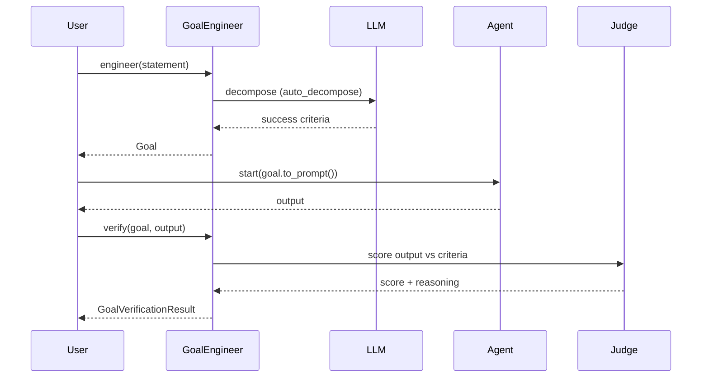

Goal Engineering turns a vague objective into a structured, measurable goal, then verifies agent output against it.


## Quick Start

<Steps>
<Step title="Engineer and verify a goal">

Engineer a goal, run your agent against it, then verify the output:

```python
from praisonaiagents import Agent, GoalEngineer

agent = Agent(name="Summariser", instructions="Summarise the input")
engineer = GoalEngineer()
goal = engineer.engineer("Summarise the report in under 100 words")

output = agent.start(goal.to_prompt())
result = engineer.verify(goal, output)
print(result.score, result.achieved)
```

</Step>

<Step title="Explicit criteria + constraints">

Provide your own criteria and constraints to skip LLM decomposition:

```python
from praisonaiagents import GoalEngineer

engineer = GoalEngineer(auto_decompose=False)
goal = engineer.engineer(
    "Summarise the report",
    criteria=["Under 100 words", "Preserves key findings"],
    constraints=["No hallucinations"],
)
```

</Step>

<Step title="Full control with GoalConfig">

Tune the model, criteria count, and pass threshold:

```python
from praisonaiagents import GoalEngineer, GoalConfig

engineer = GoalEngineer(config=GoalConfig(
    model="gpt-4o",
    max_criteria=3,
    threshold=7.5,
))
```

</Step>
</Steps>

---

## How It Works

A statement is decomposed into criteria, the agent runs, and the output is scored by the same `Judge` used across evaluation.



| Step | What happens |
|------|--------------|
| **engineer** | Builds a `Goal` from a statement. Uses supplied criteria, or the LLM proposes measurable ones when `auto_decompose=True`. |
| **to_prompt** | Renders the goal, criteria, and constraints as an instruction block for any agent. |
| **verify** | Reuses the unified `Judge` to score the output. A score at/above `threshold` marks the goal `achieved`. |

A judge failure is inconclusive — criteria stay `pending` and `achieved=False`, never a real `unmet`. The result carries an independent snapshot of criteria, so mutating it never corrupts the goal.

---

## Configuration Options

| Option | Type | Default | Description |
|--------|------|---------|-------------|
| `model` | `Optional[str]` | `os.getenv("OPENAI_MODEL_NAME", "gpt-4o-mini")` | LLM model used for decomposition/verification |
| `max_criteria` | `int` | `5` | Maximum success criteria auto-generated |
| `threshold` | `float` | `8.0` | Score (0–10) at/above which the goal is achieved |
| `auto_decompose` | `bool` | `True` | Auto-generate criteria via the LLM |
| `verbose` | `bool` | `False` | Enable verbose logging |

`GoalConfig` follows the PraisonAI convention: `False = disabled, True = defaults, GoalConfig(...) = custom`.

<Card title="Goal Module Reference" icon="code" href="/docs/sdk/reference/praisonaiagents/modules/goal">
  Full Python API for the goal package
</Card>

---

## Common Patterns

Weight criteria by importance and track weighted progress:

```python
from praisonaiagents import GoalEngineer

engineer = GoalEngineer(auto_decompose=False)
goal = engineer.engineer("Ship the release notes")
goal.add_criterion("Covers every merged PR", weight=3.0)
goal.add_criterion("Reads clearly", weight=1.0)

print(goal.progress)  # fraction of weighted criteria met, clamped to [0.0, 1.0]
```

`progress` is the fraction of weighted criteria currently `met`, clamped to `[0.0, 1.0]`. Non-positive weights count as 0; when total weight is 0, criteria count equally.

Reuse one engineered goal across multiple agents via `to_prompt()`:

```python
from praisonaiagents import Agent, GoalEngineer

engineer = GoalEngineer()
goal = engineer.engineer("Draft a launch email under 150 words")

drafter = Agent(name="Drafter", instructions="Write marketing copy")
editor = Agent(name="Editor", instructions="Tighten and proofread")

draft = drafter.start(goal.to_prompt())
final = editor.start(goal.to_prompt() + f"\n\nDraft:\n{draft}")
```

Persist a goal with `to_dict()` and restore it with `from_dict()`:

```python
import json
from praisonaiagents import Goal, GoalEngineer

goal = GoalEngineer().engineer("Summarise the report")
saved = json.dumps(goal.to_dict())

restored = Goal.from_dict(json.loads(saved))
```

---

## Best Practices

<AccordionGroup>
<Accordion title="Prefer explicit criteria for tests">
Pass your own `criteria` (with `auto_decompose=False`) when you need deterministic, repeatable checks. Let `auto_decompose` propose criteria while you explore a new goal.
</Accordion>
<Accordion title="Tune the threshold deliberately">
`threshold` defaults to `8.0`, which is strict. Lower it in `GoalConfig` when a goal tolerates partial success, and review the value the same way you review test assertions.
</Accordion>
<Accordion title="Use constraints for hard rules">
Add `constraints` for safety and format rules that must never be violated. They render inside `to_prompt()`, so the agent sees them alongside the goal.
</Accordion>
<Accordion title="Treat pending as retry, not failure">
A `pending` status in `GoalVerificationResult` means the judge was unavailable — retry the verification. It is not the same as an `unmet` criterion.
</Accordion>
</AccordionGroup>

---

## Related

<CardGroup cols={2}>
  <Card title="CHL Engineering" icon="ruler-combined" href="/docs/concepts/chl-engineering">
    Goal Engineering complements the Context / Harness / Loop rubric.
  </Card>
  <Card title="Judge" icon="gavel" href="/docs/eval/judge">
    The LLM-as-judge that `GoalEngineer.verify()` reuses.
  </Card>
  <Card title="Evaluation Suite" icon="scale-balanced" href="/docs/features/eval-suite">
    Pair goal verification with a full eval suite.
  </Card>
</CardGroup>
