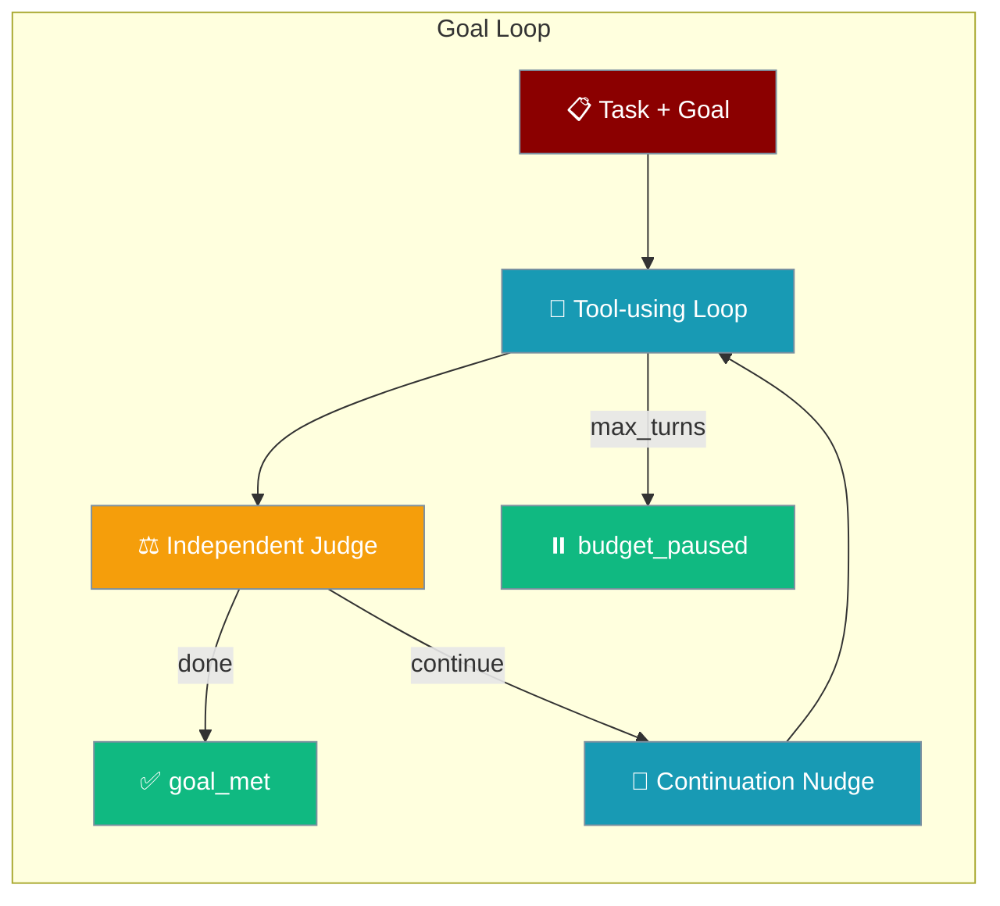
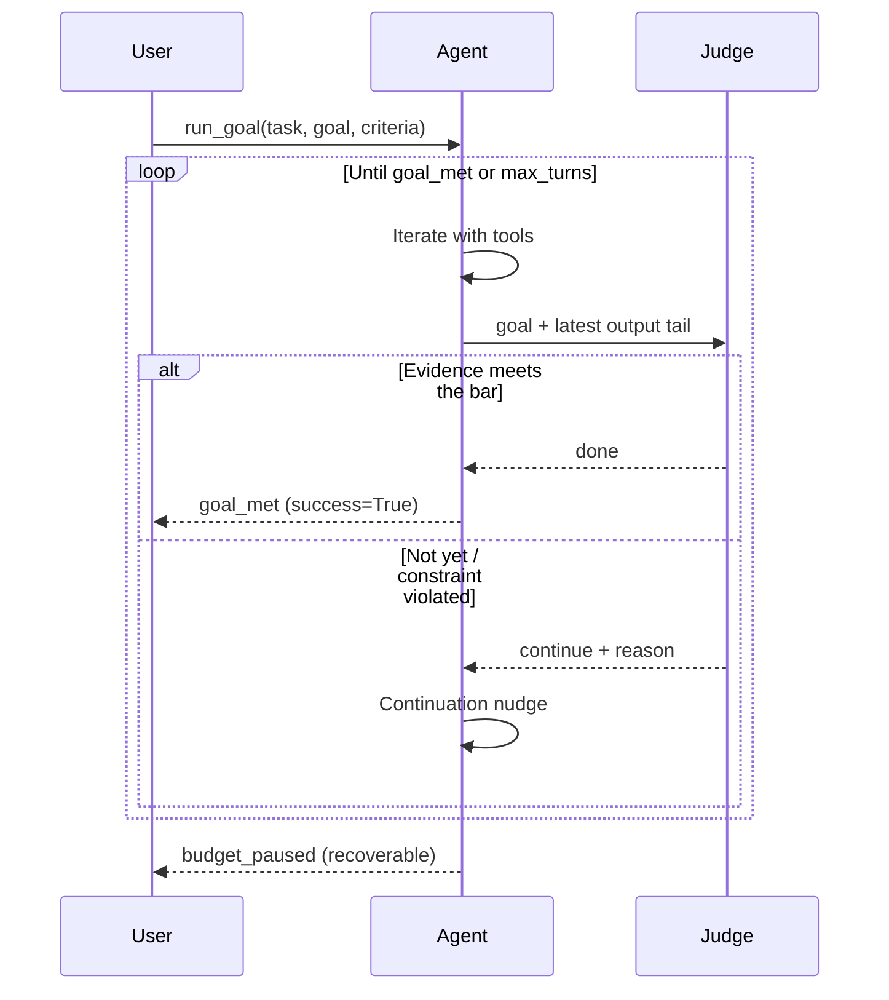
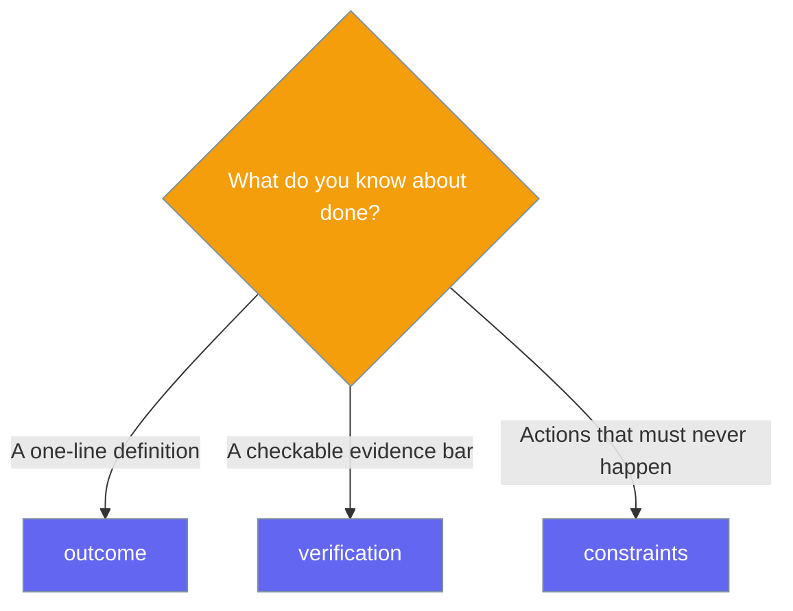

The goal loop runs your agent with its tools and only stops when an independent judge confirms the goal is met — no more "done"-keyword false positives.



## Quick Start

<Steps>
<Step title="Simple goal">

Pass a task and a goal — the judge decides when the goal is really met.

```python
from praisonaiagents import Agent

agent = Agent(instructions="You are an ops assistant", autonomy=True)

result = agent.run_goal(
    "Tidy the repo and open a PR",
    goal="A PR is open with formatting fixes and green CI",
)
print(result.success, result.completion_reason)  # True goal_met
```
</Step>

<Step title="With acceptance criteria">

Add structured criteria so the judge anchors to concrete evidence.

```python
from praisonaiagents import Agent
from praisonaiagents.goal import GoalCriteria

agent = Agent(instructions="You are an ops assistant", autonomy=True)

result = agent.run_goal(
    "Tidy the repo and open a PR",
    goal="Repo formatted, tests green, PR opened",
    criteria=GoalCriteria(
        outcome="A PR is open with formatting fixes and passing CI",
        verification="A PR URL exists and the test command exits 0",
        constraints=["do not touch CHANGELOG.md", "no force-push"],
    ),
    max_turns=15,
)
```
</Step>

<Step title="Resume a paused run">

A paused run (`max_turns` exhausted) resumes automatically for the same goal — `turns_used` is not reset.

```python
agent.run_goal("Continue the task", goal="Repo formatted, tests green, PR opened")
```
</Step>
</Steps>

---

## How It Works

The loop iterates with tools; after each iteration an independent judge reads the goal plus the latest output and returns `done` or `continue`.



The judge is strict about evidence:

> Do NOT accept mere claims of completion (e.g. the word 'done') as evidence. Require concrete evidence that the goal is actually met.

---

## Acceptance Criteria

`GoalCriteria` describes what "done" means, how to check it, and what must never happen.



| Field | Type | Default | Description |
|---|---|---|---|
| `outcome` | `str` | `""` | What "done" means in one line — the definition the judge anchors to |
| `verification` | `str` | `""` | The concrete evidence bar the judge requires before returning `done` |
| `constraints` | `List[str]` | `[]` | Must-not-violate conditions; any violation forces `continue` |

---

## `run_goal()` Options

| Option | Type | Default | Description |
|---|---|---|---|
| `task` | `str` | — | The task/prompt the agent executes |
| `goal` | `str` | — | The goal text the judge evaluates against |
| `criteria` | `Optional[GoalCriteria]` | `None` | Structured acceptance criteria (recommended) |
| `max_turns` | `int` | `20` | Judged iterations before a recoverable pause |
| `judge_model` | `Optional[str]` | `OPENAI_MODEL_NAME` env or `"gpt-4o-mini"` | Independent judge model — use a **different** model from the actor to avoid self-enhancement bias |
| `resume` | `bool` | `True` | Resume a persisted `paused` run for the same goal instead of restarting |

---

## Completion Reasons

The loop returns an `AutonomyResult` whose `completion_reason` tells you why it stopped.

| `completion_reason` | Meaning |
|---|---|
| `"goal_met"` | Judge returned `done` with concrete evidence — `success=True` |
| `"budget_paused"` | `max_turns` exhausted, or the judge returned 3 consecutive unparseable responses — `success=False`, run is **recoverable** via a second `run_goal(..., resume=True)` call |
| (other) | Falls back to the standard `run_autonomous` heuristics — see [Autonomy](/docs/features/autonomy) |

---

## The Independent Judge

The judge is deliberately simple, cheap, and safe to fail.

<AccordionGroup>
<Accordion title="Independent">
Uses a separate judge model so the acting model never self-grades — this avoids self-enhancement bias.
</Accordion>

<Accordion title="Fail-open">
A broken or timed-out judge yields `continue`, so a weak judge never wedges progress.
</Accordion>

<Accordion title="Cheap">
Only the goal plus the last ~4000 characters of agent output are judged, not the whole transcript.
</Accordion>

<Accordion title="Constraint-strict">
Any constraint listed in `GoalCriteria.constraints` blocks a `done` verdict.
</Accordion>

<Accordion title="Auto-pause safety valve">
3 consecutive unparseable judge responses auto-pause the loop with `budget_paused`, so a wedged judge cannot silently burn the whole budget.
</Accordion>
</AccordionGroup>

---

## Async Variant

`run_goal_async()` mirrors `run_goal()` for async code.

```python
result = await agent.run_goal_async("Tidy the repo", goal="A PR is open with green CI")
```

---

## `run_until(goal=...)` Delegation

Passing `goal=` to [`run_until()`](/docs/eval/evaluation-loop) now delegates to `run_goal()` — the acceptance-criteria judge gates a real tool-iteration loop instead of re-generating a whole answer.

```python
from praisonaiagents import Agent
from praisonaiagents.goal import GoalCriteria

agent = Agent(instructions="You are an ops assistant", autonomy=True)

result = agent.run_until(
    "Do the task",
    goal="A PR is open with green CI",
    goal_criteria=GoalCriteria(outcome="PR merged", verification="PR URL exists"),
)
# Returns AutonomyResult (not EvaluationLoopResult)
print(result.completion_reason)  # "goal_met" | "budget_paused"
```

<Warning>
When `goal` is passed, `run_until()` returns an `AutonomyResult` (`success` / `output` / `completion_reason`) instead of the usual `EvaluationLoopResult`. Adjust downstream code that accesses `result.final_score` / `result.iterations`.
</Warning>

---

## Best Practices

<AccordionGroup>
<Accordion title="Use a different judge model">
Set `judge_model` to a different model than the actor so the run is not self-graded.
</Accordion>

<Accordion title="Write verification as a checkable condition">
Use concrete, checkable evidence ("exit code 0", "PR URL exists"), not a feeling.
</Accordion>

<Accordion title="Keep max_turns low for first runs">
Start with `max_turns=10–20` and let `resume=True` continue a paused run when needed.
</Accordion>

<Accordion title="Fill constraints with forbidden actions">
`constraints` is the only field that can *block* a `done` verdict — list what must never happen.
</Accordion>
</AccordionGroup>

---

## Related

<CardGroup cols={2}>
<Card icon="robot" href="/docs/features/autonomy">
  Autonomy — the autonomous loop and its completion signals
</Card>
<Card icon="bullseye" href="/docs/features/goal-engineering">
  Goal Engineering — *specify and score* a goal (the Goal Loop *runs and gates* toward one)
</Card>
<Card icon="rotate" href="/docs/eval/evaluation-loop">
  Evaluation Loop — the `run_until` Ralph Loop
</Card>
<Card icon="code" href="/docs/sdk/reference/praisonaiagents/functions/Agent-run_autonomous">
  SDK Reference — the underlying `run_autonomous` loop
</Card>
</CardGroup>
