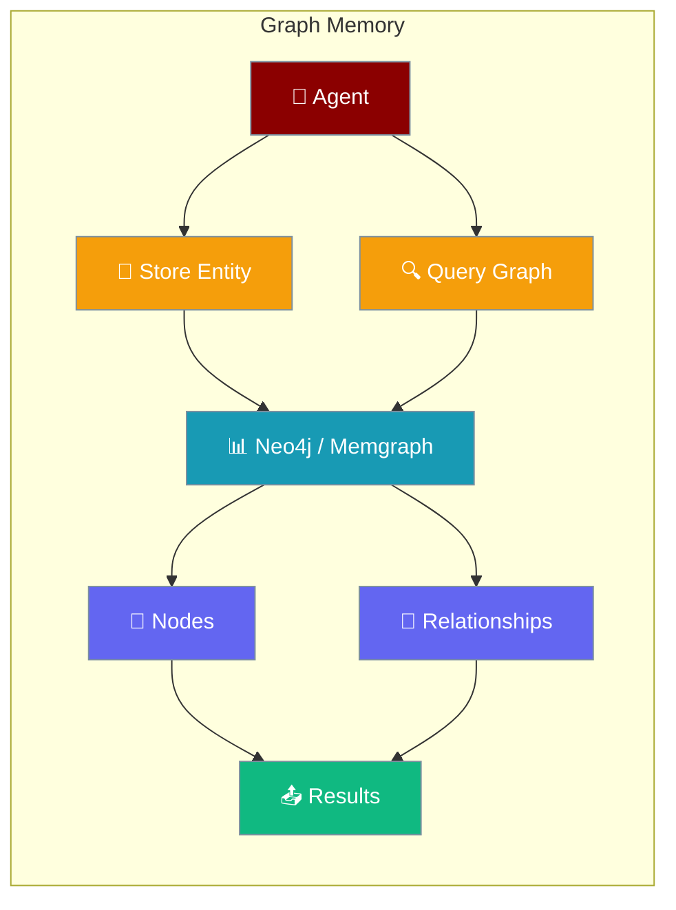

Graph memory in PraisonAI Agents enables sophisticated relationship-based storage and retrieval using graph databases like Neo4j and Memgraph. This allows agents to model complex relationships between entities, concepts, and memories.



## Overview

Graph memory extends the standard memory system by storing information as nodes and relationships in a graph database. This enables:
- Complex relationship modeling
- Multi-hop reasoning
- Entity-centric memory organization
- Temporal relationship tracking
- Pattern-based memory retrieval

## Quick Start

<Steps>

<Step title="Connect Neo4j graph memory">

```python
import os
from praisonaiagents import Agent

agent = Agent(
    name="Knowledge Manager",
    instructions="Build and query knowledge graphs",
    memory={
        "backend": "neo4j",
        "url": "bolt://localhost:7687",
        "username": "neo4j",
        "password": os.getenv("NEO4J_PASSWORD"),
    },
)
```

</Step>

<Step title="Connect Memgraph">

```python
import os
from praisonaiagents import Agent

agent = Agent(
    name="Graph Analyst",
    instructions="Analyse relationships in data",
    memory={
        "backend": "memgraph",
        "host": "localhost",
        "port": 7687,
        "username": "memgraph",
        "password": os.getenv("MEMGRAPH_PASSWORD"),
    },
)
```

</Step>

</Steps>

## Setup

### Neo4j Setup

```python
# Install Neo4j driver
# pip install neo4j

from praisonaiagents import Agent

# Create agent with Neo4j graph memory
agent = Agent(
    role="Knowledge Manager",
    goal="Build and query knowledge graphs",
    memory={
        "backend": "neo4j",
        "url": "bolt://localhost:7687",
        "username": "neo4j",
        "password": "your-password"
    }
)
```

### Memgraph Setup

```python
# Install Memgraph driver
# pip install gqlalchemy

from praisonaiagents import Agent

agent = Agent(
    role="Graph Analyst",
    goal="Analyze relationships in data",
    memory={
        "backend": "memgraph",
        "host": "localhost",
        "port": 7687,
        "username": "memgraph",
        "password": "your-password"
    }
)
```

## Graph Memory Operations

### Storing Entities and Relationships

```python
from praisonaiagents import Agent

# Agent with graph memory
agent = Agent(
    role="Relationship Mapper",
    goal="Map complex relationships",
    memory={
        "backend": "neo4j",
        "url": "bolt://localhost:7687",
        "username": "neo4j",
        "password": "your-password"
    }
)

# Store entities with relationships
result = agent.chat("""
John Smith is the CEO of TechCorp.
TechCorp acquired DataSystems in 2023.
Sarah Johnson works as CTO at TechCorp.
Sarah Johnson reports to John Smith.
""")

# Graph structure created:
# (John Smith:Person {role: "CEO"}) -[:LEADS]-> (TechCorp:Company)
# (TechCorp:Company) -[:ACQUIRED {year: 2023}]-> (DataSystems:Company)
# (Sarah Johnson:Person {role: "CTO"}) -[:WORKS_AT]-> (TechCorp:Company)
# (Sarah Johnson:Person) -[:REPORTS_TO]-> (John Smith:Person)
```

### Querying Graph Memory

```python
# Query relationships
query_agent = Agent(
    role="Query Specialist",
    goal="Extract insights from graph",
    memory={
        "backend": "neo4j",
        "url": "bolt://localhost:7687",
        "username": "neo4j",
        "password": "your-password"
    }
)

# Simple queries
result = query_agent.chat("Who works at TechCorp?")
# Returns: John Smith (CEO), Sarah Johnson (CTO)

# Multi-hop queries
result = query_agent.chat("What companies are connected to John Smith?")
# Returns: TechCorp (CEO), DataSystems (through TechCorp acquisition)

# Pattern queries
result = query_agent.chat("Find all reporting relationships")
# Returns: Sarah Johnson reports to John Smith
```

## Advanced Graph Patterns

### Temporal Relationships

```python
# Configure temporal graph memory
temporal_config = {
    "provider": "neo4j",
    "config": neo4j_config,
    "enable_temporal": True,
    "temporal_properties": ["valid_from", "valid_to"]
}

temporal_agent = Agent(
    role="History Tracker",
    goal="Track changes over time",
    memory=Memory(config=temporal_config)
)

# Store temporal data
temporal_agent.chat("""
John was CEO of StartupInc from 2018 to 2021.
John became CEO of TechCorp in 2021.
TechCorp stock price was $50 in January 2023.
TechCorp stock price rose to $75 in June 2023.
""")

# Query temporal relationships
result = temporal_agent.chat("What was John's role in 2020?")
# Returns: CEO of StartupInc

result = temporal_agent.chat("Track TechCorp stock price over time")
# Returns: Timeline of stock prices
```

### Entity Resolution

```python
# Entity resolution configuration
entity_config = {
    "provider": "neo4j",
    "config": neo4j_config,
    "entity_resolution": {
        "enabled": True,
        "similarity_threshold": 0.85,
        "merge_strategy": "latest"
    }
}

entity_agent = Agent(
    role="Entity Resolver",
    goal="Maintain clean entity graph",
    memory=Memory(config=entity_config)
)

# Automatic entity resolution
entity_agent.chat("J. Smith is the CEO")  # Resolves to John Smith
entity_agent.chat("Johnny Smith leads the company")  # Also resolves to John Smith
```

### Graph Embeddings

```python
# Enable graph embeddings for semantic search
embedding_config = {
    "provider": "neo4j",
    "config": neo4j_config,
    "embeddings": {
        "enabled": True,
        "model": "sentence-transformers/all-MiniLM-L6-v2",
        "dimensions": 384,
        "index_type": "hnsw"  # Hierarchical Navigable Small World
    }
}

semantic_agent = Agent(
    role="Semantic Analyzer",
    goal="Find semantic relationships",
    memory=Memory(config=embedding_config)
)

# Semantic similarity search
result = semantic_agent.chat("Find concepts similar to artificial intelligence")
# Returns nodes with high semantic similarity
```

## Graph Memory Patterns

### Knowledge Graph Construction

```python
class KnowledgeGraphAgent(Agent):
    """Agent specialized in building knowledge graphs"""
    
    def __init__(self, **kwargs):
        super().__init__(
            role="Knowledge Graph Builder",
            goal="Construct comprehensive knowledge graphs",
            memory=Memory(
                provider="neo4j",
                config={
                    "uri": "bolt://localhost:7687",
                    "username": "neo4j",
                    "password": "password"
                }
            ),
            **kwargs
        )
    
    def add_article(self, article_text):
        """Process article and add to knowledge graph"""
        # Extract entities and relationships
        result = self.chat(f"""
        Extract all entities and relationships from this article
        and add them to the knowledge graph:
        
        {article_text}
        
        Identify:
        - People (with roles/titles)
        - Organizations
        - Locations
        - Events (with dates)
        - Concepts
        - All relationships between them
        """)
        
        return result

# Use the specialized agent
kg_agent = KnowledgeGraphAgent()
kg_agent.add_article(news_article)
```

### Recommendation System

```python
class RecommendationAgent(Agent):
    """Agent using graph memory for recommendations"""
    
    def __init__(self, **kwargs):
        super().__init__(
            role="Recommendation Engine",
            goal="Provide personalized recommendations",
            memory=Memory(provider="neo4j", config=neo4j_config),
            **kwargs
        )
    
    def get_recommendations(self, user_id, recommendation_type):
        """Get recommendations based on graph relationships"""
        
        query = f"""
        Based on the graph relationships, recommend {recommendation_type}
        for user {user_id} considering:
        - Past interactions
        - Similar users' preferences
        - Collaborative filtering patterns
        - Content similarity
        
        Return top 5 recommendations with reasoning.
        """
        
        return self.chat(query)

# Get recommendations
recommender = RecommendationAgent()
recs = recommender.get_recommendations("user123", "products")
```

### Fraud Detection

```python
class FraudDetectionAgent(Agent):
    """Agent using graph patterns for fraud detection"""
    
    def __init__(self, **kwargs):
        super().__init__(
            role="Fraud Analyst",
            goal="Detect fraudulent patterns in transaction graphs",
            memory=Memory(
                provider="memgraph",
                config=memgraph_config,
                algorithms=["pagerank", "community_detection", "betweenness"]
            ),
            **kwargs
        )
    
    def analyze_transaction(self, transaction_data):
        """Analyze transaction for fraud patterns"""
        
        return self.chat(f"""
        Analyze this transaction for fraud indicators:
        {transaction_data}
        
        Check for:
        - Unusual connection patterns
        - Rapid transaction sequences
        - New account relationships
        - Community anomalies
        - High betweenness centrality nodes
        
        Risk level: [Low/Medium/High]
        """)

fraud_agent = FraudDetectionAgent()
risk_assessment = fraud_agent.analyze_transaction(transaction)
```

## Cypher Query Integration

```python
# Direct Cypher query support
class CypherAgent(Agent):
    """Agent that can execute Cypher queries"""
    
    def __init__(self, **kwargs):
        super().__init__(
            role="Cypher Expert",
            goal="Execute complex graph queries",
            memory=Memory(
                provider="neo4j",
                config=neo4j_config,
                enable_cypher=True
            ),
            **kwargs
        )
    
    def execute_cypher(self, query):
        """Execute raw Cypher query"""
        return self.memory.cypher_query(query)
    
    def find_shortest_path(self, start_node, end_node):
        """Find shortest path between nodes"""
        cypher = f"""
        MATCH path = shortestPath(
            (start {{name: '{start_node}'}})-[*]-(end {{name: '{end_node}'}})
        )
        RETURN path
        """
        return self.execute_cypher(cypher)

cypher_agent = CypherAgent()
path = cypher_agent.find_shortest_path("John Smith", "DataSystems")
```

## Performance Optimization

### Index Configuration

```python
# Optimize graph queries with indexes
optimized_config = {
    "provider": "neo4j",
    "config": neo4j_config,
    "indexes": [
        {"label": "Person", "property": "name"},
        {"label": "Company", "property": "name"},
        {"label": "Person", "property": "email"},
        {"relationship": "WORKS_AT", "property": "start_date"}
    ],
    "constraints": [
        {"label": "Person", "property": "email", "type": "unique"},
        {"label": "Company", "property": "ticker", "type": "unique"}
    ]
}

optimized_agent = Agent(
    role="Performance Expert",
    goal="Fast graph operations",
    memory=Memory(config=optimized_config)
)
```

### Batch Operations

```python
# Batch import for better performance
batch_config = {
    "provider": "neo4j",
    "config": neo4j_config,
    "batch_size": 1000,
    "transaction_size": 10000
}

batch_agent = Agent(
    role="Batch Processor",
    goal="Efficient bulk operations",
    memory=Memory(config=batch_config)
)

# Process large dataset
batch_agent.chat("""
Import the customer database CSV with 1M records.
Create nodes for customers and relationships for their purchases.
""")
```

## Visualization Integration

```python
# Note: This is an example of how you might create a custom visualization agent.
# GraphVisualizationTool would need to be implemented by you.

class GraphVisualizationAgent(Agent):
    """Agent that can visualize graph memory"""
    
    def __init__(self, **kwargs):
        super().__init__(
            role="Graph Visualizer",
            goal="Create visual representations of knowledge",
            memory=Memory(provider="neo4j", config=neo4j_config),
            tools=[GraphVisualizationTool()],  # User-defined tool
            **kwargs
        )
    
    def visualize_subgraph(self, center_node, depth=2):
        """Visualize subgraph around a node"""
        
        result = self.chat(f"""
        Create a visualization of the graph centered on {center_node}
        with depth {depth}. Include:
        - Node labels and key properties
        - Relationship types
        - Use colors for different node types
        - Layout for clarity
        
        Export as interactive HTML.
        """)
        
        return result

viz_agent = GraphVisualizationAgent()
viz_agent.visualize_subgraph("TechCorp", depth=3)
```

## Best Practices

1. **Schema Design**: Define clear node labels and relationship types
2. **Property Selection**: Store only necessary properties on nodes/edges
3. **Index Strategy**: Create indexes on frequently queried properties
4. **Query Optimization**: Use parameters in Cypher queries
5. **Memory Management**: Set appropriate cache sizes for your workload
6. **Batch Processing**: Use batch operations for bulk imports
7. **Relationship Direction**: Be consistent with relationship directions

## Troubleshooting

### Connection Issues

```python
# Test connection
def test_graph_connection(config):
    try:
        memory = Memory(config=config)
        memory.test_connection()
        print("✓ Graph database connected successfully")
    except Exception as e:
        print(f"✗ Connection failed: {e}")
```

### Performance Monitoring

```python
# Monitor query performance
performance_config = {
    "provider": "neo4j",
    "config": neo4j_config,
    "monitoring": {
        "log_queries": True,
        "slow_query_threshold": 1000,  # ms
        "profile_queries": True
    }
}
```

## Best Practices

<AccordionGroup>
  <Accordion title="Index Frequently Queried Properties">
    Add indexes on node properties you query often (e.g., `CREATE INDEX ON :Person(name)`) for faster lookups in Neo4j and Memgraph.
  </Accordion>
  <Accordion title="Use Connection Pooling">
    Configure connection pools for production workloads to avoid opening a new database connection per agent request.
  </Accordion>
  <Accordion title="Limit Relationship Depth">
    Constrain multi-hop queries with `LIMIT` and max depth parameters to prevent full-graph scans on large graphs.
  </Accordion>
  <Accordion title="Monitor Slow Queries">
    Enable query profiling (`"profile_queries": True`) in development to identify and optimise slow Cypher queries before going to production.
  </Accordion>
</AccordionGroup>

## Related

<CardGroup cols={2}>
  <Card title="Memory" icon="brain" href="/docs/features/memory">
    Standard memory backends and configuration
  </Card>
  <Card title="Memory Advanced Search" icon="magnifying-glass-plus" href="/docs/features/memory-advanced-search">
    Reranking and relevance filtering for memory retrieval
  </Card>
</CardGroup>