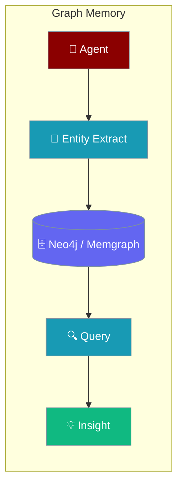
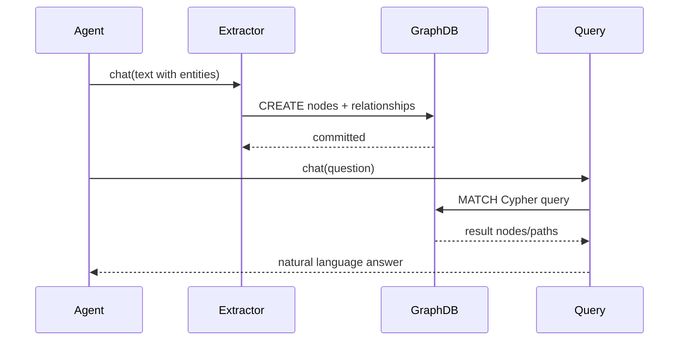

Graph memory stores agent knowledge as nodes and relationships in a graph database, enabling multi-hop reasoning and complex entity-centric retrieval.



## Quick Start

<Steps>
<Step title="Connect to Neo4j">
```python
# pip install neo4j
from praisonaiagents import Agent

agent = Agent(
    role="Knowledge Manager",
    goal="Build and query knowledge graphs",
    memory={
        "backend": "neo4j",
        "url": "bolt://localhost:7687",
        "username": "neo4j",
        "password": "your-password"
    }
)
```
</Step>

<Step title="Store and query relationships">
```python
agent.chat("""
John Smith is the CEO of TechCorp.
TechCorp acquired DataSystems in 2023.
Sarah Johnson works as CTO at TechCorp.
""")

result = agent.chat("Who works at TechCorp?")
print(result)
```
</Step>
</Steps>

---

## How It Works



---

## Setup

### Neo4j Setup

```python
from praisonaiagents import Agent

agent = Agent(
    role="Knowledge Manager",
    goal="Build and query knowledge graphs",
    memory={
        "backend": "neo4j",
        "url": "bolt://localhost:7687",
        "username": "neo4j",
        "password": "your-password"
    }
)
```

### Memgraph Setup

```python
# pip install gqlalchemy
from praisonaiagents import Agent

agent = Agent(
    role="Graph Analyst",
    goal="Analyze relationships in data",
    memory={
        "backend": "memgraph",
        "host": "localhost",
        "port": 7687,
        "username": "memgraph",
        "password": "your-password"
    }
)
```

---

## Graph Memory Operations

### Storing Entities and Relationships

```python
from praisonaiagents import Agent

agent = Agent(
    role="Relationship Mapper",
    goal="Map complex relationships",
    memory={
        "backend": "neo4j",
        "url": "bolt://localhost:7687",
        "username": "neo4j",
        "password": "your-password"
    }
)

result = agent.chat("""
John Smith is the CEO of TechCorp.
TechCorp acquired DataSystems in 2023.
Sarah Johnson works as CTO at TechCorp.
Sarah Johnson reports to John Smith.
""")

# Graph structure created:
# (John Smith:Person {role: "CEO"}) -[:LEADS]-> (TechCorp:Company)
# (TechCorp:Company) -[:ACQUIRED {year: 2023}]-> (DataSystems:Company)
# (Sarah Johnson:Person {role: "CTO"}) -[:WORKS_AT]-> (TechCorp:Company)
# (Sarah Johnson:Person) -[:REPORTS_TO]-> (John Smith:Person)
```

### Querying Graph Memory

```python
result = agent.chat("Who works at TechCorp?")
# Returns: John Smith (CEO), Sarah Johnson (CTO)

result = agent.chat("What companies are connected to John Smith?")
# Returns: TechCorp (CEO), DataSystems (through TechCorp acquisition)

result = agent.chat("Find all reporting relationships")
# Returns: Sarah Johnson reports to John Smith
```

---

## Advanced Graph Patterns

### Temporal Relationships

```python
from praisonaiagents import Agent, Memory

temporal_config = {
    "provider": "neo4j",
    "config": {"uri": "bolt://localhost:7687", "username": "neo4j", "password": "password"},
    "enable_temporal": True,
    "temporal_properties": ["valid_from", "valid_to"]
}

temporal_agent = Agent(
    role="History Tracker",
    goal="Track changes over time",
    memory=Memory(config=temporal_config)
)

temporal_agent.chat("""
John was CEO of StartupInc from 2018 to 2021.
John became CEO of TechCorp in 2021.
""")

result = temporal_agent.chat("What was John's role in 2020?")
# Returns: CEO of StartupInc
```

### Entity Resolution

```python
from praisonaiagents import Agent, Memory

entity_config = {
    "provider": "neo4j",
    "config": {"uri": "bolt://localhost:7687", "username": "neo4j", "password": "password"},
    "entity_resolution": {
        "enabled": True,
        "similarity_threshold": 0.85,
        "merge_strategy": "latest"
    }
}

entity_agent = Agent(
    role="Entity Resolver",
    goal="Maintain clean entity graph",
    memory=Memory(config=entity_config)
)

entity_agent.chat("J. Smith is the CEO")           # Resolves to John Smith
entity_agent.chat("Johnny Smith leads the company") # Also resolves to John Smith
```

### Graph Embeddings

```python
from praisonaiagents import Agent, Memory

embedding_config = {
    "provider": "neo4j",
    "config": {"uri": "bolt://localhost:7687", "username": "neo4j", "password": "password"},
    "embeddings": {
        "enabled": True,
        "model": "sentence-transformers/all-MiniLM-L6-v2",
        "dimensions": 384,
        "index_type": "hnsw"
    }
}

semantic_agent = Agent(
    role="Semantic Analyzer",
    goal="Find semantic relationships",
    memory=Memory(config=embedding_config)
)

result = semantic_agent.chat("Find concepts similar to artificial intelligence")
```

---

## Knowledge Graph Construction

```python
from praisonaiagents import Agent, Memory

class KnowledgeGraphAgent(Agent):

    def __init__(self, **kwargs):
        super().__init__(
            role="Knowledge Graph Builder",
            goal="Construct comprehensive knowledge graphs",
            memory=Memory(
                provider="neo4j",
                config={
                    "uri": "bolt://localhost:7687",
                    "username": "neo4j",
                    "password": "password"
                }
            ),
            **kwargs
        )

    def add_article(self, article_text):
        return self.chat(f"""
        Extract all entities and relationships from this article
        and add them to the knowledge graph:

        {article_text}

        Identify: People, Organizations, Locations, Events, Concepts,
        and all relationships between them.
        """)

kg_agent = KnowledgeGraphAgent()
kg_agent.add_article("Apple Inc. was founded by Steve Jobs in 1976 in Cupertino.")
```

---

## Cypher Query Integration

```python
from praisonaiagents import Agent, Memory

class CypherAgent(Agent):

    def __init__(self, neo4j_config, **kwargs):
        super().__init__(
            role="Cypher Expert",
            goal="Execute complex graph queries",
            memory=Memory(
                provider="neo4j",
                config=neo4j_config,
                enable_cypher=True
            ),
            **kwargs
        )

    def execute_cypher(self, query):
        return self.memory.cypher_query(query)

    def find_shortest_path(self, start_node, end_node):
        cypher = f"""
        MATCH path = shortestPath(
            (start {{name: '{start_node}'}})-[*]-(end {{name: '{end_node}'}})
        )
        RETURN path
        """
        return self.execute_cypher(cypher)
```

---

## Performance Optimization

### Index Configuration

```python
from praisonaiagents import Agent, Memory

optimized_config = {
    "provider": "neo4j",
    "config": {"uri": "bolt://localhost:7687", "username": "neo4j", "password": "password"},
    "indexes": [
        {"label": "Person", "property": "name"},
        {"label": "Company", "property": "name"},
    ],
    "constraints": [
        {"label": "Person", "property": "email", "type": "unique"},
    ]
}

agent = Agent(
    role="Performance Expert",
    goal="Fast graph operations",
    memory=Memory(config=optimized_config)
)
```

### Batch Operations

```python
from praisonaiagents import Agent, Memory

batch_config = {
    "provider": "neo4j",
    "config": {"uri": "bolt://localhost:7687", "username": "neo4j", "password": "password"},
    "batch_size": 1000,
    "transaction_size": 10000
}

batch_agent = Agent(
    role="Batch Processor",
    goal="Efficient bulk operations",
    memory=Memory(config=batch_config)
)
```

---

## Best Practices

<AccordionGroup>
<Accordion title="Design schema before storing data">
Define clear node labels and relationship types upfront. Changing the schema later requires data migration.
</Accordion>

<Accordion title="Create indexes on frequently queried properties">
Add indexes on name, email, and id properties to avoid full graph scans.

```python
"indexes": [
    {"label": "Person", "property": "name"},
    {"label": "Company", "property": "ticker"},
]
```
</Accordion>

<Accordion title="Use batch operations for bulk imports">
For more than a few hundred nodes, enable `batch_size` and `transaction_size` to avoid memory pressure.
</Accordion>

<Accordion title="Be consistent with relationship direction">
Always pick one canonical direction per relationship type (e.g., `WORKS_AT` always goes Person → Company). Mixed directions make Cypher queries harder to write.
</Accordion>
</AccordionGroup>

---

## Related

<CardGroup cols={2}>
<Card title="Advanced Memory" icon="brain" href="/features/advanced-memory">
  Vector and hybrid memory concepts
</Card>
<Card title="Knowledge Bases" icon="database" href="/concepts/knowledge">
  Knowledge management for agents
</Card>
</CardGroup>
