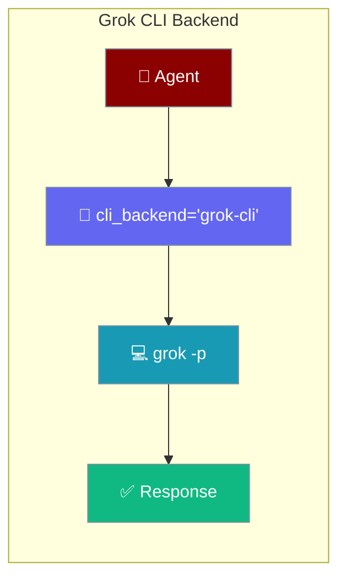
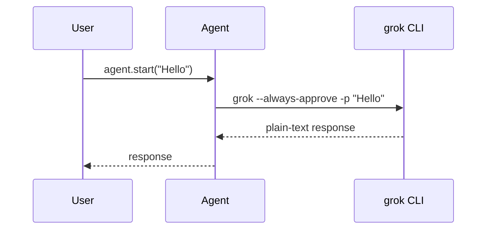

Run an Agent through your xAI subscription by delegating turns to the `grok` CLI.



The Agent sends each turn to `grok`, which uses your xAI subscription login — no `XAI_API_KEY` required.

## Quick Start

<Steps>
<Step title="Install the Grok CLI">
```bash
npm install -g @vibe-kit/grok-cli
grok --version
grok login
```
</Step>

<Step title="Run an Agent through Grok">
```python
from praisonaiagents import Agent

agent = Agent(
    name="assistant",
    instructions="You are a helpful assistant.",
    cli_backend="grok-cli",
)
agent.start("Hello")
```

<Note>
`cli_backend=` is deprecated (removal in 2.0.0). Prefer `runtime="grok-cli"` — see [Runtime Selection](/docs/features/runtime-selection).
</Note>
</Step>
</Steps>

---

## How It Works



Each turn spawns `grok` with your subscription session. No API key is passed.

---

## Configuration Options

The `grok-cli` backend ships with this default configuration:

| Option | Type | Default | Description |
|--------|------|---------|-------------|
| `command` | `str` | `"grok"` | CLI command (must be on PATH) |
| `args` | `List[str]` | `["--always-approve", "--output-format", "plain"]` | Default flags passed on every turn |
| `output` | `str` | `"text"` | Output format expected from the CLI |
| `input` | `str` | `"single"` | Prompt is passed as a single `-p` argument |
| `timeout_ms` | `int` | `300000` | Subprocess timeout (5 minutes) |

---

## CLI Flags Used

The backend builds the `grok` command with these flags:

| Flag | Purpose |
|------|---------|
| `--always-approve` | Skip interactive approval prompts |
| `--output-format plain` | Return plain-text output |
| `--cwd <path>` | Working directory (defaults to `os.getcwd()`) |
| `--resume <session_id>` | Resume a prior session (only when `session.is_resume`) |
| `--system-prompt-override <text>` | Inject the Agent's system prompt |
| `--image <path>` | Attach one or more image files |
| `-p <prompt>` | The user turn (added last) |

---

## Session Resume

The backend forwards `--resume <session_id>` only when the session is a resume — it checks `session.is_resume` before adding the flag. First turns start fresh.

---

## Configuration Surfaces

Override the default timeout (or any config field) with the dict form:

```python
from praisonaiagents import Agent

agent = Agent(
    name="assistant",
    cli_backend={"id": "grok-cli", "overrides": {"timeout_ms": 60000}},
)
agent.start("Hello")
```

Declare it in YAML for versioned configuration:

```yaml
framework: praisonai
agents:
  assistant:
    role: Helpful assistant
    cli_backend: grok-cli
```

---

## Best Practices

<AccordionGroup>
<Accordion title="Authenticate once with grok login">
Run `grok login` before your first Agent turn. The backend uses whatever subscription session the CLI is signed into — no `XAI_API_KEY` needed.
</Accordion>

<Accordion title="Raise the timeout for long turns">
The default `timeout_ms` is 5 minutes. For long-running turns, override it:
```python
agent = Agent(cli_backend={"id": "grok-cli", "overrides": {"timeout_ms": 600000}})
```
</Accordion>

<Accordion title="Attach images when needed">
Pass image paths and the backend forwards each as `--image <path>`. Useful for visual tasks the model can inspect.
</Accordion>

<Accordion title="Prefer runtime='grok-cli'">
`cli_backend=` still works but emits a `DeprecationWarning`. Use `runtime="grok-cli"` for the modern equivalent, or run `praisonai doctor fix --execute` to migrate YAML.
</Accordion>
</AccordionGroup>

---

## Related

<CardGroup cols={2}>
<Card title="Codex CLI" icon="code" href="/docs/code/codex-cli">
  Delegate Agent turns to OpenAI's Codex CLI using your ChatGPT subscription.
</Card>
<Card title="Gemini CLI" icon="google" href="/docs/code/gemini-cli">
  Delegate Agent turns to Google's Gemini CLI using your Google account.
</Card>
<Card title="Claude Code" icon="message-bot" href="/docs/code/claude-code">
  The flagship CLI backend — works with Claude Pro / Max subscriptions.
</Card>
<Card title="CLI Backend Protocol" icon="plug" href="/docs/features/cli-backend-protocol">
  How CLI backends plug into the Agent API.
</Card>
</CardGroup>
