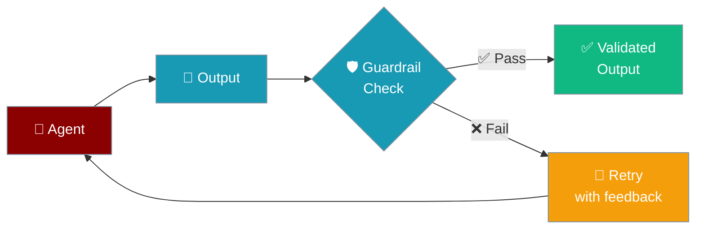
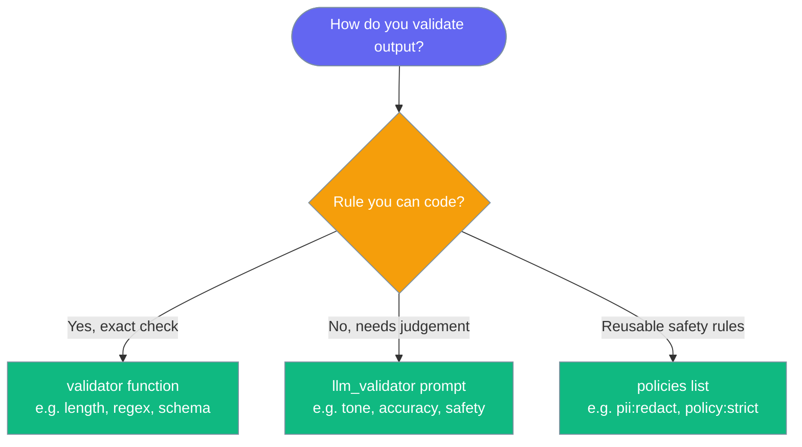
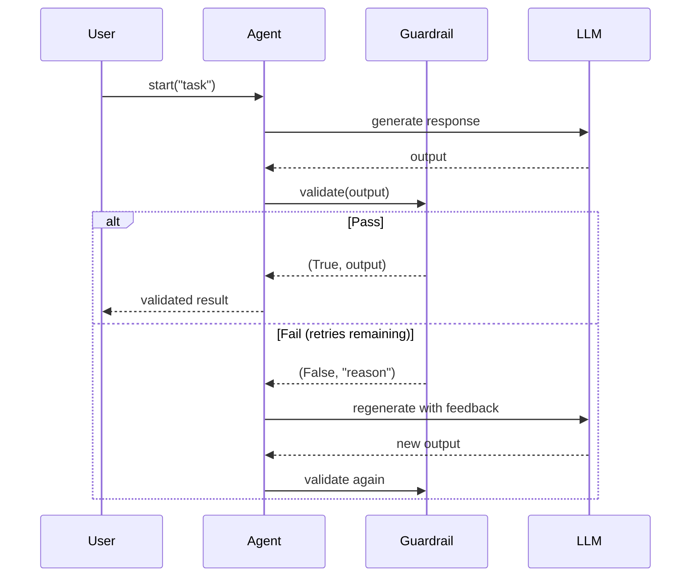

```python
from praisonaiagents import Agent

agent = Agent(name="safe-assistant", instructions="Be helpful and stay within policy.")
agent.start("Draft a customer-facing reply")
```
Guardrails validate agent output against your criteria and automatically retry if the output fails.

The user sends a prompt; guardrails validate input and output before the agent responds or calls tools.


```mermaid
graph LR
    Agent["🤖 Agent"] --> Output["📄 Output"]
    Output --> Check{"🛡️ Guardrail\nCheck"}
    Check -->|"✅ Pass"| Result["✅ Validated\nOutput"]
    Check -->|"❌ Fail"| Retry["🔄 Retry\nwith feedback"]
    Retry --> Agent

    classDef agent fill:#8B0000,stroke:#7C90A0,color:#fff
    classDef tool fill:#189AB4,stroke:#7C90A0,color:#fff
    classDef success fill:#10B981,stroke:#7C90A0,color:#fff
    classDef warning fill:#F59E0B,stroke:#7C90A0,color:#fff

    class Agent agent
    class Output,Check tool
    class Result success
    class Retry warning
```

## Quick Start

<Steps>
<Step title="Simple Usage">
Pass a validation function to an agent:

```python
from praisonaiagents import Agent

def validate_length(output):
    word_count = len(output.raw.split())
    if word_count < 100:
        return False, f"Too short: {word_count} words (need 100+)"
    return True, output

agent = Agent(
    name="Writer",
    instructions="Write detailed articles",
    guardrails=validate_length
)

result = agent.start("Write about renewable energy")
```
</Step>

<Step title="With Configuration">
Use `GuardrailConfig` for LLM-based validation with retry settings:

```python
from praisonaiagents import Agent, GuardrailConfig

agent = Agent(
    name="Writer",
    instructions="Write professional articles",
    guardrails=GuardrailConfig(
        llm_validator="Ensure the response is professional, accurate, and at least 150 words",
        max_retries=3,
        on_fail="retry",
    )
)

result = agent.start("Write about machine learning trends")
```
</Step>
</Steps>

---

## Which Validator Should I Use?

Pick a validator strategy based on how you need to check the output.


```mermaid
graph TB
    Start([How do you validate output?]) --> Q1{Rule you can code?}
    Q1 -->|Yes, exact check| A[validator function<br/>e.g. length, regex, schema]
    Q1 -->|No, needs judgement| B[llm_validator prompt<br/>e.g. tone, accuracy, safety]
    Q1 -->|Reusable safety rules| C[policies list<br/>e.g. pii:redact, policy:strict]

    classDef start fill:#6366F1,stroke:#7C90A0,color:#fff
    classDef question fill:#F59E0B,stroke:#7C90A0,color:#fff
    classDef answer fill:#10B981,stroke:#7C90A0,color:#fff

    class Start start
    class Q1 question
    class A,B,C answer
```

---

## How It Works


```mermaid
sequenceDiagram
    participant User
    participant Agent
    participant Guardrail
    participant LLM

    User->>Agent: start("task")
    Agent->>LLM: generate response
    LLM-->>Agent: output
    Agent->>Guardrail: validate(output)
    alt Pass
        Guardrail-->>Agent: (True, output)
        Agent-->>User: validated result
    else Fail (retries remaining)
        Guardrail-->>Agent: (False, "reason")
        Agent->>LLM: regenerate with feedback
        LLM-->>Agent: new output
        Agent->>Guardrail: validate again
    end
```

Guardrails work identically in sync (`.start()`, `.chat()`) and async (`.astart()`, `.achat()`) execution paths.

---

## Configuration Options

<Card title="GuardrailConfig SDK Reference" icon="code" href="/docs/sdk/reference/python/classes/GuardrailConfig">
  Full parameter reference for GuardrailConfig
</Card>

**Precedence ladder** — choose the level you need:

```python
# Level 1: Callable (function validator)
agent = Agent(guardrails=my_validator_fn)

# Level 2: String (natural language criteria)
agent = Agent(guardrails="Ensure response is professional and helpful")

# Level 3: List (policy strings)
agent = Agent(guardrails=["policy:strict", "pii:redact"])

# Level 4: GuardrailConfig (full control)
agent = Agent(guardrails=GuardrailConfig(
    validator=my_validator_fn,
    max_retries=3,
    on_fail="retry",
))
```

```python
from praisonaiagents import Agent, GuardrailConfig

agent = Agent(
    instructions="...",
    guardrails=GuardrailConfig(
        validator=my_function,
        llm_validator="Natural language validation criteria",
        max_retries=3,
        on_fail="retry",
    )
)
```

| Option | Type | Default | Description |
|--------|------|---------|-------------|
| `validator` | `Callable \| None` | `None` | Function `(output) -> (bool, Any)` for programmatic validation |
| `llm_validator` | `str \| None` | `None` | Natural language criteria for LLM-based validation |
| `max_retries` | `int` | `3` | Maximum retry attempts on validation failure |
| `on_fail` | `str` | `"retry"` | Action on failure: `"retry"`, `"skip"`, or `"raise"` |
| `policies` | `List[str]` | `[]` | Policy strings like `["policy:strict", "pii:redact"]` |

---

## Common Patterns

### Function-Based Validation

```python
from praisonaiagents import Agent

def validate_json(output):
    import json
    try:
        json.loads(output.raw)
        return True, output
    except json.JSONDecodeError as e:
        return False, f"Invalid JSON: {e}"

agent = Agent(
    name="DataAgent",
    instructions="Always respond with valid JSON",
    guardrails=validate_json
)

result = agent.start("Give me a list of 3 fruits as JSON")
```

### Natural Language Validation

```python
from praisonaiagents import Agent

agent = Agent(
    name="Writer",
    instructions="Write product descriptions",
    guardrails="Must be professional, 100-200 words, include a call to action, and contain no pricing"
)

result = agent.start("Write a description for our premium coffee mug")
```

### Multi-Agent with Guardrails

```python
from praisonaiagents import Agent, Task, PraisonAIAgents

def check_accuracy(output):
    if "estimate" in output.raw.lower() or "approximately" in output.raw.lower():
        return False, "Response must use exact values, not estimates"
    return True, output

researcher = Agent(name="Researcher", instructions="Research and provide exact facts")
writer = Agent(name="Writer", instructions="Write clear summaries")

task1 = Task(
    description="Find the population of Tokyo",
    agent=researcher,
    guardrails=check_accuracy,
    expected_output="Exact population figure"
)
task2 = Task(
    description="Write a summary using the research",
    agent=writer,
    expected_output="One-paragraph summary"
)

agents = PraisonAIAgents(agents=[researcher, writer], tasks=[task1, task2])
result = agents.start()
```

---

## Best Practices

<AccordionGroup>
  <Accordion title="Write specific, measurable criteria">
    Vague guardrails like "be good" are hard to enforce. Use concrete criteria: "must be between 100 and 200 words" or "must contain a JSON array".
  </Accordion>
  <Accordion title="Use function validators for structured data">
    When validating JSON, code, or data formats, use a function validator. LLM validators are slower and better suited for qualitative criteria like tone or completeness.
  </Accordion>
  <Accordion title="Return helpful error messages on failure">
    The `(False, "reason")` message is passed back to the agent as feedback. Make it actionable — tell the agent exactly what to fix.
  </Accordion>
  <Accordion title="Set max_retries conservatively">
    Start with `max_retries=2`. Increasing retries adds latency and cost. If the agent fails repeatedly, the validator criteria or instructions may need refinement.
  </Accordion>
</AccordionGroup>

---

<Tip>
Guardrails validate an agent's *output* and can retry. To **block an action before it happens** (a tool call, an inbound message, or an LLM request), see **Blocking Plugins** in [Plugins](/docs/features/plugins#blocking-plugins-guardrails--policies).
</Tip>

---

## Related

<CardGroup cols={2}>
  <Card title="Approval" icon="circle-check" href="/docs/features/approval">
    Add human-in-the-loop approval steps
  </Card>
  <Card title="Hooks" icon="webhook" href="/docs/features/hooks">
    Intercept and modify agent behavior at lifecycle points
  </Card>
  <Card title="Gateway Self-Lifecycle Guard" icon="shield-halved" href="/features/gateway-self-lifecycle-guard">
    Block agent commands that would stop or restart this gateway
  </Card>
</CardGroup>
