# Guardrails System

Guardrails provide output validation and quality assurance for agent tasks, ensuring results meet specified criteria before being accepted.

```mermaid
graph LR
    Task[📋 Task] --> Agent[🤖 Agent]
    Agent --> Output[📄 Output]
    Output --> Guardrail{🛡️ Guardrail}
    
    Guardrail -->|Pass| Success[✅ Validated Output]
    Guardrail -->|Fail| Retry{🔄 Retry?}
    
    Retry -->|Yes| Agent
    Retry -->|No| Error[❌ Task Failed]
    
    subgraph Guardrail Types
        FUNC[🔧 Function-based]
        LLM[🧠 LLM-based]
    end
    
    classDef task fill:#8B0000,stroke:#7C90A0,color:#fff
    classDef process fill:#189AB4,stroke:#7C90A0,color:#fff
    classDef validation fill:#2E8B57,stroke:#7C90A0,color:#fff
    classDef result fill:#FF6B6B,stroke:#7C90A0,color:#fff
    
    class Task task
    class Agent,Output process
    class Guardrail,FUNC,LLM validation
    class Success,Error,Retry result
```



## Overview

Guardrails ensure task outputs meet quality and safety criteria through:

* **Function-based validation** for structured checks
* **LLM-based validation** for natural language criteria
* **Automatic retry mechanisms** for failed validations
* **Custom validation logic** for specific requirements

## Quick Start

<CodeGroup>
```python Function Guardrail
from praisonaiagents import Agent, Task

# Define validation function
def validate_length(task_output):
    """Ensure output is at least 500 words"""
    word_count = len(task_output.raw.split())
    
    if word_count < 500:
        return False, f"Output too short: {word_count} words"
    
    return True, task_output

# Create task with guardrail
task = Task(
    description="Write a detailed article about AI",
    agent=writer_agent,
    guardrail=validate_length,
    expected_output="Article of at least 500 words"
)
```

```python Natural Language Guardrail
from praisonaiagents import Agent, Task

# Create task with natural language guardrail
task = Task(
    description="Generate a product description",
    agent=writer_agent,
    guardrail="""The output must:
    - Be professional and engaging
    - Include key product features
    - Be between 100-200 words
    - Not contain any pricing information
    - Have a clear call to action""",
    expected_output="Product description meeting criteria"
)
```

```python LLM Guardrail Class
from praisonaiagents.guardrails import LLMGuardrail

# Create reusable guardrail
quality_guardrail = LLMGuardrail(
    description="""Validate that the output:
    1. Is factually accurate
    2. Is well-structured with clear sections
    3. Uses appropriate technical language
    4. Includes relevant examples
    5. Has no grammatical errors""",
    llm="gpt-4"  # Specific LLM for validation
)

# Use in multiple tasks
task1 = Task(
    description="Write technical documentation",
    agent=doc_agent,
    guardrail=quality_guardrail
)
```
</CodeGroup>

## Guardrail Types

### Function-Based Guardrails

Function guardrails provide programmatic validation:

<CodeGroup>
```python Basic Validation
def validate_json(task_output):
    """Ensure output is valid JSON"""
    import json
    
    try:
        data = json.loads(task_output.raw)
        return True, task_output
    except json.JSONDecodeError as e:
        return False, f"Invalid JSON: {str(e)}"
```

```python Complex Validation
def validate_code_output(task_output):
    """Validate generated code"""
    code = task_output.raw
    
    # Check for syntax errors
    try:
        compile(code, '<string>', 'exec')
    except SyntaxError as e:
        return False, f"Syntax error: {e}"
    
    # Check for required patterns
    if "def main" not in code:
        return False, "Missing main function"
    
    if not code.strip().endswith("if __name__ == '__main__':"):
        return False, "Missing proper entry point"
    
    # Check for security issues
    dangerous = ['eval', 'exec', '__import__']
    for keyword in dangerous:
        if keyword in code:
            return False, f"Dangerous keyword found: {keyword}"
    
    return True, task_output
```

```python Data Validation
def validate_data_analysis(task_output):
    """Validate data analysis results"""
    import re
    
    content = task_output.raw
    
    # Check for required sections
    required_sections = [
        "Summary Statistics",
        "Key Findings",
        "Recommendations"
    ]
    
    for section in required_sections:
        if section not in content:
            return False, f"Missing section: {section}"
    
    # Check for data accuracy
    numbers = re.findall(r'\d+\.?\d*%', content)
    if len(numbers) < 3:
        return False, "Insufficient statistical data"
    
    # Validate percentage values
    for num in numbers:
        value = float(num.rstrip('%'))
        if value > 100:
            return False, f"Invalid percentage: {num}"
    
    return True, task_output
```
</CodeGroup>

### LLM-Based Guardrails

LLM guardrails use natural language for validation:

<CodeGroup>
```python Simple String Guardrail
task = Task(
    description="Write a children's story",
    agent=writer_agent,
    guardrail="The story must be appropriate for ages 5-8, use simple language, and have a positive message"
)
```

```python Detailed Criteria
task = Task(
    description="Create API documentation",
    agent=tech_writer,
    guardrail="""
    Validate the documentation includes:
    1. Clear endpoint descriptions
    2. Request/response examples
    3. Authentication details
    4. Error codes and handling
    5. Rate limiting information
    
    The tone should be technical but accessible.
    All code examples must be properly formatted.
    """
)
```

```python Advanced LLM Guardrail
guardrail = LLMGuardrail(
    description="""
    Check ALL of the following:
    
    CONTENT REQUIREMENTS:
    - Factually accurate information
    - Comprehensive coverage of topic
    - Logical flow and structure
    
    STYLE REQUIREMENTS:
    - Professional tone
    - Active voice preferred
    - Clear and concise sentences
    
    TECHNICAL REQUIREMENTS:
    - Proper citations where needed
    - No plagiarised content
    - SEO-friendly formatting
    
    MUST AVOID:
    - Biased language
    - Unsubstantiated claims
    - Excessive jargon
    """,
    llm="gpt-4"
)
```
</CodeGroup>

## Advanced Features

### Retry Configuration

Configure retry behaviour for failed validations:

```python
task = Task(
    description="Generate validated content",
    agent=agent,
    guardrail=validation_function,
    max_retries=3,  # Maximum retry attempts
    retry_delay=2,  # Delay between retries (seconds)
    retry_with_feedback=True  # Pass failure reason to agent
)
```

### Composite Guardrails

Combine multiple validation criteria:

```python
def composite_guardrail(task_output):
    """Multiple validation checks"""
    # Check 1: Length
    if len(task_output.raw) < 100:
        return False, "Output too short"
    
    # Check 2: Format
    if not task_output.raw.strip().endswith('.'):
        return False, "Output must end with period"
    
    # Check 3: Content quality (using LLM)
    quality_check = LLMGuardrail(
        "Is this content professional and error-free?"
    )
    
    result = quality_check(task_output)
    if not result.success:
        return False, result.error
    
    return True, task_output
```

### Guardrail Results

Access detailed validation results:

```python
from praisonaiagents.guardrails import GuardrailResult

class CustomGuardrail:
    def __call__(self, task_output):
        # Perform validation
        if self.validate(task_output):
            return GuardrailResult(
                success=True,
                result=task_output
            )
        else:
            return GuardrailResult(
                success=False,
                error="Validation failed: specific reason",
                details={
                    "score": 0.3,
                    "issues": ["issue1", "issue2"]
                }
            )
```

## Use Cases

<CardGroup cols={2}>
  <Card icon="shield" title="Content Safety">
    Ensure generated content is safe and appropriate
    ```python
    guardrail="No offensive, harmful, or inappropriate content"
    ```
  </Card>
  <Card icon="chart-line" title="Data Validation">
    Validate analysis results and reports
    ```python
    def validate_analysis(output):
        # Check data accuracy
        # Verify calculations
        # Ensure completeness
    ```
  </Card>
  <Card icon="code" title="Code Quality">
    Ensure generated code is safe and functional
    ```python
    def validate_code(output):
        # Syntax checking
        # Security scanning
        # Best practices
    ```
  </Card>
  <Card icon="gavel" title="Compliance">
    Meet regulatory and policy requirements
    ```python
    guardrail="Must comply with GDPR, include privacy notice"
    ```
  </Card>
</CardGroup>

## Integration Patterns

### With Agents

```python
from praisonaiagents import Agent, Task, PraisonAIAgents

# Define guardrails
def technical_accuracy(output):
    """Validate technical content"""
    # Implementation
    pass

# Create specialized agents
writer = Agent(
    name="Technical Writer",
    instructions="Write accurate technical content"
)

reviewer = Agent(
    name="Technical Reviewer",
    instructions="Review and improve technical content"
)

# Create tasks with guardrails
tasks = [
    Task(
        description="Write Python tutorial",
        agent=writer,
        guardrail=technical_accuracy,
        expected_output="Accurate Python tutorial"
    ),
    Task(
        description="Review and enhance the tutorial",
        agent=reviewer,
        guardrail="Ensure tutorial is beginner-friendly and error-free",
        expected_output="Polished tutorial"
    )
]

# Run with validation
agents = PraisonAIAgents(agents=[writer, reviewer], tasks=tasks)
result = agents.start()
```

### With Dynamic Guardrails

```python
class DynamicGuardrail:
    def __init__(self, config):
        self.min_length = config.get('min_length', 100)
        self.required_sections = config.get('sections', [])
        self.quality_threshold = config.get('quality', 0.8)
    
    def __call__(self, task_output):
        content = task_output.raw
        
        # Length check
        if len(content.split()) < self.min_length:
            return False, f"Minimum {self.min_length} words required"
        
        # Section check
        for section in self.required_sections:
            if section not in content:
                return False, f"Missing section: {section}"
        
        # Quality check (using LLM)
        quality_prompt = f"""
        Rate this content quality from 0-1:
        {content[:500]}...
        
        Consider: clarity, accuracy, completeness
        """
        
        # Implement quality scoring logic
        
        return True, task_output

# Use dynamic guardrail
guardrail = DynamicGuardrail({
    'min_length': 500,
    'sections': ['Introduction', 'Main Content', 'Conclusion'],
    'quality': 0.85
})

task = Task(
    description="Write comprehensive guide",
    agent=agent,
    guardrail=guardrail
)
```

## Best Practices

<CardGroup cols={2}>
  <Card icon="bullseye" title="Clear Criteria">
    - Define specific, measurable criteria
    - Document validation requirements
    - Provide helpful error messages
    - Include examples of valid output
  </Card>
  <Card icon="balance-scale" title="Balanced Approach">
    - Use function guardrails for simple checks
    - Reserve LLM guardrails for complex validation
    - Implement caching for repeated validations
  </Card>
  <Card icon="redo" title="Retry Strategy">
    - Set appropriate retry limits
    - Provide detailed failure reasons
    - Suggest corrections when possible
  </Card>
  <Card icon="bug" title="Testing">
    - Log validation failures
    - Handle edge cases gracefully
    - Test guardrails independently
    - Verify both pass and fail cases
    - Check retry behaviour
    - Monitor validation performance
  </Card>
</CardGroup>

## Complete Example

<CodeGroup>
```python Blog Post Generator
from praisonaiagents import Agent, Task, PraisonAIAgents
from praisonaiagents.guardrails import LLMGuardrail

# Define agents
researcher = Agent(
    name="Researcher",
    instructions="Research topics thoroughly and provide accurate information"
)

writer = Agent(
    name="Blog Writer",
    instructions="Write engaging, SEO-friendly blog posts"
)

editor = Agent(
    name="Editor",
    instructions="Polish and perfect blog posts"
)

# Define guardrails
def seo_validation(task_output):
    """Validate SEO requirements"""
    content = task_output.raw
    
    # Check title
    lines = content.split('\n')
    if not lines[0].startswith('#'):
        return False, "Missing H1 title"
    
    # Check meta description
    if 'Meta description:' not in content:
        return False, "Missing meta description"
    
    # Check keyword density (example: "AI" keyword)
    keyword_count = content.lower().count('ai')
    word_count = len(content.split())
    density = (keyword_count / word_count) * 100
    
    if density < 1 or density > 3:
        return False, f"Keyword density {density:.1f}% (target: 1-3%)"
    
    return True, task_output

# LLM-based quality guardrail
quality_guardrail = LLMGuardrail(
    description="""
    Evaluate if the blog post:
    1. Has a compelling introduction that hooks readers
    2. Provides valuable, actionable information
    3. Uses clear, concise language
    4. Includes relevant examples or case studies
    5. Has a strong conclusion with call-to-action
    6. Maintains consistent tone throughout
    7. Is free of factual errors
    8. Flows logically from point to point
    """,
    llm="gpt-4"
)

# Create tasks with guardrails
tasks = [
    Task(
        description="Research the topic: 'Future of AI in Healthcare'",
        agent=researcher,
        expected_output="Comprehensive research notes"
    ),
    Task(
        description="Write a 1000-word blog post based on the research",
        agent=writer,
        guardrail=seo_validation,
        expected_output="SEO-optimized blog post"
    ),
    Task(
        description="Edit and polish the blog post",
        agent=editor,
        guardrail=quality_guardrail,
        expected_output="Publication-ready blog post",
        context=[tasks[1]]  # Use previous task output
    )
]

# Run the blog generation pipeline
agents = PraisonAIAgents(
    agents=[researcher, writer, editor],
    tasks=tasks,
    verbose=True
)

# Execute with guardrails
result = agents.start()

# The system will:
# 1. Research the topic
# 2. Write the blog post (retry if SEO validation fails)
# 3. Edit the post (retry if quality standards not met)
# 4. Return the final, validated blog post
```
</CodeGroup>

## Next Steps

<CardGroup cols={2}>
  <Card icon="shield-check" href="/features/approval">
    Learn about human-in-the-loop approvals
  </Card>
  <Card icon="list-check" href="/concepts/tasks">
    Explore advanced task configurations
  </Card>
</CardGroup>