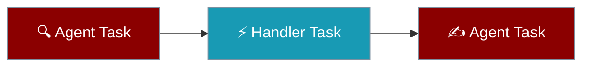
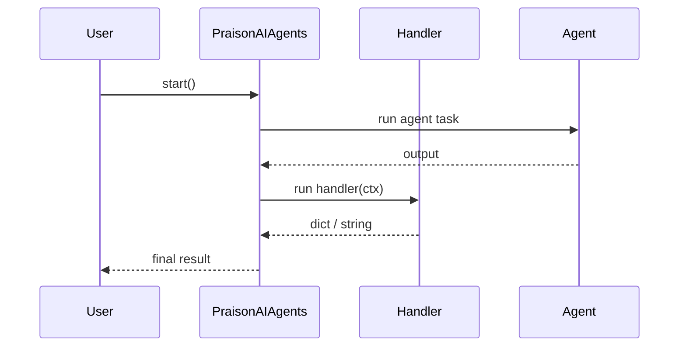

A handler task runs your Python function instead of an LLM.

<Note>
Available under both `PraisonAIAgents` / `AgentTeam` and the standalone `Workflow` engine as of PraisonAI [PR #4907](https://github.com/MervinPraison/PraisonAI/pull/4907). Earlier releases only honoured `handler` inside the standalone `Workflow` engine.
</Note>



## Quick Start

<Steps>
<Step title="Handler only">

A task with a `handler` runs your function directly — no agent required.

```python
from praisonaiagents import Agent, Task, PraisonAIAgents

score = Task(name="score", handler=lambda ctx: {"score": 92})

team = PraisonAIAgents(tasks=[score])
team.start()
```

</Step>

<Step title="Handler in a team with agents">

An agent researches, a handler post-processes, and another agent writes the report.

```python
from praisonaiagents import Agent, Task, PraisonAIAgents

researcher = Agent(name="Researcher", instructions="Research the topic and list key facts.")
writer     = Agent(name="Writer",     instructions="Write a short report from the facts.")

research = Task(
    name="research",
    description="Research renewable energy trends",
    agent=researcher,
    output_variable="research_data",
)

def summarise(ctx):
    facts = ctx.variables.get("research_data", "")
    return {"summary": facts[:500]}

process = Task(name="process", handler=summarise, context=[research])

report = Task(
    name="report",
    description="Write a report using {{summary}}",
    agent=writer,
    context=[process],
)

team = PraisonAIAgents(
    agents=[researcher, writer],
    tasks=[research, process, report],
)
team.start()
```

</Step>
</Steps>

---

## How It Works

The team runs each task in order, calling your function for handler tasks and the model for agent tasks.



---

## The context argument

The handler receives a `WorkflowContext` with `.input`, `.current_step`, and `.variables`.

```python
from praisonaiagents import Task

def enrich(ctx):
    upstream = ctx.variables["research_data"]
    return {"enriched": upstream.upper()}

Task(name="enrich", handler=enrich)
```

| Field | Type | Description |
|-------|------|-------------|
| `input` | `str` | Original run input |
| `current_step` | `str` | Name of the current task |
| `variables` | `dict` | Shared variables from upstream tasks (keyed by `output_variable`) |

---

## Async handlers

An `async def` handler works too — the SDK awaits it under both `start()` and `astart()`.

```python
from praisonaiagents import Task

async def fetch_price(ctx):
    return {"price": 42.0}

Task(name="fetch_price", handler=fetch_price)
```

---

## Common Patterns

A deterministic data step between two LLM steps keeps parsing predictable.

```python
from praisonaiagents import Agent, Task, PraisonAIAgents

analyst = Agent(name="Analyst", instructions="Return a JSON list of numbers.")

collect = Task(name="collect", description="List sales figures", agent=analyst, output_variable="figures")

def total(ctx):
    figures = ctx.variables.get("figures", "")
    return {"total": sum(int(x) for x in figures.split() if x.isdigit())}

sum_task = Task(name="sum", handler=total, context=[collect])

PraisonAIAgents(agents=[analyst], tasks=[collect, sum_task]).start()
```

Skip the LLM when the answer already lives in variables.

```python
from praisonaiagents import Task

def use_cached(ctx):
    return ctx.variables.get("cached_answer", "no answer yet")

Task(name="answer", handler=use_cached)
```

---

## Best Practices

<AccordionGroup>
<Accordion title="Keep handlers pure">
A handler should compute from its inputs and return a value — avoid hidden global state so runs stay repeatable.
</Accordion>

<Accordion title="Return strings or dicts">
Return a plain string or a dict. A dict merges into the shared variables so later tasks can read each key.
</Accordion>

<Accordion title="Use output_variable to hand data to the next step">
Set `output_variable` on the handler task to name its result, then read it downstream with `{{name}}` or `ctx.variables["name"]`.
</Accordion>

<Accordion title="Prefer handlers for API and DB calls">
Reach for a handler when a step is a deterministic API or database call that does not need an LLM.
</Accordion>
</AccordionGroup>

---

## Related

<CardGroup cols={2}>
<Card title="Tasks" icon="list-check" href="/concepts/tasks">
  The full Task parameter reference
</Card>
<Card title="Conditions" icon="git-branch" href="/features/conditions">
  Skip tasks with should_run gates
</Card>
<Card title="Output Variables" icon="arrow-right-arrow-left" href="/features/task-output-variables">
  Pass values between tasks
</Card>
<Card title="Workflows" icon="diagram-project" href="/features/workflows">
  Chain agents into pipelines
</Card>
</CardGroup>
