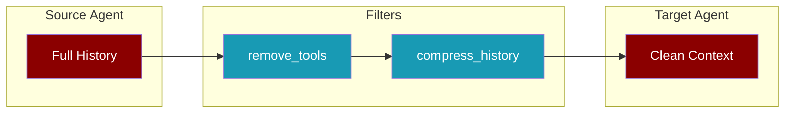
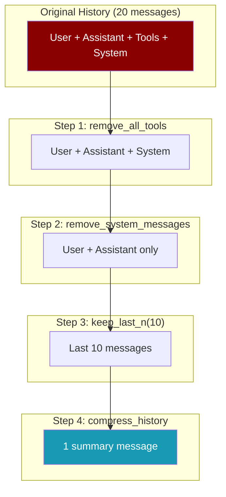

<Info>
**New in v2.x**: Chain multiple filters with `input_filter=[filter1, filter2]` and use `compress_history` to reduce token usage.
</Info>

## Overview

Handoff filters let you control what context is passed when one agent hands off to another. This helps:

- **Reduce token usage** by removing unnecessary messages
- **Focus context** on relevant information
- **Protect privacy** by filtering sensitive data



## Quick Start

<CodeGroup>
```python Single Filter
from praisonaiagents import Agent, Handoff, handoff_filters

analyst = Agent(name="Analyst", instructions="Analyze data")

coordinator = Agent(
    name="Coordinator",
    handoffs=[
        Handoff(
            agent=analyst,
            input_filter=handoff_filters.compress_history
        )
    ]
)
```

```python Filter Chaining
from praisonaiagents import Agent, Handoff, handoff_filters

analyst = Agent(name="Analyst", instructions="Analyze data")

coordinator = Agent(
    name="Coordinator",
    handoffs=[
        Handoff(
            agent=analyst,
            input_filter=[
                handoff_filters.remove_all_tools,
                handoff_filters.remove_system_messages,
                handoff_filters.compress_history,
            ]
        )
    ]
)
```
</CodeGroup>

## Available Filters

### compress_history

Compresses all messages into a single summary message. Great for reducing token usage.

```python
from praisonaiagents.agent.handoff import handoff_filters

# Before: Multiple messages
# [
#   {"role": "user", "content": "Hello"},
#   {"role": "assistant", "content": "Hi there!"},
#   {"role": "user", "content": "How are you?"}
# ]

# After: Single compressed message
# [{"role": "user", "content": "Previous conversation summary:\n[user]: Hello\n[assistant]: Hi there!\n[user]: How are you?"}]
```

### remove_all_tools

Removes all tool-related messages (tool calls and tool results).

```python
# Removes:
# - Messages with role="tool"
# - Messages with tool_calls field
```

### keep_last_n_messages

Keeps only the last N messages.

```python
# Keep last 5 messages
filter_fn = handoff_filters.keep_last_n_messages(5)
```

### remove_system_messages

Removes all system messages from the history.

```python
# Removes all messages where role="system"
```

## Filter Chaining

<Tip>
Filters are applied **in order**. Put removal filters first, then compression last.
</Tip>

```python
from praisonaiagents import Agent, Handoff, handoff_filters

# Recommended order:
# 1. Remove unwanted content
# 2. Limit message count
# 3. Compress remaining

handoff = Handoff(
    agent=target_agent,
    input_filter=[
        handoff_filters.remove_all_tools,      # First: remove tool noise
        handoff_filters.remove_system_messages, # Second: remove system prompts
        handoff_filters.keep_last_n_messages(10), # Third: limit to recent
        handoff_filters.compress_history,       # Last: compress into one
    ]
)
```



## Custom Filters

Create your own filter function:

```python
from praisonaiagents.agent.handoff import HandoffInputData

def my_custom_filter(data: HandoffInputData) -> HandoffInputData:
    """Remove messages containing sensitive keywords."""
    sensitive_words = ["password", "secret", "api_key"]
    
    filtered = []
    for msg in data.messages:
        if isinstance(msg, dict):
            content = msg.get("content", "").lower()
            if not any(word in content for word in sensitive_words):
                filtered.append(msg)
    
    data.messages = filtered
    return data

# Use with handoff
handoff = Handoff(
    agent=target_agent,
    input_filter=[
        my_custom_filter,
        handoff_filters.compress_history,
    ]
)
```

## API Reference

### HandoffInputData

The data structure passed to filter functions:

```python
@dataclass
class HandoffInputData:
    messages: List[Dict[str, Any]]  # Conversation messages
    context: Dict[str, Any]         # Additional context
    source_agent: str               # Name of source agent
    handoff_depth: int = 0          # Current handoff depth
    handoff_chain: List[str] = []   # Chain of agent names
```

### Filter Function Signature

```python
def filter_function(data: HandoffInputData) -> HandoffInputData:
    # Modify data.messages as needed
    return data
```

## Examples

<AccordionGroup>
<Accordion title="Token-Efficient Handoff">
```python
from praisonaiagents import Agent, Handoff, handoff_filters

# Minimize tokens passed to specialist
specialist = Agent(name="Specialist", instructions="Handle complex tasks")

coordinator = Agent(
    name="Coordinator",
    handoffs=[
        Handoff(
            agent=specialist,
            input_filter=[
                handoff_filters.remove_all_tools,
                handoff_filters.keep_last_n_messages(3),
                handoff_filters.compress_history,
            ]
        )
    ]
)
```
</Accordion>

<Accordion title="Privacy-Aware Handoff">
```python
from praisonaiagents import Agent, Handoff, handoff_filters
from praisonaiagents.agent.handoff import HandoffInputData

def remove_pii(data: HandoffInputData) -> HandoffInputData:
    """Remove personally identifiable information."""
    import re
    
    for msg in data.messages:
        if isinstance(msg, dict) and "content" in msg:
            # Remove email addresses
            msg["content"] = re.sub(
                r'\b[\w.-]+@[\w.-]+\.\w+\b',
                '[EMAIL REDACTED]',
                msg["content"]
            )
            # Remove phone numbers
            msg["content"] = re.sub(
                r'\b\d{3}[-.]?\d{3}[-.]?\d{4}\b',
                '[PHONE REDACTED]',
                msg["content"]
            )
    
    return data

external_agent = Agent(name="External", instructions="Process request")

internal_agent = Agent(
    name="Internal",
    handoffs=[
        Handoff(
            agent=external_agent,
            input_filter=[remove_pii, handoff_filters.compress_history]
        )
    ]
)
```
</Accordion>

<Accordion title="Focus on Recent Context">
```python
from praisonaiagents import Agent, Handoff, handoff_filters

# Only pass last 5 messages, no tools
analyst = Agent(name="Analyst", instructions="Analyze recent conversation")

coordinator = Agent(
    name="Coordinator",
    handoffs=[
        Handoff(
            agent=analyst,
            input_filter=[
                handoff_filters.remove_all_tools,
                handoff_filters.keep_last_n_messages(5),
            ]
        )
    ]
)
```
</Accordion>
</AccordionGroup>

## Related

- [Handoffs](/features/handoffs) - Agent-to-agent delegation
- [Agent as Tool](/features/agent-as-tool) - Use agents as callable tools
- [Context Policies](/features/context-policies) - Control context sharing
