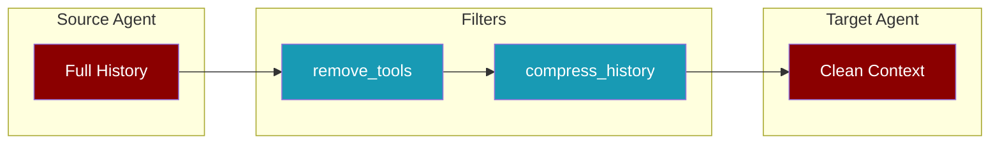

<Info>
**New in v2.x**: Chain multiple filters with `input_filter=[filter1, filter2]` and use `compress_history` to reduce token usage.
</Info>

## Overview

Handoff filters let you control what context is passed when one agent hands off to another. This helps:

- **Reduce token usage** by removing unnecessary messages
- **Focus context** on relevant information
- **Protect privacy** by filtering sensitive data


```mermaid
flowchart LR
    subgraph Source["Source Agent"]
        H[Full History]
    end
    
    subgraph Filters["Filters"]
        F1[remove_tools]
        F2[compress_history]
    end
    
    subgraph Target["Target Agent"]
        C[Clean Context]
    end
    
    H --> F1 --> F2 --> C
    
    style H fill:#8B0000,color:#fff
    style C fill:#8B0000,color:#fff
    style F1 fill:#189AB4,color:#fff
    style F2 fill:#189AB4,color:#fff
```

## Quick Start


<Steps>
<Step title="Simple Usage">
<CodeGroup>
```python Single Filter
from praisonaiagents import Agent, Handoff, handoff_filters

analyst = Agent(name="Analyst", instructions="Analyze data")

coordinator = Agent(
    name="Coordinator",
    handoffs=[
        Handoff(
            agent=analyst,
            input_filter=handoff_filters.compress_history
        )
    ]
)
```
</Step>

<Step title="With Configuration">
```python Filter Chaining
from praisonaiagents import Agent, Handoff, handoff_filters

analyst = Agent(name="Analyst", instructions="Analyze data")

coordinator = Agent(
    name="Coordinator",
    handoffs=[
        Handoff(
            agent=analyst,
            input_filter=[
                handoff_filters.remove_all_tools,
                handoff_filters.remove_system_messages,
                handoff_filters.compress_history,
            ]
        )
    ]
)
```
</CodeGroup>
</Step>
</Steps>


## Best Practices

<AccordionGroup>
  <Accordion title="Start simple">
    Enable the feature with a single parameter before adding configuration. Verify it works, then layer in options.
  </Accordion>
  <Accordion title="Use environment variables for secrets">
    Never hardcode API keys or tokens. Use `os.getenv("KEY_NAME")` to read from environment variables.
  </Accordion>
  <Accordion title="Test with minimal examples first">
    Copy the Quick Start example, run it, then extend it. This confirms your environment is set up correctly.
  </Accordion>
  <Accordion title="Check the logs">
    Set `verbose=True` on your agent to see detailed execution logs when debugging unexpected behavior.
  </Accordion>
</AccordionGroup>

## Related

<CardGroup cols={2}>
  <Card title="Features Overview" icon="grid-2" href="/docs/features">
    Browse all PraisonAI features
  </Card>
  <Card title="Quick Start" icon="rocket" href="/docs/introduction">
    Get started with PraisonAI agents
  </Card>
</CardGroup>
