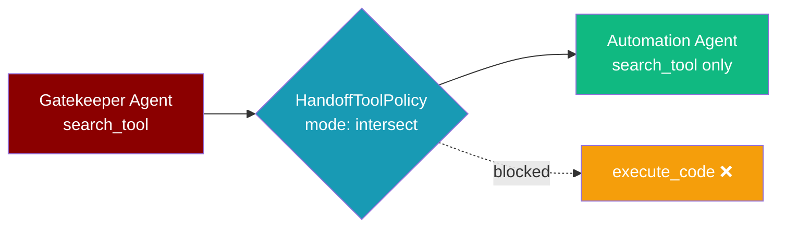
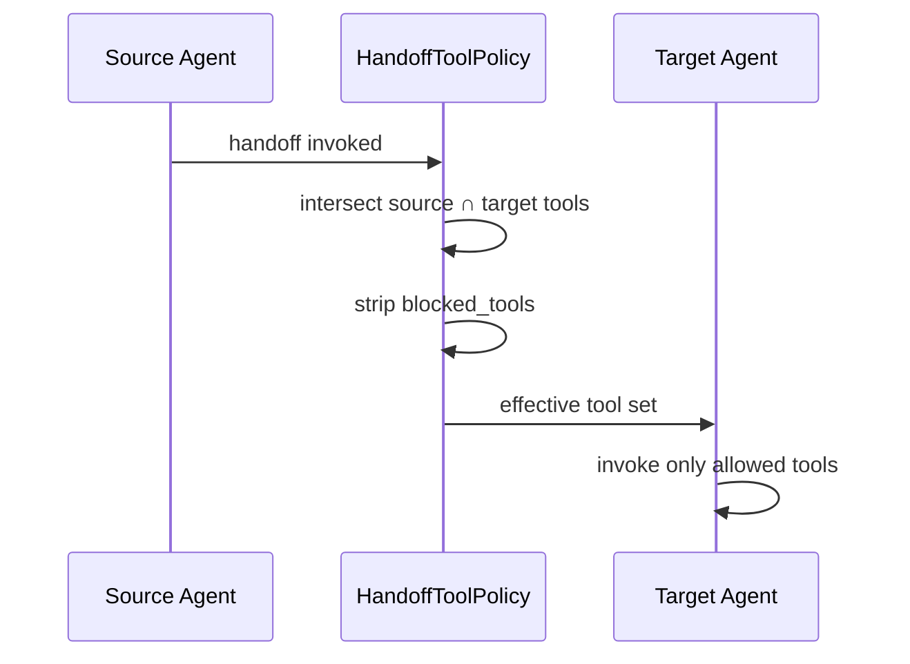
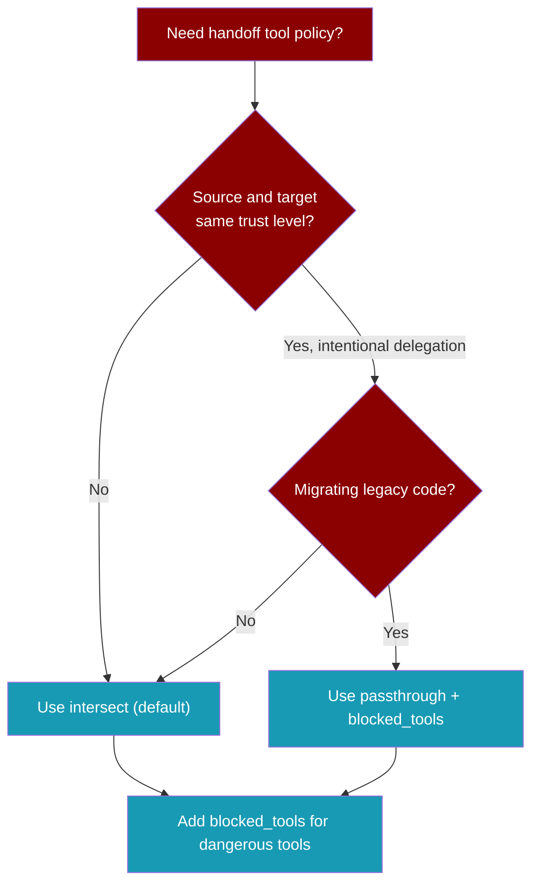

Tool policy limits which tools the target agent can use during a handoff — so a low-trust gatekeeper cannot escalate privileges by handing off to a powerful automation agent.

<Note>
Handoffs are **secure by default** since [PR #1848](https://github.com/MervinPraison/PraisonAI/pull/1848). The target agent only receives tools shared with the source agent. Use `tool_policy_mode="passthrough"` only when you intentionally need legacy behaviour.
</Note>


```python
from praisonaiagents import Agent, handoff, tool

@tool
def search_tool(query: str) -> str:
    """Search the knowledge base."""
    return f"Results for: {query}"

gatekeeper = Agent(name="Gatekeeper", tools=[search_tool])
automation = Agent(name="Automation", tools=[search_tool])

triage = Agent(
    name="Triage",
    handoffs=[handoff(automation)],
)

triage.start("Find policy docs and hand off to automation")
```

The user asks the triage agent; tool policy limits what the target can run during handoff.



## Quick Start

<Steps>
<Step title="Secure by default">
No extra configuration needed — `handoff(target)` already enforces intersect mode.

```python
from praisonaiagents import Agent, handoff, tool

@tool
def search_tool(query: str) -> str:
    """Search the knowledge base."""
    return f"Results for: {query}"

@tool
def execute_code(code: str) -> str:
    """Run code in a sandbox."""
    return "executed"

gatekeeper = Agent(name="Gatekeeper", tools=[search_tool])
automation = Agent(name="Automation", tools=[search_tool, execute_code])

triage = Agent(
    name="Triage",
    handoffs=[handoff(automation)],  # automation only gets search_tool during handoff
)
```
</Step>

<Step title="Block dangerous tools">
Always strip specific tool names regardless of mode.

```python
from praisonaiagents import Agent, handoff

triage = Agent(
    name="Triage",
    handoffs=[handoff(automation, blocked_tools=["execute_code"])],
)
```
</Step>

<Step title="Opt into legacy passthrough">
<Warning>
Passthrough gives the target its full tool set (minus `blocked_tools`). Only use this when the source agent is intentionally delegating more capability than it holds.
</Warning>

```python
from praisonaiagents import Agent, handoff

triage = Agent(
    name="Triage",
    handoffs=[
        handoff(
            automation,
            tool_policy_mode="passthrough",
            blocked_tools=["execute_code"],
        ),
    ],
)
```
</Step>

<Step title="Full HandoffConfig">
```python
from praisonaiagents import Agent, handoff, HandoffConfig, HandoffToolPolicy

config = HandoffConfig(
    tool_policy=HandoffToolPolicy(
        mode="intersect",
        blocked_tools=["execute_code", "shell_access"],
    ),
)

triage = Agent(
    name="Triage",
    handoffs=[handoff(automation, config=config)],
)
```
</Step>
</Steps>

## How It Works



## Modes

| Mode | Default? | Target tool set | Use when |
|------|----------|-----------------|----------|
| `intersect` | ✅ Yes | Tools **both** agents have, minus `blocked_tools` | Multi-agent systems with mixed trust levels (recommended) |
| `passthrough` | No (opt-in) | Target's own tools minus `blocked_tools` | Legacy code, or intentional capability delegation |



## Configuration Options

### HandoffToolPolicy

| Option | Type | Default | Description |
|--------|------|---------|-------------|
| `mode` | `Literal["intersect", "passthrough"]` | `"intersect"` | How tools are filtered during handoff |
| `blocked_tools` | `List[str]` | `[]` | Tool names always stripped regardless of mode |

### handoff() shorthand kwargs

| Parameter | Type | Default | Description |
|-----------|------|---------|-------------|
| `tool_policy_mode` | `Optional[Literal["intersect","passthrough"]]` | `None` | Shorthand for `config.tool_policy.mode` |
| `blocked_tools` | `Optional[List[str]]` | `None` | Shorthand for `config.tool_policy.blocked_tools` |

## Common Patterns

### Gatekeeper → automation (secure default)

```python
from praisonaiagents import Agent, handoff, tool

@tool
def search_tool(query: str) -> str:
    return f"Results for: {query}"

@tool
def execute_code(code: str) -> str:
    return "executed"

gatekeeper = Agent(name="Gatekeeper", tools=[search_tool])
automation = Agent(name="Automation", tools=[search_tool, execute_code])

router = Agent(name="Router", handoffs=[handoff(automation)])
```

### Always block destructive tools

```python
router = Agent(
    name="Router",
    handoffs=[
        handoff(
            automation,
            blocked_tools=["execute_code", "shell_access", "delete_file"],
        ),
    ],
)
```

### Passthrough with selective block list

```python
router = Agent(
    name="Router",
    handoffs=[
        handoff(
            automation,
            tool_policy_mode="passthrough",
            blocked_tools=["execute_code"],
        ),
    ],
)
```

## Best Practices

<AccordionGroup>
<Accordion title="Default to intersect for least-privilege">
Leave `tool_policy_mode` unset unless you have a specific reason to use passthrough. Intersect mode prevents silent privilege escalation.
</Accordion>

<Accordion title="Always block known dangerous tools">
Even in intersect mode, add `blocked_tools` for tools like `execute_code` or `shell_access` if they appear in the shared set.
</Accordion>

<Accordion title="Fix the source toolset, not the policy">
If intersect mode leaves the target without a needed tool, add that tool to the source agent rather than switching to passthrough.
</Accordion>

<Accordion title="Test handoff boundaries in security tests">
Verify that a gatekeeper handoff cannot invoke tools the source agent does not hold.
</Accordion>
</AccordionGroup>

## Migration Note

<Warning>
**Behaviour change (non-breaking API).** Before PR #1848, handoffs passed the target agent's full tool set. After PR #1848, the default is intersection. Existing code runs without changes, but the effective tool set during handoff is narrower. Restore legacy behaviour with one line: `tool_policy_mode="passthrough"`.
</Warning>

## Related

<CardGroup cols={2}>
<Card title="Agent Handoffs" icon="hand-holding-hand" href="/docs/features/handoffs">
  Core handoff patterns and delegation
</Card>
<Card title="Handoff Filters" icon="filter" href="/docs/features/handoff-filters">
  Filter context passed during handoff
</Card>
<Card title="Handoff Configuration" icon="handshake" href="/docs/configuration/handoff-config">
  Full HandoffConfig reference
</Card>
</CardGroup>
