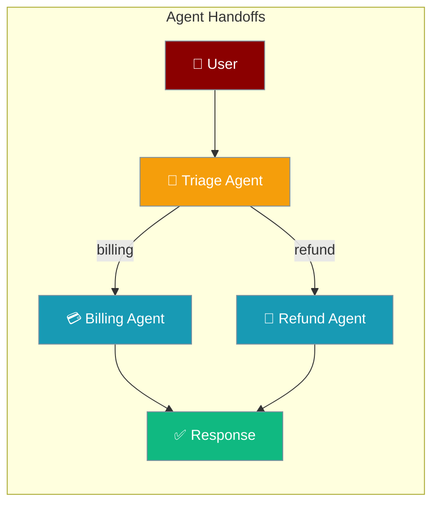
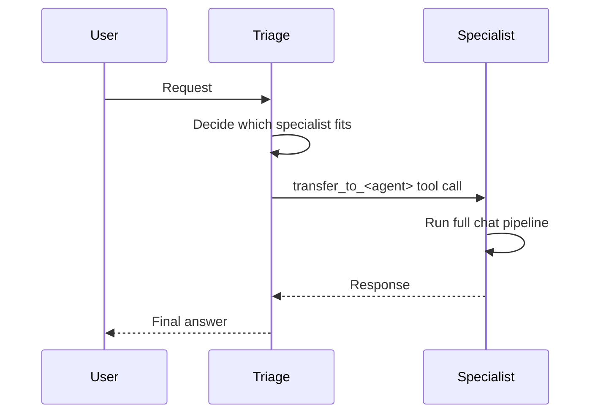

Handoffs let one agent transfer a conversation to a specialist agent based on the request.

```python
from praisonaiagents import Agent

billing = Agent(name="Billing", instructions="Handle billing inquiries.")
refund = Agent(name="Refunds", instructions="Process refund requests.")
triage = Agent(
    name="Triage",
    instructions="Route customer inquiries to the right specialist.",
    handoffs=[billing, refund],
)

triage.start("I need a refund for my last order")
```

The user describes their issue; the triage agent delegates to a specialist via a handoff tool call.



<Note>
Handoffs are secure by default — the target agent only inherits tools shared with the source agent. See [Handoff Tool Policy](/docs/features/handoff-tool-policy).
</Note>

## Quick Start

<Steps>
<Step title="Pass agents directly">

Pass specialist agents to `handoffs` and the routing agent gets a transfer tool for each.

```python
from praisonaiagents import Agent

billing = Agent(name="Billing", instructions="Handle billing inquiries and payments.")
refund = Agent(name="Refunds", instructions="Process refund requests.")

triage = Agent(
    name="Triage",
    instructions="Route customer inquiries to the right specialist.",
    handoffs=[billing, refund],
)
triage.start("I need a refund for my order")
```

</Step>

<Step title="Configure the handoff tool">

Use `handoff()` to rename the transfer tool or steer when the agent should call it.

```python
from praisonaiagents import Agent, handoff

escalation = Agent(name="Manager", instructions="Handle escalations.")

triage = Agent(
    name="Triage",
    instructions="Route inquiries; escalate hard cases.",
    handoffs=[
        handoff(
            escalation,
            tool_name_override="escalate_to_manager",
            tool_description_override="Escalate complex issues to a manager.",
        ),
    ],
)
triage.start("This is my third failed delivery — I want a manager.")
```

</Step>
</Steps>

---

## How It Works



When you set `handoffs`, PraisonAI converts each target into a `transfer_to_<agent>` tool, adds routing instructions to the agent's prompt, and passes conversation history when control transfers.

| Phase | What happens |
|---|---|
| 1. Detect | The routing agent decides a specialist is needed |
| 2. Transfer | The matching handoff tool is called |
| 3. Run | The target agent runs its full `chat()` pipeline |
| 4. Return | The specialist's response flows back to the user |

---

## Which Handoff Setup to Use?

```mermaid
graph TB
    Start([How should routing work?]) --> Q1{Need custom naming or criteria?}
    Q1 -->|No, simple routing| A["Pass Agent directly<br/>handoffs=&#91;billing, refund&#93;"]
    Q1 -->|Steer the choice| B["handoff&#40;&#41; with<br/>tool_description_override"]
    Q1 -->|Need typed input| C["TypedHandoff with<br/>a Pydantic schema"]

    classDef start fill:#6366F1,stroke:#7C90A0,color:#fff
    classDef question fill:#F59E0B,stroke:#7C90A0,color:#fff
    classDef answer fill:#10B981,stroke:#7C90A0,color:#fff

    class Start start
    class Q1 question
    class A,B,C answer
```



---

## Configuration Options

`handoff()` builds a configured transfer tool for a target agent.

<Card icon="code" href="/docs/features/handoff-tool-policy">
  Handoff Tool Policy — tool security boundary options
</Card>

| Option | Type | Default | Description |
|---|---|---|---|
| `agent` | `Agent` | required | Target agent to hand off to |
| `tool_name_override` | `str \| None` | `None` | Custom tool name (default `transfer_to_<agent>`) |
| `tool_description_override` | `str \| None` | `None` | Custom tool description shown to the LLM |
| `on_handoff` | `Callable \| None` | `None` | Callback run when the handoff is invoked |
| `input_type` | `type \| None` | `None` | Expected input type for structured data |
| `input_filter` | `Callable \| None` | `None` | Function to filter/transform passed history |
| `tool_policy_mode` | `"intersect" \| "passthrough"` | `"intersect"` | Which tools the target inherits |
| `blocked_tools` | `list[str] \| None` | `None` | Tools always stripped from the target |

---

## Common Patterns

### Pattern 1 — Callback on handoff

```python
from praisonaiagents import Agent, handoff

def log_handoff(from_agent, to_agent, context):
    print(f"Transfer: {from_agent.name} -> {to_agent.name}")

billing = Agent(name="Billing", instructions="Handle billing inquiries.")

triage = Agent(
    name="Triage",
    instructions="Route billing questions to the specialist.",
    handoffs=[handoff(billing, on_handoff=log_handoff)],
)
triage.start("Why was I charged twice?")
```

### Pattern 2 — Filter passed history

```python
from praisonaiagents import Agent, handoff
from praisonaiagents.agent.handoff import handoff_filters

technical = Agent(name="TechSupport", instructions="Solve technical problems.")

triage = Agent(
    name="Triage",
    instructions="Route technical issues to support.",
    handoffs=[handoff(technical, input_filter=handoff_filters.remove_all_tools)],
)
triage.start("The app crashes when I upload a file.")
```

### Pattern 3 — Type-safe handoff

```python
from praisonaiagents import Agent
from praisonaiagents.agent.handoff import TypedHandoff
from pydantic import BaseModel

class TaskData(BaseModel):
    priority: int
    description: str

specialist = Agent(name="Specialist", instructions="Resolve prioritised tasks.")

triage = Agent(
    name="Triage",
    instructions="Route tasks to the specialist with priority and description.",
    handoffs=[TypedHandoff(agent=specialist, input_schema=TaskData)],
)
triage.start("Escalate: priority 1, database is down.")
```

---

## Handoff Results

`handoff_to()` returns a `HandoffResult` describing the outcome.

```python
from praisonaiagents import Agent

billing = Agent(name="Billing", instructions="Handle billing issues.")
support = Agent(name="Support", instructions="Front-line support.", handoffs=[billing])

result = support.handoff_to(billing, "Handle this billing issue")

if result.outcome.status == "success":
    print(result.outcome.output)
elif result.outcome.status == "timeout":
    print(f"Timed out: {result.outcome.error}")
else:
    print(f"Failed: {result.outcome.error}")
```

| Field | Type | Description |
|---|---|---|
| `success` | `bool` | Whether the handoff completed successfully |
| `response` | `str` | Response from the target agent |
| `target_agent` | `str` | Name of the agent that received the handoff |
| `source_agent` | `str` | Name of the agent that initiated the handoff |
| `duration_seconds` | `float` | Time taken for the handoff |
| `error` | `str` | Error message if the handoff failed |
| `outcome` | `AgentRunOutcome` | Typed outcome with `.status` and `.is_retryable()` |

---

## Best Practices

<AccordionGroup>
  <Accordion title="Give each agent one clear responsibility">
    A specialist with a focused role routes cleanly. Overlapping responsibilities make the routing agent's tool choice ambiguous.
  </Accordion>
  <Accordion title="Filter history to cut tokens">
    Pass `input_filter=handoff_filters.remove_all_tools` or `handoff_filters.keep_last_n_messages(5)` so the target agent gets only the context it needs.
  </Accordion>
  <Accordion title="Use TypedHandoff for structured data">
    When a specialist needs typed fields, use `TypedHandoff(agent=..., input_schema=Model)` — the framework validates the payload at the boundary.
  </Accordion>
  <Accordion title="Keep a fallback path">
    Let the routing agent answer requests it cannot route rather than failing silently.
  </Accordion>
</AccordionGroup>

---

## Related

<CardGroup cols={2}>
<Card title="Handoff Tool Policy" icon="shield-check" href="/docs/features/handoff-tool-policy">
  Secure tool boundaries during handoff
</Card>
<Card title="Typed Handoffs" icon="filter" href="/docs/features/typed-handoffs">
  Schema-validated handoffs with Pydantic models
</Card>
</CardGroup>
