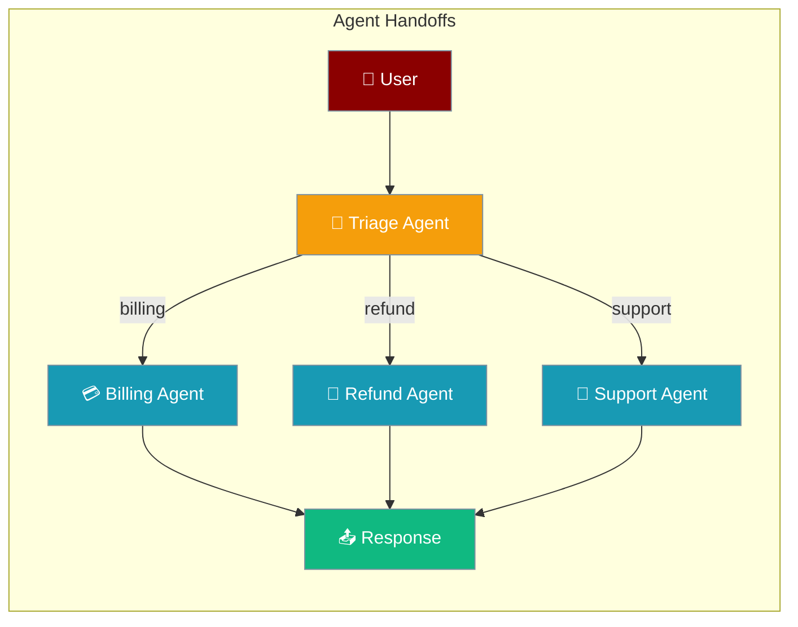

Agent handoffs enable seamless task delegation between specialised agents, allowing you to build sophisticated multi-agent systems where each agent focuses on its area of expertise.



<Note>
Handoffs are now secure by default — the target agent only inherits tools shared with the source agent. See [Handoff Tool Policy](/docs/features/handoff-tool-policy).
</Note>

## Overview

Handoffs in PraisonAI allow agents to transfer control to other agents based on the conversation context. This pattern is particularly useful for:

- Customer service routing
- Specialised task delegation
- Complex workflow orchestration
- Escalation scenarios

## How Handoffs Work

When you specify handoffs for an agent, PraisonAI automatically:
1. Converts each handoff into a tool that the agent can use
2. Adds instructions to the agent's prompt about available handoffs
3. Passes the full conversation history when transferring control

## Quick Start

<Steps>

<Step title="Simple handoff">

```python
from praisonaiagents import Agent

billing_agent = Agent(
    name="Billing",
    instructions="Handle billing inquiries and process payments",
)

refund_agent = Agent(
    name="Refunds",
    instructions="Process refund requests",
)

triage_agent = Agent(
    name="Triage",
    instructions="Route customer inquiries to the right specialist",
    handoffs=[billing_agent, refund_agent],
)

response = triage_agent.start("I need a refund for my order")
```

</Step>

</Steps>

## Basic Usage

### Simple Handoff

```python
from praisonaiagents import Agent, HandoffToolPolicy

# Create specialised agents
billing_agent = Agent(
    name="Billing",
    role="Billing specialist",
    goal="Handle billing inquiries and process payments",
    backstory="Expert in billing systems and payment processing"
)

refund_agent = Agent(
    name="Refunds",
    role="Refund specialist", 
    goal="Process refund requests",
    backstory="Specialist in refund policies and processing"
)

# Create triage agent with handoffs
triage_agent = Agent(
    name="Triage",
    role="Customer service triage",
    goal="Route customer inquiries to the right specialist",
    backstory="Expert at understanding customer needs",
    handoffs=[billing_agent, refund_agent]
)

# The triage agent can now transfer to billing or refund agents
response = triage_agent.chat("I need a refund for my order")
```

## Type-Safe Handoffs

For scenarios requiring strict data contracts between agents, use `TypedHandoff` with Pydantic schema validation:

```python
from praisonaiagents import TypedHandoff
from pydantic import BaseModel

class TaskData(BaseModel):
    priority: int
    description: str

typed_handoff = TypedHandoff(agent=specialist_agent, input_schema=TaskData)
```

<Card title="Typed Handoffs" icon="shield-check" href="/docs/features/typed-handoffs">
  Schema-validated handoffs with Pydantic models
</Card>

## Advanced Features

### Custom Callbacks

Execute custom code when handoffs occur:

```python
def log_handoff(from_agent, to_agent, context):
    print(f"Transferring from {from_agent.name} to {to_agent.name}")
    # Log to monitoring system, send notifications, etc.

from praisonaiagents import handoff

handoff_config = handoff(
    agent=billing_agent,
    on_handoff=log_handoff
)

triage_agent = Agent(
    name="Triage",
    handoffs=[handoff_config]
)
```

### Structured Input (Deprecated)

<Warning>
The `input_model` parameter has been deprecated. Use [TypedHandoff](/docs/features/typed-handoffs) for schema validation instead.
</Warning>

For typed data handoffs, use `TypedHandoff` which provides better validation and error handling:

```python
from praisonaiagents import TypedHandoff
from pydantic import BaseModel

class CustomerContext(BaseModel):
    customer_id: str
    order_id: str
    issue_type: str
    priority: str

# Recommended approach
typed_handoff = TypedHandoff(agent=billing_agent, input_schema=CustomerContext)
```

### Input Filters

Control what conversation history is passed to the target agent:

```python
handoff_config = handoff(
    agent=technical_agent,
    filter={
        "remove_all_tools": True,  # Remove tool calls from history
        "keep_last_n_messages": 5,  # Only pass last 5 messages
        "remove_system_messages": True  # Remove system prompts
    }
)
```

### Custom Tool Names

Override the default handoff tool name and description:

```python
handoff_config = handoff(
    agent=escalation_agent,
    name="escalate_to_manager",
    description="Escalate complex issues to a manager for resolution"
)
```

## Dynamic Model Switching

Each handoff runs the target agent's full `chat()` pipeline at the moment of invocation, so if you change `agent.llm` between turns, the next handoff uses the new model automatically.

```python
from praisonaiagents import Agent

researcher = Agent(name="Researcher", llm="gpt-4o-mini", instructions="Research topics")
writer = Agent(name="Writer", llm="gpt-4o-mini", instructions="Write articles", handoffs=[researcher])

# Upgrade the researcher mid-conversation — takes effect on the next handoff
researcher.llm = "claude-3-sonnet"
writer.start("Research and write about renewable energy")
```

## Full Pipeline Preserved

Every handoff runs the target agent through its complete `chat()` pipeline — exactly as if you had called `researcher.chat()` directly. Nothing is bypassed.

| Preserved during handoff | Why it matters |
|--------------------------|----------------|
| Instructions & role | The target agent behaves according to its defined persona |
| Backstory | Context and personality are maintained |
| Memory | The target agent can recall prior interactions |
| Hooks | Pre/post-call hooks execute normally |
| Guardrails | Safety policies are always enforced |
| Tool policy | The `HandoffToolPolicy` intersection is applied on top of the agent's own tools |

## Tool Security Boundary

`HandoffToolPolicy` controls which tools the target agent may use during a handoff. The default **`intersect`** mode gives the target only tools that **both** agents share — preventing a low-trust gatekeeper from handing off to an automation agent with destructive tools it does not hold.

```python
from praisonaiagents import Agent, handoff, HandoffToolPolicy

triage = Agent(
    name="Triage",
    handoffs=[
        handoff(
            automation_agent,
            blocked_tools=["execute_code"],  # always stripped
        ),
    ],
)
```

For full mode reference, migration notes, and decision guidance, see [Handoff Tool Policy](/docs/features/handoff-tool-policy).

## Handoff Results

Every handoff operation returns a `HandoffResult` with detailed information about the outcome:

| Field | Type | Description |
|-------|------|-------------|
| `success` | `bool` | Whether the handoff completed successfully |
| `response` | `str` | Response from the target agent |
| `target_agent` | `str` | Name of the agent that received the handoff |
| `source_agent` | `str` | Name of the agent that initiated the handoff |
| `duration_seconds` | `float` | Time taken for the handoff |
| `error` | `str` | Error message if handoff failed |
| `outcome` | `AgentRunOutcome` | Typed outcome with `.status`, `.is_retryable()`, etc. |

### Checking Handoff Results

```python
from praisonaiagents import Agent, handoff

billing_agent = Agent(name="Billing Agent")
support_agent = Agent(
    name="Support Agent",
    handoffs=[billing_agent]
)

# Perform handoff
result = support_agent.handoff_to(billing_agent, "Handle billing issue")

# Check result using typed outcome (recommended)
if result.outcome.status == "success":
    print(f"Handoff successful: {result.outcome.output}")
elif result.outcome.status == "timeout":
    print(f"Handoff timed out: {result.outcome.error}")
    retry_handoff()
elif result.outcome.status in ("failure", "cancelled"):
    print(f"Handoff failed: {result.outcome.error}")

# Legacy success field still available
if result.success:
    process_response(result.response)
else:
    handle_handoff_error(result.error)
```

### Creating HandoffResult from Outcome

```python
from praisonaiagents import HandoffResult, AgentRunOutcome

# Create handoff result from outcome
outcome = AgentRunOutcome.timeout(
    error="Target agent took too long to respond",
    elapsed_s=30.0
)

result = HandoffResult.from_outcome(
    outcome=outcome,
    target_agent="billing_agent",
    source_agent="support_agent"
)
```

## Complete Example

```python
from praisonaiagents import Agent, handoff
from pydantic import BaseModel

# Define context model
class CustomerInfo(BaseModel):
    name: str
    account_id: str
    issue_description: str

# Create specialised agents
billing_agent = Agent(
    name="BillingExpert",
    role="Billing specialist",
    goal="Resolve billing issues",
    backstory="10 years experience in billing",
    tools=[check_balance, process_payment]
)

technical_agent = Agent(
    name="TechSupport",
    role="Technical support",
    goal="Solve technical problems",
    backstory="Expert in troubleshooting",
    tools=[check_logs, restart_service]
)

manager_agent = Agent(
    name="Manager",
    role="Customer service manager",
    goal="Handle escalations",
    backstory="Experienced in conflict resolution"
)

# Configure handoffs with advanced features
handoffs = [
    # Simple handoff
    billing_agent,
    
    # Handoff with callback
    handoff(
        agent=technical_agent,
        on_handoff=lambda f, t, c: log_transfer(f.name, t.name)
    ),
    
    # Handoff with structured input and filters
    handoff(
        agent=manager_agent,
        name="escalate_to_management",
        description="Escalate serious issues to management",
        input_model=CustomerInfo,
        filter={"keep_last_n_messages": 3}
    )
]

# Create main agent with handoffs
support_agent = Agent(
    name="Support",
    role="Customer support",
    goal="Help customers with their issues",
    backstory="First point of contact",
    handoffs=handoffs
)

# Use in conversation with result checking
result = support_agent.chat("My payment failed and now I can't access my account")

# Check handoff results if any occurred
if hasattr(result, 'handoff_results'):
    for handoff_result in result.handoff_results:
        if handoff_result.outcome.is_success():
            print(f"Handoff to {handoff_result.target_agent} succeeded")
        elif handoff_result.outcome.is_retryable():
            print(f"Handoff to {handoff_result.target_agent} failed but can retry")
            retry_handoff(handoff_result)
        else:
            print(f"Handoff to {handoff_result.target_agent} permanently failed")
```

## Best Practices

<AccordionGroup>
  <Accordion title="Clear Agent Responsibilities">
    Each agent should have a well-defined role and expertise area. Overlapping responsibilities cause ambiguous handoff routing.
  </Accordion>
  <Accordion title="Minimal Context">
    Use filters to pass only relevant conversation history. Sending the full context increases token usage and can confuse the receiving agent.
  </Accordion>
  <Accordion title="Structured Data">
    Use `TypedHandoff` with Pydantic models for complex handoff scenarios where strong typing and validation matter.
  </Accordion>
  <Accordion title="Graceful Fallbacks">
    Always have a path for unhandled scenarios — the triage agent should be able to handle requests it cannot route rather than failing silently.
  </Accordion>
</AccordionGroup>

## Implementation Details

Under the hood, handoffs are converted to tools:

```python
# This handoff configuration:
agent.handoffs = [billing_agent]

# Becomes a tool like:
{
    "name": "transfer_to_billing",
    "description": "Transfer conversation to Billing agent: Billing specialist...",
    "function": <transfer_function>
}
```

The agent's prompt is also updated to include handoff instructions, making the agent aware of when and how to delegate tasks.

## Common Patterns

### Customer Service Router

```python
# Specialised agents for different departments
agents = {
    "billing": billing_agent,
    "technical": technical_agent,
    "sales": sales_agent,
    "refunds": refund_agent
}

router = Agent(
    name="Router",
    handoffs=list(agents.values())
)
```

### Escalation Chain

```python
level1 = Agent(name="L1Support", handoffs=[level2])
level2 = Agent(name="L2Support", handoffs=[level3])
level3 = Agent(name="L3Support", handoffs=[manager])
```

### Skill-based Routing

```python
# Agents with specific skills
python_expert = Agent(name="PythonExpert", ...)
javascript_expert = Agent(name="JSExpert", ...)
database_expert = Agent(name="DBExpert", ...)

tech_lead = Agent(
    name="TechLead",
    handoffs=[python_expert, javascript_expert, database_expert]
)
```

## Troubleshooting

### Handoff Not Triggering
* Ensure the agent's LLM supports tool calling
* Check that handoff agents are properly configured
* Verify the conversation context clearly indicates need for transfer

### Context Loss
* Use input filters to preserve important context
* Consider using structured input models
* Implement callbacks to track what information is passed

### Circular Handoffs
* Design clear handoff hierarchies
* Implement logic to prevent infinite loops
* Use callbacks to detect circular patterns

<Note>
Memory backends can implement the `on_delegation` hook to automatically store results from delegated tasks. See [Memory Lifecycle Hooks](/docs/features/memory-lifecycle-hooks) for details.
</Note>

## Related

<CardGroup cols={2}>
<Card title="Handoff Tool Policy" icon="shield-check" href="./handoff-tool-policy">
  Secure tool boundaries during handoff
</Card>
<Card title="Handoff Filters" icon="filter" href="./handoff-filters">
  Filter context passed during handoff
</Card>
<Card title="Agent Run Outcomes" icon="circle-check" href="./agent-run-outcomes">
  Typed outcomes for handoff results
</Card>
<Card title="Agent to Agent Communication" icon="comments" href="./a2a">
  Advanced multi-agent communication patterns
</Card>
</CardGroup>
