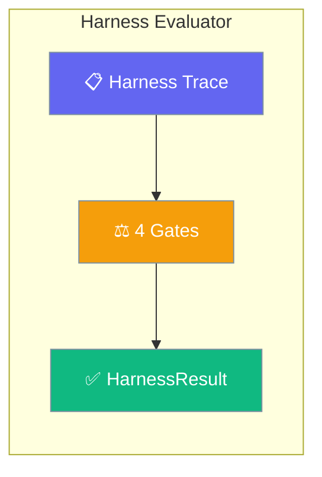
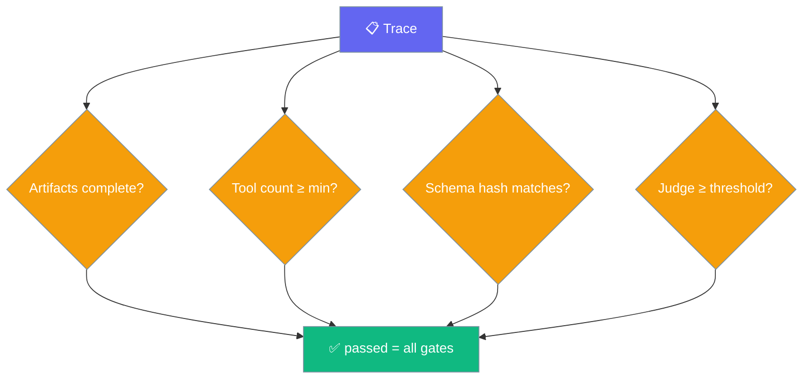
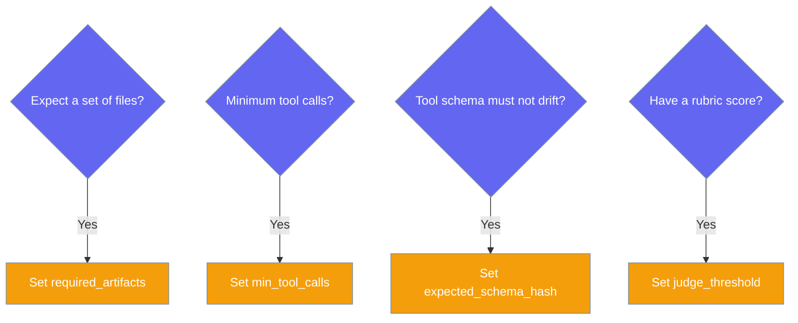

Harness Evaluator scores an Interactive Test Harness trace — tool-call count, tool-schema parity, required artifacts, optional judge score — and folds the result into your `EvalSuite`, no CLI import required.



## Quick Start

<Steps>
<Step title="Score a minimal trace">
```python
from praisonaiagents.eval import HarnessEvaluator

trace = {
    "tool_calls": [{"name": "read_file"}, {"name": "write_file"}],
    "artifacts": ["out.txt"],
    "tool_schema": {"read_file": {}, "write_file": {}},
    "judge_score": 9.0,
}

result = HarnessEvaluator(
    trace=trace,
    required_artifacts=["out.txt"],
    min_tool_calls=2,
    judge_threshold=7.0,
    name="smoke_scenario",
).run(print_summary=True)

print(result.passed, result.score)
```
</Step>

<Step title="Gate on tool-schema parity">
```python
from praisonaiagents.eval import HarnessEvaluator

result = HarnessEvaluator(
    trace=trace,
    expected_schema_hash="a1b2c3d4e5f6a7b8",   # sha256(tool_schema)[:16]
    name="plugin_parity",
).run()

print(result.schema_consistent)
```
</Step>

<Step title="Batch a CSV of scenarios">
```python
import csv
from praisonaiagents.eval import HarnessEvaluator, harness_row_to_eval_case

with open("scenarios.csv") as f:
    for row in csv.DictReader(f):
        case  = harness_row_to_eval_case(row)
        trace = run_your_harness(case.input)     # your harness function
        result = HarnessEvaluator(
            trace=trace,
            required_artifacts=[row.get("fixture", "")],
            name=case.name,
        ).run()
        print(case.name, result.passed)
```
</Step>
</Steps>

---

## How It Works

Four independent gates feed an AND — every gate must pass for `passed=True`, and `score` is the fraction of gates that passed.



---

## Choosing which gate to enable

Turn on only the gates you have real expectations for; the rest stay open.



---

## Configuration Options

Full parameter narrative lives in the [SDK source](https://github.com/MervinPraison/PraisonAI/blob/main/src/praisonai-agents/praisonaiagents/eval/harness_eval.py).

| Option | Type | Default | Description |
|--------|------|---------|-------------|
| `trace` | `dict` | required | Harness trace dict (see accepted keys below) |
| `required_artifacts` | `list[str]` | `[]` | Artifacts that must be present in `trace["artifacts"]` to pass |
| `min_tool_calls` | `int` | `0` | Minimum tool calls required — `0` disables the gate |
| `expected_schema_hash` | `str` | `None` | If set, `sha256(tool_schema)[:16]` must match for the parity gate |
| `judge_threshold` | `float` | `7.0` | Judge score at/above which the judge gate passes |
| `name` | `str` | `None` | Evaluation name |
| `save_results_path` | `str` | `None` | Path to persist result JSON |
| `verbose` | `bool` | `False` | Enable verbose logging |

**Methods**

| Method | Returns | Purpose |
|--------|---------|---------|
| `run(print_summary=False)` | `HarnessResult` | Computes the 4 gates and aggregates |
| `to_eval_result(case_name=None)` | `EvalResult` | Converts the latest run for `EvalReport` export |

**Helper**

`harness_row_to_eval_case(row)` maps a CSV harness row (`id`/`name`/`scenario`, `prompt`/`input`, optional `fixture`, `rubric`, `expected`) into an `EvalCase` with `metadata["source"] = "harness"`.

---

## Trace shape

Keys are order-insensitive — the first non-empty match wins.

| Field | Accepted keys | Accepted forms |
|-------|---------------|----------------|
| Tool calls | `tool_calls` → `tool_trace` → `tools` | list of dicts/objects, or an `int` (counted) |
| Artifacts | `artifacts` → `files` → `outputs` | list of strings, list of dicts (`path`/`name`/`file`/`filename`/`artifact`), or a dict (values used) |
| Tool schema | `tool_schema` | any JSON-serialisable dict |
| Judge score | `judge_score` | float (malformed values fail the judge gate) |

---

## Common Patterns

Gate CI on a pass, guard tool-schema drift, or fold results into an `EvalSuite`.

<Tabs>
  <Tab title="Single trace CI gate">
    ```python
    import sys
    from praisonaiagents.eval import HarnessEvaluator

    result = HarnessEvaluator(
        trace=trace,
        required_artifacts=["out.txt"],
        min_tool_calls=2,
    ).run()

    if not result.passed:
        sys.exit(1)
    ```
  </Tab>
  <Tab title="CSV batch to EvalReport">
    ```python
    import csv
    from praisonaiagents.eval import (
        HarnessEvaluator, harness_row_to_eval_case, EvalReport,
    )

    results = []
    with open("scenarios.csv") as f:
        for row in csv.DictReader(f):
            case  = harness_row_to_eval_case(row)
            trace = run_your_harness(case.input)     # your harness function
            evaluator = HarnessEvaluator(
                trace=trace,
                required_artifacts=[row.get("fixture", "")],
                judge_threshold=7.0,
                name=case.name,
            )
            evaluator.run()
            results.append(evaluator.to_eval_result())

    report = EvalReport(results=results)
    print(report.to_json())
    ```
  </Tab>
</Tabs>

---

## Best Practices

<AccordionGroup>
  <Accordion title="min_tool_calls=0 means no gate">
    The default `0` disables the tool-count check. Set it only when a scenario has a real minimum.
  </Accordion>
  <Accordion title="A None judge score skips the gate; a malformed one fails it">
    Omit `judge_score` to skip judging entirely. A value that can't parse to a float fails the gate rather than crashing the suite.
  </Accordion>
  <Accordion title="Reuse expected_schema_hash to catch drift">
    Compute `sha256(tool_schema)[:16]` once against the native tool, then reuse it in plugin CI to catch schema drift.
  </Accordion>
  <Accordion title="Zero external deps — safe in CI">
    Scoring runs without `litellm` or `OPENAI_API_KEY`, so it fits any CI runner.
  </Accordion>
</AccordionGroup>

---

## Related

<CardGroup cols={2}>
  <Card title="Context Evaluator" icon="shuffle" href="/docs/features/context-evaluator">
    Score multi-agent handoff fidelity
  </Card>
  <Card title="Evaluation Loop" icon="rotate" href="/docs/eval/evaluation-loop">
    Iterative agent → judge → improve loop
  </Card>
  <Card title="Judge" icon="gavel" href="/docs/eval/judge">
    LLM-as-judge for evaluating outputs
  </Card>
</CardGroup>
