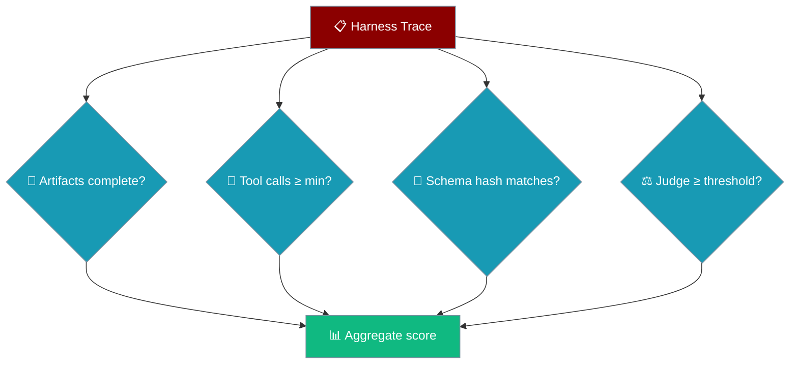

Harness Evaluator scores an Interactive Test Harness trace against tool-call, schema-parity, artifact, and judge gates so harness runs plug straight into `EvalSuite`.


## Quick Start

<Steps>
<Step title="Score a trace">

Pass a trace dict with tool calls and artifacts, then call `run`:

```python
from praisonaiagents.eval import HarnessEvaluator

trace = {
    "tool_calls": [{"name": "read_file"}, {"name": "write_file"}],
    "artifacts": ["out.txt"],
}

evaluator = HarnessEvaluator(trace=trace, name="smoke_scenario")
result = evaluator.run(print_summary=True)
print(result.passed, result.score)
```

</Step>

<Step title="Add gates">

Require specific artifacts and a minimum number of tool calls:

```python
from praisonaiagents.eval import HarnessEvaluator

trace = {
    "tool_calls": [{"name": "read_file"}, {"name": "write_file"}],
    "artifacts": ["out.txt", "report.md"],
    "judge_score": 9.0,
}

evaluator = HarnessEvaluator(
    trace=trace,
    required_artifacts=["out.txt", "report.md"],
    min_tool_calls=2,
    judge_threshold=7.0,
    name="build_report",
)
result = evaluator.run(print_summary=True)
```

</Step>

<Step title="Gate on tool-schema parity">
```python
from praisonaiagents.eval import HarnessEvaluator

result = HarnessEvaluator(
    trace=trace,
    expected_schema_hash="a1b2c3d4e5f6a7b8",   # sha256(tool_schema)[:16]
    name="plugin_parity",
).run()

print(result.schema_consistent)
```
</Step>

<Step title="Aggregate in an EvalSuite">

Add the evaluator to an `EvalSuite` and export an `EvalReport`:

```python
from praisonaiagents.eval import HarnessEvaluator, EvalSuite

evaluator = HarnessEvaluator(
    trace={"tool_calls": 2, "artifacts": ["out.txt"]},
    required_artifacts=["out.txt"],
    name="scenario_a",
)

suite = EvalSuite(evaluators=[evaluator], name="harness_suite")
report = suite.run(print_summary=True)
```

</Step>
</Steps>

---

## How It Works

A trace passes through four independent gates; the score is the fraction of gates that pass.



| Gate | What it checks | When it passes |
|------|----------------|----------------|
| **Artifacts** | Every `required_artifacts` entry is present in the trace | No missing artifacts |
| **Tool calls** | Number of tool calls in the trace | `count >= min_tool_calls` |
| **Schema hash** | sha256[:16] of `tool_schema` vs `expected_schema_hash` | Hashes match (or no hash set) |
| **Judge** | `judge_score` from the trace | `score >= judge_threshold` (or no score present) |

The trace reads tool calls from `tool_calls` → `tool_trace` → `tools` and artifacts from `artifacts` → `files` → `outputs`, so real harness traces score unmodified. An integer under a tool-calls key means "N calls"; dict-shaped artifacts are unwrapped via `path`/`name`/`file`/`filename`/`artifact`.

---

## Configuration Options

| Option | Type | Default | Description |
|--------|------|---------|-------------|
| `trace` | `Dict[str, Any]` | required | Harness trace dict (`tool_calls`/`tool_trace`/`tools`, `artifacts`/`files`/`outputs`, `tool_schema`, `judge_score`). |
| `required_artifacts` | `Optional[List[str]]` | `None` | Artifact paths/names that must be present to pass. |
| `min_tool_calls` | `int` | `0` | Minimum number of tool calls required (`0` = no gate). |
| `expected_schema_hash` | `Optional[str]` | `None` | If set, the trace's tool-schema sha256[:16] hash must match this value. |
| `judge_threshold` | `float` | `7.0` | Judge score (0–10) at/above which the judge gate passes. |
| `name` | `Optional[str]` | `None` | Optional evaluation name. |
| `save_results_path` | `Optional[str]` | `None` | Optional path to persist the result JSON. |
| `verbose` | `bool` | `False` | Enable verbose logging. |

**Methods**

| Method | Returns | Purpose |
|--------|---------|---------|
| `run(print_summary=False)` | `HarnessResult` | Computes the 4 gates and aggregates |
| `to_eval_result(case_name=None)` | `EvalResult` | Converts the latest run for `EvalReport` export |

**Helper**

`harness_row_to_eval_case(row)` maps a CSV harness row (`id`/`name`/`scenario`, `prompt`/`input`, optional `fixture`, `rubric`, `expected`) into an `EvalCase` with `metadata["source"] = "harness"`.

`run()` returns a `HarnessResult` exposing `passed`, `score`, `tool_call_count`, `tool_calls_sufficient`, `schema_hash`, `schema_consistent`, `artifacts_complete`, `missing_artifacts`, `judge_score`, and `judge_passed`, plus `to_dict()`, `to_json()`, and `print_summary()`.

<Card title="Eval Module Reference" icon="code" href="/docs/sdk/reference/praisonaiagents/modules/eval">
  Full Python API for the eval package
</Card>

---

## Trace shape

Keys are order-insensitive — the first non-empty match wins.

| Field | Accepted keys | Accepted forms |
|-------|---------------|----------------|
| Tool calls | `tool_calls` → `tool_trace` → `tools` | list of dicts/objects, or an `int` (counted) |
| Artifacts | `artifacts` → `files` → `outputs` | list of strings, list of dicts (`path`/`name`/`file`/`filename`/`artifact`), or a dict (values used) |
| Tool schema | `tool_schema` | any JSON-serialisable dict |
| Judge score | `judge_score` | float (malformed values fail the judge gate) |

---

## Common Patterns

Aggregate CSV harness scenarios into an `EvalReport` with `harness_row_to_eval_case()`:

```python
import csv
from praisonaiagents.eval import harness_row_to_eval_case

with open("scenarios.csv") as f:
    cases = [harness_row_to_eval_case(row) for row in csv.DictReader(f)]
```

Enforce tool-schema parity between a native run and a plugin run:

```python
from praisonaiagents.eval import HarnessEvaluator

evaluator = HarnessEvaluator(
    trace=plugin_run_trace,
    expected_schema_hash=native_schema_hash,   # from the native baseline run
    name="parity_check",
)
result = evaluator.run(print_summary=True)
assert result.schema_consistent
```

Gate CI on artifact completeness for a suite of scenarios:

```python
from praisonaiagents.eval import HarnessEvaluator, EvalSuite

evaluators = [
    HarnessEvaluator(trace=t, required_artifacts=["out.txt"], name=t["id"])
    for t in scenario_traces
]
report = EvalSuite(evaluators=evaluators, name="ci_gate").run(print_summary=True)
```

---

## Best Practices

<AccordionGroup>
<Accordion title="A bad judge score fails safely — it never crashes the suite">
A non-numeric `judge_score` fails the judge gate but does not raise, so one broken scenario won't abort a mixed CI run. A trace with no `judge_score` treats the judge as "not configured" — the judge gate simply passes and does not count against you.
</Accordion>
<Accordion title="The tool-call fallbacks let you pass real traces unmodified">
Tool calls are read from `tool_calls`, then `tool_trace`, then `tools`, and artifacts from `artifacts`, then `files`, then `outputs`. Whatever key your harness emits, the evaluator finds it — no reshaping step before scoring.
</Accordion>
<Accordion title="Use min_tool_calls for behaviour, expected_schema_hash for parity">
Set `min_tool_calls` when a scenario must actually exercise tools (a smoke test that made zero calls is suspect). Set `expected_schema_hash` when you need the tool surface to stay identical between two runs — for example native vs. plugin-provided tools.
</Accordion>
<Accordion title="Persist results for CI artifacts">
Pass `save_results_path` to write the result JSON, or call `result.to_json()` yourself, so failed CI runs keep the per-gate breakdown for debugging.
</Accordion>
</AccordionGroup>

---

## Related

<CardGroup cols={2}>
  <Card title="Context Evaluator" icon="shuffle" href="/docs/features/context-evaluator">
    Score multi-agent handoff fidelity
  </Card>
  <Card title="Evaluation Loop" icon="rotate" href="/docs/eval/evaluation-loop">
    Iterative agent → judge → improve loop
  </Card>
  <Card title="Judge" icon="gavel" href="/docs/eval/judge">
    LLM-as-judge for evaluating outputs
  </Card>
  <Card title="Evaluation" icon="chart-line" href="/docs/concepts/evaluation">
    Evaluators, suites, and reports
  </Card>
  <Card title="CHL Engineering" icon="ruler-combined" href="/concepts/chl-engineering">
    The Context / Harness / Loop rubric this evaluator scores against.
  </Card>
</CardGroup>
