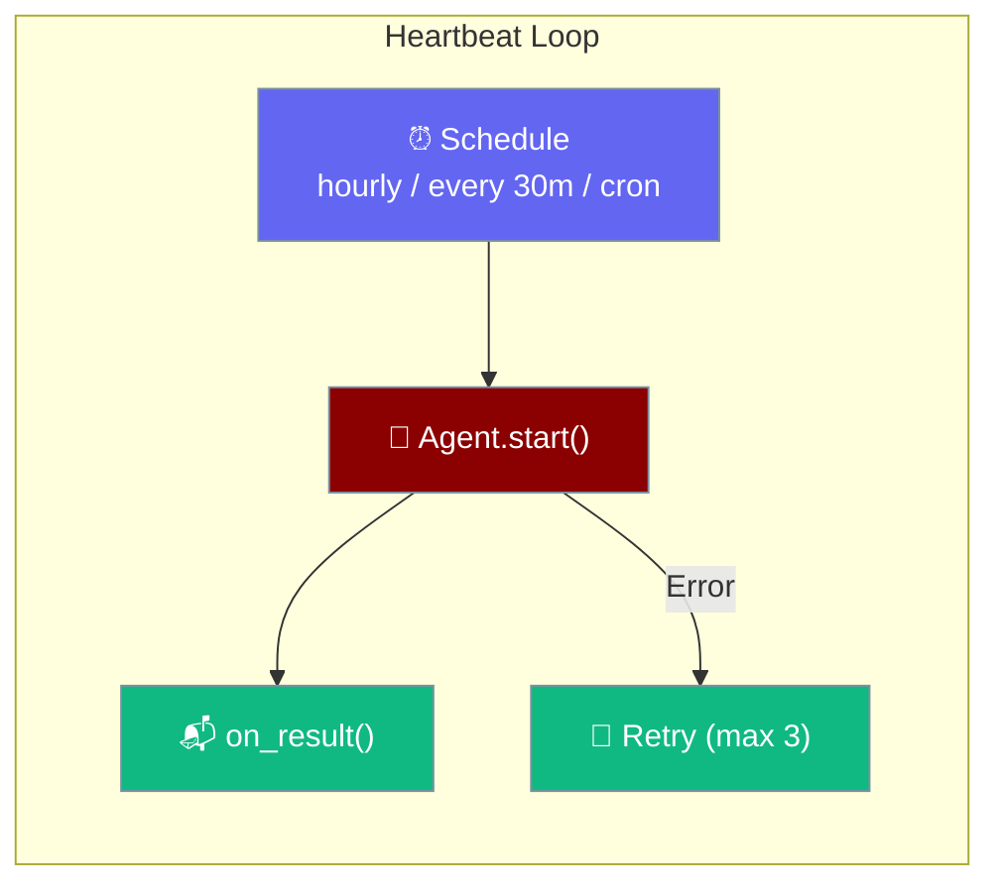
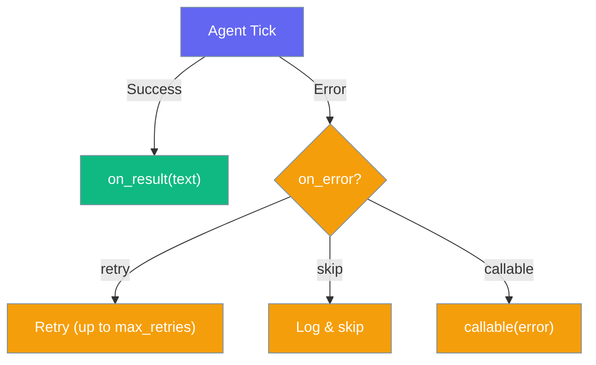

Heartbeat runs an agent on a recurring schedule and delivers the results via callbacks. Standalone — does NOT modify the Agent class.



## Quick Start

<Steps>
<Step title="Basic Heartbeat">
```python
from praisonaiagents import Agent, Heartbeat

agent = Agent(instructions="Check server status and summarize")
hb = Heartbeat(agent, schedule="hourly")
hb.start()  # Blocks — runs agent every hour
```
</Step>

<Step title="With Callback">
```python
from praisonaiagents import Agent, Heartbeat

agent = Agent(instructions="Summarize latest news")

def send_to_slack(result):
    print(f"📬 {result}")

hb = Heartbeat(
    agent,
    schedule="every 30m",
    prompt="Give me a 3-bullet news summary",
    on_result=send_to_slack,
)
hb.start()
```
</Step>

<Step title="Background Thread">
```python
hb = Heartbeat(agent, schedule="daily")
hb.start(blocking=False)  # Runs in daemon thread
# ... your app continues running
hb.stop()
```
</Step>
</Steps>

---

## Schedule Expressions

Heartbeat uses the same schedule parser as [Schedule Tools](/docs/tools/schedule-tools):

| Format | Example | Description |
|--------|---------|-------------|
| Keyword | `"hourly"`, `"daily"`, `"weekly"` | Predefined intervals |
| Interval | `"every 30m"`, `"every 6h"`, `"*/10s"` | Custom interval |
| Cron | `"cron:0 7 * * *"` | 5-field cron expression |
| One-shot | `"at:2026-03-01T09:00:00"` | ISO 8601 timestamp |

---

## Configuration

| Parameter | Type | Default | Description |
|-----------|------|---------|-------------|
| `schedule` | `str` | `"hourly"` | When to run (see table above) |
| `prompt` | `str` | `None` | Override prompt for each tick (None = "Run your scheduled check.") |
| `on_result` | `Callable` | `None` | Callback receiving result text. None = log to stdout |
| `on_error` | `str\|Callable` | `"retry"` | `"retry"`, `"skip"`, or `callable(error)` |
| `max_retries` | `int` | `3` | Max consecutive retries before skipping |

---

## Error Handling



---

## Best Practices

<AccordionGroup>
<Accordion title="Use Background Mode for Web Apps">
Call `hb.start(blocking=False)` to run in a daemon thread alongside your web server or bot.
</Accordion>

<Accordion title="Always Set on_result in Production">
Without `on_result`, results are only logged. Connect it to Slack, email, or a database for production use.
</Accordion>

<Accordion title="Combine with Loop Detection">
For long-running heartbeats, enable `loop_detection=True` on the agent to prevent stuck states.
</Accordion>
</AccordionGroup>

---

## Related

<CardGroup cols={2}>
<Card title="Schedule Tools" icon="clock" href="/docs/tools/schedule-tools">
  Agent-centric scheduling via tool calls
</Card>
<Card title="Background Tasks" icon="clock" href="/docs/features/background-tasks">
  BackgroundRunner and ScheduleLoop
</Card>
</CardGroup>
