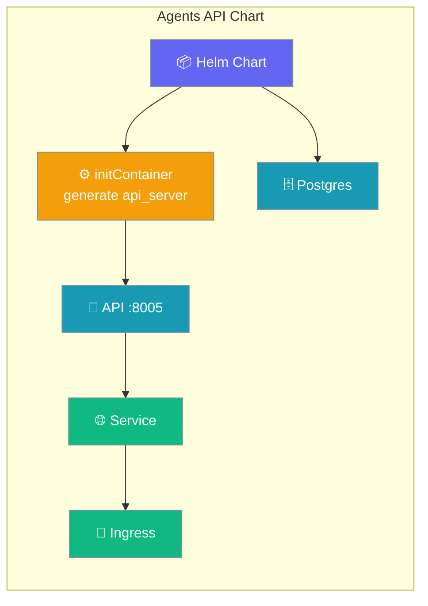
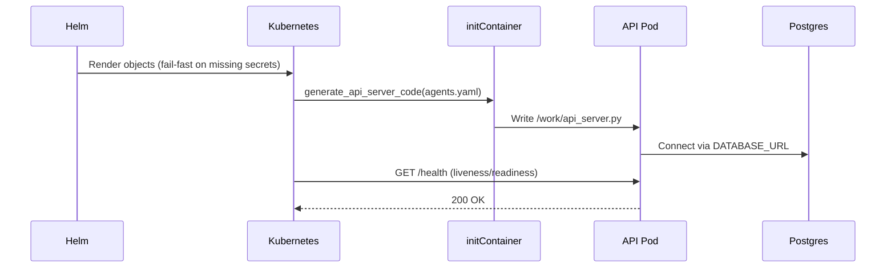

Deploy the PraisonAI agents API together with a pgvector Postgres database to Kubernetes with the official Helm chart.



<Warning>
This chart ships in the git checkout, **not** in the PyPI wheel (`MANIFEST.in` excludes `infra/`). Run from a monorepo checkout, or set `PRAISONAI_HELM_ROOT` / `PRAISONAI_INFRA_ROOT`, or pass `--chart-dir`.
</Warning>

## Quick Start

<Steps>
<Step title="Create the auth Secrets">
Pre-create the API token and Postgres password Secrets out-of-band.

```bash
kubectl create secret generic praisonai-api-auth \
  --from-literal=PRAISONAI_API_TOKEN="$(openssl rand -hex 16)"
kubectl create secret generic praisonai-postgres-auth \
  --from-literal=password="$(openssl rand -hex 16)"
```
</Step>

<Step title="Install the chart">
Reference both Secrets so the chart's fail-fast checks pass.

```bash
helm install praisonai ./src/praisonai-deploy/infra/helm/praisonai-agents-api \
  --set auth.existingSecret=praisonai-api-auth \
  --set postgres.auth.existingSecret=praisonai-postgres-auth
```
</Step>

<Step title="Verify with a port-forward">
Forward the Service and hit the health endpoint.

```bash
kubectl port-forward svc/praisonai-praisonai-agents-api 8005:8005
curl http://127.0.0.1:8005/health
```
</Step>
</Steps>

---

## How It Works

An initContainer generates the API server code from your `agents.yaml`, then the main container runs it against the in-cluster Postgres.



| Object | Created | Purpose |
|--------|---------|---------|
| `Deployment` | always | initContainer generates the server; main container serves the API on port 8005. |
| `Service` | always | Exposes the API pod. |
| `Ingress` | when `ingress.enabled=true` | External access. |
| `StatefulSet` + `Service` (Postgres) | when `postgres.enabled=true` | In-cluster pgvector database. |
| `Secret` (auth) | when `auth.token` set (no `existingSecret`) | Holds the API token. |
| `Secret` (postgres) | when `postgres.auth.password` set (no `existingSecret`) | Holds the DB password. |
| `ConfigMap` (agents) | unless an existing ConfigMap is referenced | Mounts `agents.yaml`. |
| `ServiceAccount` | when `serviceAccount.create=true` | Pod identity. |

The initContainer receives `PRAISONAI_AGENTS_FILE`, `PRAISONAI_API_PORT`, and `PRAISONAI_SERVER_FILE` as env, then calls `generate_api_server_code`.

---

## Configuration Options

Every key below is from `src/praisonai-deploy/infra/helm/praisonai-agents-api/values.yaml`.

Chart identity: `version: 0.1.0`, `appVersion: "latest"`.

| Key | Type | Default | Description |
|-----|------|---------|-------------|
| `replicaCount` | `int` | `1` | API replicas. |
| `image.repository` | `string` | `ghcr.io/mervinpraison/praisonai` | Official GHCR image. |
| `image.tag` | `string` | `""` (falls back to `appVersion`) | Pin a released tag in production. |
| `image.pullPolicy` | `string` | `IfNotPresent` | Image pull policy. |
| `imagePullSecrets` | `list` | `[]` | Pull secrets for private registries. |
| `agents.fileName` | `string` | `agents.yaml` | Mounted agents file name. |
| `agents.content` | `string` | *(sample assistant)* | Inline agents YAML. |
| `agents.configMapName` | `string` | `""` | Use a named ConfigMap the chart creates. |
| `agents.existingConfigMap` | `string` | `""` | Reference a pre-existing ConfigMap. |
| `api.port` | `int` | `8005` | Container port. |
| `api.serverFile` | `string` | `api_server.py` | Generated server entrypoint. |
| `auth.enabled` | `bool` | `true` | Inject `PRAISONAI_API_TOKEN`. |
| `auth.existingSecret` | `string` | `""` | Reference a pre-created Secret (preferred). |
| `auth.secretKey` | `string` | `PRAISONAI_API_TOKEN` | Data key in the Secret to read. |
| `auth.token` | `string` | `""` | Inline token; chart creates a Secret. **Avoid in Git.** |
| `postgres.enabled` | `bool` | `true` | Deploy an in-cluster pgvector Postgres. |
| `postgres.image` | `string` | `pgvector/pgvector:pg16` | Postgres image. |
| `postgres.port` | `int` | `5432` | Postgres port. |
| `postgres.database` | `string` | `praisonai` | Database name. |
| `postgres.username` | `string` | `praisonai` | Database user. |
| `postgres.auth.existingSecret` | `string` | `""` | Reference a pre-created password Secret. |
| `postgres.auth.password` | `string` | `""` | Inline password; chart creates a Secret. **Avoid in Git.** |
| `postgres.auth.secretKey` | `string` | `password` | Data key in the Secret to read. |
| `postgres.persistence.enabled` | `bool` | `true` | Persist the database on a PVC. |
| `postgres.persistence.size` | `string` | `8Gi` | PVC size. |
| `postgres.persistence.storageClass` | `string` | `""` | PVC storage class. |
| `service.type` | `string` | `ClusterIP` | Service type. |
| `service.port` | `int` | `8005` | Service port. |
| `ingress.enabled` | `bool` | `false` | Expose via Ingress. |
| `ingress.className` | `string` | `nginx` | IngressClass name. |
| `ingress.annotations` | `map` | `{}` | Ingress annotations. |
| `ingress.hosts` | `list` | `[{host: api.example.com, paths: [{path: /, pathType: Prefix}]}]` | Ingress hosts and paths. |
| `ingress.tls` | `list` | `[]` | Ingress TLS blocks. |
| `probes.enabled` | `bool` | `true` | Enable liveness/readiness probes. |
| `probes.path` | `string` | `/health` | Probe path. |
| `env` | `list` | `[]` | Extra env vars (e.g. LLM keys via `secretKeyRef`). |
| `resources` | `map` | `{}` | Resource requests/limits. |
| `serviceAccount.create` | `bool` | `true` | Create a ServiceAccount. |
| `serviceAccount.name` | `string` | `""` | Override the ServiceAccount name. |
| `podAnnotations` | `map` | `{}` | Pod annotations. |
| `podSecurityContext` | `map` | `{}` | Pod-level securityContext. |
| `securityContext` | `map` | `{}` | Container-level securityContext. |
| `nodeSelector` | `map` | `{}` | Pod nodeSelector. |
| `tolerations` | `list` | `[]` | Pod tolerations. |
| `affinity` | `map` | `{}` | Pod affinity. |

---

## Security — Fail-Fast on Missing Secrets

The chart refuses to render without a token source and a database password.

<Warning>
With `auth.enabled=true` (default) you **must** set `auth.existingSecret` **or** `auth.token`. Otherwise the render fails:
> `auth.enabled is true but no auth.existingSecret or auth.token was provided.`
</Warning>

<Warning>
With `postgres.enabled=true` (default) you **must** set `postgres.auth.existingSecret` **or** `postgres.auth.password`. Otherwise the render fails:
> `postgres.enabled is true but no postgres.auth.existingSecret or postgres.auth.password was provided.`
</Warning>

Fix each by pre-creating the referenced Secret (preferred) or supplying the inline value. Disable a subsystem's requirement only for trusted local testing by setting `auth.enabled=false` or `postgres.enabled=false`.

---

## Passing LLM Keys via `env`

Pass provider keys with the `valueFrom.secretKeyRef` pattern.

```yaml
env:
  - name: OPENAI_API_KEY
    valueFrom:
      secretKeyRef:
        name: praisonai-llm
        key: OPENAI_API_KEY
```

---

## Best Practices

<AccordionGroup>
<Accordion title="Prefer existingSecret over inline values">
Inline `auth.token` and `postgres.auth.password` end up in Git. Pre-create Secrets and reference them with `existingSecret`.
</Accordion>

<Accordion title="Pin image.tag in production">
The default tag falls back to `appVersion` (`latest`), which drifts. Pin a released tag for reproducible deployments.
</Accordion>

<Accordion title="Keep persistence enabled for real data">
`postgres.persistence.enabled=true` binds an 8Gi PVC by default. Size it for your workload and set a `storageClass` where needed.
</Accordion>

<Accordion title="Set resources requests/limits">
The chart ships `resources: {}`, so the pod has no guaranteed CPU/memory. Set requests and limits before production.
</Accordion>
</AccordionGroup>

---

## Install via the CLI

Skip the long `helm` invocation — the CLI wrapper injects both Secret references for you.

```bash
praisonai deploy helm --chart agents-api
```

---

## Related

<CardGroup cols={2}>
<Card title="Helm CLI Wrapper" icon="ship" href="/docs/features/helm-cli">
  One command to install this chart.
</Card>
<Card title="Docker Compose Stack" icon="docker" href="/docs/features/compose-stack">
  The local equivalent of this chart.
</Card>
</CardGroup>
